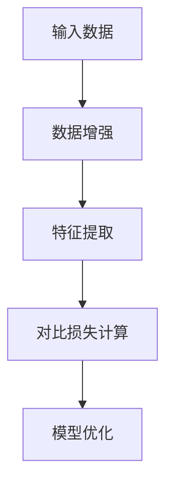

                 

# 《金融领域对比学习的探索与实践》

---

## 关键词：
- 对比学习
- 金融应用
- 机器学习
- 风险评估
- 欺诈检测

---

## 摘要：
对比学习是一种新兴的机器学习技术，通过对比正样本对和负样本对来学习数据的潜在表示。在金融领域，对比学习展现了巨大的潜力，特别是在风险评估、欺诈检测和时间序列分析等方面。本文将从对比学习的基本概念出发，深入探讨其在金融领域的具体应用，并结合实际案例，分析对比学习的算法实现与优化策略。最后，本文将总结对比学习在金融领域的优势与挑战，并展望其未来的研究方向。

---

## 第1章: 对比学习的基本概念与背景

### 1.1 对比学习的定义与核心概念

#### 1.1.1 对比学习的定义
对比学习（Contrastive Learning）是一种基于对比目标函数的无监督或弱监督学习方法。其核心思想是通过最大化正样本对的相似性，同时最小化负样本对的相似性，来学习数据的潜在表示。

对比学习的目标函数可以表示为：
$$ L = -\log p(x_i, x_j) - \log p(x_k, x_l) $$
其中，$(x_i, x_j)$ 是正样本对，$(x_k, x_l)$ 是负样本对。

#### 1.1.2 对比学习的核心要素
对比学习的核心要素包括：
1. **正样本对**：具有相同标签或相似特征的样本对。
2. **负样本对**：具有不同标签或差异较大的样本对。
3. **对比损失函数**：衡量正样本对与负样本对相似性的损失函数。

对比学习与传统机器学习的对比可以总结如下：

| 对比学习 | 传统机器学习 |
|----------|---------------|
| 基于对比目标函数 | 基于单一目标函数 |
| 强调正样本对与负样本对的差异 | 强调单个样本的分类或回归 |
| 适用于无监督或弱监督场景 | 适用于监督学习场景 |

#### 1.1.3 对比学习与传统机器学习的对比
对比学习与传统机器学习的主要区别在于：
- 对比学习通过对比正样本对和负样本对来学习数据的潜在表示，而传统机器学习通过单个样本的标签进行分类或回归。
- 对比学习适用于无监督或弱监督场景，而传统机器学习通常需要大量标注数据。

### 1.2 对比学习在金融领域的应用背景

#### 1.2.1 金融数据分析的挑战
金融数据具有以下特点：
1. **高维性**：金融数据通常包含大量的特征，如股票价格、交易量、市场指数等。
2. **时间依赖性**：金融数据往往具有很强的时间依赖性，如股票价格的变化受历史数据影响。
3. **噪声干扰**：金融数据中常常存在噪声干扰，如市场波动、突发事件等。

#### 1.2.2 对比学习在金融中的潜在价值
对比学习在金融领域的潜在价值主要体现在以下几个方面：
1. **风险评估**：通过对比正常交易与异常交易，识别潜在的金融风险。
2. **欺诈检测**：通过对比合法交易与欺诈交易，检测金融欺诈行为。
3. **时间序列分析**：通过对比相似的时间序列，预测未来的市场趋势。

#### 1.2.3 当前研究现状与未来趋势
当前，对比学习在金融领域的研究主要集中在以下几个方面：
1. **风险评估**：利用对比学习对信用评分和市场风险进行评估。
2. **欺诈检测**：利用对比学习检测交易欺诈和身份验证。
3. **时间序列分析**：利用对比学习预测股票价格和经济指标。

未来，对比学习在金融领域的研究将更加注重以下几个方面：
1. **算法优化**：进一步优化对比学习的损失函数和模型结构。
2. **多模态数据融合**：将文本、图像等多种数据模态融入对比学习中。
3. **实时性提升**：提升对比学习在金融领域的实时性，以应对快速变化的金融市场。

### 1.3 本章小结
本章主要介绍了对比学习的基本概念、核心要素以及在金融领域的应用背景。通过对对比学习与传统机器学习的对比，我们明确了对比学习的独特优势。同时，我们还探讨了对比学习在金融领域的潜在价值和未来研究方向。

---

## 第2章: 对比学习的原理与数学模型

### 2.1 对比学习的核心原理

#### 2.1.1 对比学习的基本流程
对比学习的基本流程包括以下步骤：
1. **数据预处理**：对数据进行清洗、归一化等预处理操作。
2. **数据增强**：通过数据增强技术生成正样本对和负样本对。
3. **特征提取**：利用编码器提取数据的潜在表示。
4. **对比损失计算**：计算正样本对与负样本对的对比损失。
5. **模型优化**：通过优化器更新模型参数。

对比学习的基本流程可以用以下 mermaid 图表示：

#### 2.1.2 正样本对与负样本对的构建
正样本对和负样本对的构建是对比学习的核心环节。正样本对通常由相同标签的样本组成，而负样本对则由不同标签的样本组成。

例如，在股票价格预测中，正样本对可以是同一股票在不同时间点的价格数据，而负样本对可以是不同股票在相同时间点的价格数据。

#### 2.1.3 数据增强与特征提取
数据增强技术可以有效提升对比学习的性能。常见的数据增强方法包括：
1. **旋转**：对图像数据进行旋转。
2. **裁剪**：对图像数据进行随机裁剪。
3. **噪声添加**：在数据中添加随机噪声。

特征提取是对比学习的关键步骤，常用的特征提取方法包括：
1. **深度学习模型**：如卷积神经网络（CNN）、循环神经网络（RNN）等。
2. **传统特征提取方法**：如主成分分析（PCA）、线性判别分析（LDA）等。

### 2.2 对比学习的数学模型

#### 2.2.1 对比损失函数
对比损失函数是对比学习的核心，常用的对比损失函数包括：
1. **NT-Xent损失**：由Kumaran等人提出，公式为：
$$ L = -\log \frac{\exp(s)}{\exp(s) + \sum_{j \neq i} \exp(s_j)} $$
其中，$s$ 是正样本对的相似性得分，$s_j$ 是负样本对的相似性得分。

2. **ArcFace损失**：由Deng等人提出，公式为：
$$ L = -\log \frac{\exp(\cos(\theta) - s)}{\sum_{k} \exp(\cos(\theta_k) - s)} $$
其中，$\theta$ 是样本对之间的夹角，$s$ 是超参数。

#### 2.2.2 信息瓶颈理论
信息瓶颈理论是对比学习的理论基础之一。信息瓶颈理论认为，模型应该在保留类别信息的同时，尽量去除其他无关信息。

信息瓶颈理论可以用以下公式表示：
$$ I(X; Z) = \min_{p(z|x)} \mathbb{E}_{p(x)}[H(Z|X)] $$
其中，$X$ 是输入数据，$Z$ 是模型的隐藏层表示，$I(X; Z)$ 是输入与隐藏层表示之间的信息量。

#### 2.2.3 对比学习的优化目标
对比学习的优化目标是通过最大化正样本对的相似性，同时最小化负样本对的相似性，来学习数据的潜在表示。常用的优化目标包括：
1. **最大化正样本对的相似性**：通过调整模型参数，使得正样本对的相似性尽可能大。
2. **最小化负样本对的相似性**：通过调整模型参数，使得负样本对的相似性尽可能小。

### 2.3 本章小结
本章主要介绍了对比学习的核心原理和数学模型。通过对对比学习的基本流程、正样本对与负样本对的构建、数据增强与特征提取的探讨，我们深入理解了对比学习的实现过程。同时，通过对对比损失函数和信息瓶颈理论的分析，我们明确了对比学习的理论基础。

---

## 第3章: 对比学习在金融领域的具体应用

### 3.1 金融风险评估中的对比学习

#### 3.1.1 风险评估的基本概念
金融风险评估是通过对金融市场中的各种风险因素进行分析，评估其对金融资产或金融机构的影响。常见的金融风险包括市场风险、信用风险和操作风险。

#### 3.1.2 对比学习在信用评分中的应用
信用评分是金融风险评估中的重要组成部分。通过对比学习，可以对不同信用等级的客户进行分类，从而评估其信用风险。

例如，我们可以将信用评分分为高风险和低风险两类，然后通过对比学习对两类客户进行区分。

#### 3.1.3 对比学习在市场风险中的应用
市场风险是指由于市场价格波动而引起的金融资产价值损失。通过对历史市场价格数据进行对比学习，可以预测未来的市场价格走势，从而评估市场风险。

### 3.2 金融欺诈检测中的对比学习

#### 3.2.1 欺诈检测的基本原理
金融欺诈检测是通过对金融交易数据进行分析，识别异常交易行为。常见的欺诈检测方法包括基于规则的检测和基于机器学习的检测。

#### 3.2.2 对比学习在交易欺诈中的应用
通过对合法交易与欺诈交易进行对比学习，可以识别出异常交易行为。例如，我们可以将合法交易与欺诈交易进行对比，提取其特征差异，从而检测欺诈交易。

#### 3.2.3 对比学习在身份验证中的应用
通过对合法用户与非法用户进行对比学习，可以识别出身份验证中的异常行为。例如，可以通过对比用户的登录行为特征，识别出异常登录行为。

### 3.3 金融时间序列分析中的对比学习

#### 3.3.1 时间序列分析的基本概念
时间序列分析是通过对时间序列数据进行分析，识别数据中的模式和趋势。常见的时间序列分析方法包括ARIMA、GARCH等。

#### 3.3.2 对比学习在股价预测中的应用
通过对历史股价数据进行对比学习，可以预测未来的股价走势。例如，我们可以将相似的历史股价数据进行对比，提取其相似性特征，从而预测未来的股价变化。

#### 3.3.3 对比学习在经济指标预测中的应用
通过对历史经济指标数据进行对比学习，可以预测未来的经济指标走势。例如，可以通过对比相似的历史经济指标数据，提取其相似性特征，从而预测未来的经济指标变化。

### 3.4 本章小结
本章主要介绍了对比学习在金融领域的具体应用，包括金融风险评估、欺诈检测和时间序列分析。通过对这些应用的探讨，我们深入理解了对比学习在金融领域的实际价值。

---

## 第4章: 对比学习算法的实现与优化

### 4.1 对比学习算法实现的步骤

#### 4.1.1 数据预处理
数据预处理是对比学习实现的基础。主要包括数据清洗、归一化、特征提取等步骤。

例如，在股票价格预测中，我们需要对历史股价数据进行清洗和归一化处理，以消除数据中的噪声和尺度差异。

#### 4.1.2 特征提取方法
特征提取是对比学习的关键步骤。常用的特征提取方法包括：
1. **深度学习模型**：如卷积神经网络（CNN）、循环神经网络（RNN）等。
2. **传统特征提取方法**：如主成分分析（PCA）、线性判别分析（LDA）等。

#### 4.1.3 对比模型的构建与训练
对比模型的构建与训练是对比学习的核心环节。主要包括模型的设计、对比损失函数的定义、优化器的选择等。

例如，在股票价格预测中，我们可以使用卷积神经网络提取股价数据的特征，然后定义对比损失函数，最后使用Adam优化器进行训练。

### 4.2 对比学习的优化策略

#### 4.2.1 数据增强策略
数据增强策略是提升对比学习性能的重要手段。常用的

