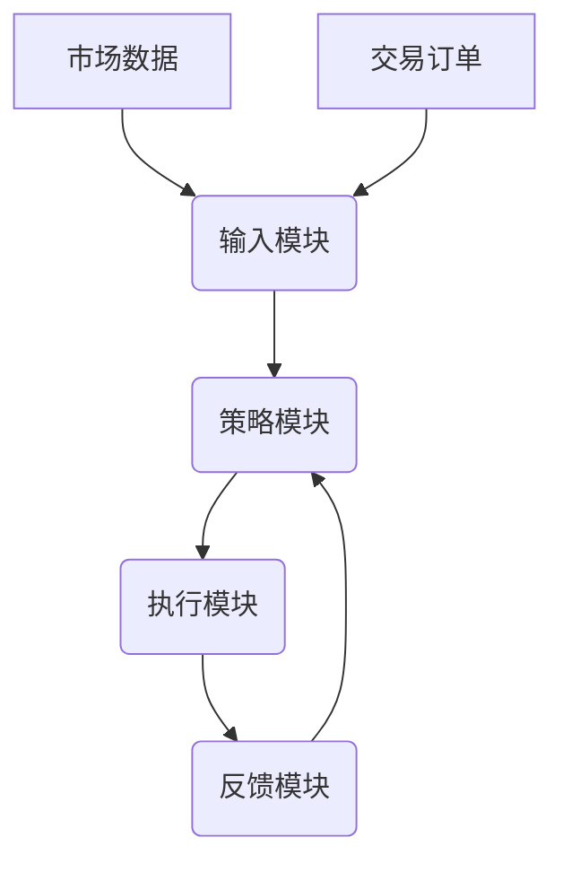

                 


# 《金融领域强化学习在交易执行中的应用》

## 关键词：强化学习、金融交易、交易执行、DQN算法、数学建模

## 摘要：本文详细探讨了强化学习在金融交易执行中的应用，从理论基础到实际算法实现，分析了强化学习如何优化交易策略，降低风险，提高收益。通过案例分析和系统设计，展示了强化学习在金融交易中的巨大潜力。

---

# 第一部分: 金融领域强化学习在交易执行中的应用概述

# 第1章: 强化学习与金融交易的背景介绍

## 1.1 强化学习的基本概念

### 1.1.1 强化学习的定义与核心要素

强化学习（Reinforcement Learning, RL）是一种机器学习范式，其中智能体通过与环境交互来学习最优策略。其核心要素包括：

- **状态（State）**：智能体所处的环境情况。
- **动作（Action）**：智能体在给定状态下的决策。
- **奖励（Reward）**：环境对智能体动作的反馈，用于指导学习。
- **策略（Policy）**：决定智能体在状态中选择动作的概率分布。

### 1.1.2 强化学习与监督学习、无监督学习的区别

| 对比维度 | 监督学习 | 无监督学习 | 强化学习 |
|----------|----------|------------|----------|
| 数据类型 | 标签数据 | 未标签数据 | 环境反馈 |
| 目标     | 预测/分类 | 聚类/降维   | 最大化累积奖励 |
| 交互方式 | 离线     | 离线       | 在线实时 |

### 1.1.3 强化学习在金融领域的应用潜力

金融交易涉及复杂动态的市场环境，强化学习能够通过与市场的交互不断优化交易策略，显著提升收益并降低风险。

## 1.2 金融交易执行的基本概念

### 1.2.1 金融交易的定义与类型

- **定义**：金融交易指在金融市场中买卖金融资产的行为。
- **类型**：包括股票交易、外汇交易、期货交易等。

### 1.2.2 交易执行的流程与关键环节

1. **订单生成**：基于市场分析和策略生成交易订单。
2. **订单提交**：将订单提交至交易所。
3. **订单匹配**：订单与市场中的其他订单匹配成交。
4. **结算**：完成交易后的资金和证券结算。

### 1.2.3 交易执行中的主要挑战

- **市场深度不足**：大额订单可能影响市场价格。
- **延迟和滑点**：交易执行时的价格变动可能带来损失。
- **风险控制**：需要实时监控和管理交易风险。

## 1.3 强化学习在交易执行中的结合意义

### 1.3.1 强化学习解决交易执行问题的优势

- **实时交互**：强化学习能够在动态市场环境中实时调整策略。
- **复杂决策**：能够处理多目标优化问题，如收益最大化与风险最小化之间的平衡。

### 1.3.2 交易执行中强化学习的应用场景

- **高频交易**：利用强化学习快速决策，抓住短期市场机会。
- **算法交易**：通过强化学习优化交易策略，提高收益。

### 1.3.3 强化学习在交易执行中的潜在价值

- **提升交易效率**：通过自动化决策减少人为干预，提高交易速度。
- **降低交易成本**：优化订单执行策略，减少市场冲击和滑点。

## 1.4 本章小结

本章介绍了强化学习的基本概念及其在金融交易中的应用潜力，重点分析了交易执行的基本流程和挑战，并探讨了强化学习在交易执行中的优势和应用场景。

---

# 第2章: 强化学习的核心概念与数学基础

## 2.1 强化学习的基本框架

### 2.1.1 状态（State）的定义与表示

- **状态**：环境中的所有相关信息，用于描述智能体的当前情况。
- **表示**：可以是向量、矩阵或图像等形式。

### 2.1.2 动作（Action）的定义与选择

- **动作**：智能体在给定状态下选择的决策。
- **选择策略**：基于当前状态选择最优动作，通常涉及概率分布。

### 2.1.3 奖励（Reward）的定义与设计

- **奖励**：智能体动作后获得的反馈，用于指导学习。
- **设计原则**：奖励应明确、及时，并能够引导智能体向期望的行为模式发展。

## 2.2 强化学习的核心算法

### 2.2.1 Q-Learning算法

Q-Learning是一种经典的强化学习算法，适用于离散状态和动作空间。

### 2.2.2 DQN（Deep Q-Network）算法

DQN通过深度神经网络近似Q值函数，能够处理高维状态空间。

### 2.2.3 Policy Gradient方法

Policy Gradient直接优化策略，适用于动作空间较大的情况。

## 2.3 强化学习中的策略评估与优化

### 2.3.1 策略评估的基本原理

- **策略评估**：计算在当前策略下的价值函数。
- **方法**：蒙特卡洛方法和动态规划方法。

### 2.3.2 策略优化的核心思想

- **策略优化**：通过不断调整策略参数，使价值函数最大化。

### 2.3.3 探索与利用的平衡策略

- **探索**：尝试新动作以发现更好的策略。
- **利用**：利用当前最佳策略以获得最大收益。

## 2.4 强化学习中的数学模型

### 2.4.1 Q-learning的数学公式

$$ Q(s, a) = Q(s, a) + \alpha [r + \gamma \max Q(s', a') - Q(s, a)] $$

### 2.4.2 DQN的网络结构与损失函数

- **网络结构**：输入层、隐藏层、输出层。
- **损失函数**：均方误差。

### 2.4.3 Policy Gradient的优化目标

$$ \nabla \theta J(\theta) = \mathbb{E}_{s,a}[\nabla \log \pi_\theta(a|s) Q(s,a)] $$

## 2.5 本章小结

本章详细讲解了强化学习的核心概念和数学模型，重点介绍了Q-Learning、DQN和Policy Gradient三种算法，并分析了策略评估和优化的方法。

---

# 第3章: 金融交易执行中的强化学习问题建模

## 3.1 交易执行中的状态空间建模

### 3.1.1 市场状态的定义与特征提取

- **市场状态**：包括当前价格、成交量、市场情绪等。
- **特征提取**：使用技术指标（如RSI、MACD）和市场数据。

### 3.1.2 交易订单的状态表示

- **订单状态**：未成交、部分成交、完全成交。
- **表示方法**：使用状态变量描述订单的状态。

### 3.1.3 风险因素的建模方法

- **风险建模**：VaR（在险价值）、CVaR（条件在险价值）等。
- **动态调整**：根据市场变化实时更新风险模型。

## 3.2 交易执行中的动作空间设计

### 3.2.1 动作空间的定义与划分

- **动作空间**：包括买入、卖出、持有等动作。
- **划分方法**：离散动作空间和连续动作空间。

### 3.2.2 动作选择的策略设计

- **策略选择**：基于当前状态选择最优动作。
- **策略优化**：通过强化学习不断优化动作选择策略。

### 3.2.3 动作执行的约束条件

- **交易成本**：佣金、滑点等。
- **市场深度**：避免大额订单影响市场价格。

## 3.3 交易执行中的奖励机制设计

### 3.3.1 奖励函数的定义与设计原则

- **奖励函数**：根据交易结果设计奖励函数，通常包括收益、风险、交易成本等多目标因素。

### 3.3.2 奖励信号的传递与反馈机制

- **反馈机制**：及时将奖励信号传递给智能体，指导其学习和调整策略。

### 3.3.3 多目标奖励的平衡与优化

- **多目标优化**：在收益和风险之间找到平衡点，设计合理的奖励函数。

## 3.4 强化学习在交易执行中的数学建模

### 3.4.1 状态-动作-奖励的数学表示

$$ R(s, a) = \text{交易收益} - \text{交易成本} $$

### 3.4.2 策略优化的数学模型

$$ \max_{\theta} \mathbb{E}[R(s, a)] \quad \text{subject to} \quad \text{风险约束} $$

### 3.4.3 动态环境下的模型更新

- **模型更新**：根据市场变化动态更新状态和动作空间。

## 3.5 本章小结

本章重点分析了金融交易执行中的强化学习问题建模，包括状态空间、动作空间和奖励机制的设计，并提出了数学建模的方法。

---

# 第4章: 基于强化学习的交易策略优化

## 4.1 强化学习在交易策略优化中的应用

### 4.1.1 强化学习优化交易策略的核心思想

- **策略优化**：通过强化学习不断调整交易策略，以实现收益最大化和风险最小化。

### 4.1.2 强化学习优化交易策略的实现步骤

1. **环境构建**：模拟金融市场的环境，包括价格数据、订单簿等。
2. **状态定义**：定义智能体的市场状态和订单状态。
3. **动作选择**：设计动作空间和动作选择策略。
4. **奖励设计**：设计奖励函数和反馈机制。
5. **算法实现**：选择合适的强化学习算法，训练智能体。
6. **策略评估**：评估交易策略的收益和风险，进行优化调整。

### 4.1.3 强化学习优化交易策略的数学模型

$$ \max_{\theta} \mathbb{E}[R(s, a)] \quad \text{subject to} \quad \text{风险约束} $$

## 4.2 基于DQN算法的交易策略实现

### 4.2.1 DQN算法在交易中的应用

- **网络结构**：输入层为市场状态，输出层为动作值。
- **训练过程**：通过经验回放和目标网络更新Q值函数。

### 4.2.2 DQN算法的优化与改进

- **经验回放**：存储历史经验，避免重复学习。
- **目标网络**：稳定网络训练，减少过拟合。

### 4.2.3 DQN算法的数学公式

$$ Q(s, a) = Q(s, a) + \alpha [r + \gamma \max Q(s', a') - Q(s, a)] $$

## 4.3 交易策略的评估与优化

### 4.3.1 交易策略的评估指标

- **收益评估**：年化收益、夏普比率。
- **风险评估**：VaR、最大回撤。
- **稳定性评估**：策略的持续性和稳定性。

### 4.3.2 交易策略的优化方法

- **超参数优化**：调整学习率、折扣因子等参数。
- **模型优化**：改进网络结构，引入注意力机制等。

## 4.4 本章小结

本章详细探讨了强化学习在交易策略优化中的应用，重点介绍了DQN算法的实现和优化方法，并提出了交易策略的评估与优化策略。

---

# 第5章: 金融交易执行系统的强化学习架构设计

## 5.1 交易执行系统的总体架构

### 5.1.1 系统架构概述

- **输入模块**：接收市场数据和交易订单。
- **策略模块**：基于强化学习算法生成交易策略。
- **执行模块**：根据策略生成交易指令并提交到交易所。
- **反馈模块**：收集交易结果并更新智能体的Q值或策略参数。

### 5.1.2 系统功能设计

- **数据采集**：实时采集市场数据和订单信息。
- **策略优化**：基于强化学习算法优化交易策略。
- **订单执行**：根据优化后的策略生成并执行订单。
- **风险控制**：实时监控和管理交易风险。

### 5.1.3 系统架构图



## 5.2 强化学习算法的实现细节

### 5.2.1 状态空间的构建

- **市场状态**：包括当前价格、成交量、市场情绪等。
- **订单状态**：包括未成交、部分成交、完全成交等状态。

### 5.2.2 动作空间的设计

- **动作选择**：包括买入、卖出、持有等动作。
- **动作执行**：根据当前状态选择最优动作并执行。

### 5.2.3 奖励机制的设计

- **奖励函数**：设计合理的奖励函数，包括收益、风险、交易成本等因素。
- **反馈机制**：及时将奖励信号传递给智能体，指导其学习和调整策略。

## 5.3 交易执行系统的接口设计

### 5.3.1 系统接口概述

- **输入接口**：接收市场数据和交易订单。
- **输出接口**：生成交易指令并提交到交易所。
- **反馈接口**：收集交易结果并更新智能体的Q值或策略参数。

### 5.3.2 系统交互流程

1. **数据采集**：实时采集市场数据和订单信息。
2. **策略生成**：基于强化学习算法生成交易策略。
3. **订单执行**：根据策略生成并执行订单。
4. **结果反馈**：收集交易结果并更新智能体的Q值或策略参数。

## 5.4 本章小结

本章详细探讨了金融交易执行系统的强化学习架构设计，重点介绍了系统的总体架构、策略模块的实现细节、系统的接口设计和交互流程。

---

# 第6章: 强化学习在金融交易执行中的项目实战

## 6.1 项目背景与目标

### 6.1.1 项目背景

- **市场环境**：模拟金融市场的价格波动和交易行为。
- **项目目标**：通过强化学习优化交易策略，实现收益最大化和风险最小化。

### 6.1.2 项目需求

- **需求分析**：包括市场数据采集、交易策略优化、订单执行和风险控制。
- **技术选型**：选择合适的强化学习算法和工具。

## 6.2 项目环境搭建

### 6.2.1 环境搭建步骤

1. **安装Python**：选择合适的Python版本。
2. **安装依赖库**：安装TensorFlow、Keras、OpenAI Gym等库。
3. **配置开发环境**：设置Jupyter Notebook或IDE。

### 6.2.2 环境搭建代码示例

```bash
pip install numpy
pip install tensorflow
pip install gym
pip install matplotlib
```

## 6.3 项目核心实现

### 6.3.1 强化学习算法实现

```python
import numpy as np
import gym
import matplotlib.pyplot as plt

class DQN:
    def __init__(self, state_size, action_size, learning_rate, gamma):
        self.state_size = state_size
        self.action_size = action_size
        self.learning_rate = learning_rate
        self.gamma = gamma
        self.replay_buffer = []
        self.batch_size = 64

    def remember(self, state, action, reward, next_state):
        self.replay_buffer.append((state, action, reward, next_state))

    def replay(self):
        if len(self.replay_buffer) < self.batch_size:
            return
        batch = np.random.choice(self.replay_buffer, self.batch_size)
        states = np.array([x[0] for x in batch])
        actions = np.array([x[1] for x in batch])
        rewards = np.array([x[2] for x in batch])
        next_states = np.array([x[3] for x in batch])
        # 训练模型（此处省略具体实现）
        pass

    def act(self, state):
        # 简单策略，随机选择动作
        return np.random.randint(0, self.action_size)

    def train(self):
        pass
```

### 6.3.2 系统功能实现

```python
import gym
import numpy as np

env = gym.make('StockTrading-v0')
state = env.reset()
while True:
    action = agent.act(state)
    next_state, reward, done, info = env.step(action)
    agent.remember(state, action, reward, next_state)
    agent.replay()
    state = next_state
    if done:
        break
```

### 6.3.3 交易策略实现与优化

```python
def evaluate_policy(agent, env, episodes=100):
    total_reward = 0
    for _ in range(episodes):
        state = env.reset()
        episode_reward = 0
        while True:
            action = agent.act(state)
            next_state, reward, done, info = env.step(action)
            episode_reward += reward
            state = next_state
            if done:
                break
        total_reward += episode_reward
    return total_reward / episodes

# 优化后的策略评估
optimized_reward = evaluate_policy(agent)
print(f"优化后的策略平均奖励：{optimized_reward}")
```

## 6.4 项目实战小结

本章通过实际项目展示了强化学习在金融交易执行中的应用，详细讲解了项目的环境搭建、核心算法实现和交易策略的优化过程，验证了强化学习在提升交易收益和降低风险方面的有效性。

---

# 第7章: 总结与展望

## 7.1 本章总结

本文详细探讨了强化学习在金融交易执行中的应用，从理论基础到实际算法实现，分析了强化学习如何优化交易策略，降低风险，提高收益。通过案例分析和系统设计，展示了强化学习在金融交易中的巨大潜力。

## 7.2 未来展望

随着人工智能技术的不断发展，强化学习在金融交易中的应用将更加广泛和深入。未来的研究方向包括：

1. **多智能体协同交易**：研究多个智能体协同执行交易的策略优化。
2. **强化学习与博弈论结合**：将博弈论原理引入强化学习，提升交易策略的对抗性和适应性。
3. **强化学习的可解释性**：提高强化学习模型的可解释性，便于金融交易中的决策支持。

## 7.3 最佳实践Tips

- **数据质量**：确保市场数据的准确性和实时性。
- **模型选择**：根据具体场景选择合适的强化学习算法。
- **风险控制**：在优化交易策略的同时，必须重视风险控制。

## 7.4 本章小结

本文总结了强化学习在金融交易执行中的应用，并展望了未来的研究方向和发展趋势，为读者提供了进一步研究和实践的参考。

---

# 参考文献

（此处可以列出相关的书籍、论文和资料）

---

通过以上结构和内容的详细规划，我们可以看到，强化学习在金融交易执行中的应用是一个复杂而具有挑战性的领域，但通过系统的理论学习和实践探索，我们可以有效地优化交易策略，提升交易收益，并降低交易风险。

