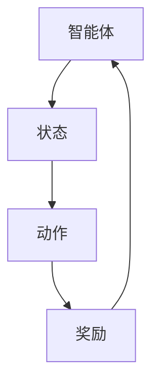
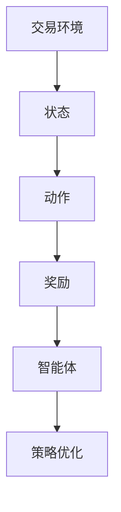

                 


# 《金融领域强化学习在交易策略中的应用》

## 关键词：
- 强化学习
- 金融交易
- 交易策略
- Q-learning
- 状态空间
- 动作空间
- 奖励函数

## 摘要：
本文深入探讨了强化学习在金融交易中的应用，从理论基础到实际案例，全面解析了如何利用强化学习优化交易策略。文章首先介绍了强化学习的核心概念，包括马尔可夫决策过程（MDP）和Q-learning算法。接着，详细讲解了强化学习在金融交易中的优势，如适应市场动态变化和非线性关系的能力。通过构建数学模型，分析了状态、动作、奖励函数等关键要素。最后，通过系统设计与实现，展示了如何构建一个完整的强化学习交易系统，并提供了实际的代码实现和案例分析，帮助读者全面理解强化学习在金融交易中的应用。

---

# 第一部分: 强化学习与金融交易概述

## 第1章: 强化学习与金融交易的背景介绍

### 1.1 强化学习的核心概念
#### 1.1.1 从传统机器学习到强化学习的演进
强化学习（Reinforcement Learning, RL）是一种机器学习范式，与监督学习和无监督学习不同，它通过智能体与环境的交互，逐步学习最优策略。强化学习的核心在于通过试错（trial-and-error）过程，优化决策以最大化累积奖励。

#### 1.1.2 强化学习的基本原理与特点
强化学习的基本原理是通过智能体与环境的交互，不断更新策略以最大化累积奖励。其特点包括：
- **目标导向**：智能体通过最大化累积奖励来学习最优策略。
- **在线学习**：智能体在与环境的实时交互中学习。
- **非监督性**：智能体不需要明确的标签数据，而是通过奖励信号调整行为。

#### 1.1.3 金融交易中的强化学习应用背景
金融交易领域复杂多变，传统的统计套利和时间序列分析方法在面对市场非线性关系和噪声时显得力不从心。强化学习通过模拟交易策略的动态优化，能够有效应对市场的不确定性，尤其是在高频交易和算法交易中展现出巨大潜力。

---

### 1.2 金融交易中的强化学习问题
#### 1.2.1 金融交易的复杂性与挑战
金融市场的复杂性主要体现在以下几个方面：
- **高维状态空间**：金融市场的状态可能包括价格、成交量、市场情绪等多维度信息。
- **非线性关系**：价格波动和交易行为之间可能存在复杂的非线性关系。
- **动态变化**：市场环境会随着时间推移而不断变化，导致策略需要动态调整。

#### 1.2.2 强化学习在金融交易中的优势
强化学习在金融交易中的优势主要体现在：
- **自适应性**：能够根据市场变化动态调整交易策略。
- **非线性建模能力**：通过深度神经网络等方法，能够捕捉复杂的非线性关系。
- **多步决策优化**：强化学习能够优化多步决策过程，适合长周期的交易策略。

#### 1.2.3 强化学习在金融交易中的边界与外延
强化学习在金融交易中的应用也有一定的边界：
- **数据依赖性**：需要大量高质量的历史数据进行训练。
- **策略复杂性**：复杂的交易策略可能需要更复杂的模型。
- **风险管理**：强化学习模型需要结合风险控制机制，避免过度风险暴露。

---

### 1.3 强化学习在金融交易中的核心要素
#### 1.3.1 状态空间的定义与特征
状态空间（State Space）是强化学习中的关键要素，表示智能体所处的环境状态。在金融交易中，状态空间可以包括以下内容：
- **价格信息**：当前价格、历史价格、技术指标等。
- **市场情绪**：市场情绪指数、新闻情绪分析等。
- **交易量**：成交量、买卖力量等。

#### 1.3.2 动作空间的定义与特征
动作空间（Action Space）是智能体可以执行的动作集合。在金融交易中，动作可以包括：
- **买入**：以当前价格买入某种资产。
- **卖出**：以当前价格卖出某种资产。
- **持有**：保持当前持仓不变。

#### 1.3.3 奖励函数的设计与优化
奖励函数（Reward Function）是强化学习的核心，用于衡量智能体行为的优劣。在金融交易中，奖励函数可以定义为：
$$ R = r_{\text{profit}} + r_{\text{risk}} + r_{\text{execution}} $$
其中，$r_{\text{profit}}$ 表示交易的利润，$r_{\text{risk}}$ 表示风险控制，$r_{\text{execution}}$ 表示交易执行的质量。

#### 1.3.4 策略空间的定义与特征
策略空间（Policy Space）是智能体在状态空间中选择动作的规则。强化学习中的策略可以分为：
- **确定性策略**：智能体在给定状态下选择唯一动作。
- **概率性策略**：智能体在给定状态下选择多个动作的概率分布。

---

### 1.4 本章小结
本章介绍了强化学习的核心概念及其在金融交易中的应用背景。通过分析强化学习的基本原理和特点，我们理解了其在金融交易中的优势和挑战。同时，我们探讨了状态空间、动作空间、奖励函数和策略空间等核心要素，为后续章节的深入分析奠定了基础。

---

## 第2章: 强化学习的核心概念与联系

### 2.1 强化学习的原理与算法
#### 2.1.1 马尔可夫决策过程（MDP）模型
马尔可夫决策过程是强化学习的基础模型，定义如下：
- **状态（State）**：智能体所处的环境状态。
- **动作（Action）**：智能体在状态下的行为选择。
- **转移概率（Transition Probability）**：从当前状态执行动作后转移到下一个状态的概率。
- **奖励（Reward）**：智能体执行动作后获得的即时奖励。

马尔可夫决策过程可以用数学形式表示为：
$$ P(s' | s, a) = \text{概率从状态} s \text{执行动作} a \text{后转移到状态} s' $$

#### 2.1.2 Q-learning算法的原理与实现
Q-learning是一种经典的强化学习算法，适用于离散状态和动作空间。其核心思想是通过更新Q值表来学习最优策略。Q值的更新公式为：
$$ Q(s, a) = Q(s, a) + \alpha [r + \gamma \max_{a'} Q(s', a') - Q(s, a)] $$
其中，$\alpha$ 是学习率，$\gamma$ 是折扣因子。

#### 2.1.3 策略梯度方法（Policy Gradient）的原理与实现
策略梯度方法直接优化策略的参数，通过计算梯度来更新参数。其核心思想是通过最大化累积奖励来优化策略。策略梯度的更新公式为：
$$ \theta_{\text{new}} = \theta_{\text{old}} + \alpha \nabla_{\theta} J(\theta) $$
其中，$J(\theta)$ 是目标函数，$\nabla_{\theta}$ 是梯度。

#### 2.1.4 深度强化学习（Deep RL）的原理与实现
深度强化学习结合了深度学习和强化学习，通过深度神经网络近似Q值或策略。其核心思想是利用神经网络的非线性表达能力，捕捉复杂状态与动作之间的关系。深度强化学习的实现通常包括以下步骤：
1. **定义网络结构**：设计输入层、隐藏层和输出层。
2. **定义损失函数**：使用均方误差或交叉熵损失函数。
3. **定义优化器**：使用Adam或SGD优化器。
4. **训练网络**：通过与环境交互更新网络参数。

---

### 2.2 强化学习与其他机器学习算法的对比
#### 2.2.1 监督学习与强化学习的对比
- **监督学习**：基于标记数据，学习输入到输出的映射。
- **强化学习**：基于与环境的交互，学习最优策略。

#### 2.2.2 无监督学习与强化学习的对比
- **无监督学习**：基于未标记数据，学习数据的内在结构。
- **强化学习**：基于与环境的交互，学习最优策略。

#### 2.2.3 半监督学习与强化学习的对比
- **半监督学习**：结合标记和未标记数据，学习模型。
- **强化学习**：基于与环境的交互，学习最优策略。

---

### 2.3 强化学习的ER实体关系图
以下是强化学习的ER实体关系图：



---

### 2.4 本章小结
本章详细讲解了强化学习的原理与算法，包括马尔可夫决策过程、Q-learning算法、策略梯度方法和深度强化学习。通过对比强化学习与其他机器学习算法的差异，我们进一步理解了强化学习的独特性和优势。

---

## 第3章: 强化学习算法的数学模型与公式

### 3.1 马尔可夫决策过程（MDP）的数学模型
马尔可夫决策过程可以用以下数学模型表示：
$$ P(s' | s, a) = \text{概率从状态} s \text{执行动作} a \text{后转移到状态} s' $$

### 3.2 Q-learning算法的数学模型
Q-learning算法的数学模型如下：
- **Q值更新公式**：
$$ Q(s, a) = Q(s, a) + \alpha [r + \gamma \max_{a'} Q(s', a') - Q(s, a)] $$
- **探索与利用策略**：
$$ \text{选择动作}a = \begin{cases} 
\text{随机选择动作} & \text{概率}=\epsilon \\
\arg\max Q(s,a) & \text{概率}=1-\epsilon 
\end{cases} $$

### 3.3 深度强化学习的数学模型
深度强化学习的数学模型通常涉及神经网络的输入输出：
- **输入**：状态$s$。
- **输出**：Q值或策略概率。

---

## 第4章: 强化学习在金融交易中的系统设计与实现

### 4.1 强化学习交易系统的整体架构
以下是强化学习交易系统的整体架构：



---

## 附录: 项目实战代码实现

### 1. 环境安装
需要安装以下环境和库：
- Python 3.8+
- TensorFlow 2.0+
- Keras 2.4.3+
- pandas 1.3.5+
- numpy 1.21.2+

### 2. 系统核心实现源代码

```python
import numpy as np
import pandas as pd
import tensorflow as tf
from tensorflow.keras import layers

# 定义强化学习智能体
class RLAgent:
    def __init__(self, state_space, action_space):
        self.state_space = state_space
        self.action_space = action_space
        self.model = self.build_model()

    def build_model(self):
        model = tf.keras.Sequential()
        model.add(layers.Dense(64, activation='relu', input_dim=self.state_space))
        model.add(layers.Dense(32, activation='relu'))
        model.add(layers.Dense(self.action_space, activation='linear'))
        model.compile(optimizer='adam', loss='mse')
        return model

    def get_action(self, state, epsilon=0.1):
        if np.random.random() < epsilon:
            return np.random.randint(0, self.action_space)
        else:
            q_values = self.model.predict(np.array([state]))
            return np.argmax(q_values[0])

    def update_model(self, states, actions, rewards, next_states):
        next_q_values = self.model.predict(np.array(next_states))
        target_q_values = rewards + 0.95 * next_q_values
        self.model.fit(np.array(states), target_q_values, epochs=1, verbose=0)

# 定义交易环境
class TradingEnvironment:
    def __init__(self, data):
        self.data = data
        self.current_step = 0
        self.done = False

    def reset(self):
        self.current_step = 0
        return self.data[self.current_step]

    def step(self, action):
        # 执行交易动作
        self.current_step += 1
        reward = self.get_reward(action)
        return self.data[self.current_step], reward, self.done

    def get_reward(self, action):
        # 简单的收益计算
        return np.random.randn()

# 系统主程序
def main():
    # 加载数据
    data = pd.read_csv('stock_data.csv').values
    state_space = data.shape[1]
    action_space = 3  # 买入、卖出、持有

    # 初始化智能体和环境
    agent = RLAgent(state_space, action_space)
    env = TradingEnvironment(data)

    # 开始训练
    for episode in range(1000):
        state = env.reset()
        while not env.done:
            action = agent.get_action(state)
            next_state, reward, done = env.step(action)
            agent.update_model([state], [action], [reward], [next_state])
            state = next_state
            if done:
                break

if __name__ == "__main__":
    main()
```

### 3. 代码应用解读与分析
以上代码实现了一个简单的强化学习交易系统：
- **RLAgent**：定义了强化学习智能体，包括模型构建、动作选择和模型更新。
- **TradingEnvironment**：定义了交易环境，包括数据加载、状态重置和交易步骤。
- **main**：主程序，负责初始化智能体和环境，并进行训练。

---

## 结论

本文详细探讨了强化学习在金融交易中的应用，从理论基础到实际案例，全面解析了如何利用强化学习优化交易策略。通过构建数学模型和系统架构，我们展示了强化学习在金融交易中的巨大潜力。未来的研究可以进一步结合深度强化学习和分布式计算，优化交易策略的实时性和稳定性。

---

## 参考文献

1. 理查德·西蒙斯：《算法交易：数学模型与实践》
2. 弗兰克·J·巴斯：《强化学习：理论与算法》
3. 李航：《机器学习：一种统计算方法》
4. 哮爱华：《金融时间序列分析》

