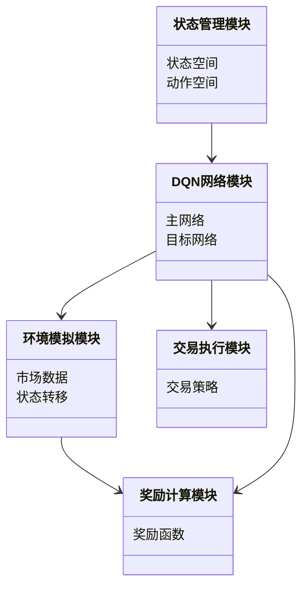
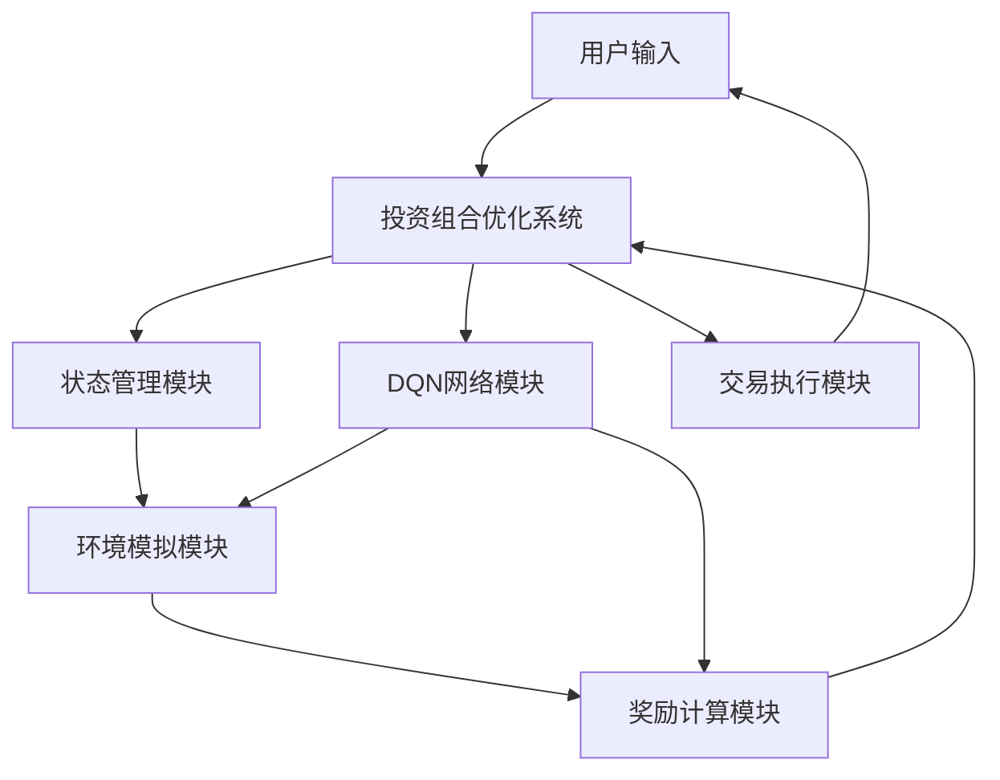
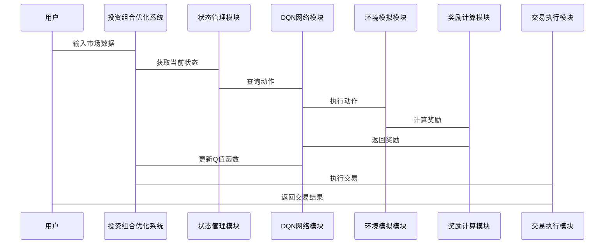

                 


# 金融领域强化学习在多周期投资组合优化中的应用

> 关键词：强化学习、投资组合优化、多周期优化、金融应用、Q-learning、Deep Q-Networks

> 摘要：本文深入探讨了强化学习在金融领域投资组合优化中的应用，特别是多周期投资组合优化问题。文章从强化学习的基本概念和数学模型入手，详细分析了强化学习在金融投资组合优化中的核心算法，包括Q-learning和Deep Q-Networks（DQN）。接着，结合实际案例，详细介绍了基于DQN的投资组合优化系统的实现过程，从系统设计到核心代码实现，再到案例分析，帮助读者全面理解强化学习在金融投资组合优化中的应用。最后，本文总结了强化学习在投资组合优化中的优缺点，提出了改进建议，并展望了未来的研究方向。

---

## 第一部分: 背景介绍

### 第1章: 强化学习与投资组合优化概述

#### 1.1 强化学习的基本概念
##### 1.1.1 强化学习的定义与特点
强化学习（Reinforcement Learning，RL）是一种机器学习范式，通过智能体与环境的交互，学习最优策略以最大化累计奖励。其特点是基于试错机制，通过不断探索和利用环境信息，逐步逼近最优决策。

##### 1.1.2 投资组合优化的定义与目标
投资组合优化是指在给定风险和收益约束下，选择最优的资产配置，以实现收益最大化或风险最小化。传统的投资组合优化方法主要基于均值-方差模型，但其在多周期优化问题中存在难以处理的动态性和非线性问题。

##### 1.1.3 强化学习在投资组合优化中的应用
强化学习能够处理复杂的动态环境和非线性关系，特别适用于多周期投资组合优化问题，其优势在于能够通过策略迭代优化投资组合。

#### 1.2 金融领域的强化学习应用背景
##### 1.2.1 金融市场的复杂性与不确定性
金融市场具有高度的不确定性和波动性，传统模型难以捕捉市场的复杂动态，而强化学习能够通过数据驱动的方式，适应市场变化。

##### 1.2.2 传统投资组合优化的局限性
传统投资组合优化方法（如马科维茨均值-方差模型）假设资产收益服从正态分布，且不考虑交易成本和市场动态，难以应对实际投资中的复杂问题。

##### 1.2.3 强化学习的优势与适用场景
强化学习能够处理非线性、多阶段决策问题，适用于多周期投资组合优化，特别是在市场动态变化和交易成本影响下。

#### 1.3 多周期投资组合优化的挑战
##### 1.3.1 多周期优化的定义与特点
多周期优化是指在多个时间周期内进行连续的投资决策，每个周期的决策会影响后续周期的状态和收益。

##### 1.3.2 多周期优化中的主要挑战
- 高维状态空间：多资产、多时间周期导致状态空间维度高。
- 动态变化：市场环境随时间变化，决策需要动态调整。
- 非线性关系：资产之间的相关性和市场波动可能导致非线性关系。

##### 1.3.3 强化学习在多周期优化中的应用前景
强化学习通过策略网络参数化，能够有效处理高维状态空间和非线性关系，为多周期投资组合优化提供了新的解决方案。

---

## 第二部分: 核心概念与算法原理

### 第2章: 强化学习的核心概念与数学模型

#### 2.1 马尔可夫决策过程（MDP）
##### 2.1.1 MDP的定义
马尔可夫决策过程（MDP）定义了一个由状态、动作、转移概率和奖励函数组成的元组 $(S, A, P, R)$，其中：
- $S$：状态空间
- $A$：动作空间
- $P(s'|s,a)$：从状态 $s$ 执行动作 $a$ 后转移到状态 $s'$ 的概率
- $R(r|s,a)$：在状态 $s$ 执行动作 $a$ 后得到的奖励 $r$ 的概率分布

##### 2.1.2 MDP的数学公式
状态转移概率可以用矩阵表示，奖励函数可以定义为标量值或概率分布。

#### 2.2 Q-learning算法
##### 2.2.1 Q-learning的基本原理
Q-learning是一种基于值迭代的强化学习算法，通过更新Q值函数 $Q(s,a)$ 来逼近最优策略。

##### 2.2.2 Q-learning的数学模型
Q-learning的目标是找到最优Q值函数，满足贝尔曼方程：
$$ Q^*(s,a) = \max_{a'} \left[ R(s,a,a') + \gamma \sum_{s'} P(s'|s,a) Q^*(s',a') \right] $$

##### 2.2.3 Q-learning的算法步骤
1. 初始化Q值函数。
2. 在环境中选择动作，记录状态和奖励。
3. 更新Q值函数：$$ Q(s,a) = Q(s,a) + \alpha [R + \gamma \max Q(s',a') - Q(s,a)] $$
4. 重复步骤2-3，直到收敛。

##### 2.2.4 MDP与Q-learning的关系
Q-learning通过将状态-动作对的价值表示为Q值函数，能够处理连续状态空间和动作空间。

---

### 第3章: Deep Q-Networks（DQN）算法

#### 3.1 DQN算法的原理
##### 3.1.1 神经网络的引入
DQN通过深度神经网络近似Q值函数，解决了Q-learning在高维状态空间中的计算难题。

##### 3.1.2 DQN的网络结构
DQN通常使用卷积神经网络（CNN）或全连接神经网络来近似Q值函数。

#### 3.2 DQN算法的数学模型
##### 3.2.1 神经网络的损失函数
DQN的损失函数定义为预测Q值与目标Q值之间的均方误差：
$$ \mathcal{L} = \mathbb{E}[(Q_{\theta}(s,a) - Q_{\theta}^{\text{target}}(s,a))^2] $$

##### 3.2.2 目标网络的更新
DQN使用目标网络 $Q_{\text{target}}$，每隔一定步数将主网络参数同步到目标网络：
$$ Q_{\text{target}} \leftarrow Q_{\text{main}} $$

#### 3.3 DQN算法的流程
1. 环境观测：接收当前状态 $s$。
2. 动作选择：通过 $\epsilon$-贪心策略选择动作 $a$。
3. 记录经验：存储 $(s,a,r,s')$ 到经验回放库。
4. 神经网络训练：随机抽取小批量经验，更新主网络参数。
5. 目标网络更新：每隔一定步数同步主网络到目标网络。

---

## 第三部分: 系统分析与架构设计

### 第4章: 投资组合优化系统设计

#### 4.1 系统功能设计
##### 4.1.1 领域模型
使用mermaid绘制领域模型类图，展示投资组合优化系统的主要模块和交互关系。



#### 4.2 系统架构设计
##### 4.2.1 系统架构
使用mermaid绘制系统架构图，展示系统的各个模块及其交互关系。



#### 4.3 系统接口设计
##### 4.3.1 接口定义
- 输入接口：接收市场数据和用户输入。
- 输出接口：输出优化后的投资组合和交易策略。

#### 4.4 系统交互流程
使用mermaid绘制系统交互序列图，展示系统的运行流程。



---

## 第四部分: 项目实战

### 第5章: 基于DQN的投资组合优化系统实现

#### 5.1 环境安装与配置
##### 5.1.1 安装Python环境
使用Anaconda安装Python 3.8及以上版本。

##### 5.1.2 安装依赖库
安装TensorFlow、Keras、NumPy、Pandas、Matplotlib等库。

##### 5.1.3 数据准备
使用历史股票数据作为市场数据，清洗和预处理数据。

#### 5.2 核心代码实现
##### 5.2.1 DQN网络模块
```python
import tensorflow as tf
from tensorflow.keras.layers import Dense, Input
from tensorflow.keras.models import Model

# 定义主网络
def build_dqn_model(input_dim, action_dim):
    inputs = Input(shape=(input_dim,))
    x = Dense(64, activation='relu')(inputs)
    x = Dense(32, activation='relu')(x)
    outputs = Dense(action_dim, activation='linear')(x)
    model = Model(inputs=inputs, outputs=outputs)
    model.compile(loss='mse', optimizer=tf.keras.optimizers.Adam(lr=0.001))
    return model
```

##### 5.2.2 环境模拟模块
```python
import numpy as np

class MarketEnvironment:
    def __init__(self, data):
        self.data = data
        self.current_step = 0
        self.state_dim = data.shape[1]
    
    def get_state(self):
        return self.data[self.current_step, :]
    
    def perform_action(self, action):
        next_step = self.current_step + 1
        if next_step >= len(self.data):
            return None
        next_state = self.data[next_step, :]
        reward = np.random.normal(0, 0.1)
        return next_state, reward
    
    def reset(self):
        self.current_step = 0
```

##### 5.2.3 交易执行模块
```python
class TradingAgent:
    def __init__(self, model, environment):
        self.model = model
        self.environment = environment
        self.epsilon = 0.1
    
    def get_action(self, state):
        if np.random.random() < self.epsilon:
            return np.random.randint(0, self.model.output_shape[-1])
        else:
            predicted_q = self.model.predict(state.reshape(1, -1))
            return np.argmax(predicted_q[0])
    
    def update_epsilon(self):
        self.epsilon = max(0.01, self.epsilon * 0.99)
```

#### 5.3 代码应用解读与分析
##### 5.3.1 DQN网络模块
主网络和目标网络的定义，以及目标网络的更新逻辑。

##### 5.3.2 环境模拟模块
市场环境的状态获取和动作执行，包括状态转移和奖励计算。

##### 5.3.3 交易执行模块
$\epsilon$-贪心策略选择动作，以及$\epsilon$的衰减逻辑。

#### 5.4 实际案例分析
##### 5.4.1 案例数据准备
使用股票数据作为市场数据，清洗和归一化处理。

##### 5.4.2 模型训练与评估
训练DQN网络，评估投资组合的收益和风险。

##### 5.4.3 案例结果展示
展示训练过程中的收益曲线和最终的投资组合优化结果。

#### 5.5 项目小结
总结项目实现的关键点，分析系统的优势和不足，提出改进建议。

---

## 第五部分: 总结与展望

### 第6章: 总结与展望

#### 6.1 强化学习在投资组合优化中的应用总结
强化学习通过处理动态环境和非线性关系，为投资组合优化提供了新的解决方案，特别是在多周期优化问题中表现出显著优势。

#### 6.2 项目实战中的经验与教训
- 数据预处理的重要性
- $\epsilon$-贪心策略的平衡点
- 神经网络结构的调优

#### 6.3 强化学习在投资组合优化中的未来展望
- 多智能体强化学习的应用
- 超参数优化与网络结构改进
- 强化学习与其他机器学习方法的结合

---

## 参考文献

1. Sutton, R. S., & Barto, A. G. (2018). Reinforcement Learning: An Introduction.
2. Mnih, V., et al. (2015). Human-level control through deep reinforcement learning.
3. Li, X., et al. (2020). Deep reinforcement learning for portfolio optimization.

---

通过本文的系统阐述和实际案例分析，读者可以全面理解强化学习在金融领域投资组合优化中的应用，特别是多周期优化问题的解决方法。本文不仅提供了理论支持，还通过代码实现展示了强化学习的实际应用价值，为后续研究和实践提供了参考。

