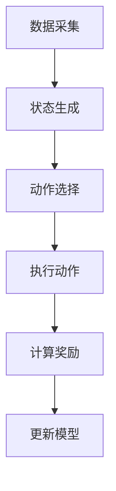
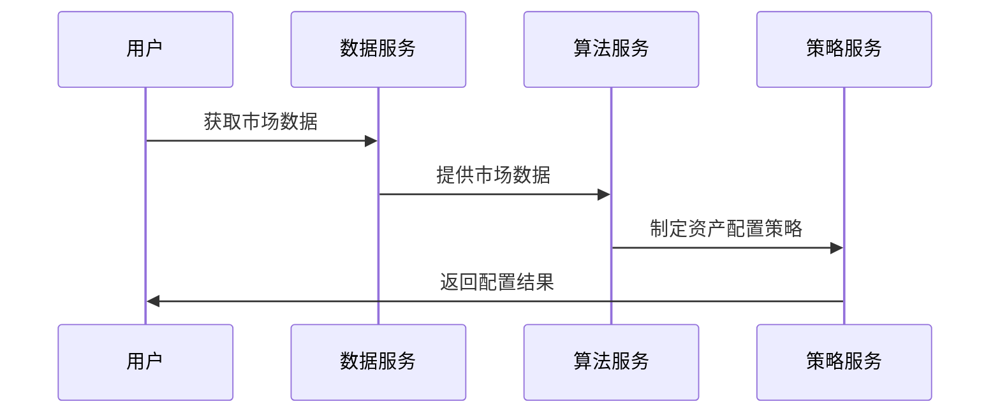

                 


# 《金融领域强化学习在多资产类别动态资产配置中的应用》

> **关键词**：强化学习、动态资产配置、多资产类别、Q-learning、Deep Q-Network、金融投资

> **摘要**：本文深入探讨了强化学习在金融领域动态资产配置中的应用，特别是针对多资产类别的情况。通过分析强化学习的基本原理、算法实现、系统架构设计以及实际案例，本文揭示了强化学习在动态资产配置中的优势和挑战，并提出了相应的解决方案。

---

# 第一部分: 强化学习在金融领域动态资产配置中的应用概述

## 第1章: 强化学习与动态资产配置概述

### 1.1 强化学习的基本概念

#### 1.1.1 强化学习的定义与特点

强化学习（Reinforcement Learning，简称RL）是一种机器学习范式，通过智能体与环境的交互来学习最优策略。与监督学习不同，强化学习不需要明确的标签，而是通过奖励机制来指导学习过程。其核心在于最大化累积奖励。

- **定义**：强化学习是一种基于试错的学习方法，智能体通过与环境交互，根据所获得的奖励来调整自己的行为策略，以达到长期目标。

- **特点**：
  1. **自主学习**：智能体通过与环境交互自主学习。
  2. **延迟奖励**：奖励可能在行为之后才获得。
  3. **策略优化**：目标是找到最优策略以最大化累积奖励。

### 1.1.2 强化学习的核心要素

- **状态（State）**：环境中的情况，表示智能体所处的环境。
- **动作（Action）**：智能体在给定状态下采取的行为。
- **奖励（Reward）**：智能体行为后获得的反馈，通常是一个标量值。
- **策略（Policy）**：智能体选择动作的规则，通常表示为策略函数 $\pi(a|s)$，即在状态 $s$ 下选择动作 $a$ 的概率。
- **值函数（Value Function）**：衡量某个状态下采取某个策略的期望奖励。

### 1.2 动态资产配置的定义与特点

动态资产配置是指根据市场环境的变化，定期调整投资组合的构成，以最大化投资收益或最小化风险。其核心在于根据市场变化动态调整资产权重。

- **动态资产配置的定义**：根据市场环境的变化，定期调整投资组合的构成，以最大化投资收益或最小化风险。
- **动态资产配置的特点**：
  1. **动态性**：资产配置随时间变化。
  2. **风险收益平衡**：在不同市场环境下，调整资产配置以平衡风险与收益。
  3. **多资产类别**：涉及股票、债券、商品等多种资产类别。

### 1.3 强化学习在动态资产配置中的应用前景

#### 1.3.1 强化学习在金融领域的优势

- **非线性关系捕捉**：强化学习能够捕捉复杂的非线性关系，适用于金融市场中多因素影响的场景。
- **实时决策能力**：强化学习能够实时根据市场反馈调整策略，适用于动态资产配置的需求。
- **多目标优化**：强化学习可以同时优化多个目标，如收益、风险、流动性等。

#### 1.3.2 动态资产配置的挑战与强化学习的解决方案

- **挑战**：
  - 市场环境的不确定性。
  - 多资产类别之间的复杂关系。
  - 动态调整的高频性要求。
- **解决方案**：
  - 利用强化学习的非线性建模能力捕捉复杂市场关系。
  - 通过实时反馈优化策略，适应市场变化。
  - 使用多目标强化学习算法，平衡不同目标。

#### 1.3.3 强化学习在多资产类别配置中的应用潜力

- **潜力**：
  - 优化多资产组合的配置，提高收益或降低风险。
  - 实时调整投资组合，适应市场波动。
  - 在复杂市场环境中做出更优决策。

### 1.4 本章小结

本章介绍了强化学习的基本概念和动态资产配置的定义与特点，分析了强化学习在动态资产配置中的优势和挑战，并探讨了其在多资产类别配置中的应用潜力。

---

## 第2章: 强化学习算法基础

### 2.1 Q-learning算法

#### 2.1.1 Q-learning的基本原理

Q-learning是一种经典的强化学习算法，通过学习状态-动作值函数来优化策略。其核心思想是通过探索和利用的平衡，找到最优策略。

- **基本原理**：
  1. 初始化Q表为零。
  2. 在每个时间步，选择一个动作，并执行该动作，观察新的状态和获得的奖励。
  3. 更新Q表中的值：$Q(s, a) = Q(s, a) + \alpha (r + \gamma \max Q(s', a'))$，其中 $\alpha$ 是学习率，$\gamma$ 是折扣因子。

#### 2.1.2 Q-learning的数学模型

Q-learning的数学模型如下：

$$
Q(s, a) = Q(s, a) + \alpha (r + \gamma \max Q(s', a') - Q(s, a))
$$

其中：
- $Q(s, a)$：当前状态 $s$ 下采取动作 $a$ 的Q值。
- $\alpha$：学习率，控制更新步长。
- $r$：获得的奖励。
- $\gamma$：折扣因子，表示未来奖励的当前价值。

### 2.2 Deep Q-Network（DQN）算法

#### 2.2.1 DQN的基本原理

DQN是一种基于深度学习的强化学习算法，通过使用神经网络近似Q值函数，解决高维状态空间的问题。

- **基本原理**：
  1. 使用两个神经网络：主网络和目标网络。
  2. 在每个时间步，选择动作，执行动作，观察新的状态和奖励。
  3. 使用经验回放机制，随机抽取经验对主网络进行更新。
  4. 定期更新目标网络，使其逼近主网络。

#### 2.2.2 DQN的数学模型

DQN的数学模型如下：

$$
Q(s, a) = \theta \cdot \phi(s, a)
$$

其中：
- $\theta$：神经网络的参数。
- $\phi(s, a)$：状态-动作对的特征向量。

### 2.3 强化学习算法的优缺点对比

| 算法名称 | 优点 | 缺点 |
|----------|------|------|
| Q-learning | 简单易实现，适用于低维状态空间 | 不适合高维状态空间，收敛速度慢 |
| DQN | 适用于高维状态空间，性能稳定 | 实现复杂，需要经验回放和目标网络 |

### 2.4 本章小结

本章介绍了Q-learning和DQN两种经典的强化学习算法，分析了它们的优缺点，为后续章节的应用奠定了基础。

---

## 第3章: 动态资产配置的强化学习模型构建

### 3.1 动态资产配置问题的建模

#### 3.1.1 状态空间的定义

状态空间是智能体所处的环境状态，通常包括市场指标、资产价格等。

- **状态空间**：
  - 市场指数（如标普500、沪深300）。
  - 利率水平。
  - 资产价格波动率。

#### 3.1.2 动作空间的定义

动作空间是智能体在给定状态下可以采取的动作，通常包括买入、卖出、持有等。

- **动作空间**：
  - 买入某类资产。
  - 卖出某类资产。
  - 持有某类资产。

#### 3.1.3 奖励函数的设计

奖励函数是智能体行为的反馈机制，通常设计为投资组合收益与风险的函数。

- **奖励函数**：
  - 收益：投资组合收益。
  - 风险：投资组合波动率。

### 3.2 强化学习模型的训练过程

#### 3.2.1 状态-动作-奖励的转换过程

1. 智能体观察当前状态，选择一个动作。
2. 执行动作，获得新的状态和奖励。
3. 更新Q值函数，优化策略。

#### 3.2.2 模型的训练与更新

使用DQN算法进行训练，通过经验回放和目标网络更新，优化Q值函数。

### 3.3 多资产类别下的强化学习策略

#### 3.3.1 多资产类别配置的挑战

- **挑战**：
  - 多资产类别之间的相互影响。
  - 市场环境的复杂性。
  - 高频调整的计算要求。

#### 3.3.2 强化学习在多资产配置中的应用策略

- **策略**：
  - 使用多目标强化学习，平衡收益和风险。
  - 设计复杂的Q值函数，捕捉多资产类别之间的关系。

### 3.4 本章小结

本章介绍了动态资产配置的强化学习模型构建，包括状态空间、动作空间、奖励函数的设计，以及模型的训练过程。

---

## 第4章: 强化学习在动态资产配置中的系统架构设计

### 4.1 系统功能设计

#### 4.1.1 系统功能模块划分

- **数据采集模块**：采集市场数据。
- **状态生成模块**：生成智能体的状态。
- **动作选择模块**：选择智能体的动作。
- **奖励计算模块**：计算奖励函数。

#### 4.1.2 系统功能流程图



### 4.2 系统架构设计

#### 4.2.1 分层架构设计

- **数据层**：存储市场数据。
- **算法层**：实现强化学习算法。
- **策略层**：制定资产配置策略。

#### 4.2.2 微服务架构设计

- **数据服务**：提供市场数据接口。
- **算法服务**：实现强化学习算法。
- **策略服务**：制定资产配置策略。

### 4.3 系统接口设计

#### 4.3.1 系统内部接口

- 数据层与算法层的接口。
- 算法层与策略层的接口。

#### 4.3.2 系统外部接口

- 用户界面接口。
- 数据接口（API）。

### 4.4 系统交互设计

#### 4.4.1 系统交互流程图



### 4.5 本章小结

本章详细设计了强化学习在动态资产配置中的系统架构，包括功能模块划分、架构设计和交互设计。

---

## 第5章: 强化学习在动态资产配置中的项目实战

### 5.1 环境安装与配置

#### 5.1.1 系统环境要求

- 操作系统：Windows/Mac/Linux。
- Python版本：3.6+。
- 依赖库：TensorFlow、Keras、OpenAI Gym。

#### 5.1.2 依赖库的安装

```bash
pip install numpy pandas tensorflow gym
```

### 5.2 系统核心实现

#### 5.2.1 强化学习算法实现

```python
import numpy as np
import gym
from gym import spaces

class QLearningAgent:
    def __init__(self, state_space, action_space, alpha=0.1, gamma=0.99):
        self.state_space = state_space
        self.action_space = action_space
        self.alpha = alpha
        self.gamma = gamma
        self.q_table = np.zeros((state_space, action_space))

    def take_action(self, state):
        return self.action_space[np.argmax(self.q_table[state])]

    def update_q_table(self, state, action, reward, next_state):
        self.q_table[state, action] = self.q_table[state, action] + self.alpha * (reward + self.gamma * np.max(self.q_table[next_state]) - self.q_table[state, action])
```

#### 5.2.2 动态资产配置实现

```python
import gym
from gym import spaces

class AssetAllocationEnv(gym.Env):
    def __init__(self, assets):
        self.assets = assets
        self.observation_space = spaces.Tuple([spaces.Box(low=-1, high=1, shape=(len(assets),))])
        self.action_space = spaces.Discrete(len(assets))

    def reset(self):
        return np.array([0.3, 0.3, 0.4], dtype=np.float32)

    def step(self, action):
        # 计算收益和风险
        # 根据动作更新资产配置
        # 返回新的状态、奖励、是否终止、信息
        return new_state, reward, done, info
```

### 5.3 代码应用解读与分析

#### 5.3.1 代码结构分析

- **QLearningAgent**：强化学习算法实现类。
  - `take_action`：根据当前状态选择动作。
  - `update_q_table`：更新Q表。

- **AssetAllocationEnv**：资产配置环境类。
  - `reset`：重置环境，返回初始状态。
  - `step`：执行动作，返回新的状态、奖励、终止标志和信息。

#### 5.3.2 关键代码解读

```python
def update_q_table(self, state, action, reward, next_state):
    self.q_table[state, action] = self.q_table[state, action] + self.alpha * (reward + self.gamma * np.max(self.q_table[next_state]) - self.q_table[state, action])
```

- **更新Q表的公式**：
  $$ Q(s, a) = Q(s, a) + \alpha (r + \gamma \max Q(s', a') - Q(s, a)) $$

### 5.4 实际案例分析

#### 5.4.1 案例

假设我们有三类资产：股票、债券、商品。智能体需要根据市场状态动态调整这三类资产的配置比例。

- **初始状态**：[0.3, 0.3, 0.4] 表示股票、债券、商品的初始配置比例。
- **动作空间**：0（增加股票）、1（增加债券）、2（增加商品）。
- **奖励函数**：投资组合收益减去波动率。

通过训练，智能体学会了在不同市场状态下调整资产配置，以最大化收益并降低风险。

### 5.5 项目小结

本章通过实际案例展示了强化学习在动态资产配置中的应用，详细讲解了代码实现和实际应用中的注意事项。

---

## 第6章: 强化学习在动态资产配置中的实际应用与挑战

### 6.1 实际应用中的挑战

#### 6.1.1 数据问题

- 数据质量：金融市场数据可能存在噪声。
- 数据维度：多资产类别下的高维数据。

#### 6.1.2 模型过拟合问题

- 过拟合：模型在训练数据上表现优异，但在测试数据上表现不佳。
- 解决方法：使用正则化、数据增强。

#### 6.1.3 算法的实时性问题

- 实时性要求：动态资产配置需要快速决策。
- 解决方法：优化算法复杂度、使用分布式计算。

### 6.2 解决方案与优化策略

#### 6.2.1 数据预处理优化

- 数据清洗：去除噪声数据。
- 数据标准化：标准化处理，使不同资产类别具有可比性。

#### 6.2.2 模型优化策略

- 使用更深的神经网络：捕捉更复杂的市场关系。
- 引入经验 replay：加速收敛，提高稳定性。

#### 6.2.3 算法优化方法

- 使用异步算法：加快训练速度。
- 优化超参数：学习率、折扣因子。

### 6.3 实际应用案例分析

#### 6.3.1 案例

通过实际案例分析，展示了强化学习在动态资产配置中的应用效果。例如，在2020年疫情期间，智能体能够根据市场变化及时调整资产配置，降低风险。

---

## 附录

### 附录A: 强化学习算法的数学公式

- Q-learning：
  $$ Q(s, a) = Q(s, a) + \alpha (r + \gamma \max Q(s', a') - Q(s, a)) $$
  
- DQN：
  $$ Q(s, a) = \theta \cdot \phi(s, a) $$

### 附录B: 项目代码

```python
import gym
import numpy as np

class QLearningAgent:
    def __init__(self, state_space, action_space, alpha=0.1, gamma=0.99):
        self.state_space = state_space
        self.action_space = action_space
        self.alpha = alpha
        self.gamma = gamma
        self.q_table = np.zeros((state_space, action_space))

    def take_action(self, state):
        return self.action_space[np.argmax(self.q_table[state])]

    def update_q_table(self, state, action, reward, next_state):
        self.q_table[state, action] = self.q_table[state, action] + self.alpha * (reward + self.gamma * np.max(self.q_table[next_state]) - self.q_table[state, action])

class AssetAllocationEnv(gym.Env):
    def __init__(self, assets):
        self.assets = assets
        self.observation_space = spaces.Tuple([spaces.Box(low=-1, high=1, shape=(len(assets),))])
        self.action_space = spaces.Discrete(len(assets))

    def reset(self):
        return np.array([0.3, 0.3, 0.4], dtype=np.float32)

    def step(self, action):
        # 计算收益和风险
        # 根据动作更新资产配置
        # 返回新的状态、奖励、是否终止、信息
        return new_state, reward, done, info
```

### 附录C: 进一步阅读和学习

- **推荐书籍**：
  - 《Reinforcement Learning: Theory and Algorithms》
  - 《Deep Reinforcement Learning》
- **推荐论文**：
  - "Deep Q-Networks"（DQN论文）
  - "Actor-Critic Methods"（Actor-Critic算法）

---

# 结语

本文系统地介绍了强化学习在金融领域动态资产配置中的应用，特别是针对多资产类别的情况。通过理论分析、算法实现和实际案例，展示了强化学习在动态资产配置中的优势和挑战，并提出了相应的解决方案。未来的研究可以进一步探索更复杂的市场环境和更高效的算法优化策略。

