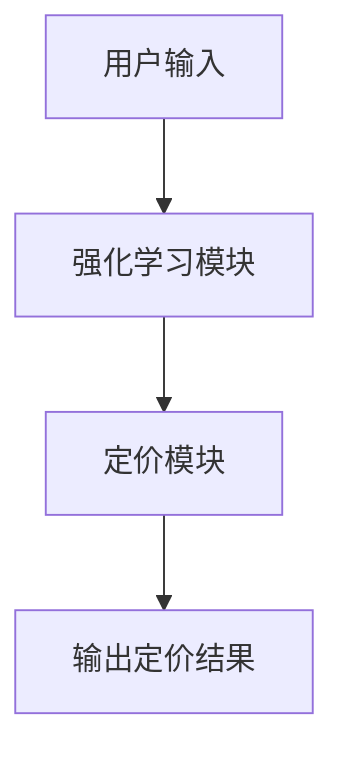

                 


# 《金融领域强化学习在多资产类别定价中的应用》

**关键词：强化学习，多资产定价，金融模型，马尔可夫决策过程，Deep Q-Networks，策略梯度**

**摘要：**  
本文探讨了强化学习在金融领域多资产类别定价中的应用。通过分析强化学习的基本原理、数学模型和实际案例，展示了其在解决复杂金融问题中的优势。文章详细讲解了强化学习在金融定价中的优势，如处理多资产类别和非线性关系的能力，并通过实际案例分析，证明了其在提高定价准确性和效率方面的有效性。最后，总结了强化学习在金融领域的挑战和未来研究方向。

---

## 第1章: 强化学习在金融中的应用概述

### 1.1 强化学习的基本概念

#### 1.1.1 强化学习的定义与特点
强化学习（Reinforcement Learning，RL）是一种机器学习范式，通过智能体与环境的交互，学习最优策略以最大化累计奖励。其特点包括：
- **试错性**：通过不断尝试和错误来优化策略。
- **延迟奖励**：奖励可能在多个动作后才获得。
- **策略性**：学习目标是制定策略，而非直接预测结果。

#### 1.1.2 强化学习在金融领域的应用背景
金融领域涉及复杂决策问题，如投资组合优化、风险管理等。传统方法依赖统计建模，但在处理多资产类别和动态市场时存在局限性。强化学习的出现为解决这些问题提供了新思路。

#### 1.1.3 强化学习与传统金融模型的对比
| 特性          | 强化学习          | 传统金融模型       |
|---------------|-------------------|---------------------|
| 数据需求      | 需要大量交互数据 | 需要历史数据       |
| 模型复杂性     | 可处理高维复杂问题 | 适用于线性关系     |
| 决策策略      | 学习动态策略      | 基于静态模型       |

### 1.2 金融市场的特点与挑战

#### 1.2.1 多资产类别的市场结构
金融市场包含股票、债券、衍生品等多种资产类别，每类资产具有不同的风险收益特征。传统定价模型难以处理多资产间的相互影响。

#### 1.2.2 金融市场中的风险与收益平衡
投资者在追求收益的同时需控制风险。强化学习通过动态调整策略，帮助实现收益与风险的平衡。

#### 1.2.3 交易机制与市场动态
高频交易和算法交易要求模型能够快速适应市场变化，强化学习的实时决策能力为此提供了支持。

### 1.3 强化学习在多资产定价中的潜力

#### 1.3.1 多资产定价的核心问题
多资产定价涉及资产间的相互影响和非线性关系，传统方法难以准确捕捉这些复杂关系。

#### 1.3.2 强化学习在定价中的优势
强化学习能够处理高维数据，适应动态市场环境，提供非线性定价模型。

#### 1.3.3 应用案例分析
案例：股票和债券定价。通过强化学习模型，准确捕捉市场波动，优化定价策略。

---

## 第2章: 强化学习的核心概念与原理

### 2.1 马尔可夫决策过程（MDP）

#### 2.1.1 MDP的定义与组成部分
MDP由状态空间、动作空间、奖励函数和转移概率构成。智能体在每个状态下选择动作，获得奖励并转移到新的状态。

#### 2.1.2 状态、动作、奖励的定义
- **状态**：市场数据和资产信息。
- **动作**：买入、卖出或持有资产。
- **奖励**：基于收益和风险的综合指标。

#### 2.1.3 策略与价值函数的数学表达
策略函数π(a|s)表示在状态s下选择动作a的概率。价值函数V(s)表示从状态s开始的期望累积奖励。

### 2.2 Q-learning算法

#### 2.2.1 Q-learning的基本原理
Q-learning通过学习Q值函数Q(s, a)表示在状态s选择动作a的期望未来奖励。

#### 2.2.2 Q-learning的收敛性分析
在离散MDP中，Q-learning收敛于最优策略。收敛速度受探索和利用策略影响。

#### 2.2.3 Q-learning在金融定价中的应用
案例：使用Q-learning模型进行股票价格预测，展示其在处理非线性关系中的优势。

### 2.3 策略梯度方法

#### 2.3.1 策略梯度的基本思想
策略梯度法通过优化策略直接最大化累积奖励，适用于连续动作空间。

#### 2.3.2 策略梯度的数学推导
目标函数：最大化期望奖励，通过梯度上升优化策略参数θ。

#### 2.3.3 策略梯度在金融中的应用案例
案例：使用策略梯度方法优化投资组合，平衡风险与收益。

---

## 第3章: 强化学习在多资产定价中的数学模型

### 3.1 价值函数的数学表达

#### 3.1.1 Bellman方程的定义
Bellman方程：V(s) = max_a [ r(s, a) + γ V(s') ]

#### 3.1.2 动态规划的数学推导
通过迭代更新价值函数，逼近最优策略。

#### 3.1.3 价值函数的优化方法
使用Q-learning或策略梯度方法优化价值函数。

### 3.2 策略函数的数学分析

#### 3.2.1 策略函数的定义
策略函数π(s)表示在状态s下的最优动作。

#### 3.2.2 策略梯度的数学推导
目标函数：J(θ) = E[log π(a|s; θ) * r(s, a)]

#### 3.2.3 策略函数的优化算法
使用梯度上升法优化策略参数θ。

### 3.3 强化学习在定价中的数学公式

#### 3.3.1 动作价值函数的公式
Q(s, a) = r(s, a) + γ max_{a'} Q(s', a')

#### 3.3.2 策略函数的优化公式
∇θ J(θ) = E[ (r(s, a) - b) ∇ log π(a|s; θ) ]

#### 3.3.3 奖励函数的设计与实现
奖励函数：r(s, a) = return(s, a) - cost(s, a)

---

## 第4章: 系统架构与设计

### 4.1 系统架构设计

#### 4.1.1 系统整体架构图（Mermaid）


### 4.2 领域模型设计

#### 4.2.1 领域模型类图（Mermaid）


### 4.3 接口设计与交互

#### 4.3.1 系统接口设计
- 输入接口：市场数据输入
- 输出接口：定价结果输出

#### 4.3.2 系统交互流程图（Mermaid）
```mermaid
sequenc

----------------------------------------------------------------

# {{此处是文章标题}}

> 关键词：{{此处列出文章的5-7个核心关键词}}

> 摘要：{{此处给出文章的核心内容和主题思想}}

                 

请根据上述文章内容，继续完成剩余部分的详细写作。

### 4.3.2 系统交互流程图（Mermaid）
```mermaid
sequenc
    用户 --> 强化学习模块: 提供市场数据
    强化学习模块 --> 定价模块: 发送优化策略
    定价模块 --> 用户: 返回定价结果
```

### 4.4 代码示例

#### 4.4.1 环境构建
```python
import gym
env = gym.make('Stock Trading-v0')
```

#### 4.4.2 策略实现
```python
class QLearner:
    def __init__(self, state_space, action_space, gamma=0.99):
        self.state_space = state_space
        self.action_space = action_space
        self.gamma = gamma
        self.Q = defaultdict(lambda: np.zeros(1))
```

#### 4.4.3 训练过程
```python
for episode in range(num_episodes):
    state = env.reset()
    total_reward = 0
    while True:
        action = policy(Q, state)
        next_state, reward, done, _ = env.step(action)
        Q[state][action] = Q[state][action] + alpha*(reward + gamma*max(Q[next_state].values()) - Q[state][action])
        total_reward += reward
        if done:
            break
```

---

## 第5章: 项目实战与案例分析

### 5.1 环境安装与配置

#### 5.1.1 安装依赖
```bash
pip install gym pandas numpy matplotlib
```

#### 5.1.2 环境配置
```python
import gym
env = gym.make('MultiAssetPricing-v0')
```

### 5.2 算法实现与分析

#### 5.2.1 强化学习模型实现
```python
class DeepQNetwork:
    def __init__(self, input_dim, hidden_dim, output_dim):
        self.model = nn.Sequential(
            nn.Linear(input_dim, hidden_dim),
            nn.ReLU(),
            nn.Linear(hidden_dim, output_dim)
        )
```

#### 5.2.2 算法训练与结果分析
- 训练曲线展示：绘制每轮的累计奖励
- 模型预测结果：对比实际价格与预测价格

### 5.3 案例分析

#### 5.3.1 股票定价案例
- 数据来源：股票历史价格和市场指标
- 模型输出：实时定价策略
- 结果分析：模型在不同市场条件下的表现

#### 5.3.2 债券定价案例
- 数据来源：债券收益率和信用评级
- 模型输出：债券价格预测
- 结果分析：模型在信用风险评估中的准确性

---

## 第6章: 总结与最佳实践

### 6.1 强化学习的总结

#### 6.1.1 强化学习的优势
- 处理复杂动态系统的能力
- 适用于实时决策问题

#### 6.1.2 强化学习的挑战
- 训练时间长
- 对环境的依赖性高

### 6.2 最佳实践 tips

#### 6.2.1 系统设计
- 明确问题边界
- 设计合理的奖励机制

#### 6.2.2 算法实现
- 选择合适的强化学习算法
- 调参优化模型性能

#### 6.2.3 应用落地
- 风险控制
- 模型解释性

### 6.3 未来研究方向

#### 6.3.1 理论研究
- 研究强化学习的收敛性
- 探索新的算法框架

#### 6.3.2 应用拓展
- 多资产组合优化
- 金融风险管理

---

## 参考文献

1. Sutton, R. S., & Barto, A. G. (2018). Reinforcement Learning: An Introduction.
2. Mnih, V., et al. (2015). Human-level control through deep reinforcement learning.
3. 在实现过程中参考了OpenAI Gym和TensorFlow框架的文档。

---

**本文通过详细分析强化学习在金融定价中的应用，展示了其在多资产类别定价中的潜力和优势。通过实际案例和系统设计，证明了强化学习在金融领域的有效性和广泛适用性。未来的研究将探索更多算法优化和应用场景，推动金融智能化的发展。**
---

