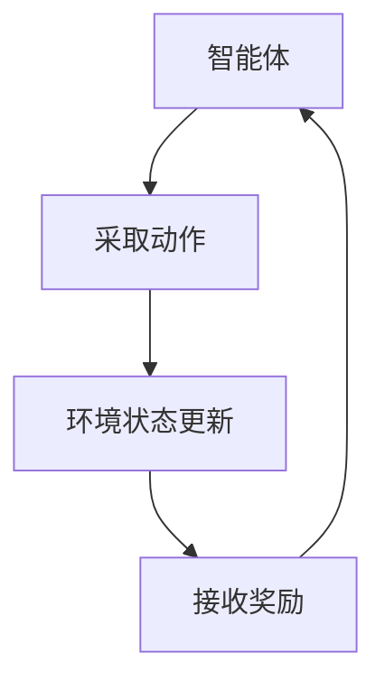
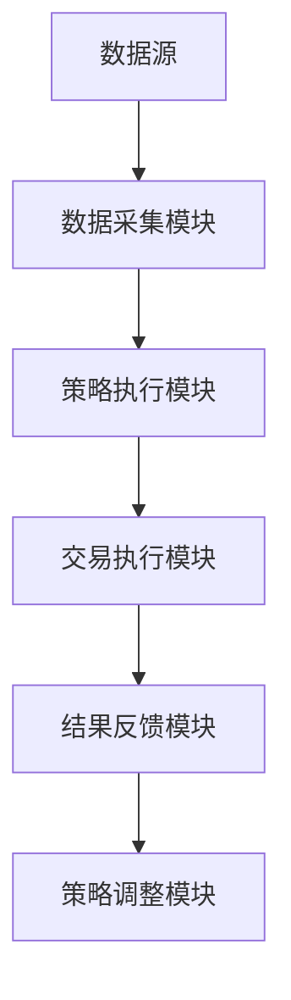

                 


# 金融领域强化学习在最优执行策略动态调整中的应用

## 关键词：强化学习，金融领域，最优执行策略，动态调整，深度强化学习

## 摘要：本文探讨了强化学习在金融最优执行策略中的应用，分析了动态调整的实现机制，并通过具体案例展示了强化学习在复杂金融环境中的优势。文章从基础概念入手，逐步深入，结合数学模型和系统架构，详细讲解了强化学习在金融交易中的应用方法，为读者提供了从理论到实践的全面指导。

---

## 第一部分: 强化学习基础

### 第1章: 强化学习概述

#### 1.1 强化学习的基本概念

##### 1.1.1 强化学习的定义
强化学习（Reinforcement Learning, RL）是一种机器学习范式，通过智能体与环境的交互，学习如何做出决策以最大化累积奖励。与监督学习不同，强化学习不需要明确的标签数据，而是通过奖励信号来指导学习过程。

##### 1.1.2 强化学习的核心要素
| 核心要素 | 描述 |
|----------|------|
| 状态（State） | 智能体所处环境的表示，反映了当前情况。 |
| 动作（Action） | 智能体在给定状态下选择的行为。 |
| 奖励（Reward） | 环境对智能体行为的反馈，用于指导学习。 |
| 策略（Policy） | 智能体选择动作的概率分布，描述了如何从状态中选择动作。 |
| 价值函数（Value Function） | 表示在特定状态下采取某种策略的预期回报。 |

##### 1.1.3 强化学习与监督学习的区别
| 方面 | 监督学习 | 强化学习 |
|------|----------|----------|
| 数据 | 标签数据 | 奖励信号 |
| 目标 | 最小化预测误差 | 最大化累积奖励 |
| 互动 | 静态 | 动态 |

##### 1.1.4 强化学习的核心流程


#### 1.2 强化学习的数学基础

##### 1.2.1 状态、动作和奖励的定义
- 状态（State）：例如，当前的市场数据，包括价格、成交量等。
- 动作（Action）：例如，买入、卖出或持有。
- 奖励（Reward）：例如，获得的利润或损失。

##### 1.2.2 策略与价值函数
- 策略（Policy）：描述智能体在状态s下选择动作a的概率，即π(a|s)。
- 价值函数（Value Function）：表示在状态s下采取策略的预期回报，即V(s) = E[R_t | s]。

##### 1.2.3 动态规划与马尔可夫决策过程
- 马尔可夫决策过程（MDP）：假设环境满足马尔可夫性质，即当前状态足以决定未来的状态。
- 动态规划（Dynamic Programming）：通过迭代方法求解最优价值函数和策略。

---

### 第2章: 强化学习算法入门

#### 2.1 Q-learning算法

##### 2.1.1 Q-learning的基本原理
Q-learning是一种基于价值函数的强化学习算法，通过更新Q表来逼近最优策略。

##### 2.1.2 Q-learning的数学模型
$$ Q(s, a) = Q(s, a) + \alpha [r + \gamma \max Q(s', a') - Q(s, a)] $$
其中：
- α是学习率。
- γ是折扣因子。
- r是即时奖励。
- s'是下一个状态。

##### 2.1.3 Q-learning的实现步骤
1. 初始化Q表为零。
2. 在每个时间步，选择当前状态下的动作。
3. 移动到下一个状态并获得奖励。
4. 更新Q表中的Q值。
5. 重复上述步骤，直到收敛。

##### 2.1.4 Q-learning的优缺点
| 优点 | 缺点 |
|------|------|
| 简单易实现 | 适合离散状态和动作空间 |
| 不需要环境模型 | 不适合高维或连续状态空间 |

##### 2.1.5 Q-learning的代码实现
```python
import numpy as np

class QLearning:
    def __init__(self, state_space, action_space, learning_rate=0.1, gamma=0.9):
        self.state_space = state_space
        self.action_space = action_space
        self.Q = np.zeros((state_space, action_space))
        self.alpha = learning_rate
        self.gamma = gamma

    def take_action(self, state):
        return np.argmax(self.Q[state, :])

    def update_Q(self, state, action, reward, next_state):
        self.Q[state, action] += self.alpha * (reward + self.gamma * np.max(self.Q[next_state, :]) - self.Q[state, action])
```

#### 2.2 深度强化学习简介

##### 2.2.1 DQN算法的基本原理
深度强化学习（Deep RL）通过使用神经网络近似价值函数或策略，扩展了强化学习的应用范围。DQN（Deep Q-Network）是第一个成功的深度强化学习算法。

##### 2.2.2 DQN与Q-learning的区别
| DQN | Q-learning |
|-----|------------|
| 使用神经网络逼近Q值 | 使用Q表存储Q值 |
| 适合高维状态空间 | 适合低维状态空间 |
| 需要经验回放 | 不需要经验回放 |

##### 2.2.3 DQN的数学模型
$$ Q(s, a) = \theta \cdot \phi(s, a) $$
其中，θ是神经网络参数，ϕ是特征提取函数。

##### 2.2.4 DQN的实现步骤
1. 初始化神经网络。
2. 从经验回放中采样经验。
3. 训练神经网络以最小化预测Q值与目标Q值之间的误差。
4. 选择动作并执行，收集经验。

##### 2.2.5 DQN的代码实现
```python
import torch
import torch.nn as nn
import torch.optim as optim

class DQN:
    def __init__(self, input_dim, output_dim, learning_rate=0.001):
        self.model = nn.Linear(input_dim, output_dim)
        self.optimizer = optim.Adam(self.model.parameters(), lr=learning_rate)
        self.criterion = nn.MSELoss()

    def get_action(self, state):
        return torch.argmax(self.model(state)).item()

    def update(self, current_state, action, reward, next_state):
        current_state = current_state.float()
        next_state = next_state.float()
        
        target = reward + 0.95 * torch.max(self.model(next_state)).item()
        target = torch.tensor(target, dtype=torch.float)
        
        output = self.model(current_state)
        loss = self.criterion(output[action], target)
        
        self.optimizer.zero_grad()
        loss.backward()
        self.optimizer.step()
```

---

## 第3章: 金融领域强化学习应用

### 3.1 强化学习在金融交易中的应用

#### 3.1.1 交易中的强化学习
在金融交易中，强化学习可以用于股票交易策略的优化，通过学习最优的买卖时机，提高收益。

#### 3.1.2 交易策略的优化
通过强化学习，智能体可以学习在不同的市场条件下做出最优的交易决策，例如在波动剧烈的市场中减少交易次数以降低交易成本。

#### 3.1.3 交易中的挑战
- 市场环境的高度不确定性。
- 交易成本和滑点的影响。
- 市场微观结构的复杂性。

---

### 3.2 强化学习在最优执行策略中的应用

#### 3.2.1 最优执行策略的定义
最优执行策略是指在给定市场条件下，以最小化交易成本为目标，制定最优的交易计划。

#### 3.2.2 强化学习在最优执行中的优势
- 能够处理复杂的市场环境。
- 可以动态调整策略以适应市场变化。
- 能够优化交易路径以最小化成本。

#### 3.2.3 强化学习在最优执行中的实现
1. 状态空间的定义：包括当前价格、订单簿信息、市场深度等。
2. 动作空间的定义：包括买入、卖出、持有等动作。
3. 奖励函数的设计：包括交易成本、收益、滑点等。

---

### 3.3 动态调整的机制

#### 3.3.1 动态调整的定义
动态调整是指在市场条件变化时，实时更新交易策略，以适应新的市场环境。

#### 3.3.2 动态调整的实现
通过强化学习，智能体可以实时感知市场变化，调整策略参数，实现动态优化。

#### 3.3.3 动态调整的挑战
- 如何实时更新策略而不影响交易。
- 如何处理高频交易中的延迟。
- 如何避免过度拟合。

---

## 第4章: 强化学习在最优执行策略动态调整中的实现

### 4.1 强化学习算法的选择

#### 4.1.1 算法选择的依据
根据具体应用场景选择合适的算法，例如在低维状态空间中选择Q-learning，高维状态空间中选择DQN。

#### 4.1.2 算法实现的步骤
1. 状态空间和动作空间的定义。
2. 奖励函数的设计。
3. 策略的选择和实现。
4. 算法的训练和优化。

### 4.2 算法实现的细节

#### 4.2.1 状态空间的处理
将市场数据转化为状态向量，例如将价格、成交量等转化为标准化的输入。

#### 4.2.2 动作空间的设计
根据交易策略设计动作空间，例如买卖平仓三种动作。

#### 4.2.3 奖励函数的定义
定义合适的奖励函数，例如考虑交易成本、收益、滑点等。

### 4.3 实验与结果分析

#### 4.3.1 实验设计
设计不同的实验场景，例如在不同的市场条件下测试算法的性能。

#### 4.3.2 实验结果
通过回测分析，验证算法的有效性。

#### 4.3.3 结果分析
分析算法在不同市场条件下的表现，找出优化的方向。

---

## 第5章: 系统架构与实现

### 5.1 系统架构设计

#### 5.1.1 系统功能模块
- 数据采集模块：获取市场数据。
- 策略执行模块：根据强化学习模型生成交易信号。
- 策略调整模块：动态调整交易策略。

#### 5.1.2 系统架构图


### 5.2 系统实现细节

#### 5.2.1 数据采集模块的实现
通过API获取实时市场数据，例如使用Yahoo Finance API。

#### 5.2.2 策略执行模块的实现
基于强化学习模型，生成交易信号，例如买入、卖出或持有。

#### 5.2.3 策略调整模块的实现
根据市场反馈，动态调整策略参数，例如改变动作空间或奖励函数。

### 5.3 代码实现

#### 5.3.1 数据采集代码
```python
import pandas_datareader as pdr

def get_data(ticker, start, end):
    df = pdr.get_data_yahoo(ticker, start=start, end=end)
    return df
```

#### 5.3.2 强化学习模型代码
```python
class TradingAgent:
    def __init__(self, state_space, action_space):
        self.state_space = state_space
        self.action_space = action_space
        self.Q = np.zeros((state_space, action_space))
        self.alpha = 0.1
        self.gamma = 0.9

    def get_action(self, state):
        return np.argmax(self.Q[state, :])

    def update_Q(self, state, action, reward, next_state):
        self.Q[state, action] += self.alpha * (reward + self.gamma * np.max(self.Q[next_state, :]) - self.Q[state, action])
```

#### 5.3.3 策略执行代码
```python
def execute_strategy(agent, data):
    state = get_current_state(data)
    action = agent.get_action(state)
    if action == 0:
        execute_buy_order()
    elif action == 1:
        execute_sell_order()
    else:
        do_nothing()
```

### 5.4 实验结果与分析

#### 5.4.1 实验结果
通过回测，验证强化学习模型在不同市场条件下的表现。

#### 5.4.2 结果分析
分析模型在牛市、熊市、震荡市中的表现，找出优化的方向。

---

## 第6章: 总结与展望

### 6.1 总结
本文探讨了强化学习在金融最优执行策略动态调整中的应用，分析了强化学习的核心算法及其在金融领域的优势。

### 6.2 展望
未来的研究方向包括：
- 更高效的算法设计。
- 更复杂市场的建模。
- 更高的交易频率支持。

---

通过以上详细的内容，您可以开始撰写一篇完整的、有深度的、结构清晰的技术博客文章。

