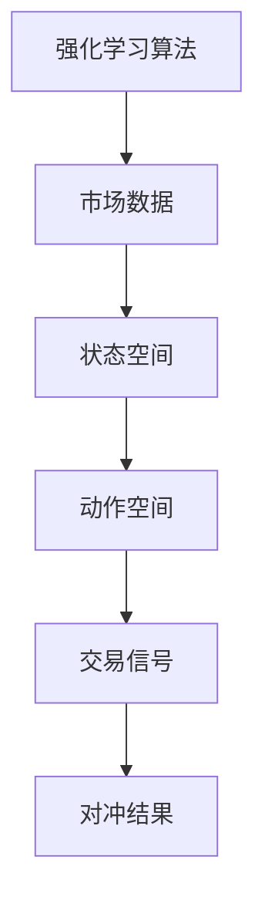

                 


# 《金融领域强化学习在期权对冲策略中的应用》

> **关键词**：强化学习、期权对冲、Q-Learning、Deep Q-Learning、数学建模  
>
> **摘要**：本文深入探讨了强化学习在金融期权对冲策略中的应用，从基础理论到算法实现，再到系统架构，全面分析了强化学习在动态金融环境中的优势。通过具体的数学模型和代码实现，展示了如何利用强化学习优化期权对冲策略，应对金融市场中的复杂性和不确定性。本文还结合实际案例，对比了传统对冲方法与强化学习方法的差异，为金融从业者和研究人员提供了新的视角和实践指导。

---

## 第1章：期权对冲与强化学习概述

### 1.1 期权对冲的背景与意义
期权是一种金融衍生品，其价值依赖于标的资产的价格波动。期权对冲的核心目标是通过动态调整头寸，降低或消除期权组合的风险敞口。传统的对冲策略通常基于静态模型（如Black-Scholes模型），但在实际金融市场中，价格波动、交易成本和高频交易等因素使得静态模型难以适应动态变化的市场环境。

### 1.2 强化学习在金融领域的应用潜力
强化学习（Reinforcement Learning，RL）是一种通过试错机制优化决策过程的机器学习方法。它在金融领域的应用潜力巨大，尤其是在需要动态调整交易策略和风险管理的场景中。与传统机器学习方法相比，强化学习能够处理非线性关系和复杂决策过程，特别适合应对金融市场中的不确定性。

### 1.3 期权对冲中的强化学习应用
将强化学习应用于期权对冲，核心在于将对冲策略转化为一个动态决策问题。通过定义状态空间、动作空间和奖励函数，强化学习算法可以在模拟的金融环境中不断试错，优化对冲策略。这种方法能够适应市场环境的变化，提高对冲效率和收益。

---

## 第2章：强化学习的核心原理

### 2.1 强化学习的基本原理
强化学习通过智能体与环境的交互，逐步优化决策策略。核心要素包括：
1. **状态（State）**：环境的当前情况，例如标的资产的价格和波动率。
2. **动作（Action）**：智能体采取的行动，例如买入或卖出期权。
3. **奖励（Reward）**：环境对动作的反馈，通常表示策略的好坏。
4. **策略（Policy）**：智能体选择动作的概率分布。
5. **值函数（Value Function）**：衡量某状态下策略的价值。

### 2.2 强化学习在期权对冲中的应用
在期权对冲中，强化学习可以用来优化对冲组合的调整策略。例如，当标的资产的价格偏离预期时，强化学习算法可以通过调整头寸来降低风险敞口。这种动态调整能力使得强化学习在应对市场波动时更具灵活性。

### 2.3 常用强化学习算法
1. **Q-Learning**：通过更新Q值函数，找到最优策略。
2. **Deep Q-Learning**：利用深度神经网络近似Q值函数，适用于高维状态空间。
3. **策略梯度（Policy Gradient）**：直接优化策略参数，减少样本需求。

---

## 第3章：期权对冲策略的数学建模

### 3.1 期权定价模型
Black-Scholes模型是期权定价的基础，但其假设条件（如波动率恒定）在现实中往往不成立。强化学习可以通过动态调整参数，弥补传统模型的不足。

### 3.2 强化学习的数学模型
强化学习的核心是贝尔曼方程（Bellman Equation）：

$$ V(s) = \max_{a} [ r(s,a) + V(a) ] $$

其中，\( V(s) \) 表示状态 \( s \) 的值，\( r(s,a) \) 是状态 \( s \) 下采取动作 \( a \) 的奖励。

### 3.3 对冲策略的动态优化
通过强化学习，对冲策略可以表示为一个动态调整的过程：

1. 状态空间：\( S = \{ s_1, s_2, ..., s_n \} \)，例如价格、波动率等。
2. 动作空间：\( A = \{ a_1, a_2, ..., a_m \} \)，例如买入、卖出或持有。
3. 奖励函数：\( R(s, a) \)，例如对冲成本的减少或收益的增加。

---

## 第4章：强化学习在期权对冲中的系统架构设计

### 4.1 系统功能设计
1. 数据预处理：收集和处理市场数据。
2. 状态空间定义：将市场状态转化为强化学习的输入。
3. 动作空间定义：将交易策略转化为强化学习的动作。
4. 奖励机制设计：定义对冲效果的评价标准。

### 4.2 系统架构图



### 4.3 接口设计
1. 数据接口：与数据源（如交易所API）对接。
2. 策略接口：定义强化学习策略的输入输出。
3. 执行接口：将交易信号传递给交易系统。

---

## 第5章：项目实战：基于强化学习的期权对冲系统

### 5.1 环境安装
1. 安装Python和相关库（如TensorFlow、Keras、OpenAI Gym）。
2. 数据获取：使用Yahoo Finance获取标的资产价格数据。

### 5.2 系统实现
1. 状态空间定义：标的资产价格、波动率等。
2. 动作空间定义：买入、卖出或持有。
3. 奖励函数设计：对冲成本的减少。

### 5.3 实施代码

```python
import gym
import numpy as np

# 定义环境
class OptionHedgeEnv(gym.Env):
    def __init__(self):
        super().__init__()
        self.state = np.array([initial_price, volatility])
        self.action_space = gym.spaces.Discrete(3)  # 0: buy, 1: hold, 2: sell
        self.observation_space = gym.spaces.Box(low=low, high=high)

    def step(self, action):
        # 根据动作计算新的状态和奖励
        new_price = ...  # 根据模型计算新的价格
        reward = compute_reward(current_price, new_price, action)
        return new_state, reward, done, info

    def reset(self):
        # 初始化环境
        return initial_state
```

### 5.4 实验结果与对比分析
1. 对比传统对冲方法与强化学习方法的收益曲线。
2. 分析强化学习在不同市场环境下的表现。

---

## 第6章：总结与展望

### 6.1 本章总结
本文详细探讨了强化学习在期权对冲中的应用，从理论到实践，展示了如何利用强化学习优化对冲策略。

### 6.2 未来展望
1. 处理高频交易中的延迟和滑点问题。
2. 研究多资产对冲的强化学习策略。
3. 提高模型的鲁棒性，应对极端市场环境。

### 6.3 最佳实践 Tips
1. 在实际应用中，建议结合市场专家的经验调整强化学习模型。
2. 定期更新模型参数，适应市场变化。

### 6.4 小结
强化学习为金融期权对冲提供了新的思路，其动态调整和自适应能力使其在复杂金融市场中具有显著优势。

---

以上是《金融领域强化学习在期权对冲策略中的应用》的技术博客文章的完整大纲和内容概要。

