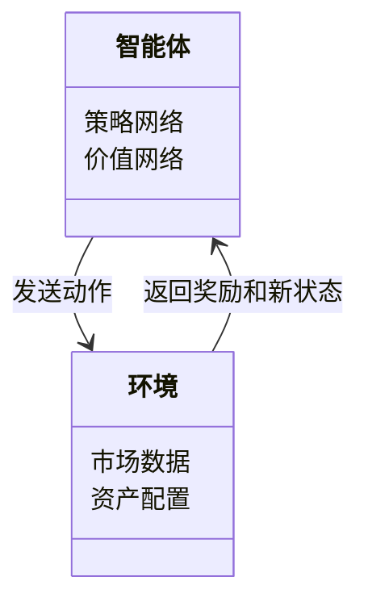
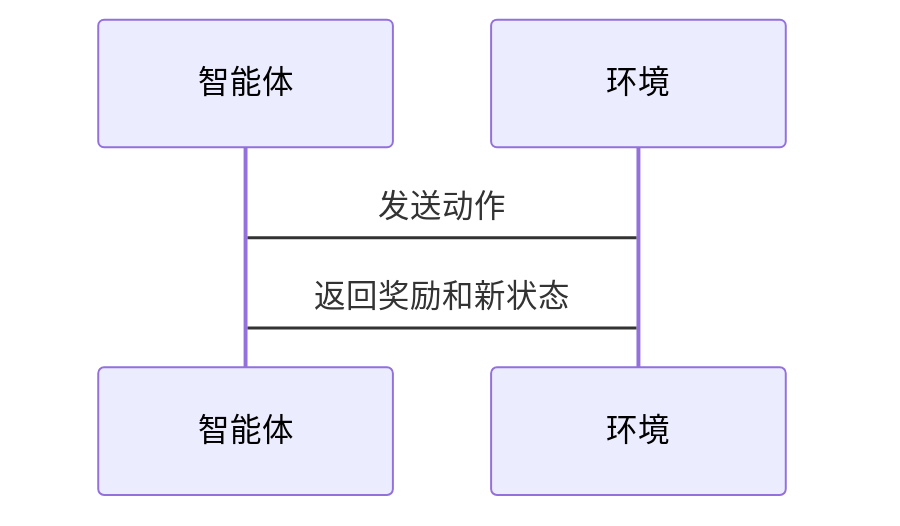

                 


# 《金融领域强化学习在流动性管理中的应用》

---

## 关键词：强化学习，流动性管理，金融，人工智能，数学模型

---

## 摘要：

本文深入探讨了强化学习在金融领域流动性管理中的应用，结合实际案例分析了强化学习的核心概念、算法原理、系统架构及项目实现。通过详细的技术分析，展示了如何利用强化学习优化流动性管理，提升金融系统的稳定性和收益。

---

# 第1章: 强化学习与金融流动性管理的背景

## 1.1 强化学习的基本概念

### 1.1.1 强化学习的定义与特点

强化学习（Reinforcement Learning，简称RL）是一种机器学习范式，通过智能体与环境的交互，学习最优策略以最大化累积奖励。其核心在于通过试错机制，逐步优化决策。

- **定义**：智能体通过与环境交互，学习选择最优动作，以获得最大化的累积奖励。
- **特点**：
  - **在线性**：智能体在实时环境中进行学习。
  - **延迟性**：奖励可能延迟，智能体需具备长期规划能力。
  - **策略性**：通过策略函数或值函数优化决策。

### 1.1.2 强化学习的核心要素

- **状态（State）**：环境当前的信息，如市场数据、资产配置等。
- **动作（Action）**：智能体在给定状态下采取的操作，如买入、卖出等。
- **奖励（Reward）**：智能体行为的结果，衡量是否接近目标。
- **策略（Policy）**：智能体选择动作的概率分布函数。
- **值函数（Value Function）**：衡量状态或动作-状态对的期望奖励。

### 1.1.3 强化学习与金融领域的结合

- **金融领域**：强化学习广泛应用于交易策略、风险管理、资产配置等领域。
- **流动性管理**：确保资产在不同时间点的流动性，避免流动性风险。

---

## 1.2 金融流动性管理的定义与挑战

### 1.2.1 流动性管理的定义

流动性管理是指在金融市场中，合理配置资产，确保在需要时能够快速变现，同时平衡收益与风险。

- **目标**：维持资产的流动性和价值，降低流动性风险。
- **核心**：动态调整资产配置，应对市场波动。

### 1.2.2 金融流动性管理的难点与痛点

- **市场波动**：金融市场瞬息万变，需要快速决策。
- **数据复杂性**：涉及大量市场数据和交易信息。
- **决策延迟**：传统方法依赖人工判断，效率低下。

### 1.2.3 强化学习在流动性管理中的优势

- **自动化决策**：智能体能够实时根据市场变化做出最优决策。
- **数据驱动**：通过大量数据训练，优化决策策略。
- **动态调整**：能够快速适应市场变化，动态优化资产配置。

---

## 1.3 强化学习在金融领域的应用现状

### 1.3.1 强化学习在金融领域的典型应用

- **交易策略优化**：通过强化学习训练智能交易策略。
- **风险管理**：预测和管理市场风险。
- **资产配置**：优化投资组合，平衡风险与收益。

### 1.3.2 流动性管理中的强化学习研究进展

- **研究现状**：学者们已将强化学习应用于流动性管理的多个方面。
- **技术发展**：深度强化学习逐渐成为主流，能够处理复杂金融市场问题。

### 1.3.3 当前研究的局限性与未来方向

- **局限性**：
  - 算法的泛化能力有限。
  - 对市场外生事件（如黑天鹅事件）的应对能力不足。
- **未来方向**：
  - 结合强化学习与其他技术（如自然语言处理）。
  - 提升模型的可解释性和鲁棒性。

---

## 1.4 本章小结

本章从强化学习的基本概念出发，介绍了其在金融领域的应用，重点探讨了流动性管理的定义、挑战及强化学习的优势。为后续章节奠定了基础。

---

# 第2章: 强化学习的核心概念与算法原理

## 2.1 强化学习的基本原理

### 2.1.1 状态、动作、奖励的定义

- **状态（State）**：智能体所处的环境信息，如市场指数、资产价格。
- **动作（Action）**：智能体选择的操作，如买入股票、卖出债券。
- **奖励（Reward）**：智能体行为的结果，如收益或损失。

### 2.1.2 策略与价值函数的定义

- **策略（Policy）**：描述智能体在状态下的动作选择概率。
- **价值函数（Value Function）**：衡量状态或动作-状态对的期望奖励。

### 2.1.3 探索与利用的平衡

- **探索**：尝试新动作，发现潜在高回报策略。
- **利用**：根据当前知识，选择最优动作以最大化收益。

---

## 2.2 强化学习的主要算法

### 2.2.1 Q-learning算法

- **核心思想**：通过学习状态-动作对的值函数，选择最优动作。
- **数学公式**：

$$ Q(s, a) = Q(s, a) + \alpha (r + \gamma \max Q(s', a') - Q(s, a)) $$

- **优点**：
  - 简单易实现。
  - 适合离散动作空间。

### 2.2.2 策略梯度算法

- **核心思想**：直接优化策略，最大化期望奖励。
- **数学公式**：

$$ \nabla \theta J(\theta) = \mathbb{E}[\nabla \log \pi_\theta(a|s) Q(s, a)] $$

- **优点**：
  - 适合连续动作空间。
  - 可直接优化策略。

### 2.2.3 深度强化学习算法

- **核心思想**：使用深度神经网络近似值函数或策略。
- **典型算法**：
  - DQN（Deep Q-Network）。
  - PPO（Proximal Policy Optimization）。

---

## 2.3 强化学习的数学模型

### 2.3.1 Q-learning的数学公式

- **更新规则**：

$$ Q(s, a) = Q(s, a) + \alpha (r + \gamma \max Q(s', a') - Q(s, a)) $$

- **参数**：
  - $\alpha$：学习率。
  - $\gamma$：折扣因子。

### 2.3.2 策略梯度的数学公式

- **梯度计算**：

$$ \nabla \theta J(\theta) = \mathbb{E}[\nabla \log \pi_\theta(a|s) Q(s, a)] $$

---

## 2.4 强化学习的核心概念对比表

| 概念       | 描述                                   |
|------------|----------------------------------------|
| 状态       | 当前环境的信息                         |
| 动作       | 智能体选择的行为                       |
| 奖励       | 行为的结果，衡量优劣                   |
| 策略       | 动作选择的概率分布函数                 |
| 价值函数   | 状态或动作-状态对的期望奖励             |

---

## 2.5 强化学习的核心概念ER图

```mermaid
erDiagram
    actor 智能体 {
        <属性>
        s 状态
        a 动作
        r 奖励
    }
    class 环境 {
        <属性>
        s 状态
        a 动作
        r 奖励
    }
    智能体 --> 环境 : 选择动作
    环境 --> 智能体 : 返回奖励和新状态
```

---

## 2.6 本章小结

本章详细讲解了强化学习的核心概念和主要算法，为后续章节的流动性管理应用奠定了理论基础。

---

# 第3章: 强化学习在流动性管理中的系统设计与架构

## 3.1 强化学习系统的总体架构

### 3.1.1 系统功能设计

- **数据采集**：收集市场数据、交易记录等。
- **状态表示**：将市场数据转化为状态输入。
- **动作选择**：根据状态选择最优动作。
- **奖励计算**：根据结果计算奖励，优化策略。

### 3.1.2 系统架构图



---

## 3.2 系统接口设计

### 3.2.1 系统接口描述

- **输入接口**：市场数据接口、用户输入接口。
- **输出接口**：交易指令接口、收益报告接口。

---

## 3.3 系统交互流程

### 3.3.1 交互流程图



---

## 3.4 本章小结

本章详细设计了强化学习在流动性管理中的系统架构，为后续章节的实现提供了指导。

---

# 第4章: 强化学习在流动性管理中的项目实战

## 4.1 项目背景与目标

### 4.1.1 项目背景

- **目标**：优化资产配置，提高流动性管理效率。

### 4.1.2 项目目标

- **短期目标**：实现基本的交易策略优化。
- **长期目标**：构建智能流动性管理平台。

---

## 4.2 环境搭建与数据准备

### 4.2.1 环境搭建

- **工具安装**：安装Python、TensorFlow、Keras等。

### 4.2.2 数据准备

- **数据来源**：收集历史市场数据、实时数据等。

---

## 4.3 系统核心实现

### 4.3.1 强化学习模型实现

```python
import numpy as np
import tensorflow as tf

class DQN:
    def __init__(self, state_space, action_space):
        self.state_space = state_space
        self.action_space = action_space
        self.model = self.build_model()

    def build_model(self):
        model = tf.keras.Sequential([
            tf.keras.layers.Dense(64, activation='relu', input_dim=self.state_space),
            tf.keras.layers.Dense(32, activation='relu'),
            tf.keras.layers.Dense(self.action_space, activation='linear')
        ])
        return model

    def act(self, state):
        state = np.array([state])
        prediction = self.model.predict(state)[0]
        return np.argmax(prediction)
```

---

## 4.4 代码实现与分析

### 4.4.1 训练过程

```python
agent = DQN(state_space, action_space)
for episode in range(num_episodes):
    state = env.reset()
    while True:
        action = agent.act(state)
        next_state, reward, done = env.step(action)
        if done:
            break
        # 学习过程
        target = reward + gamma * np.max(agent.model.predict(np.array([next_state]))[0])
        target_f = agent.model.predict(np.array([state]))[0]
        target_f[action] = target
        agent.model.fit(np.array([state]), np.array([target_f]), epochs=1, verbose=0)
```

### 4.4.2 模型优化

- **超参数调整**：学习率、折扣因子、网络结构等。
- **数据增强**：增加数据多样性，提升模型鲁棒性。

---

## 4.5 实际案例分析

### 4.5.1 案例描述

- **场景**：某金融公司需要优化其资产配置策略。
- **目标**：提高资金流动性，降低流动性风险。

### 4.5.2 案例分析

- **模型训练**：训练强化学习模型，优化资产配置。
- **效果评估**：对比传统方法与强化学习方法的收益和风险。

---

## 4.6 本章小结

本章通过实际项目案例，详细讲解了强化学习在流动性管理中的实现过程，验证了其有效性。

---

# 第5章: 强化学习在金融领域的最佳实践

## 5.1 强化学习的最佳实践

### 5.1.1 数据处理

- **数据清洗**：处理缺失值、异常值。
- **特征工程**：提取有意义的特征，降低维度。

### 5.1.2 模型选择

- **算法选择**：根据问题类型选择合适算法。
- **网络结构**：设计合理的神经网络结构。

### 5.1.3 超参数调优

- **网格搜索**：寻找最优超参数。
- **贝叶斯优化**：高效搜索最优参数。

---

## 5.2 强化学习的注意事项

### 5.2.1 模型过拟合

- **解决方法**：
  - 正则化。
  - 数据增强。

### 5.2.2 环境的不确定性

- **解决方法**：
  - 使用策略评估方法。
  - 引入不确定性模型。

---

## 5.3 未来发展方向

### 5.3.1 多智能体协同

- **研究方向**：多个智能体协同工作，优化整体收益。

### 5.3.2 深度强化学习

- **研究方向**：结合深度学习，提升模型表达能力。

---

## 5.4 本章小结

本章总结了强化学习在金融领域的最佳实践，提出了未来发展方向。

---

# 第6章: 总结与展望

## 6.1 本文总结

本文详细探讨了强化学习在金融领域流动性管理中的应用，从理论到实践，系统地介绍了其核心概念、算法原理、系统架构及项目实现。

## 6.2 未来展望

随着技术的发展，强化学习在金融领域的应用将更加广泛，特别是在复杂场景下的应用，如多智能体协同、动态风险管理等方面。

---

# 参考文献

（此处列出相关参考文献）

---

# 致谢

感谢在撰写本文过程中给予帮助和支持的同仁和朋友。

