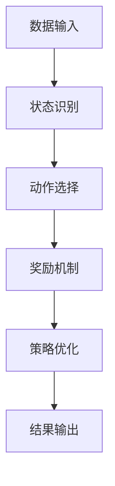
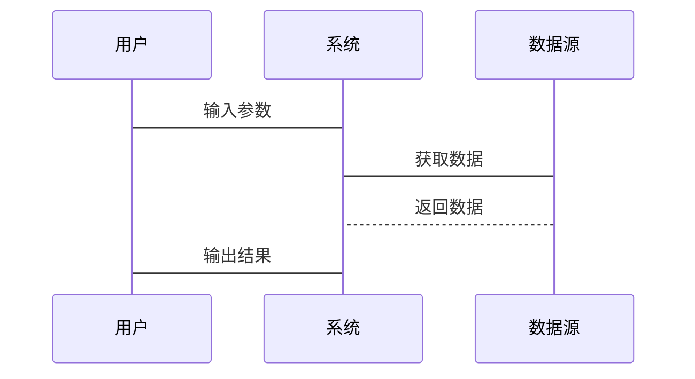

                 


# 《金融领域强化学习在资产定价中的应用》

> 关键词：强化学习，资产定价，金融，Q-learning，马尔可夫决策过程，动态规划，贝尔曼方程，交易策略，风险管理，数学模型

> 摘要：本文深入探讨了强化学习在金融资产定价中的应用，从强化学习的基本概念到其在金融领域的具体应用，再到系统的架构设计和实际项目实现，详细分析了强化学习在资产定价中的优势和挑战。通过数学模型、算法原理、系统架构和项目实战的多维度展开，本文为读者提供了一套完整的强化学习在金融资产定价中的解决方案，同时结合实际案例分析，展示了如何将强化学习应用于复杂的金融问题。

---

## 第一部分: 金融领域强化学习基础

### 第1章: 强化学习与资产定价概述

#### 1.1 强化学习的基本概念

##### 1.1.1 强化学习的定义与特点
强化学习（Reinforcement Learning，简称RL）是一种机器学习范式，其核心思想是通过智能体与环境的交互，逐步学习最优策略，以最大化累积奖励。强化学习与监督学习和无监督学习的最大区别在于，它不需要大量标注数据，而是通过试错的方式学习策略。

**特点：**
- **自主学习**：智能体通过与环境交互，逐步探索和学习。
- **延迟奖励**：奖励可能在多个动作之后才给出，需要考虑长期收益。
- **动态环境**：环境状态可能随时间变化，具有不确定性。

##### 1.1.2 强化学习的核心要素：状态、动作、奖励

- **状态（State）**：描述环境当前情况的特征，例如市场中的价格、成交量等。
- **动作（Action）**：智能体在给定状态下选择的行为，例如买入、卖出或持有。
- **奖励（Reward）**：智能体在执行动作后获得的反馈，通常是一个标量值，表示该动作的好坏。

##### 1.1.3 强化学习与监督学习、无监督学习的区别

| 对比维度 | 监督学习 | 无监督学习 | 强化学习 |
|----------|----------|------------|----------|
| 数据类型 | 标签数据 | 无标签数据 | 状态和奖励 |
| 目标 | 预测目标值 | 找到数据结构 | 最大化累积奖励 |
| 交互方式 | 无交互 | 无交互 | 有交互 |

#### 1.2 资产定价的基本概念

##### 1.2.1 资产定价的定义与目标
资产定价是指通过对资产的内在价值、市场风险、流动性等因素的分析，确定其合理价格的过程。其目标是通过模型或算法，预测资产的未来价格，为投资决策提供支持。

##### 1.2.2 资产定价的主要模型与方法
- **基本分析法**：通过分析公司的财务报表、行业地位等因素，预测资产价值。
- **技术分析法**：通过分析历史价格和成交量，预测未来价格走势。
- **期权定价模型**：如Black-Scholes模型，用于衍生品定价。

##### 1.2.3 金融市场的基本特征与挑战
- **不确定性**：市场价格受多种因素影响，具有高度不确定性。
- **非线性关系**：资产价格与市场变量之间的关系往往是非线性的。
- **高维状态空间**：金融市场涉及多个变量，状态空间维度高。

#### 1.3 强化学习在资产定价中的应用前景

##### 1.3.1 强化学习在金融领域的优势
- **自适应性**：强化学习能够根据市场变化动态调整策略。
- **非线性建模能力**：强化学习擅长处理复杂非线性关系。
- **多目标优化**：强化学习可以同时优化多个目标，如收益、风险等。

##### 1.3.2 强化学习在资产定价中的潜在应用场景
- **动态资产配置**：根据市场变化调整投资组合。
- **交易策略优化**：通过强化学习训练最优交易策略。
- **风险管理**：识别和管理市场中的风险因素。

##### 1.3.3 当前研究现状与未来发展趋势
- **研究现状**：强化学习在金融领域的研究逐渐增多，但主要集中在交易策略优化和风险管理。
- **未来趋势**：随着深度强化学习的发展，强化学习在资产定价中的应用将更加广泛和深入。

#### 1.4 本章小结
本章介绍了强化学习的基本概念和资产定价的基本原理，分析了强化学习在资产定价中的优势和应用场景，为后续章节的深入分析奠定了基础。

---

### 第2章: 强化学习的核心概念与数学模型

#### 2.1 马尔可夫决策过程（MDP）

##### 2.1.1 状态空间与动作空间的定义
- **状态空间（State Space）**：所有可能的状态的集合。
- **动作空间（Action Space）**：所有可能的动作的集合。

##### 2.1.2 奖励函数与价值函数
- **奖励函数（Reward Function）**：定义在状态和动作对上的函数，返回一个标量奖励。
- **价值函数（Value Function）**：衡量一个状态-动作对的长期收益。

##### 2.1.3 动态规划与贝尔曼方程

**贝尔曼方程**：
$$ V(s) = \max_a \mathbb{E}[r + V(s')] $$

其中：
- \( V(s) \) 是状态 \( s \) 的价值函数。
- \( r \) 是执行动作 \( a \) 后获得的即时奖励。
- \( V(s') \) 是状态转移后的价值函数。

#### 2.2 Q-learning算法

##### 2.2.1 Q-learning的基本原理
Q-learning是一种经典的强化学习算法，通过学习Q值函数（Q(s, a)）来衡量状态-动作对的价值。

**Q值更新公式**：
$$ Q(s,a) = Q(s,a) + \alpha (r + \max Q(s',a') - Q(s,a)) $$

其中：
- \( \alpha \) 是学习率。
- \( r \) 是即时奖励。
- \( \max Q(s',a') \) 是后续状态的最大Q值。

##### 2.2.2 Q-learning的收敛性分析
Q-learning在无限 episodes 下，若满足探索-利用平衡条件，Q值会收敛到最优策略。

##### 2.2.3 Q-learning在资产定价中的应用示例
假设我们有一个简单的资产定价问题，智能体通过买卖动作影响资产价格，目标是通过Q-learning算法找到最优交易策略。

#### 2.3 策略梯度方法

##### 2.3.1 策略梯度的基本思想
策略梯度方法直接优化策略，通过梯度上升方法最大化累积奖励。

**策略梯度更新公式**：
$$ \theta_{t+1} = \theta_t + \alpha \nabla_\theta J(\theta) $$

其中：
- \( \theta \) 是策略参数。
- \( J(\theta) \) 是目标函数，通常为累积奖励。

##### 2.3.2 策略梯度的优势与挑战
- **优势**：直接优化策略，无需维护Q值函数。
- **挑战**：梯度计算复杂，对环境建模要求较高。

##### 2.3.3 策略梯度在金融交易中的应用
策略梯度可以用于训练复杂的金融交易策略，例如动态资产配置。

#### 2.4 数学公式与推导

##### 2.4.1 贝尔曼方程的数学表达
$$ V(s) = \max_a \mathbb{E}[r + V(s')] $$

##### 2.4.2 Q-learning的更新公式
$$ Q(s,a) = Q(s,a) + \alpha (r + \max Q(s',a') - Q(s,a)) $$

#### 2.5 本章小结
本章详细介绍了强化学习的核心概念和数学模型，重点讲解了马尔可夫决策过程和Q-learning算法，并通过公式推导和实际案例分析，帮助读者理解强化学习在金融中的应用。

---

### 第3章: 强化学习在金融资产定价中的系统架构

#### 3.1 系统架构设计

##### 3.1.1 系统模块划分
- **数据输入模块**：接收市场数据和历史交易数据。
- **状态识别模块**：将市场数据转化为状态。
- **动作选择模块**：根据状态选择最优动作。
- **奖励机制模块**：计算动作的奖励。
- **策略优化模块**：优化策略以最大化累积奖励。

##### 3.1.2 系统功能设计
- 数据处理：清洗和转换市场数据。
- 状态生成：将市场数据转化为强化学习的状态。
- 动作选择：基于当前状态选择最优动作。
- 奖励计算：根据动作结果计算奖励。
- 策略优化：通过强化学习算法优化策略。

##### 3.1.3 系统架构图（Mermaid）


#### 3.2 系统接口设计

##### 3.2.1 数据接口
- 输入接口：接收市场数据和历史数据。
- 输出接口：输出优化后的策略或交易信号。

##### 3.2.2 算法接口
- 输入接口：接收状态和动作。
- 输出接口：输出奖励和优化后的策略。

##### 3.2.3 输出接口
- 输出交易信号：如买入、卖出或持有。
- 输出策略参数：如投资组合配置。

#### 3.3 系统交互流程（Mermaid）


#### 3.4 本章小结
本章设计了一个完整的强化学习在资产定价中的系统架构，详细描述了系统的模块划分、功能设计和交互流程，为后续的项目实现提供了理论基础。

---

### 第4章: 强化学习在资产定价中的项目实战

#### 4.1 项目环境搭建

##### 4.1.1 Python环境安装
- 安装Python 3.8或更高版本。
- 安装必要的库：numpy、pandas、tensorflow、keras、scikit-learn等。

##### 4.1.2 必要库的安装
```bash
pip install numpy pandas tensorflow keras scikit-learn
```

#### 4.2 系统核心实现

##### 4.2.1 状态空间的定义
- 状态由市场指标组成，例如股票价格、成交量、技术指标等。

##### 4.2.2 动作空间的定义
- 动作包括买入、卖出、持有三种选择。

##### 4.2.3 奖励函数的设计
- 奖励函数可以根据收益和风险来设计，例如：
  $$ r = \text{收益} - \text{风险} $$

##### 4.2.4 策略优化模块的实现
- 使用Q-learning算法或策略梯度方法优化策略。

#### 4.3 项目核心代码实现

##### 4.3.1 状态识别代码
```python
import numpy as np

def get_state(data, i):
    state = data[i:i+4].values
    state = (state - np.mean(state)) / np.std(state)
    return state
```

##### 4.3.2 动作选择代码
```python
def choose_action(Q, state, epsilon=0.1):
    if np.random.random() < epsilon:
        return np.random.randint(3)
    else:
        return np.argmax(Q[state])
```

##### 4.3.3 奖励计算代码
```python
def calculate_reward(price, action, next_price):
    if action == 0:  # 买入
        return next_price - price
    elif action == 1:  # 卖出
        return price - next_price
    else:  # 持有
        return 0
```

##### 4.3.4 策略优化代码
```python
def optimize_policy(Q, episodes=1000, learning_rate=0.1):
    for _ in range(episodes):
        state = get_state(data, np.random.randint(len(data)))
        action = choose_action(Q, state)
        next_state = get_state(data, np.random.randint(len(data)))
        reward = calculate_reward(data[state], action, data[next_state])
        Q[state][action] += learning_rate * (reward + max(Q[next_state]) - Q[state][action])
    return Q
```

#### 4.4 项目实战案例分析
假设我们有一个股票价格数据集，通过上述代码实现一个简单的Q-learning交易策略，训练智能体在股票价格波动中找到最优买卖时机。

#### 4.5 项目小结
本章通过实际代码实现，展示了如何将强化学习应用于资产定价问题，从环境搭建到系统实现，再到策略优化，为读者提供了一个完整的项目实战案例。

---

## 第五部分: 总结与展望

### 第5章: 总结与展望

#### 5.1 本章总结
本文详细探讨了强化学习在金融资产定价中的应用，从理论基础到系统架构，再到实际项目实现，全面分析了强化学习在金融中的潜力和优势。

#### 5.2 未来展望
随着深度强化学习的不断发展，强化学习在金融资产定价中的应用将更加广泛和深入。未来的研究方向可能包括：
- 更复杂的金融模型与算法。
- 更高效的训练方法与优化策略。
- 更多的实际应用场景与案例分析。

#### 5.3 最佳实践 Tips
- **数据质量**：确保数据的准确性和完整性。
- **模型选择**：根据具体问题选择合适的强化学习算法。
- **风险管理**：在实际应用中，需结合其他风险管理方法。

#### 5.4 本章小结
本文通过总结和展望，为读者提供了强化学习在金融资产定价中的发展方向和实践建议。

---

通过以上结构和内容的详细展开，本文为读者提供了一套完整的强化学习在金融资产定价中的解决方案，从理论到实践，从算法到系统，帮助读者深入理解强化学习在金融领域的应用。

