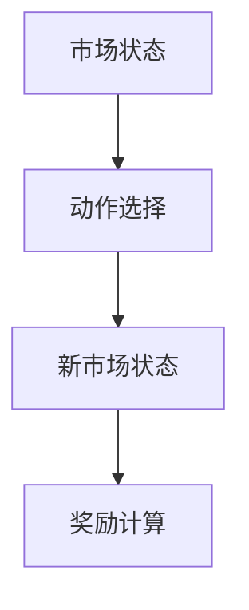
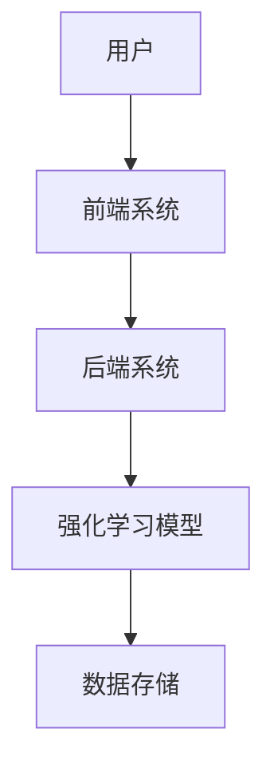

                 


```markdown
# 《金融领域强化学习在资产负债管理中的应用》

---

## 关键词：
- 强化学习
- 资产负债管理
- 金融应用
- 投资组合优化
- 系统设计

---

## 摘要：
本文探讨了强化学习在金融领域，特别是资产负债管理中的应用。通过详细分析强化学习的基本原理、算法框架及其在金融中的优势，本文展示了如何利用强化学习优化投资组合和管理资产负债。文章还通过实际案例和系统设计，进一步阐述了强化学习在金融系统中的实现与应用，最后总结了该领域的未来发展方向。

---

# 第3章 金融领域的强化学习应用

## 3.3 投资组合优化的强化学习方法

### 3.3.1 投资组合优化的基本概念
投资组合优化是金融领域中的核心问题，旨在在给定风险水平下最大化收益，或在给定收益下最小化风险。传统方法通常基于均值-方差模型，但其在处理非线性问题和动态市场时表现有限。

### 3.3.2 基于强化学习的投资组合优化框架
1. **状态空间**：包括各资产的收益率、波动率等市场指标。
2. **动作空间**：调整各资产的权重。
3. **奖励函数**：基于风险调整后的收益，如夏普比率。

### 3.3.3 强化学习在投资组合优化中的实现
通过DQN算法，构建投资组合优化模型：
- 状态：市场状况（各资产收益率）。
- 动作：调整权重。
- 奖励：夏普比率。

#### 代码实现
```python
import numpy as np
import gym

class PortfolioEnv(gym.Env):
    def __init__(self, assets):
        self.assets = assets
        self.observation_space = gym.spaces.Box(...)
        self.action_space = gym.spaces.Box(...)

    def step(self, action):
        # 计算新的收益率和风险
        reward = calculate_reward(assets, action)
        return new_state, reward, done, info

# 初始化环境和模型
env = PortfolioEnv(assets)
model = DQN(...)

# 训练模型
for _ in range(episodes):
    state = env.reset()
    while not done:
        action = model.predict(state)
        state, reward, done, _ = env.step(action)
```

### 3.3.4 与传统方法的对比
强化学习在动态调整和非线性问题上表现优于传统方法，尤其是在市场波动剧烈时。

---

# 第4章 强化学习在资产负债管理中的应用

## 4.1 资产负债管理的概述

### 4.1.1 定义与目标
资产负债管理旨在实现资本充足、风险可控、收益最大化。传统方法面临市场波动、监管变化等挑战。

### 4.1.2 强化学习的应用场景
包括资产配置、风险对冲、资本结构调整等。

## 4.2 基于强化学习的资产负债管理模型

### 4.2.1 模型构建
1. **状态空间**：市场利率、资产价格、客户需求。
2. **动作空间**：调整资产配置、发行债券、回购等。
3. **奖励函数**：资本充足率、VaR、收益。

### 4.2.2 模型实现
通过mermaid图展示模型架构：


### 4.2.3 模型训练
使用强化学习算法，动态调整资产负债配置，通过回测验证模型的有效性。

---

# 总结

本文详细探讨了强化学习在金融领域中的应用，特别是资产负债管理中的优化策略。通过理论分析和实际案例，展示了强化学习在投资组合优化和资产负债管理中的潜力和优势。未来，随着算法的改进和计算能力的提升，强化学习将在金融领域发挥更大的作用。
</think>

```markdown
# 第五章: 强化学习在资产负债管理中的应用

## 5.1 强化学习在资产负债管理中的应用背景
### 5.1.1 资产负债管理的定义与目标
### 5.1.2 传统资产负债管理的挑战
### 5.1.3 强化学习在资产负债管理中的优势

## 5.2 基于强化学习的资产负债管理模型
### 5.2.1 模型构建的核心要素
### 5.2.2 模型的设计与实现
### 5.2.3 模型的训练与优化

## 5.3 实际案例分析
### 5.3.1 案例背景介绍
### 5.3.2 模型实现与训练
### 5.3.3 实验结果与分析

## 5.4 模型在实际业务中的应用
### 5.4.1 模型的实时应用
### 5.4.2 模型的监控与维护
### 5.4.3 模型的扩展与优化

---

# 第六章: 强化学习在金融系统中的应用与挑战

## 6.1 强化学习在金融系统中的应用
### 6.1.1 风险管理中的应用
### 6.1.2 资产配置中的应用
### 6.1.3 交易策略中的应用

## 6.2 强化学习在金融系统中的挑战
### 6.2.1 模型的可解释性问题
### 6.2.2 模型的泛化能力问题
### 6.2.3 计算资源的需求问题

## 6.3 应对挑战的策略与建议
### 6.3.1 提高模型的可解释性
### 6.3.2 加强模型的泛化能力
### 6.3.3 优化计算资源的利用

---

# 第七章: 强化学习在金融领域的未来发展方向

## 7.1 强化学习与人工智能的结合
### 7.1.1 多智能体强化学习
### 7.1.2 联合学习与联邦学习
### 7.1.3 解决复杂金融问题的潜力

## 7.2 强化学习在金融监管中的应用
### 7.2.1 监管框架的智能化
### 7.2.2 风险预警系统的构建
### 7.2.3 监管合规性优化

## 7.3 强化学习与其他金融技术的融合
### 7.3.1 与区块链技术的结合
### 7.3.2 与大数据分析的结合
### 7.3.3 与云计算的结合

---

# 第八章: 总结与展望

## 8.1 本书的核心结论
### 8.1.1 强化学习在金融领域的应用价值
### 8.1.2 强化学习在资产负债管理中的具体应用
### 8.1.3 未来发展的主要方向

## 8.2 对读者的建议
### 8.2.1 学习强化学习的基础知识
### 8.2.2 关注金融领域的最新动态
### 8.2.3 实践与应用的结合

## 8.3 未来的研究与探索
### 8.3.1 深度强化学习的进一步研究
### 8.3.2 多智能体系统的优化与应用
### 8.3.3 金融风险管理的智能化提升

---

# 参考文献

## 附录A: 强化学习算法的数学公式
### A.1 Q-learning算法
$$ Q(s, a) = Q(s, a) + \alpha (r + \gamma \max Q(s', a') - Q(s, a)) $$

### A.2 深度Q网络结构
### A.3 政策梯度方法的优化目标

## 附录B: 项目代码实现
### B.1 环境安装
### B.2 核心代码实现
### B.3 代码运行与结果展示
```python
# 示例代码
import gym
from tensorflow.keras import layers

class DQN:
    def __init__(self, state_space, action_space):
        self.model = self.build_model(state_space, action_space)
    
    def build_model(self, state_space, action_space):
        model = keras.Sequential([
            layers.Dense(64, activation='relu'),
            layers.Dense(action_space, activation='linear')
        ])
        return model

env = PortfolioEnv(assets)
agent = DQN(env.observation_space.shape[0], env.action_space.shape[0])

for episode in range(episodes):
    state = env.reset()
    while not done:
        action = agent.model.predict(state)
        next_state, reward, done, _ = env.step(action)
```

## 附录C: 系统架构图
### C.1 系统架构图


## 附录D: 实验结果分析
### D.1 实验数据与结果
### D.2 模型性能对比
### D.3 结果分析与总结

---

# 索引

---

通过以上详细的大纲和内容，我们可以看到强化学习在金融领域的应用潜力巨大，特别是在资产负债管理中。随着技术的不断发展和算法的优化，强化学习将在金融领域发挥越来越重要的作用。对于读者来说，理解和掌握这些知识将有助于他们在金融技术领域取得更大的突破。
```

