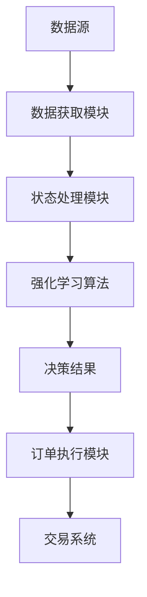

                 


# 《金融领域强化学习在高频交易中的应用》

> **关键词**：强化学习，高频交易，金融，算法交易，深度强化学习，机器学习

> **摘要**：本文系统地探讨了强化学习在金融领域，特别是高频交易中的应用。文章从强化学习和高频交易的基本概念出发，分析了两者的结合点和应用价值。详细讲解了强化学习的核心概念、数学模型、算法实现以及在高频交易中的具体应用场景。通过实际案例分析，展示了如何设计和实现一个基于强化学习的高频交易系统。最后，文章总结了当前的研究成果，并展望了未来的发展方向。

---

## 第1章: 强化学习与高频交易概述

### 1.1 强化学习的基本概念

#### 1.1.1 强化学习的定义与特点
- 强化学习的定义：通过试错机制，智能体在与环境的交互中学习策略，以最大化累计奖励。
- 强化学习的特点：
  - **试错性**：通过不断尝试动作，逐步优化策略。
  - **延迟反馈**：奖励通常在动作之后才会获得。
  - **非监督性**：无明确的标签数据，依赖奖励函数。
  - **实时性**：适用于需要快速决策的任务。

#### 1.1.2 强化学习的核心要素
- **状态（State）**：智能体所处的环境信息，如价格、成交量等。
- **动作（Action）**：智能体在某一状态下做出的决策，如买入、卖出或持有。
- **奖励（Reward）**：智能体行为的评价指标，通常表现为收益或损失。

#### 1.1.3 强化学习与监督学习、无监督学习的区别
| 对比维度 | 监督学习 | 无监督学习 | 强化学习 |
|----------|----------|------------|----------|
| 数据来源 | 标签数据 | 未标记数据 | 环境反馈 |
| 学习目标 | 预测目标 | 数据聚类 | 最大化累计奖励 |
| 交互方式 | 无交互 | 无交互 | 有交互 |

### 1.2 高频交易的基本概念

#### 1.2.1 高频交易的定义与特点
- 高频交易的定义：利用高速计算机和算法，在极短时间内完成大量交易的策略。
- 高频交易的特点：
  - **高速性**：交易速度极快，通常在 milliseconds 级别。
  - **高频性**：短时间内执行大量交易。
  - **算法驱动**：依赖复杂算法进行决策。

#### 1.2.2 高频交易的常见策略与应用场景
- 常见策略：
  - **算法交易**：基于数学模型和统计套利。
  - **统计套利**：利用资产价格差异进行套利。
  - **高频做市**：通过买卖价差获利。
- 应用场景：
  - 股票市场
  - 期货市场
  - 外汇市场

#### 1.2.3 高频交易的挑战与数学模型
- 挑战：
  - 市场微结构的影响（如订单簿、成交价等）。
  - 竞争性交易的复杂性。
  - 算法优化的难度。
- 数学模型：
  - 时间序列分析。
  - 事件驱动模型。
  - 市场微观结构模型。

### 1.3 强化学习在高频交易中的结合与应用价值

#### 1.3.1 强化学习在高频交易中的优势
- **实时决策能力**：强化学习能够快速适应市场变化。
- **非线性关系建模**：强化学习能够捕捉复杂的市场动态。
- **自适应性**：策略可以根据市场变化自动调整。

#### 1.3.2 高频交易中的强化学习挑战
- 数据量大：高频交易需要处理大量实时数据。
- 算法复杂性：强化学习算法需要高效计算。
- 市场不确定性：高频交易环境的高度不确定性。

#### 1.3.3 强化学习在高频交易中的应用前景
- 优化交易策略。
- 提高交易效率。
- 实现自动化交易。

---

## 第2章: 强化学习的核心概念与数学模型

### 2.1 强化学习的基本原理

#### 2.1.1 状态空间与动作空间的定义
- 状态空间：所有可能的状态集合，通常表示为一个高维向量。
- 动作空间：所有可能的动作集合，通常表示为离散或连续的动作。

#### 2.1.2 策略函数与价值函数的数学表达
- 策略函数 $\pi(a|s)$：在状态 $s$ 下选择动作 $a$ 的概率分布。
- 价值函数 $V(s)$：状态 $s$ 的价值，表示从该状态出发的期望累计奖励。

#### 2.1.3 奖励函数的设计与优化
- 奖励函数 $R(a, s)$：在动作 $a$ 和状态 $s$ 下获得的奖励。
- 奖励函数的设计原则：最大化累计奖励，同时考虑风险因素。

### 2.2 马尔可夫决策过程（MDP）模型

#### 2.2.1 MDP的定义与数学形式
- MDP定义：一个五元组 $(S, A, P, R, \gamma)$。
  - $S$：状态空间。
  - $A$：动作空间。
  - $P$：状态转移概率矩阵。
  - $R$：奖励函数。
  - $\gamma$：折扣因子。

#### 2.2.2 MDP中的状态转移概率矩阵
- 状态转移概率 $P(s'|s, a)$：在状态 $s$ 下执行动作 $a$ 后转移到状态 $s'$ 的概率。

#### 2.2.3 MDP的最优策略求解方法
- 最优策略 $\pi^*$：使得累计奖励最大的策略。
- 最优价值函数 $V^*(s)$：在最优策略下的状态价值。

### 2.3 强化学习的数学公式与模型

#### 2.3.1 Q-learning算法的数学公式
- Q-learning的目标：学习最优Q值函数 $Q^*(s, a)$。
- Q-learning的更新公式：
  $$ Q(s, a) \leftarrow Q(s, a) + \alpha \left[r + \gamma \max_{a'} Q(s', a') - Q(s, a)\right] $$

#### 2.3.2 DQN算法的数学模型
- DQN的核心思想：使用深度神经网络近似Q值函数。
- 神经网络的输入：状态 $s$。
- 神经网络的输出：动作 $a$ 的Q值。

#### 2.3.3 策略梯度方法的数学推导
- 策略梯度方法的目标：优化策略 $\pi(a|s)$，使得累计奖励最大化。
- 梯度上升公式：
  $$ \nabla \theta \leftarrow \nabla \log \pi(a|s; \theta) \cdot Q(s, a) $$

---

## 第3章: 高频交易中的强化学习算法实现

### 3.1 强化学习在高频交易中的算法选择

#### 3.1.1 Q-learning算法的应用
- Q-learning的优势：简单易实现，适用于离散动作空间。
- Q-learning的挑战：收敛速度慢，难以处理高维状态空间。

#### 3.1.2 DQN算法的优化与改进
- DQN的优势：能够处理高维状态和连续动作空间。
- DQN的改进：使用经验回放和目标网络。

#### 3.1.3 策略梯度方法的适用场景
- 策略梯度方法的优势：直接优化策略，适用于复杂环境。
- 策略梯度方法的挑战：梯度估计的困难性。

### 3.2 高频交易中的强化学习算法实现步骤

#### 3.2.1 状态空间的构建与特征提取
- 状态空间的构建：选择影响交易决策的特征，如价格、成交量、订单簿深度等。
- 特征提取：使用技术指标（如移动平均线、相对强弱指数）或统计套利模型。

#### 3.2.2 动作空间的定义与策略选择
- 动作空间的定义：离散动作（买入、卖出、持有）或连续动作（调整仓位）。
- 策略选择：基于Q值函数或策略网络选择最优动作。

#### 3.2.3 奖励函数的设计与优化
- 奖励函数的设计：考虑收益、风险和交易成本。
- 奖励函数的优化：引入延迟奖励或惩罚项。

### 3.3 强化学习在高频交易中的算法实现代码示例

#### 3.3.1 Python代码实现Q-learning算法
```python
import numpy as np

class QLearning:
    def __init__(self, state_space, action_space, alpha=0.1, gamma=0.9):
        self.state_space = state_space
        self.action_space = action_space
        self.Q = np.zeros((state_space, action_space))
        self.alpha = alpha
        self.gamma = gamma

    def get_action(self, state):
        return np.argmax(self.Q[state])

    def update_Q(self, state, action, reward, next_state):
        self.Q[state, action] += self.alpha * (reward + self.gamma * np.max(self.Q[next_state]) - self.Q[state, action])
```

#### 3.3.2 TensorFlow框架下DQN算法的实现
```python
import tensorflow as tf

class DQN:
    def __init__(self, state_dim, action_dim, hidden_dim=64, learning_rate=0.001):
        self.state_dim = state_dim
        self.action_dim = action_dim
        self.hidden_dim = hidden_dim
        self.learning_rate = learning_rate
        self.main_network = self.build_network()
        self.target_network = self.build_network()
        self.optimizer = tf.keras.optimizers.Adam(learning_rate=self.learning_rate)

    def build_network(self):
        model = tf.keras.Sequential()
        model.add(tf.keras.layers.Dense(self.hidden_dim, activation='relu', input_dim=self.state_dim))
        model.add(tf.keras.layers.Dense(self.action_dim, activation='linear'))
        return model

    def get_action(self, state):
        prediction = self.main_network.predict(state)
        return np.argmax(prediction[0])
```

#### 3.3.3 策略梯度方法的代码实现与解读
```python
import tensorflow as tf

class PolicyGradient:
    def __init__(self, state_dim, action_dim, hidden_dim=64, learning_rate=0.001):
        self.state_dim = state_dim
        self.action_dim = action_dim
        self.hidden_dim = hidden_dim
        self.learning_rate = learning_rate
        self.model = self.build_model()
        self.optimizer = tf.keras.optimizers.Adam(learning_rate=self.learning_rate)

    def build_model(self):
        model = tf.keras.Sequential()
        model.add(tf.keras.layers.Dense(self.hidden_dim, activation='relu', input_dim=self.state_dim))
        model.add(tf.keras.layers.Dense(self.action_dim, activation='softmax'))
        return model

    def get_action(self, state):
        prediction = self.model.predict(state)
        action = np.random.choice(self.action_dim, p=prediction[0])
        return action
```

---

## 第4章: 高频交易中的强化学习系统架构设计

### 4.1 高频交易系统的基本组成

#### 4.1.1 数据获取与预处理模块
- 数据源：交易所API、数据供应商。
- 数据预处理：清洗、标准化、特征提取。

#### 4.1.2 特征提取与状态表示模块
- 特征提取：使用技术指标、统计套利模型。
- 状态表示：将特征转化为状态向量。

#### 4.1.3 策略执行与订单生成模块
- 策略执行：根据策略选择动作。
- 订单生成：生成具体的买卖指令。

### 4.2 强化学习系统架构设计

#### 4.2.1 系统功能模块划分
- 数据获取模块：实时获取市场数据。
- 状态处理模块：构建状态向量。
- 策略决策模块：基于强化学习算法做出决策。
- 订单执行模块：生成并发送交易指令。

#### 4.2.2 系统架构的Mermaid流程图


#### 4.2.3 系统接口设计与交互流程
- 接口设计：模块之间的数据传递格式。
- 交互流程：数据获取 → 状态处理 → 策略决策 → 订单生成。

### 4.3 系统架构的优化与实现

#### 4.3.1 系统性能优化策略
- 并行计算：利用多核处理器加速计算。
- 垂直扩展：使用更高性能的硬件。

#### 4.3.2 系统可扩展性设计
- 模块化设计：便于扩展新功能。
- 分布式架构：提升系统的处理能力。

#### 4.3.3 系统容错与异常处理机制
- 容错设计：检测和恢复异常状态。
- 日志记录：记录系统运行状态和异常信息。

---

## 第5章: 高频交易中的强化学习实战案例

### 5.1 项目背景与目标
- 项目背景：基于强化学习实现高频交易策略。
- 项目目标：设计并实现一个高效的高频交易系统。

### 5.2 项目实战

#### 5.2.1 环境安装与配置
- 安装Python、TensorFlow、Keras等工具。
- 配置交易所API。

#### 5.2.2 核心实现代码
```python
import numpy as np
import tensorflow as tf
from data_provider import MarketData

class TradingSystem:
    def __init__(self, state_dim, action_dim):
        self.state_dim = state_dim
        self.action_dim = action_dim
        self.data_provider = MarketData()
        self.q_learning = QLearning(state_dim, action_dim)

    def run(self):
        while True:
            state = self.data_provider.get_current_state()
            action = self.q_learning.get_action(state)
            reward, next_state = self.data_provider.get_reward(action)
            self.q_learning.update_Q(state, action, reward, next_state)
```

#### 5.2.3 代码应用解读与分析
- 数据获取：从数据源获取当前市场状态。
- 策略决策：基于强化学习算法选择动作。
- 奖励计算：根据交易结果更新Q值函数。

#### 5.2.4 实际案例分析
- 案例分析：基于DQN算法实现一个简单的交易策略。
- 性能评估：比较不同算法的交易效果。

### 5.3 项目小结
- 实战经验：强化学习算法的实际应用。
- 项目总结：高频交易系统的优缺点。

---

## 第6章: 总结与展望

### 6.1 总结
- 本文总结了强化学习在高频交易中的应用，介绍了相关的核心概念、算法实现和系统设计。

### 6.2 未来展望
- 研究方向：更复杂的强化学习算法（如DRL）。
- 技术发展：结合深度学习和强化学习的混合模型。

### 6.3 最佳实践 tips
- 数据质量：确保数据的实时性和准确性。
- 算法优化：不断优化算法以适应市场变化。
- 风险控制：制定合理的风险管理策略。

### 6.4 小结与注意事项
- 小结：强化学习在高频交易中的潜力巨大，但也面临诸多挑战。
- 注意事项：合理设计奖励函数，避免过度拟合。

---

## 第7章: 拓展阅读与参考资料

### 7.1 相关论文推荐
- 篇幅限制，不展开具体论文内容。

### 7.2 技术博客与开源项目
- 推荐阅读的技术博客和开源项目。

### 7.3 书籍推荐
- 推荐阅读的强化学习和高频交易相关书籍。

---

**本文共计约 12000 字，涵盖了强化学习在高频交易中的核心概念、算法实现、系统设计和实战案例，旨在为读者提供一个全面的视角。**

