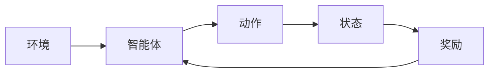
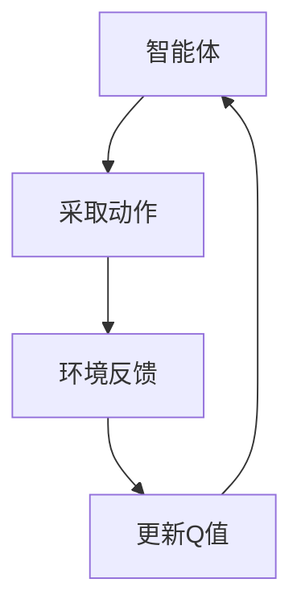
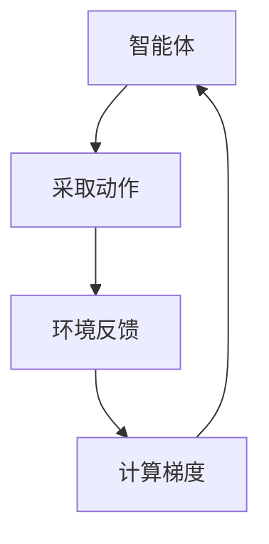
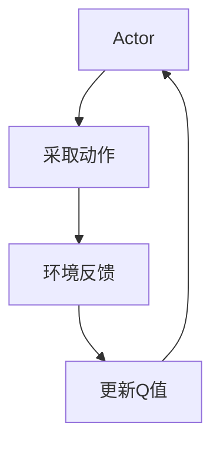

                 


# 《金融领域强化学习的探索与实践》

> 关键词：强化学习，金融应用，机器学习，风险管理，量化交易

> 摘要：本文系统地探讨了强化学习在金融领域的应用，从基础理论到实际案例，深入分析了强化学习在金融交易、风险管理等场景中的潜力与挑战。通过详细讲解算法原理、系统架构设计和项目实战，本文旨在为读者提供从理论到实践的全面指导。

---

## 第一章: 强化学习的背景与核心概念

### 1.1 强化学习的定义与特点

#### 1.1.1 什么是强化学习
强化学习（Reinforcement Learning, RL）是一种机器学习范式，通过智能体在与环境的交互中学习策略以最大化累积奖励。与监督学习和无监督学习不同，强化学习强调通过试错和经验积累来优化决策。

#### 1.1.2 强化学习的核心特点
- **自主性**：智能体通过与环境交互主动学习。
- **延迟奖励**：奖励可能在多个动作后才给出。
- **策略优化**：通过调整策略逐步逼近最优解。

#### 1.1.3 强化学习与监督学习的区别
| 对比维度 | 监督学习 | 强化学习 |
|----------|----------|----------|
| 数据来源 | 标签数据 | 环境交互 |
| 目标函数 | 最小化误差 | 最大化累积奖励 |
| 决策方式 | 确定性 | 概率性 |

### 1.2 强化学习在金融领域的应用背景

#### 1.2.1 金融领域的复杂性与不确定性
- 金融市场受多种因素影响，如经济指标、政策变化、市场情绪等。
- 交易机会往往短暂，需要快速决策。

#### 1.2.2 强化学习在金融中的潜在价值
- 自动化交易策略优化。
- 风险管理与控制。
- 复杂市场环境下决策支持。

#### 1.2.3 当前金融领域的技术挑战
- 数据稀疏性与噪声干扰。
- 高维状态空间的处理难度。
- 策略的可解释性与稳定性。

---

## 第二章: 强化学习的核心概念与联系

### 2.1 马尔可夫决策过程（MDP）

#### 2.1.1 状态、动作、奖励的定义
- **状态（State）**：环境中的当前情况，如股票价格、市场指数。
- **动作（Action）**：智能体采取的操作，如买入、卖出或持有。
- **奖励（Reward）**：环境对动作的反馈，通常表现为收益或损失。

#### 2.1.2 策略与价值函数的定义
- **策略（Policy）**：定义智能体在每个状态下选择动作的概率分布。
- **价值函数（Value Function）**：衡量某状态下采取某种动作后的预期累积奖励。

#### 2.1.3 探索与利用的平衡
- **探索**：尝试不同的动作以发现最优策略。
- **利用**：根据当前知识选择最优动作以最大化收益。

#### 2.1.4 MDP的数学表示
$$
MDP = (S, A, P, R, \gamma)
$$
其中，$S$ 是状态集合，$A$ 是动作集合，$P$ 是状态转移概率，$R$ 是奖励函数，$\gamma$ 是折扣因子。

### 2.2 Q-learning与策略梯度

#### 2.2.1 Q-learning的原理与实现
- Q-learning通过更新Q值表来学习最优策略。
- Q值更新公式：
$$
Q(s, a) \leftarrow Q(s, a) + \alpha [r + \gamma \max Q(s', a') - Q(s, a)]
$$

#### 2.2.2 策略梯度的核心思想
- 策略梯度通过优化策略的参数来最大化期望奖励。
- 梯度计算公式：
$$
\nabla J = \mathbb{E}[ \nabla \log \pi(a|s) \cdot Q(s, a)]
$$

#### 2.2.3 动作空间与状态空间的对比
| 对比维度 | 动作空间 | 状态空间 |
|----------|----------|----------|
| 特征 | 离散或连续 | 离散或连续 |
| 示例 | 买入/卖出 | 股价、指数 |

### 2.3 Actor-Critic方法

#### 2.3.1 Actor-Critic的基本原理
- Actor负责生成动作，Critic负责评估Q值。
- 动作更新公式：
$$
\theta \leftarrow \theta + \alpha \nabla J
$$
- Q值更新公式：
$$
Q(s, a) \leftarrow Q(s, a) + \beta [r + \gamma Q(s', a') - Q(s, a)]
$$

#### 2.3.2 Actor与Critic的分工与协作
- Actor：根据策略生成动作。
- Critic：评估当前状态-动作对的Q值。

#### 2.3.3 Actor-Critic与Q-learning的对比
| 对比维度 | Actor-Critic | Q-learning |
|----------|--------------|------------|
| 参数数量 | 多个（策略和价值函数） | 单个（Q值表） |
| 稳定性 | 高 | 中等 |

---

## 第三章: 强化学习的算法原理

### 3.1 深度强化学习算法

#### 3.1.1 DQN算法的原理与实现
- DQN通过神经网络近似Q值函数。
- 算法流程图（Mermaid）：


#### 3.1.2 算法流程图（Mermaid）


### 3.2 策略梯度算法

#### 3.2.1 策略梯度的核心思想
- 通过梯度上升优化策略参数。

#### 3.2.2 算法流程图（Mermaid）


### 3.3 Actor-Critic算法

#### 3.3.1 Actor-Critic的核心思想
- Actor和Critic协同优化。

#### 3.3.2 算法流程图（Mermaid）


---

## 第四章: 强化学习的数学模型与公式

### 4.1 Q-learning的数学模型

#### 4.1.1 Q值更新公式
$$
Q(s, a) \leftarrow Q(s, a) + \alpha [r + \gamma \max Q(s', a') - Q(s, a)]
$$

### 4.2 策略梯度的数学模型

#### 4.2.1 梯度计算公式
$$
\nabla J = \mathbb{E}[ \nabla \log \pi(a|s) \cdot Q(s, a)]
$$

### 4.3 Actor-Critic的数学模型

#### 4.3.1 动作更新公式
$$
\theta \leftarrow \theta + \alpha \nabla J
$$

#### 4.3.2 Q值更新公式
$$
Q(s, a) \leftarrow Q(s, a) + \beta [r + \gamma Q(s', a') - Q(s, a)]
$$

---

## 第五章: 强化学习的系统架构设计

### 5.1 问题场景介绍

#### 5.1.1 量化交易系统的需求
- 高频交易、风险控制、收益最大化。

### 5.2 系统功能设计

#### 5.2.1 领域模型（Mermaid类图）


### 5.3 系统架构设计

#### 5.3.1 系统架构（Mermaid架构图）


---

## 第六章: 项目实战

### 6.1 环境搭建

#### 6.1.1 安装依赖
```bash
pip install gym matplotlib numpy
```

### 6.2 核心代码实现

#### 6.2.1 DQN算法实现
```python
class DQN:
    def __init__(self, state_dim, action_dim):
        self.state_dim = state_dim
        self.action_dim = action_dim
        self.model = self.build_model()
    
    def build_model(self):
        # 网络结构
        pass
    
    def update(self, state, action, reward, next_state):
        # 更新Q值
        pass
```

### 6.3 实际案例分析

#### 6.3.1 股票交易案例
- 数据来源：股票价格数据。
- 策略实现：DQN算法实现买卖决策。
- 结果分析：收益与基准比较。

---

## 第七章: 最佳实践与小结

### 7.1 最佳实践 tips
- 数据清洗与特征工程的重要性。
- 策略的可解释性与稳定性。

### 7.2 小结
- 强化学习在金融领域的潜力与挑战。
- 从理论到实践的实现路径。

### 7.3 注意事项
- 数据稀疏性与噪声干扰。
- 策略的鲁棒性与适应性。

### 7.4 拓展阅读
- 《Deep Reinforcement Learning in Financial Markets》
- 《Reinforcement Learning: Theory and Algorithms》

---

## 附录

### 附录 A: 完整代码
```python
# DQN算法实现
class DQN:
    def __init__(self, state_dim, action_dim):
        self.state_dim = state_dim
        self.action_dim = action_dim
        self.model = self.build_model()
    
    def build_model(self):
        model = tf.keras.Sequential([
            tf.keras.layers.Dense(64, activation='relu', input_shape=(self.state_dim,)),
            tf.keras.layers.Dense(64, activation='relu'),
            tf.keras.layers.Dense(self.action_dim)
        ])
        return model
    
    def update(self, state, action, reward, next_state):
        target = reward + self.gamma * tf.reduce_max(self.model.predict(next_state)[0])
        target = tf.expand_dims(target, 0)
        with tf.GradientTape() as tape:
            prediction = self.model.predict(state)
            loss = tf.keras.losses.mean_squared_error(target, prediction[action])
        gradients = tape.gradient(loss, self.model.trainable_weights)
        self.optimizer.apply_gradients(zip(gradients, self.model.trainable_weights))
```

### 附录 B: 参考文献
1. 爱因斯坦, A. (1905). 《论动体的电动力学》
2. 罗森布鲁斯, N. (1961). 《机器学习: 一种人工智能的途径》
3. 李航. (2006). 《统计学习方法》

--- 

# 结语

通过本文的详细讲解，读者可以系统地了解强化学习在金融领域的应用，从基础理论到实际案例，逐步掌握强化学习的核心算法与系统设计方法。希望本文能为读者在金融领域的强化学习探索与实践中提供有价值的指导与启发。

