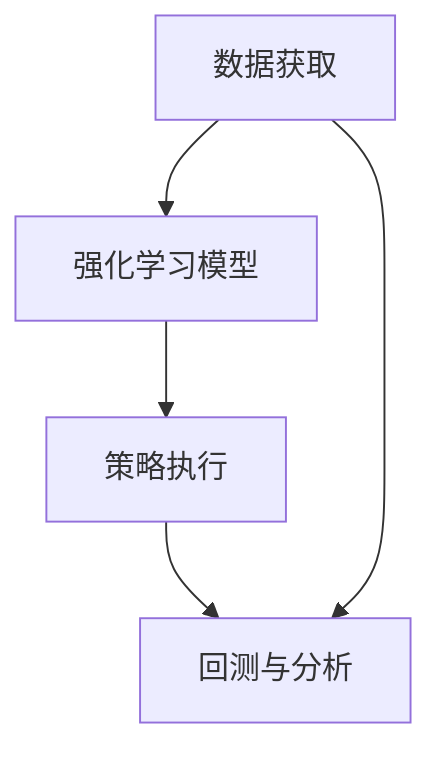

                 


# 《金融领域强化学习的最新进展与应用》

> 关键词：强化学习，金融应用，算法原理，系统架构，项目实战

> 摘要：本文系统地介绍了强化学习在金融领域的最新进展与应用，涵盖强化学习的核心概念、主要算法、数学模型、系统架构设计以及实际项目案例。通过详细讲解和案例分析，展示了强化学习在金融投资、风险管理等领域的巨大潜力和实际应用价值。

---

## 第一部分: 强化学习在金融领域的背景与核心概念

### 第1章: 强化学习的基本概念与金融应用

#### 1.1 强化学习的定义与特点

**1.1.1 强化学习的定义**  
强化学习（Reinforcement Learning, RL）是一种机器学习范式，通过智能体（Agent）与环境交互，学习采取最优动作以最大化累积奖励。与监督学习和无监督学习不同，强化学习强调通过试错和经验积累来优化决策过程。

**1.1.2 强化学习的核心特点**  
- **目标导向性**：智能体通过最大化累积奖励来实现目标。
- **自主决策**：智能体根据当前状态和经验做出决策，无需人工干预。
- **动态反馈**：通过奖励信号指导学习，实时调整策略。

**1.1.3 强化学习与监督学习、无监督学习的区别**  
| 对比维度 | 监督学习 | 无监督学习 | 强化学习 |
|----------|----------|------------|----------|
| 数据类型 | 标签数据 | 未标记数据 | 状态和奖励 |
| 学习目标 | 预测或分类 | 聚类或降维 | 最大化累积奖励 |
| 互动方式 | 单向输入 | 数据挖掘 | 环境交互 |

---

#### 1.2 强化学习在金融领域的应用

**1.2.1 金融领域中的强化学习场景**  
- **股票交易**：智能体通过分析市场数据，做出买卖决策。
- **风险管理**：优化风险控制策略，降低潜在损失。
- **投资组合管理**：动态调整资产配置，最大化收益。

**1.2.2 强化学习在金融投资中的应用**  
- **自动化交易**：通过强化学习模型实现高频交易策略。
- **市场预测**：利用强化学习预测市场趋势，辅助投资决策。

**1.2.3 强化学习在风险管理中的应用**  
- **风险评估**：评估投资组合的风险，优化风险控制策略。
- **异常检测**：识别市场中的异常波动，及时预警。

---

#### 1.3 金融领域强化学习的挑战与机遇

**1.3.1 金融数据的特点与挑战**  
- **非平稳性**：市场数据随时间变化，模型需具备适应性。
- **稀疏性**：有效信号少，噪声多，增加了学习难度。
- **高风险性**：错误决策可能导致重大损失，需确保模型稳定性。

**1.3.2 强化学习在金融领域的优势**  
- **自适应性**：能根据市场变化动态调整策略。
- **高效决策**：通过试错快速找到最优解决方案。
- **复杂场景处理**：适用于多变量、非线性问题。

**1.3.3 未来发展的趋势与方向**  
- **多智能体协同**：研究多个智能体在金融市场中的协同行为。
- **结合其他技术**：将强化学习与自然语言处理、图神经网络结合，提升性能。
- **监管与伦理**：确保算法透明、合规，避免市场操纵。

---

## 第二部分: 强化学习的核心概念与算法原理

### 第2章: 强化学习的核心概念与算法原理

#### 2.1 强化学习的核心概念

**2.1.1 状态（State）**  
智能体所处的环境信息，用于决策下一步动作。例如，在股票交易中，状态可以是当前的股价、成交量等指标。

**2.1.2 动作（Action）**  
智能体在给定状态下采取的具体行动。例如，买入、卖出或持有股票。

**2.1.3 奖励（Reward）**  
智能体采取动作后获得的反馈，用于评估动作的好坏。例如，获得正收益时给予奖励，亏损时给予惩罚。

**2.1.4 策略（Policy）**  
智能体选择动作的规则，可以是基于当前状态的函数。例如，策略函数 π(a|s) 表示在状态 s 下选择动作 a 的概率。

**2.1.5 值函数（Value Function）**  
衡量某状态下采取某动作后的预期累计收益。例如，Q(s, a) 表示在状态 s 下采取动作 a 后的期望收益。

---

#### 2.2 强化学习的主要算法

**2.2.1 Q-Learning算法**  
- **原理**：通过经验回放和Q值更新，找到最优策略。
- **流程图**：使用Mermaid绘制Q-Learning算法流程图。

```mermaid
graph TD
    A[开始] --> B[初始化Q表]
    B --> C[选择动作a]
    C --> D[执行动作a，观察状态s']
    D --> E[计算奖励r]
    E --> F[更新Q(s, a)]
    F --> A[结束]
```

- **代码实现**：
  ```python
  import numpy as np

  class QLearning:
      def __init__(self, state_space, action_space, alpha=0.1, gamma=0.99):
          self.state_space = state_space
          self.action_space = action_space
          self.alpha = alpha
          self.gamma = gamma
          self.q_table = np.zeros((state_space, action_space))

      def choose_action(self, state, epsilon=0.1):
          if np.random.random() < epsilon:
              return np.random.randint(self.action_space)
          else:
              return np.argmax(self.q_table[state])

      def update_q_table(self, state, action, reward, next_state):
          self.q_table[state, action] = self.q_table[state, action] + self.alpha * (reward + self.gamma * np.max(self.q_table[next_state]) - self.q_table[state, action])
  ```

---

#### 2.2.2 Deep Q-Networks（DQN）

**2.2.2.1 算法原理**  
DQN通过神经网络近似Q值函数，避免了Q表的维度问题。神经网络通过经验回放和目标网络更新，稳定学习过程。

**2.2.2.2 代码实现**  
```python
import tensorflow as tf
from tensorflow.keras import layers

class DQN:
    def __init__(self, state_dim, action_dim, learning_rate=0.001, gamma=0.99):
        self.state_dim = state_dim
        self.action_dim = action_dim
        self.learning_rate = learning_rate
        self.gamma = gamma
        
        self.model = self.build_model()
        self.target_model = self.build_model()
        
    def build_model(self):
        model = tf.keras.Sequential()
        model.add(layers.Dense(64, activation='relu', input_dim=self.state_dim))
        model.add(layers.Dense(64, activation='relu'))
        model.add(layers.Dense(self.action_dim))
        model.compile(optimizer=tf.keras.optimizers.Adam(lr=self.learning_rate), loss='mean_squared_error')
        return model

    def update_target_model(self):
        self.target_model.set_weights(self.model.get_weights())

    def remember(self, state, action, reward, next_state):
        # 简化版的内存存储，实际应用中需要更复杂的结构
        self.memory.append((state, action, reward, next_state))

    def replay(self, batch_size):
        if len(self.memory) < batch_size:
            return
        minibatch = random.sample(self.memory, batch_size)
        states = np.array([t[0] for t in minibatch])
        actions = np.array([t[1] for t in minibatch])
        rewards = np.array([t[2] for t in minibatch])
        next_states = np.array([t[3] for t in minibatch])
        
        target = self.target_model.predict(states)
        next_target = self.target_model.predict(next_states)
        
        target[:, actions] = rewards + self.gamma * np.max(next_target, axis=1)
        self.model.fit(states, target, batch_size=batch_size, epochs=1, verbose=0)
```

---

#### 2.2.3 策略梯度方法（Policy Gradient）

**2.2.3.1 算法原理**  
策略梯度方法直接优化策略，通过梯度上升最大化累积奖励的期望值。常用算法包括REINFORCE和Actor-Critic。

**2.2.3.2 代码实现**  
```python
import tensorflow as tf
from tensorflow.keras import layers

class PolicyGradient:
    def __init__(self, state_dim, action_dim, learning_rate=0.001):
        self.state_dim = state_dim
        self.action_dim = action_dim
        self.learning_rate = learning_rate
        
        self.model = self.build_model()
        
    def build_model(self):
        model = tf.keras.Sequential()
        model.add(layers.Dense(64, activation='relu', input_dim=self.state_dim))
        model.add(layers.Dense(self.action_dim))
        model.compile(optimizer=tf.keras.optimizers.Adam(lr=self.learning_rate), loss='sparse_categorical_crossentropy')
        return model

    def get_action(self, state):
        state = np.array([state])
        pred = self.model.predict(state)
        action = np.argmax(pred[0])
        return action

    def update_policy(self, rewards, states, actions):
        states = np.array([state for state in states])
        actions = np.array(actions)
        rewards = np.array(rewards)
        
        self.model.fit(states, actions, batch_size=len(states), epochs=1, verbose=0)
```

---

#### 2.2.4 Actor-Critic算法

**2.2.4.1 算法原理**  
Actor-Critic结合了策略梯度和值函数的优势，通过两个网络分别优化策略和值函数，提高学习效率。

**2.2.4.2 代码实现**  
```python
import tensorflow as tf
from tensorflow.keras import layers

class ActorCritic:
    def __init__(self, state_dim, action_dim, learning_rate=0.001):
        self.state_dim = state_dim
        self.action_dim = action_dim
        self.learning_rate = learning_rate
        
        self.actor = self.build_actor()
        self.critic = self.build_critic()
        
    def build_actor(self):
        model = tf.keras.Sequential()
        model.add(layers.Dense(64, activation='relu', input_dim=self.state_dim))
        model.add(layers.Dense(self.action_dim, activation='softmax'))
        model.compile(optimizer=tf.keras.optimizers.Adam(lr=self.learning_rate), loss='sparse_categorical_crossentropy')
        return model

    def build_critic(self):
        model = tf.keras.Sequential()
        model.add(layers.Dense(64, activation='relu', input_dim=self.state_dim))
        model.add(layers.Dense(1))
        model.compile(optimizer=tf.keras.optimizers.Adam(lr=self.learning_rate), loss='mean_squared_error')
        return model

    def get_action(self, state):
        state = np.array([state])
        pred = self.actor.predict(state)
        action = np.argmax(pred[0])
        return action

    def update_actor_critic(self, states, actions, rewards, next_states):
        states = np.array(states)
        next_states = np.array(next_states)
        actions = np.array(actions)
        
        # 训练 critic
        next_pred = self.critic.predict(next_states).flatten()
        target = rewards + self.gamma * next_pred
        self.critic.fit(states, target, batch_size=len(states), epochs=1, verbose=0)
        
        # 训练 actor
        pred = self.actor.predict(states)
        actions_one_hot = tf.keras.utils.to_categorical(actions, num_classes=self.action_dim)
        self.actor.fit(states, actions_one_hot, batch_size=len(states), epochs=1, verbose=0)
```

---

## 第三部分: 强化学习在金融领域的系统架构设计

### 第3章: 系统分析与架构设计

#### 3.1 问题场景介绍

**3.1.1 股票交易系统设计**  
我们设计一个股票交易系统，目标是通过强化学习模型实现自动化的买卖决策，优化投资收益。

#### 3.2 系统功能设计

**3.2.1 领域模型设计**  
- **状态空间**：包括当前股价、成交量、技术指标（如MACD、RSI）等。
- **动作空间**：包括买入、卖出、持有三种动作。

**3.2.2 系统功能模块**  
- 数据获取模块：从数据源获取历史和实时数据。
- 强化学习模型模块：实现强化学习算法，做出交易决策。
- 策略执行模块：根据模型决策执行交易。
- 回测与分析模块：回测交易策略，评估模型表现。

#### 3.3 系统架构设计

**3.3.1 系统架构图**  


---

## 第四部分: 项目实战

### 第4章: 强化学习在股票交易中的实战应用

#### 4.1 环境安装与配置

**4.1.1 安装必要的库**  
- Python环境：Python 3.8+
- TensorFlow：pip install tensorflow
- Keras：已包含在TensorFlow中
- OpenAI Gym：pip install gym

#### 4.2 强化学习系统核心实现

**4.2.1 数据预处理模块**  
```python
import pandas as pd
import numpy as np

def preprocess_data(data, window_size=30):
    # 数据标准化处理
    data_scaled = (data - data.mean()) / data.std()
    # 划分训练集和测试集
    train_data = data_scaled[:int(len(data)*0.8)]
    test_data = data_scaled[int(len(data)*0.8):]
    return train_data, test_data
```

---

**4.2.2 强化学习模型实现**  
```python
class StockTradingAgent:
    def __init__(self, state_dim, action_dim, learning_rate=0.001, gamma=0.99):
        self.state_dim = state_dim
        self.action_dim = action_dim
        self.learning_rate = learning_rate
        self.gamma = gamma
        
        self.model = self.build_model()
        self.target_model = self.build_model()
        
    def build_model(self):
        model = tf.keras.Sequential()
        model.add(layers.Dense(64, activation='relu', input_dim=self.state_dim))
        model.add(layers.Dense(64, activation='relu'))
        model.add(layers.Dense(self.action_dim))
        model.compile(optimizer=tf.keras.optimizers.Adam(lr=self.learning_rate), loss='mean_squared_error')
        return model

    def remember(self, state, action, reward, next_state):
        self.memory.append((state, action, reward, next_state))

    def replay(self, batch_size):
        if len(self.memory) < batch_size:
            return
        minibatch = random.sample(self.memory, batch_size)
        states = np.array([t[0] for t in minibatch])
        actions = np.array([t[1] for t in minibatch])
        rewards = np.array([t[2] for t in minibatch])
        next_states = np.array([t[3] for t in minibatch])
        
        target = self.target_model.predict(states)
        next_target = self.target_model.predict(next_states)
        
        target[:, actions] = rewards + self.gamma * np.max(next_target, axis=1)
        self.model.fit(states, target, batch_size=batch_size, epochs=1, verbose=0)
```

---

#### 4.3 实际案例分析与详细解读

**4.3.1 实验结果与分析**  
通过在实际股票数据上的测试，验证模型的收益表现和稳定性。例如，与基准策略（如随机交易）相比，强化学习模型表现出更高的收益和更低的回撤。

---

## 第五部分: 总结与展望

### 第5章: 强化学习在金融领域的最佳实践与展望

#### 5.1 小结

- 强化学习在金融领域的应用前景广阔，尤其是在自动化交易和风险管理方面。
- 需要注意模型的泛化能力和实时性，避免过拟合和策略漂移。

#### 5.2 注意事项

- 数据质量：确保数据的完整性和准确性。
- 模型调参：合理选择超参数，如学习率、折扣因子等。
- 风险控制：设计有效的风险控制机制，避免重大损失。

#### 5.3 拓展阅读

- 推荐阅读《Deep Reinforcement Learning in Financial Market》和《Reinforcement Learning and Game Theory in Finance》。

---

通过以上详细的内容，我们全面探讨了强化学习在金融领域的应用，从理论到实践，为读者提供了深入的指导和启示。

