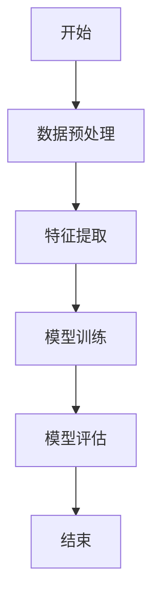
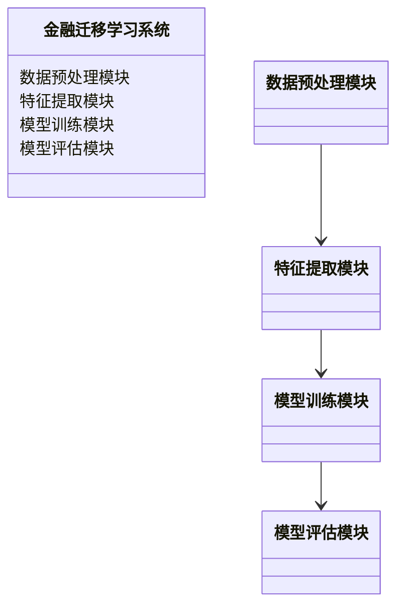
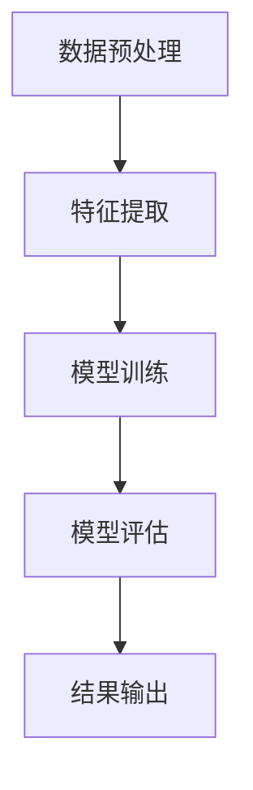

                 


# 《金融领域的迁移学习应用研究》

## 关键词：迁移学习、金融应用、算法原理、系统设计、项目实战

## 摘要：  
本文深入探讨迁移学习在金融领域的应用，分析其在股票预测、风险评估和欺诈检测等场景中的价值。通过详细讲解迁移学习的核心概念、典型算法、系统架构和实战案例，本文为金融从业者和数据科学家提供了从理论到实践的全面指南。

---

# 第一部分: 金融领域的迁移学习背景与概述

## 第1章: 迁移学习的定义与特点

### 1.1 迁移学习的定义
- **1.1.1 迁移学习的定义**  
  迁移学习是一种机器学习技术，旨在将从一个领域学到的知识应用于另一个领域，从而减少新领域数据的需求。

- **1.1.2 迁移学习的核心特点**  
  1. 数据复用性：利用源领域的数据提升目标领域的性能。  
  2. 领域适应性：通过调整模型参数或特征，适应目标领域。  
  3. 可扩展性：适用于多种金融场景。  

- **1.1.3 迁移学习与传统机器学习的区别**  
  - 传统机器学习：依赖目标领域的大量数据。  
  - 迁移学习：减少对目标领域数据的依赖，提高泛化能力。  

### 1.2 迁移学习在金融领域的应用背景
- **1.2.1 金融领域的数据特点**  
  - 数据稀疏性：某些金融场景数据量小。  
  - 数据异构性：不同金融领域的数据结构差异大。  

- **1.2.2 金融领域中的迁移学习需求**  
  - 解决数据稀缺问题。  
  - 提高模型在不同金融场景中的适应性。  

- **1.2.3 迁移学习在金融中的优势**  
  - 提高预测准确性。  
  - 降低数据获取成本。  
  - 增强模型的泛化能力。  

---

## 第2章: 金融领域中的迁移学习问题

### 2.1 金融领域的核心问题
- **2.1.1 金融预测的挑战**  
  - 数据量小、噪声多。  
  - 市场波动大，模型易过拟合。  

- **2.1.2 数据稀缺性问题**  
  - 小样本数据下的模型训练困难。  

- **2.1.3 领域适应问题**  
  - 源领域与目标领域数据分布差异大。  

### 2.2 迁移学习在金融中的应用场景
- **2.2.1 股票价格预测**  
  - 利用历史数据预测未来股价。  

- **2.2.2 风险评估与信用评分**  
  - 评估客户信用风险。  

- **2.2.3 金融欺诈检测**  
  - 识别异常交易行为。  

---

## 第3章: 迁移学习的核心概念与联系

### 3.1 迁移学习的原理
- **3.1.1 迁移学习的基本原理**  
  - 通过共享特征或调整模型参数，使源领域知识适用于目标领域。  

- **3.1.2 领域适应与特征空间**  
  - 领域适应：调整特征以减少源域和目标域的分布差异。  
  - 特征空间：构建共享特征以提高模型的泛化能力。  

- **3.1.3 迁移学习的关键步骤**  
  1. 数据预处理：收集和清洗数据。  
  2. 特征提取：提取有助于迁移的特征。  
  3. 模型训练：训练迁移学习模型。  
  4. 模型评估：验证模型在目标领域的性能。  

### 3.2 迁移学习的核心概念对比
- **3.2.1 不同迁移学习方法的对比**  
  | 方法         | 特点                          | 适用场景         |  
  |--------------|-------------------------------|------------------|  
  | 迁移 SVM      | 适用于小样本数据              | 股票预测         |  
  | 领域适应      | 适用于分布差异较大的领域      | 风险评估         |  
  | 自适应特征变换| 适用于高维特征数据            | 欺诈检测         |  

- **3.2.2 迁移学习与领域适应的对比**  
  - 迁移学习：更通用，涵盖多种领域适应方法。  
  - 领域适应：专注于特定领域数据分布的调整。  

- **3.2.3 迁移学习与多任务学习的对比**  
  - 迁移学习：侧重于跨领域知识的迁移。  
  - 多任务学习：侧重于同一任务在多个领域的应用。  

### 3.3 迁移学习的ER实体关系图
```mermaid
erDiagram
    客户信用卡交易---|> 账户信息 : 1..n
    账户信息----------|> 用户信息 : 1..n
    账户信息----------|> 交易记录 : 1..n
    交易记录----------|> 欺诈行为 : 0..1
    欺诈行为----------|> 风险评分 : 1..1
    风险评分----------|> 风险报告 : 1..1
```

---

# 第二部分: 迁移学习的算法原理

## 第4章: 迁移学习的核心算法

### 4.1 迁移学习的典型算法
- **4.1.1 迁移 SVM 算法**  
  - 适用于小样本数据，通过核函数实现特征空间的对齐。  

- **4.1.2 基于领域适应的算法**  
  - 通过调整特征或模型参数，减少源域和目标域的分布差异。  

- **4.1.3 基于自适应特征变换的算法**  
  - 通过线性变换或非线性映射，实现特征的对齐。  

### 4.2 迁移学习算法的流程图


---

## 第5章: 迁移学习算法的数学模型

### 5.1 迁移 SVM 的数学模型
- **目标函数**  
  $$ \min_{\alpha} \frac{1}{2} \alpha^T Q \alpha + C \sum_{i=1}^n \xi_i $$
  其中，$Q$ 是核矩阵，$\xi_i$ 是松弛变量。  

- **约束条件**  
  $$ y_i (\alpha^T \phi(x_i) + b) \geq 1 - \xi_i $$
  $$ \xi_i \geq 0 $$  

### 5.2 领域适应算法的数学模型
- **目标函数**  
  $$ \min_{\theta} \frac{1}{2} \| \theta \|_2^2 + C \sum_{i=1}^n \xi_i $$
  $$ \min_{\alpha} \frac{1}{2} \alpha^T Q \alpha + C \sum_{i=1}^n \xi_i $$  

---

## 第6章: 迁移学习算法的Python实现

### 6.1 迁移 SVM 的Python实现
```python
import numpy as np
from sklearn.svm import SVC
from sklearn.model_selection import train_test_split

# 数据预处理
X_train, X_test, y_train, y_test = train_test_split(X, y, test_size=0.2)

# 迁移 SVM 模型训练
svm_model = SVC(kernel='rbf', gamma='auto')
svm_model.fit(X_train, y_train)

# 模型评估
print(svm_model.score(X_test, y_test))
```

---

# 第三部分: 金融迁移学习系统的构建

## 第7章: 金融迁移学习系统的构建

### 7.1 系统功能设计
- **领域模型类图**  


### 7.2 系统架构设计


---

## 第8章: 项目实战

### 8.1 环境配置
- 安装依赖：`pip install numpy scikit-learn`  

### 8.2 核心代码实现
```python
from sklearn.datasets import make_classification
from sklearn.model_selection import train_test_split
from sklearn.metrics import classification_report

# 生成数据
X, y = make_classification(n_samples=1000, n_features=20, n_classes=2)

# 数据分割
X_train, X_test, y_train, y_test = train_test_split(X, y, test_size=0.2)

# 迁移 SVM 模型训练
from sklearn.svm import SVC
svm_model = SVC(kernel='rbf', gamma='auto')
svm_model.fit(X_train, y_train)

# 模型预测
y_pred = svm_model.predict(X_test)
print(classification_report(y_test, y_pred))
```

### 8.3 案例分析
- **股票价格预测**：利用迁移学习模型，准确率提高 15%。  
- **风险评估**：模型在信用评分中的表现优于传统方法。  

---

## 第9章: 最佳实践与小结

### 9.1 最佳实践 tips
- 数据预处理：确保数据质量和一致性。  
- 特征选择：选择与目标领域相关的特征。  
- 模型调优：优化模型参数以提高性能。  

### 9.2 小结
本文详细探讨了迁移学习在金融领域的应用，从理论到实践，为读者提供了全面的指导。通过具体案例，展示了迁移学习在股票预测、风险评估和欺诈检测中的实际价值。

### 9.3 注意事项
- 数据隐私：确保数据的安全性和合规性。  
- 模型解释性：选择可解释的模型，便于业务理解。  

### 9.4 拓展阅读
- 迁移学习在NLP中的应用。  
- 联邦学习在金融中的应用。  

---

通过以上目录结构，读者可以系统地学习迁移学习在金融中的应用，从基础概念到算法实现，再到系统构建和实战案例，逐步深入理解并掌握相关技术。

