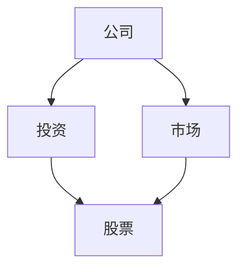
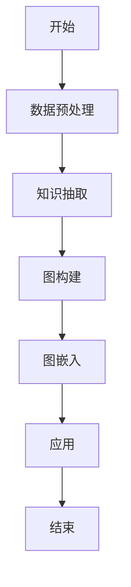

                 

# 目录大纲：《金融领域知识图谱的构建与应用》

## 第一部分：背景与核心概念

### 第1章：知识图谱概述
- 1.1 知识图谱的基本概念
  - 1.1.1 定义与特点
  - 1.1.2 在金融领域的应用潜力
- 1.2 金融领域知识图谱的背景
  - 1.2.1 传统金融数据分析的局限性
  - 1.2.2 知识图谱在金融中的需求

### 第2章：金融知识图谱的核心概念
- 2.1 实体与关系的定义
  - 2.1.1 实体类型：公司、股票、市场等
  - 2.1.2 关系类型：投资、交易、影响等
- 2.2 ER实体关系图
  - 使用mermaid绘制的实体关系图示例

## 第二部分：算法原理

### 第3章：知识图谱构建算法
- 3.1 基本概念与原理
  - 3.1.1 图嵌入算法：Word2Vec、Node2Vec
  - 3.1.2 金融特定算法：如金融实体关联算法
- 3.2 算法流程图
  - 使用mermaid绘制的算法流程图
- 3.3 Python代码实现
  - 示例代码展示图嵌入过程
- 3.4 数学模型与公式
  - $$\text{图嵌入公式}$$
  - 详细解释与举例说明

## 第三部分：系统设计与架构

### 第4章：系统分析与架构设计
- 4.1 项目背景与目标
  - 金融知识图谱构建的场景介绍
- 4.2 系统功能设计
  - 使用mermaid类图展示领域模型
- 4.3 系统架构设计
  - 使用mermaid架构图展示整体架构
- 4.4 接口与交互设计
  - 系统接口说明与交互流程图

## 第四部分：项目实战

### 第5章：金融知识图谱构建实战
- 5.1 环境搭建与数据准备
  - 数据源与工具介绍
- 5.2 核心代码实现
  - 知识抽取、构建与应用代码示例
- 5.3 案例分析与应用
  - 金融风险分析与投资建议的案例
- 5.4 项目总结与优化
  - 经验总结与改进建议

## 第五部分：总结与拓展

### 第6章：总结与最佳实践
- 6.1 章节回顾
  - 核心概念与算法的总结
- 6.2 最佳实践与注意事项
  - 项目实施中的关键点
- 6.3 拓展阅读与未来展望
  - 推荐的进一步学习资源与未来方向

---

### 附录：工具与资源
- 附录A：常用知识图谱工具介绍
- 附录B：数据源与API推荐

---

### 示例：ER实体关系图（使用mermaid）

### 示例：算法流程图（使用mermaid）

