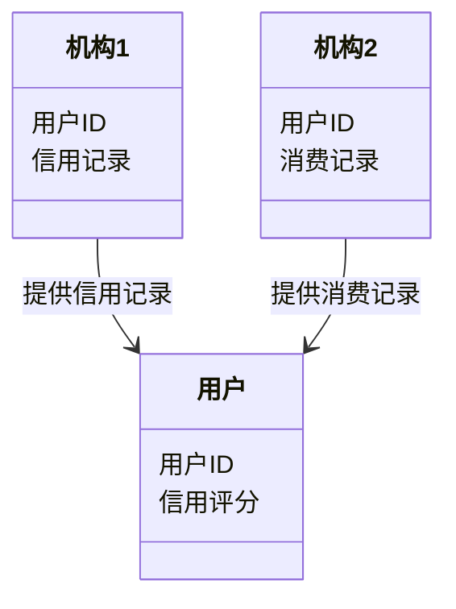
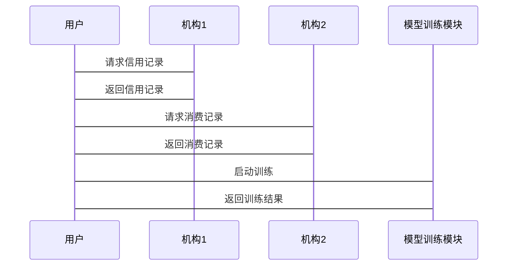
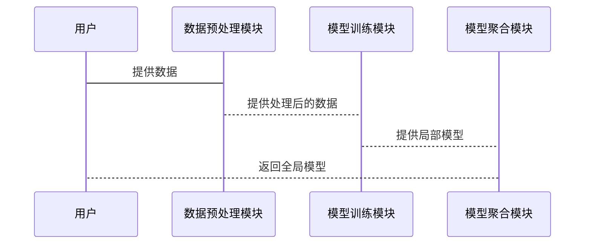

                 


# 《金融领域联邦学习在跨机构信用评分与风险管理中的应用》

## 关键词：联邦学习，信用评分，风险管理，跨机构协作，数据隐私，机器学习

## 摘要：
本文深入探讨了联邦学习在金融领域信用评分与风险管理中的应用。通过分析联邦学习的核心概念、算法原理、系统架构设计以及实际项目案例，本文展示了联邦学习如何在跨机构协作中保护数据隐私，同时提升信用评分模型的性能。文章还结合数学模型和实际案例，详细讲解了联邦学习的优势与挑战，为金融领域的技术实践者提供了理论支持和实践指导。

---

# 第1章 联邦学习与金融领域的概述

## 1.1 联邦学习的起源与发展

### 1.1.1 联邦学习的定义与核心概念
联邦学习（Federated Learning）是一种分布式机器学习技术，允许多个参与方在不共享原始数据的前提下，联合训练模型。其核心在于数据隐私保护和跨机构协作。

### 1.1.2 联邦学习在金融领域的应用背景
金融行业对数据隐私和安全要求极高，传统的数据集中化建模方法存在数据泄露风险。联邦学习通过局部建模和模型聚合，解决了这一问题。

### 1.1.3 跨机构协作的必要性
金融机构之间数据孤岛问题严重，联邦学习通过跨机构协作，提升了信用评分和风险管理的效率与准确性。

## 1.2 信用评分与风险管理的挑战

### 1.2.1 信用评分的传统方法与局限性
传统信用评分主要依赖单一机构的数据，模型泛化能力有限。

### 1.2.2 风险管理中的数据孤岛问题
金融机构之间数据分散，难以构建全局模型。

### 1.2.3 联邦学习在信用评分与风险管理中的应用前景
联邦学习通过跨机构协作，提升了信用评分模型的准确性和风险管理能力。

## 1.3 本章小结
本章介绍了联邦学习的定义、核心概念及其在金融领域的应用背景，强调了联邦学习在信用评分与风险管理中的重要性。

---

# 第2章 联邦学习的核心概念与联系

## 2.1 联邦学习的核心原理

### 2.1.1 联邦学习的基本原理
数据分布在不同的参与方，通过局部建模和模型聚合，形成全局模型。

### 2.1.2 联邦学习的三要素：数据、模型、通信
数据：分布在不同机构；模型：局部模型和全局模型；通信：模型参数同步。

### 2.1.3 联邦学习的分类与应用场景
横向联邦学习、纵向联邦学习、混合联邦学习。

## 2.2 联邦学习与传统机器学习的对比

### 2.2.1 数据隐私与安全的对比
联邦学习保护数据隐私，传统方法可能泄露数据。

### 2.2.2 模型训练效率的对比
联邦学习训练效率较低，但隐私保护更好。

### 2.2.3 跨机构协作能力的对比
联邦学习支持跨机构协作，传统方法依赖数据集中化。

## 2.3 联邦学习在信用评分中的应用

### 2.3.1 联邦学习如何解决信用评分的数据隐私问题
通过局部建模和模型聚合，保护各机构的原始数据。

### 2.3.2 联邦学习在信用评分中的具体应用场景
跨机构联合建模，提升信用评分模型的泛化能力。

### 2.3.3 联邦学习对信用评分模型性能的提升
通过数据融合，提升模型的准确性和稳定性。

## 2.4 核心概念对比表格

| 对比维度         | 联邦学习          | 传统机器学习      |
|------------------|-------------------|-------------------|
| 数据隐私         | 高               | 低               |
| 跨机构协作能力   | 高               | 低               |
| 模型性能         | 高               | 一般             |

## 2.5 本章小结
本章详细讲解了联邦学习的核心原理，对比了其与传统机器学习的差异，并分析了其在信用评分中的具体应用。

---

# 第3章 联邦学习算法原理与数学模型

## 3.1 联邦学习算法的分类与选择

### 3.1.1 横向联邦学习
数据按横向分布，适合相同特征但不同数据集的情况。

### 3.1.2 纵向联邦学习
数据按纵向分布，适合同一特征但不同数据集的情况。

### 3.1.3 混合联邦学习
结合横向和纵向联邦学习，适用于复杂数据分布。

## 3.2 联邦学习算法的数学模型

### 3.2.1 联邦学习的优化目标
$$ \min_{\theta} \frac{1}{N}\sum_{i=1}^{N} f_i(\theta) $$

### 3.2.2 联邦学习的损失函数
$$ L(\theta) = \frac{1}{N}\sum_{i=1}^{N} \text{loss}_i(\theta) $$

### 3.2.3 联邦学习的模型聚合方法
$$ \theta_{\text{new}} = \theta_{\text{old}} - \eta \nabla L(\theta_{\text{old}}) $$

## 3.3 横向联邦学习的算法流程

### 3.3.1 数据预处理
```python
# 示例代码：数据预处理
import pandas as pd
data = pd.read_csv('local_data.csv')
data.dropna(inplace=True)
```

### 3.3.2 通信协议设计
```python
# 示例代码：通信协议
def communicate(model_local, model_global):
    # 合并模型参数
    global_weights = []
    for i in range(len(model_local)):
        global_weights.append((model_local[i] + model_global[i]) / 2)
    return global_weights
```

### 3.3.3 模型训练与聚合
```python
# 示例代码：模型训练与聚合
from sklearn.linear_model import LogisticRegression

local_model = LogisticRegression().fit(local_X, local_y)
global_model = LogisticRegression().fit(global_X, global_y)
```

## 3.4 本章小结
本章详细讲解了联邦学习的算法原理，包括横向、纵向和混合联邦学习的数学模型和实现方法。

---

# 第4章 联邦学习在信用评分中的系统架构设计

## 4.1 问题场景介绍

### 4.1.1 信用评分系统的需求
提升模型准确性和泛化能力，保护数据隐私。

### 4.1.2 跨机构协作的挑战
数据隐私、通信效率、模型性能。

## 4.2 系统功能设计

### 4.2.1 领域模型设计


### 4.2.2 系统架构设计


### 4.2.3 接口设计


## 4.3 本章小结
本章通过系统架构设计，展示了联邦学习在信用评分中的具体实现方式，包括数据预处理、模型训练和结果输出。

---

# 第5章 联邦学习的数学模型与系统架构

## 5.1 联邦学习的数学模型

### 5.1.1 模型参数更新
$$ \theta_{t+1} = \theta_t - \eta \sum_{i=1}^{N} \nabla f_i(\theta_t) $$

### 5.1.2 模型聚合方法
$$ \theta_{\text{global}} = \frac{1}{N}\sum_{i=1}^{N} \theta_i $$

## 5.2 系统架构设计

### 5.2.1 系统模块划分
- 数据预处理模块
- 模型训练模块
- 模型聚合模块
- 结果输出模块

### 5.2.2 系统交互流程


## 5.3 本章小结
本章详细讲解了联邦学习的数学模型和系统架构设计，为后续的项目实现奠定了基础。

---

# 第6章 联邦学习在信用评分中的项目实战

## 6.1 环境安装与配置

### 6.1.1 安装依赖
```bash
pip install -r requirements.txt
```

### 6.1.2 环境配置
```bash
export FLASK_APP=app.py
```

## 6.2 数据准备与处理

### 6.2.1 数据预处理
```python
import pandas as pd
data = pd.read_csv('credit_data.csv')
data.dropna(inplace=True)
```

### 6.2.2 数据分割
```python
from sklearn.model_selection import train_test_split
X_train, X_test, y_train, y_test = train_test_split(data.drop('label', axis=1), data['label'])
```

## 6.3 模型实现与测试

### 6.3.1 模型训练
```python
from sklearn.linear_model import LogisticRegression
model = LogisticRegression().fit(X_train, y_train)
```

### 6.3.2 模型测试
```python
score = model.score(X_test, y_test)
print(f"模型准确率：{score}")
```

## 6.4 项目小结
本章通过具体项目实战，展示了联邦学习在信用评分中的实现过程，包括环境配置、数据处理和模型训练。

---

# 第7章 总结与展望

## 7.1 关键点总结

### 7.1.1 联邦学习的核心优势
- 数据隐私保护
- 跨机构协作能力
- 模型性能提升

### 7.1.2 项目中的关键步骤
- 数据预处理
- 模型训练与聚合
- 系统架构设计

## 7.2 未来挑战与方向

### 7.2.1 数据隐私与安全
- 加强加密技术
- 提升通信安全性

### 7.2.2 模型性能优化
- 提升训练效率
- 优化模型精度

### 7.2.3 跨机构协作机制
- 建立信任机制
- 完善协作流程

## 7.3 注意事项与最佳实践

### 7.3.1 数据处理
- 确保数据完整性
- 处理缺失值

### 7.3.2 模型选择
- 根据场景选择合适模型
- 定期更新模型

## 7.4 拓展阅读

### 7.4.1 推荐书籍
- 《联邦学习：分布式机器学习的新范式》
- 《信用评分与风险管理》

### 7.4.2 推荐博客
- [联邦学习技术博客](https://example.com)
- [信用评分与风险管理博客](https://example.com)

## 7.5 本章小结
本章总结了联邦学习在信用评分中的应用，并展望了未来的发展方向，同时给出了实践中的注意事项和拓展阅读建议。

---

# 结语

通过本文的详细讲解，读者可以全面了解联邦学习在金融领域信用评分与风险管理中的应用。从理论到实践，从算法到系统架构，本文为技术实践者提供了丰富的知识和实践指导。未来，随着技术的发展，联邦学习将在金融领域发挥更大的作用，为信用评分和风险管理提供更强大的支持。

--- 

感谢您的耐心阅读！如需进一步探讨或合作，欢迎随时联系！

