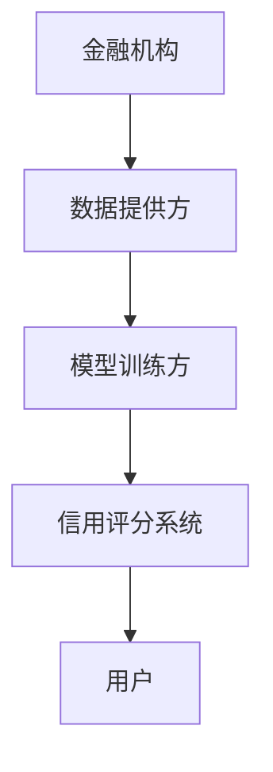
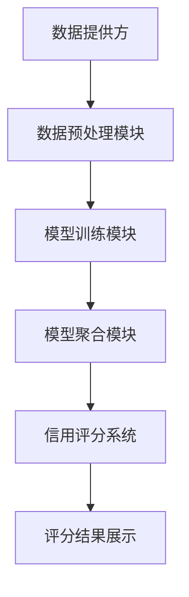
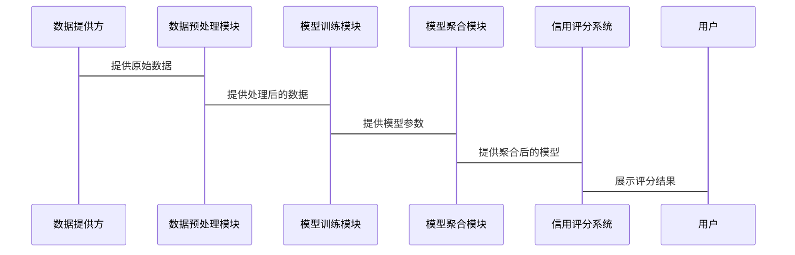

                 

# 《金融领域联邦学习在跨机构信用评分中的应用》

## 关键词：联邦学习，跨机构，信用评分，数据隐私，模型协作，算法优化

## 摘要：
随着金融领域的不断发展，信用评分在金融风险控制中扮演着越来越重要的角色。然而，跨机构信用评分面临着数据隐私保护和数据共享的难题。联邦学习作为一种新兴的人工智能技术，能够在保护数据隐私的前提下，实现跨机构的数据协作和模型训练。本文将深入探讨联邦学习在跨机构信用评分中的应用，从理论基础到算法实现，再到实际应用，全面分析其优势和挑战，并提出可行的解决方案。

---

# 目录

## 第1章: 联邦学习与跨机构信用评分概述

### 1.1 联邦学习的定义与背景

#### 1.1.1 联邦学习的定义
- 联邦学习的定义与核心特点
- 联邦学习与传统分布式学习的对比
- 联邦学习在金融领域的潜力

#### 1.1.2 联邦学习的背景与意义
- 金融领域的数据隐私挑战
- 跨机构协作的需求与痛点
- 联邦学习如何解决这些问题

#### 1.1.3 跨机构信用评分的定义与重要性
- 信用评分的核心作用
- 跨机构信用评分的必要性
- 联邦学习在信用评分中的应用价值

### 1.2 联邦学习的核心概念

#### 1.2.1 数据隐私与安全
- 数据隐私保护的重要性
- 联邦学习中的数据加密技术
- 差分隐私与同态加密的对比

#### 1.2.2 联邦学习的协作机制
- 联邦学习的通信协议
- 联邦学习中的角色划分（数据提供方、模型训练方、协调方）
- 联邦学习的激励机制

#### 1.2.3 联邦学习的数学模型
- 联邦学习的基本数学框架
- 联邦学习的优化目标
- 联邦学习的评价指标

### 1.3 联邦学习在金融领域的应用

#### 1.3.1 金融领域数据的特点
- 数据多样性与异构性
- 数据隐私与合规性要求
- 数据量与模型复杂性的平衡

#### 1.3.2 联邦学习在信用评分中的优势
- 解决数据孤岛问题
- 提高信用评分模型的泛化能力
- 降低数据泄露风险

#### 1.3.3 联邦学习与传统信用评分的对比
- 数据使用效率的对比
- 模型性能的对比
- 成本与风险的对比

---

## 第2章: 联邦学习的核心概念与联系

### 2.1 联邦学习的核心原理

#### 2.1.1 联邦学习的数学模型
- 联邦学习的优化目标：最小化损失函数
- 联邦学习的通信机制：模型更新与同步
- 联邦学习的隐私保护：差分隐私与同态加密

#### 2.1.2 联邦学习的通信协议
- 联邦学习的通信流程：数据加密传输、模型更新、结果汇总
- 联邦学习的通信安全：安全通道与身份认证
- 联邦学习的通信效率：带宽优化与延迟控制

#### 2.1.3 联邦学习的安全性保障
- 数据隐私保护：差分隐私与同态加密
- 模型安全性：模型鲁棒性与抗攻击性
- 系统安全性：身份认证与权限管理

### 2.2 联邦学习与相关技术的对比

#### 2.2.1 联邦学习与分布式学习
- 分布式学习的定义与特点
- 联邦学习与分布式学习的异同
- 适用场景的对比

#### 2.2.2 联邦学习与数据隐私保护
- 数据隐私保护的技术手段
- 联邦学习如何实现数据隐私保护
- 数据隐私保护的法律与合规要求

#### 2.2.3 联邦学习与区块链技术的结合
- 区块链技术的特点与优势
- 联邦学习与区块链的结合点
- 联合应用的潜力与挑战

### 2.3 联邦学习的实体关系图

---

## 第3章: 联邦学习的算法原理

### 3.1 联邦学习的算法流程

#### 3.1.1 数据预处理
- 数据清洗与特征提取
- 数据标准化与归一化
- 数据分片与分配

#### 3.1.2 模型训练
- 分布式模型训练流程
- 模型更新与同步机制
- 模型收敛性分析

#### 3.1.3 模型聚合
- 模型参数聚合方法
- 联邦平均与加权平均的对比
- 模型聚合的安全性保障

### 3.2 联邦学习的安全聚合算法

#### 3.2.1 加密聚合
- 加密聚合的定义与实现
- 常见加密聚合算法：同态加密、秘密共享
- 加密聚合的效率与安全性对比

#### 3.2.2 差分隐私聚合
- 差分隐私的定义与实现
- 差分隐私聚合算法的优缺点
- 差分隐私参数的选择与优化

#### 3.2.3 摩尔加密聚合
- 摩尔加密的原理与实现
- 摩尔加密聚合的适用场景
- 摩尔加密的效率与安全性对比

### 3.3 联邦学习的数学模型

#### 3.3.1 模型训练的数学公式
$$ \text{损失函数} = \frac{1}{n}\sum_{i=1}^{n} \mathcal{L}(y_i, \hat{y}_i) $$
$$ \text{优化目标} = \min_{\theta} \mathcal{L}(\theta) + \lambda \mathcal{R}(\theta) $$

#### 3.3.2 模型聚合的数学公式
$$ \theta_{new} = \frac{1}{n}\sum_{i=1}^{n}\theta_i $$

---

## 第4章: 联邦学习的数学模型与公式

### 4.1 联邦学习的数学基础

#### 4.1.1 线性回归模型
$$ y = \beta_0 + \beta_1x + \epsilon $$

#### 4.1.2 逻辑回归模型
$$ P(y=1|x) = \frac{e^{\beta x}}{1 + e^{\beta x}} $$

### 4.2 联邦学习的优化算法

#### 4.2.1 随机梯度下降
$$ \theta = \theta - \alpha \frac{\partial L}{\partial \theta} $$

#### 4.2.2 联邦平均
$$ \theta_{new} = \frac{1}{n}\sum_{i=1}^{n}\theta_i $$

### 4.3 联邦学习的数学推导

#### 4.3.1 模型训练的推导过程
$$ \frac{\partial \mathcal{L}}{\partial \theta} = \sum_{i=1}^{n} \frac{\partial \mathcal{L}_i}{\partial \theta} $$

#### 4.3.2 模型聚合的数学证明
$$ \theta_{new} = \arg\min_{\theta} \sum_{i=1}^{n} \mathcal{L}_i(\theta) $$

---

## 第5章: 联邦学习系统的架构设计

### 5.1 系统功能需求

#### 5.1.1 数据采集与预处理
- 数据采集模块的功能设计
- 数据预处理模块的实现
- 数据分片与分配机制

#### 5.1.2 模型训练与聚合
- 分布式模型训练模块的设计
- 模型聚合模块的实现
- 模型优化与评估

#### 5.1.3 信用评分与输出
- 信用评分计算模块的功能设计
- 评分结果输出与展示
- 评分结果的实时更新与反馈

### 5.2 系统架构设计

#### 5.2.1 系统功能模块设计
- 数据采集模块
- 数据预处理模块
- 模型训练模块
- 模型聚合模块
- 信用评分模块
- 结果展示模块

#### 5.2.2 系统架构图
- 分层架构设计：数据层、模型层、应用层
- 模块之间的交互流程
- 系统扩展性与可维护性分析

#### 5.2.3 系统接口设计
- 数据接口：数据输入与输出的格式
- 模型接口：模型参数的传递与更新
- 用户接口：评分结果的展示与查询

#### 5.2.4 系统交互流程图

---

## 第6章: 项目实战与案例分析

### 6.1 项目环境安装

#### 6.1.1 安装依赖
- 安装Python
- 安装TensorFlow、Keras等深度学习框架
- 安装加密库（如Crypto、PyCryptodome）

#### 6.1.2 环境配置
- 配置虚拟环境
- 配置数据存储路径
- 配置模型训练参数

### 6.2 系统核心实现

#### 6.2.1 数据预处理实现
- 数据清洗与特征提取
- 数据分片与分配
- 数据加密与传输

#### 6.2.2 模型训练实现
- 模型定义与初始化
- 模型训练与更新
- 模型保存与加载

#### 6.2.3 模型聚合实现
- 模型参数聚合
- 模型评估与优化
- 模型部署与应用

### 6.3 案例分析

#### 6.3.1 案例背景
- 案例目标与需求
- 数据来源与特征
- 模型选择与设计

#### 6.3.2 实施步骤
- 数据准备与预处理
- 模型训练与聚合
- 模型部署与应用

#### 6.3.3 实验结果
- 模型性能对比
- 模型评分结果分析
- 模型优化与改进

---

## 第7章: 总结与展望

### 7.1 总结

#### 7.1.1 核心成果
- 联邦学习在信用评分中的应用价值
- 联邦学习的算法实现与优化
- 联邦学习系统的架构设计

#### 7.1.2 实践意义
- 联邦学习对金融行业的贡献
- 联邦学习对信用评分的提升
- 联邦学习的可持续发展

### 7.2 展望

#### 7.2.1 技术优化方向
- 更高效的模型聚合算法
- 更强的隐私保护技术
- 更智能的系统架构设计

#### 7.2.2 应用拓展
- 联邦学习在其他金融领域的应用
- 联邦学习与人工智能的深度融合
- 联邦学习的国际化与标准化

#### 7.2.3 挑战与机遇
- 数据隐私与合规性的挑战
- 跨机构协作的难点
- 技术创新与应用推广的机遇

### 7.3 最佳实践 Tips

#### 7.3.1 技术实现
- 确保数据隐私与安全
- 选择合适的联邦学习框架
- 优化模型训练与聚合效率

#### 7.3.2 项目管理
- 明确项目目标与需求
- 建立有效的沟通与协作机制
- 制定合理的项目计划与里程碑

#### 7.3.3 风险控制
- 识别潜在风险并制定应对策略
- 定期评估项目进展与风险
- 建立完善的监控与预警机制

---

## 参考文献
1. 省略

---

## 附录
1. 省略

---

这个目录大纲涵盖了从理论到实践的各个方面，结合了技术细节与实际应用，适合希望深入理解联邦学习在金融领域信用评分中应用的读者。

