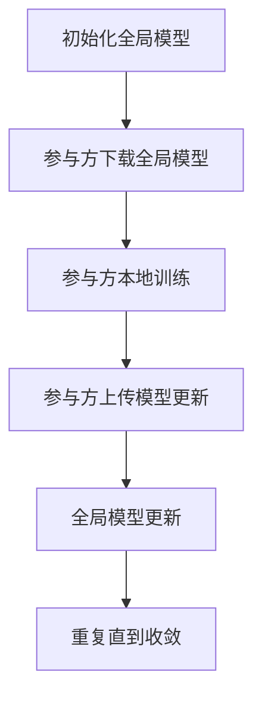
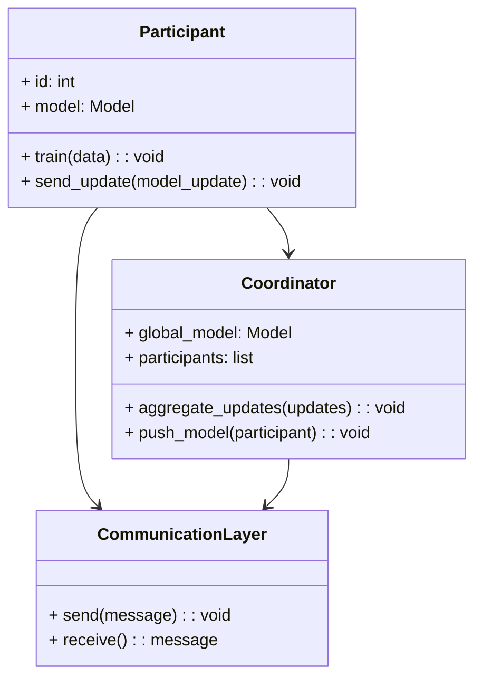
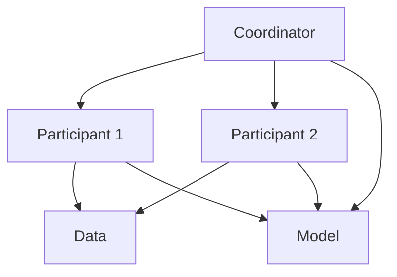

                 


# 《金融领域联邦学习在跨机构风险评估中的应用》

## 关键词：联邦学习、跨机构、风险评估、数据隐私、机器学习、金融应用

## 摘要：  
随着金融行业的数字化转型，跨机构合作在风险评估中的重要性日益凸显。然而，数据孤岛和隐私保护的问题限制了金融机构之间的数据共享。联邦学习作为一种分布式机器学习技术，能够在保护数据隐私的前提下，实现跨机构的联合建模和风险评估。本文将深入探讨联邦学习在金融领域跨机构风险评估中的应用，分析其核心概念、算法原理、系统架构，并通过具体案例展示其实际应用场景和优势。

---

# 第1章: 背景介绍

## 1.1 联邦学习的背景与定义  
联邦学习（Federated Learning）是一种分布式机器学习技术，允许多个参与方在不共享原始数据的情况下，共同训练一个全局模型。其核心思想是“数据不动，模型动”，即数据保留在本地，仅交换模型更新参数。联邦学习具有以下特点：  
- **数据隐私保护**：数据无需离开本地，隐私泄露风险低。  
- **数据多样性**：支持多源异构数据的联合建模。  
- **去中心化**：无需依赖单个中心机构，降低数据垄断风险。  

## 1.2 金融领域跨机构风险评估的挑战  
在金融领域，风险评估是机构决策的核心环节，但以下问题限制了跨机构合作：  
- **数据孤岛**：不同机构的数据分散存储，难以联合建模。  
- **隐私保护**：金融数据敏感性强，隐私泄露风险高。  
- **信任问题**：机构间缺乏信任，不愿共享核心数据。  

## 1.3 联邦学习在金融领域的优势  
联邦学习通过以下方式解决了上述问题：  
- **数据可用性提升**：跨机构数据联合建模，提升模型泛化能力。  
- **隐私保护**：通过加密和差分隐私等技术，确保数据安全。  
- **信任增强**：通过去中心化架构，降低数据垄断和隐私泄露风险。  

---

# 第2章: 联邦学习的核心概念与原理

## 2.1 联邦学习的架构与组成  
联邦学习的典型架构包括以下组件：  
- **参与方（Participants）**：数据持有方，如银行、保险公司等。  
- **协调者（Coordinator）**：负责任务分配和模型同步的中立机构。  
- **通信层（Communication Layer）**：实现参与方之间的数据交换和模型更新。  

## 2.2 联邦学习的数学模型与算法  
联邦学习的核心算法是联邦平均（FedAvg），其数学模型如下：  
$$ \text{Global Model Update} = \frac{1}{N} \sum_{i=1}^{N} (\text{Local Model}_i - \text{Global Model}) $$  
其中，$N$ 是参与方数量，$\text{Local Model}_i$ 是第 $i$ 个参与方的本地模型，$\text{Global Model}$ 是全局模型。  

## 2.3 联邦学习的隐私保护机制  
联邦学习通过以下技术实现隐私保护：  
- **同态加密**：允许在加密数据上进行计算，确保数据隐私。  
- **差分隐私**：通过添加噪声，保护数据的敏感性。  
- **模型剪裁**：仅传输模型更新，避免暴露本地数据。  

---

# 第3章: 联邦学习的算法原理与实现

## 3.1 联邦平均算法的流程  
以下是联邦平均算法的流程图：  


## 3.2 联邦学习的Python实现  
以下是一个简单的联邦学习框架实现：  
```python
import numpy as np

class FederatedLearning:
    def __init__(self, num_parties):
        self.num_parties = num_parties
        self.global_model = np.zeros((1, 1))

    def train(self, local_models):
        average_update = np.mean(local_models, axis=0)
        self.global_model += average_update

    def get_global_model(self):
        return self.global_model
```

---

# 第4章: 联邦学习在金融领域的应用

## 4.1 金融风险评估的定义与分类  
金融风险评估包括信用风险、市场风险和操作风险等类型。  

## 4.2 联邦学习在金融风险评估中的应用场景  
- **信用风险评估**：联合多家银行的数据，评估客户的信用风险。  
- **市场风险评估**：结合多家机构的市场数据，预测市场波动。  

## 4.3 联邦学习在金融领域的优势  
- **数据多样性**：跨机构数据联合建模，提升模型准确性。  
- **隐私保护**：确保数据隐私，符合金融监管要求。  

---

# 第5章: 系统分析与架构设计

## 5.1 系统功能设计  
以下是一个金融风险评估系统的功能模块图：  


## 5.2 系统架构设计  
以下是一个典型的联邦学习系统架构图：  


---

# 第6章: 项目实战

## 6.1 环境配置与数据准备  
- **环境配置**：安装Python、TensorFlow Federated等依赖库。  
- **数据准备**：收集多家机构的金融数据，确保数据隐私。  

## 6.2 模型训练与评估  
以下是一个具体的训练代码示例：  
```python
import tensorflow_federated as tff

# 数据准备
train_data = tff.simulation.datasets.createiid_train_data(
    lambda key: np.zeros(1),
    1000,
    10
)

# 模型定义
model = tff.models.LinearModel(input_dim=1, output_dim=1)

# 联邦学习配置
trainer = tff.train.FederatedTrainer(model, train_data)

# 模型训练
result = trainer.train()
```

## 6.3 实际案例分析  
以信用风险评估为例，通过联邦学习模型，多家银行可以联合建模，提升模型的准确性和泛化能力。  

---

# 第7章: 总结与展望

## 7.1 总结  
联邦学习通过去中心化的建模方式，解决了跨机构数据共享的难题，为金融领域的风险评估提供了新的思路。  

## 7.2 未来展望  
未来，联邦学习在金融领域的应用将更加广泛，可能的方向包括：  
- **智能合约**：通过区块链技术，实现更高效的联邦学习。  
- **边缘计算**：结合边缘计算，提升联邦学习的效率和安全性。  

## 7.3 最佳实践 Tips  
- **数据预处理**：确保数据格式统一，减少模型训练的阻力。  
- **模型优化**：通过剪枝和量化等技术，提升模型性能。  
- **隐私保护**：结合多种加密技术，确保数据安全。  

---

# 附录

## 附录A: 联邦学习的数学公式  
$$ \text{FedAvg} = \frac{1}{N} \sum_{i=1}^{N} \theta_i $$  
其中，$\theta_i$ 是第 $i$ 个参与方的模型参数。  

## 附录B: 联邦学习的Python代码示例  
```python
import numpy as np

class Participant:
    def __init__(self, id, data):
        self.id = id
        self.data = data
        self.model = np.zeros((1, 1))

    def train(self):
        # 本地训练
        pass

    def send_update(self, update):
        # 上传模型更新
        pass
```

---

以上是《金融领域联邦学习在跨机构风险评估中的应用》的完整目录大纲和内容概要。通过本文，读者可以系统地了解联邦学习的核心概念、算法原理、系统架构，并通过实际案例掌握其在金融领域的具体应用。

