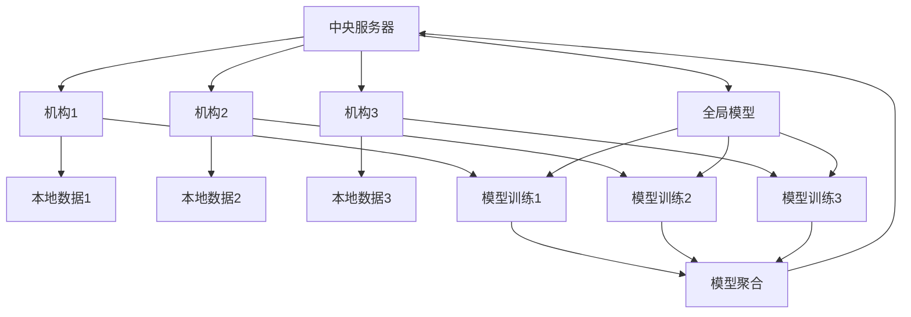
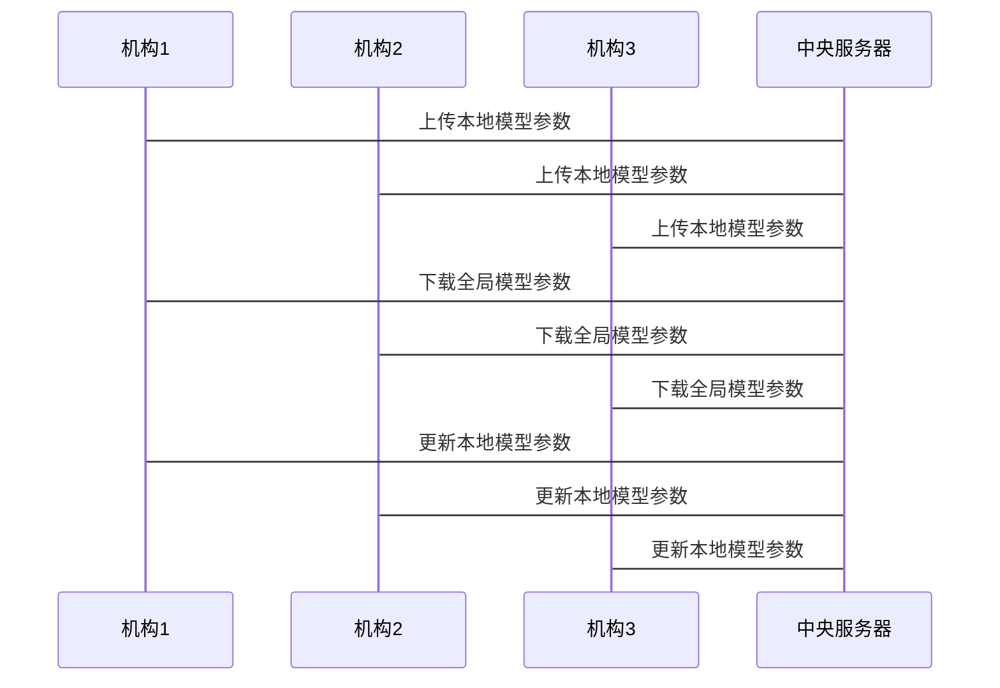

                 


# 金融领域联邦学习在跨机构风险评估中的应用

## 关键词：联邦学习，跨机构，风险评估，分布式机器学习，金融安全

## 摘要：本文深入探讨了联邦学习在金融领域跨机构风险评估中的应用，从背景、核心概念、算法原理到系统架构和项目实战，全面分析了联邦学习在金融领域的优势、挑战和解决方案。通过实际案例和代码实现，展示了联邦学习如何在保护数据隐私的前提下，实现跨机构的风险评估和预测，为金融行业提供了新的思路和实践方向。

---

## 第一部分：联邦学习与跨机构风险评估的背景与概念

### 第1章：联邦学习的起源与发展

#### 1.1 联邦学习的起源

- **1.1.1 分布式机器学习的背景**
  - 传统集中式机器学习的局限性：数据集中化带来的隐私问题、数据传输成本高、单点机构难以覆盖全局风险。
  - 分布式机器学习的兴起：数据局部化、隐私保护、去中心化决策的需求推动了分布式机器学习的发展。

- **1.1.2 联邦学习的核心理念**
  - 联邦学习的定义：多个机构在不共享原始数据的前提下，通过模型参数的协同优化，共同构建全局模型的技术。
  - 联邦学习的核心目标：在保护数据隐私的前提下，实现跨机构的协作学习和模型共享。

- **1.1.3 联邦学习与传统集中式学习的对比**
  - 数据所有权：集中式学习由单一机构拥有数据，联邦学习中数据所有权分散在各个机构。
  - 数据隐私：集中式学习数据集中存储存在泄露风险，联邦学习通过局部建模和参数交换保护隐私。
  - 计算效率：联邦学习通过分布式计算提高模型训练效率，降低计算成本。

#### 1.2 联邦学习在金融领域的应用现状

- **1.2.1 金融领域数据隐私的挑战**
  - 金融数据的敏感性：包括客户信息、交易记录、信用评分等，数据泄露可能导致重大损失。
  - 数据孤岛问题：不同金融机构之间数据孤立，难以形成全局视角进行风险评估。
  - 监管要求：金融行业对数据隐私和合规性的严格要求，限制了数据的自由共享。

- **1.2.2 联邦学习在金融领域的优势**
  - 数据隐私保护：通过联邦学习技术，金融机构可以在不共享原始数据的前提下，协同训练风险评估模型。
  - 跨机构协作：联邦学习打破了数据孤岛，实现了跨机构的风险评估和预测。
  - 高效计算：联邦学习通过分布式计算和模型聚合，提高了模型训练的效率和性能。

- **1.2.3 当前应用的典型案例**
  - 联邦学习在信用评分中的应用：多家银行联合训练信用评分模型，提高风险评估的准确性和全面性。
  - 联邦学习在欺诈检测中的应用：通过跨机构的数据协作，提高欺诈检测的准确性和覆盖范围。
  - 联邦学习在金融监管中的应用：通过数据共享和模型协作，帮助监管机构及时发现和应对金融风险。

#### 1.3 跨机构风险评估的必要性

- **1.3.1 金融机构间的协同需求**
  - 金融机构之间的数据孤立问题：不同机构的数据无法协同使用，限制了风险评估的全面性。
  - 跨机构风险的关联性：例如，一家机构的客户可能在多家机构有贷款记录，需要跨机构协作才能全面评估其风险。
  - 金融监管的需求：监管机构需要跨机构的数据协作，才能全面评估金融系统的风险。

- **1.3.2 跨机构风险评估的难点**
  - 数据隐私保护：如何在不共享原始数据的前提下，实现跨机构的数据协作。
  - 模型协作的效率：如何在分布式环境下高效地进行模型训练和优化。
  - 机构间的信任问题：如何建立信任机制，确保各方按照协议进行数据协作。

- **1.3.3 联邦学习在跨机构风险评估中的作用**
  - 联邦学习提供了一种在保护数据隐私的前提下，实现跨机构协作的解决方案。
  - 联邦学习通过模型参数的协同优化，避免了原始数据的共享，同时实现了全局模型的构建。
  - 联邦学习通过分布式计算和模型聚合，提高了风险评估的效率和准确性。

---

### 第2章：联邦学习的核心概念与联系

#### 2.1 联邦学习的原理

- **2.1.1 联邦学习的基本流程**
  - 数据准备：各个机构分别拥有自己的数据集，数据集可能包含客户信息、交易记录等。
  - 模型初始化：每个机构在本地数据上训练初始模型。
  - 模型聚合：各个机构将训练好的模型参数上传到一个中心服务器，或者通过点对点的方式进行模型聚合。
  - 模型更新：中心服务器将聚合后的模型参数分发给各个机构，供其在本地进行模型更新。
  - 循环迭代：重复模型训练、聚合和更新的过程，直到达到收敛条件或达到预设的训练轮数。

- **2.1.2 联邦学习的核心算法**
  - 联邦平均（FedAvg）算法：通过加权平均的方式聚合各个机构的模型参数，得到全局模型。
  - 联邦聚合（FedProx）算法：在联邦平均的基础上，引入正则化项，避免模型参数的漂移。
  - 其他变体算法：例如基于梯度的联邦学习算法、基于加密的联邦学习算法等。

- **2.1.3 联邦学习的通信机制**
  - 模型参数的同步：各个机构通过某种通信方式（例如HTTP、gRPC等）将模型参数上传到中心服务器。
  - 模型参数的分发：中心服务器将聚合后的模型参数分发给各个机构，供其进行本地模型更新。
  - 通信的安全性：通过加密技术和安全协议，确保通信过程中的数据安全和隐私保护。

#### 2.2 联邦学习与其他分布式学习方法的对比

- **2.2.1 联邦学习与分布式机器学习的异同**
  - 分布式机器学习：多个机构在集中式服务器上进行模型训练，数据仍然集中在服务器端。
  - 联邦学习：模型训练分布在各个机构的本地，只有模型参数被上传到中心服务器或在机构之间进行交换。
  - 对比：联邦学习更注重数据隐私保护，避免原始数据的集中存储和传输。

- **2.2.2 联邦学习与边缘计算的联系**
  - 边缘计算：将计算能力推送到数据生成的边缘设备，减少数据传输到中心服务器的需求。
  - 联邦学习：通过边缘设备进行模型训练和参数聚合，减少对中心服务器的依赖。
  - 联系：边缘计算为联邦学习提供了技术基础，联邦学习为边缘计算提供了数据协作的机制。

- **2.2.3 联邦学习与数据共享的对比**
  - 数据共享：直接共享原始数据，可能导致数据泄露和隐私问题。
  - 联邦学习：通过模型参数的协同优化，避免了原始数据的共享，同时实现了数据协作的效果。
  - 优势：联邦学习在保护数据隐私的前提下，实现了数据协作和模型共享。

#### 2.3 联邦学习的ER实体关系图

```mermaid
er
actor(机构): 类别 -> 实体: 机构
actor(模型): 类别 -> 实体: 模型
actor(数据): 类别 -> 实体: 数据

机构 -[拥有]-> 数据
机构 -[训练]-> 模型
机构 -[聚合]-> 模型
机构 -[更新]-> 模型

模型 -[共享]-> 机构
模型 -[聚合]-> 全局模型
模型 -[分发]-> 机构

数据 -[本地训练]-> 模型
数据 -[本地更新]-> 模型
```

---

### 第3章：联邦学习算法的数学模型与实现

#### 3.1 联邦学习的基本算法

- **3.1.1 联邦平均（FedAvg）算法**
  - 算法步骤：
    1. 初始化全局模型参数 $\theta$。
    2. 每个机构在本地数据上训练模型，得到本地模型参数 $\theta_i$。
    3. 机构将本地模型参数 $\theta_i$ 上传到中心服务器。
    4. 中心服务器对所有机构的模型参数进行加权平均，得到新的全局模型参数 $\theta_{\text{new}}$。
    5. 将新的全局模型参数 $\theta_{\text{new}}$ 分发给各个机构，供其进行本地模型更新。
    6. 重复步骤 2-5，直到达到预设的训练轮数或收敛条件。

  - 算法公式：
    $$ \theta_{\text{new}} = \frac{1}{n} \sum_{i=1}^{n} \theta_i $$

- **3.1.2 联邦聚合（FedProx）算法**
  - 算法步骤：
    1. 初始化全局模型参数 $\theta$。
    2. 每个机构在本地数据上训练模型，得到本地模型参数 $\theta_i$。
    3. 机构将本地模型参数 $\theta_i$ 上传到中心服务器。
    4. 中心服务器对所有机构的模型参数进行加权聚合，得到新的全局模型参数 $\theta_{\text{new}}$。
    5. 将新的全局模型参数 $\theta_{\text{new}}$ 分发给各个机构，供其进行本地模型更新。
    6. 重复步骤 2-5，直到达到预设的训练轮数或收敛条件。

  - 算法公式：
    $$ \theta_{\text{new}} = \frac{1}{n} \sum_{i=1}^{n} \frac{1}{|\mathcal{S}_i|} \sum_{j \in \mathcal{S}_i} \theta_j $$

- **3.1.3 其他变体算法**
  - 联邦梯度下降（FedGD）：基于梯度的联邦学习算法，适用于非 IID 数据分布。
  - 联邦加密学习：通过加密技术（如同态加密、秘密分享）保护模型参数的隐私。
  - 联邦强化学习：将强化学习应用于联邦学习框架中，适用于动态环境和策略优化。

#### 3.2 联邦学习的数学模型

- **3.2.1 联邦平均算法的数学公式**
  $$ \theta_{i}^{(t+1)} = \theta_{i}^{(t)} + \eta \cdot \sum_{j=1}^{n} w_j (\theta_{j}^{(t)} - \theta_{i}^{(t)}) $$

- **3.2.2 联邦聚合算法的数学公式**
  $$ \theta_{i}^{(t+1)} = \theta_{i}^{(t)} + \eta \cdot \frac{1}{|\mathcal{S}_i|} \sum_{j=1}^{|\mathcal{S}_i|} (\theta_{j}^{(t)} - \theta_{i}^{(t)}) $$

- **3.2.3 联邦学习的优化目标**
  - 损失函数：$$ \mathcal{L}(\theta) = \frac{1}{n}\sum_{i=1}^{n} \mathcal{L}_i(\theta) $$
  - 参数更新：$$ \theta_{\text{new}} = \theta_{\text{old}} - \eta \cdot \nabla_{\theta} \mathcal{L}(\theta) $$

#### 3.3 联邦学习算法的实现

- **3.3.1 算法实现的步骤**
  1. 初始化全局模型参数。
  2. 每个机构在本地数据上训练模型，得到本地模型参数。
  3. 机构将本地模型参数上传到中心服务器。
  4. 中心服务器对所有机构的模型参数进行聚合，得到新的全局模型参数。
  5. 将新的全局模型参数分发给各个机构，供其进行本地模型更新。
  6. 重复步骤 2-5，直到达到预设的训练轮数或收敛条件。

- **3.3.2 算法实现的代码示例**
  ```python
  import numpy as np

  def fed_avg(global_model, client_models, weights):
      # 计算加权平均
      new_model = global_model.copy()
      for i in range(len(client_models)):
          new_model += weights[i] * client_models[i]
      new_model /= sum(weights)
      return new_model

  # 初始化全局模型参数
  global_model = np.random.randn(10, 1)

  # 初始化本地模型参数
  client_models = [np.random.randn(10, 1) for _ in range(5)]
  weights = [1, 1, 1, 1, 1]

  # 联邦平均
  new_global_model = fed_avg(global_model, client_models, weights)

  print("新的全局模型参数：")
  print(new_global_model)
  ```

- **3.3.3 算法实现的数学模型**
  $$ \theta_{\text{new}} = \frac{1}{n} \sum_{i=1}^{n} \theta_i $$

---

### 第4章：联邦学习在跨机构风险评估中的应用

#### 4.1 跨机构风险评估的场景介绍

- **4.1.1 风险评估的定义**
  - 风险评估：通过对客户、市场、交易等多方面的数据进行分析，评估潜在风险的过程。
  - 跨机构风险评估：涉及多个金融机构的数据协作，评估跨机构的客户风险。

- **4.1.2 跨机构风险评估的必要性**
  - 数据孤岛问题：不同金融机构之间数据孤立，难以形成全局视角进行风险评估。
  - 跨机构风险的关联性：例如，一家机构的客户可能在多家机构有贷款记录，需要跨机构协作才能全面评估其风险。

- **4.1.3 联邦学习在跨机构风险评估中的优势**
  - 数据隐私保护：通过联邦学习技术，金融机构可以在不共享原始数据的前提下，协同训练风险评估模型。
  - 跨机构协作：联邦学习打破了数据孤岛，实现了跨机构的风险评估和预测。
  - 高效计算：联邦学习通过分布式计算和模型聚合，提高了风险评估的效率和性能。

#### 4.2 联邦学习在风险评估中的具体应用

- **4.2.1 联邦学习用于信用评分**
  - 问题背景：传统信用评分模型通常依赖于单机构的数据，难以全面评估客户的信用风险。
  - 联邦学习的应用：通过跨机构的数据协作，联合训练信用评分模型，提高模型的准确性和全面性。
  - 具体步骤：
    1. 各机构在本地数据上训练信用评分模型。
    2. 机构将模型参数上传到中心服务器。
    3. 中心服务器聚合各个机构的模型参数，得到全局信用评分模型。
    4. 将全局模型分发给各个机构，供其进行本地模型更新。
    5. 重复步骤 1-4，直到达到预设的训练轮数或收敛条件。

- **4.2.2 联邦学习用于欺诈检测**
  - 问题背景：欺诈行为通常涉及跨机构的交易记录，单机构难以发现复杂的欺诈模式。
  - 联邦学习的应用：通过跨机构的数据协作，联合训练欺诈检测模型，提高模型的准确性和覆盖范围。
  - 具体步骤：
    1. 各机构在本地数据上训练欺诈检测模型。
    2. 机构将模型参数上传到中心服务器。
    3. 中心服务器聚合各个机构的模型参数，得到全局欺诈检测模型。
    4. 将全局模型分发给各个机构，供其进行本地模型更新。
    5. 重复步骤 1-4，直到达到预设的训练轮数或收敛条件。

- **4.2.3 联邦学习用于金融监管**
  - 问题背景：金融监管需要跨机构的数据协作，才能全面评估金融系统的风险。
  - 联邦学习的应用：通过跨机构的数据协作，联合训练金融监管模型，帮助监管机构及时发现和应对金融风险。
  - 具体步骤：
    1. 各机构在本地数据上训练金融监管模型。
    2. 机构将模型参数上传到中心服务器。
    3. 中心服务器聚合各个机构的模型参数，得到全局金融监管模型。
    4. 将全局模型分发给各个机构，供其进行本地模型更新。
    5. 重复步骤 1-4，直到达到预设的训练轮数或收敛条件。

#### 4.3 联邦学习在风险评估中的优势

- **4.3.1 数据隐私保护**
  - 联邦学习通过模型参数的协同优化，避免了原始数据的共享，同时实现了全局模型的构建。
  - 数据隐私保护是金融领域跨机构协作的核心需求，联邦学习提供了有效的解决方案。

- **4.3.2 跨机构协作**
  - 联邦学习打破了数据孤岛，实现了跨机构的数据协作和模型共享。
  - 通过联邦学习，金融机构可以在不共享原始数据的前提下，协同训练风险评估模型，提高模型的准确性和全面性。

- **4.3.3 高效计算**
  - 联邦学习通过分布式计算和模型聚合，提高了风险评估的效率和性能。
  - 相比于传统的集中式学习，联邦学习减少了数据传输的成本，提高了计算效率。

---

### 第5章：联邦学习在跨机构风险评估中的系统架构设计

#### 5.1 系统功能设计

- **5.1.1 系统功能模块**
  - 数据预处理模块：对本地数据进行清洗、归一化等预处理。
  - 模型训练模块：在本地数据上训练模型，得到本地模型参数。
  - 模型聚合模块：将本地模型参数上传到中心服务器，并从中心服务器下载全局模型参数。
  - 模型更新模块：根据全局模型参数，更新本地模型参数，继续进行本地训练。

- **5.1.2 系统功能流程**
  1. 数据预处理：对本地数据进行清洗、归一化等预处理。
  2. 模型训练：在本地数据上训练模型，得到本地模型参数。
  3. 模型聚合：将本地模型参数上传到中心服务器，并从中心服务器下载全局模型参数。
  4. 模型更新：根据全局模型参数，更新本地模型参数，继续进行本地训练。
  5. 重复步骤 2-4，直到达到预设的训练轮数或收敛条件。

#### 5.2 系统架构设计



- **5.2.1 中央服务器**
  - 职责：接收各个机构的模型参数，进行模型聚合，生成全局模型参数，并将全局模型参数分发给各个机构。
  - 组件：
    - 模型聚合器：对各个机构的模型参数进行加权平均，生成全局模型参数。
    - 模型分发器：将全局模型参数分发给各个机构，供其进行本地模型更新。

- **5.2.2 机构模块**
  - 职责：在本地数据上训练模型，得到本地模型参数，并将本地模型参数上传到中央服务器。
  - 组件：
    - 数据预处理器：对本地数据进行清洗、归一化等预处理。
    - 模型训练器：在本地数据上训练模型，得到本地模型参数。
    - 模型聚合器：将本地模型参数上传到中央服务器，并从中央服务器下载全局模型参数。

- **5.2.3 本地数据模块**
  - 职责：存储和管理本地数据，供机构模块进行模型训练和更新。
  - 组件：
    - 数据存储器：存储本地数据，包括客户信息、交易记录等。
    - 数据处理器：对本地数据进行清洗、归一化等预处理，确保数据质量。

#### 5.3 系统接口设计

- **5.3.1 模型聚合接口**
  - 接口名称：`aggregate_models`
  - 输入参数：各个机构的模型参数。
  - 输出参数：全局模型参数。
  - 接口功能：对各个机构的模型参数进行加权平均，生成全局模型参数。

- **5.3.2 模型分发接口**
  - 接口名称：`distribute_models`
  - 输入参数：全局模型参数。
  - 输出参数：无。
  - 接口功能：将全局模型参数分发给各个机构，供其进行本地模型更新。

- **5.3.3 模型训练接口**
  - 接口名称：`train_model`
  - 输入参数：本地数据。
  - 输出参数：本地模型参数。
  - 接口功能：在本地数据上训练模型，得到本地模型参数。

#### 5.4 系统交互流程



---

### 第6章：联邦学习在跨机构风险评估中的项目实战

#### 6.1 项目实战环境安装

- **6.1.1 环境要求**
  - Python 3.6+
  - TensorFlow或PyTorch框架
  - 安装必要的依赖库：numpy、pandas、scikit-learn等。

- **6.1.2 安装依赖**
  ```bash
  pip install numpy pandas scikit-learn tensorflow
  ```

#### 6.2 项目核心代码实现

- **6.2.1 数据预处理代码**
  ```python
  import pandas as pd
  from sklearn.preprocessing import StandardScaler

  # 读取本地数据
  data = pd.read_csv('local_data.csv')

  # 数据清洗
  data.dropna(inplace=True)

  # 数据归一化
  scaler = StandardScaler()
  data_normalized = scaler.fit_transform(data)
  ```

- **6.2.2 模型训练代码**
  ```python
  import tensorflow as tf
  from tensorflow.keras import layers

  # 定义本地模型
  model = tf.keras.Sequential([
      layers.Dense(64, activation='relu'),
      layers.Dense(32, activation='relu'),
      layers.Dense(1, activation='sigmoid')
  ])

  # 编译模型
  model.compile(optimizer='adam', loss='binary_crossentropy', metrics=['accuracy'])

  # 训练模型
  model.fit(data_normalized, labels, epochs=10, batch_size=32)
  ```

- **6.2.3 模型聚合代码**
  ```python
  def fed_avg(global_model, client_models, weights):
      # 计算加权平均
      new_model = global_model.copy()
      for i in range(len(client_models)):
          new_model += weights[i] * client_models[i]
      new_model /= sum(weights)
      return new_model

  # 初始化全局模型参数
  global_model = np.random.randn(10, 1)

  # 初始化本地模型参数
  client_models = [np.random.randn(10, 1) for _ in range(5)]
  weights = [1, 1, 1, 1, 1]

  # 联邦平均
  new_global_model = fed_avg(global_model, client_models, weights)

  print("新的全局模型参数：")
  print(new_global_model)
  ```

#### 6.3 项目实战的详细解读与分析

- **6.3.1 代码实现的步骤**
  1. 数据预处理：对本地数据进行清洗、归一化等预处理。
  2. 模型训练：在本地数据上训练模型，得到本地模型参数。
  3. 模型聚合：将本地模型参数上传到中央服务器，并从中央服务器下载全局模型参数。
  4. 模型更新：根据全局模型参数，更新本地模型参数，继续进行本地训练。

- **6.3.2 代码实现的注意事项**
  - 数据预处理：确保各个机构的数据格式一致，避免数据冲突。
  - 模型训练：确保本地模型的训练过程一致，避免模型参数不一致导致的聚合问题。
  - 模型聚合：确保模型聚合的权重分配合理，避免某些机构的模型参数对全局模型的影响过大。

#### 6.4 实际案例分析

- **6.4.1 实际案例介绍**
  - 案例背景：某银行与其他多家金融机构合作，希望通过联邦学习技术，联合训练客户信用评分模型，提高风险评估的准确性和全面性。

- **6.4.2 实际案例分析**
  - 数据准备：各个机构分别拥有自己的客户数据，数据包含客户信息、交易记录等。
  - 模型训练：每个机构在本地数据上训练信用评分模型，得到本地模型参数。
  - 模型聚合：机构将本地模型参数上传到中央服务器，中央服务器对模型参数进行聚合，生成全局模型参数。
  - 模型更新：将全局模型参数分发给各个机构，供其进行本地模型更新，继续进行训练。

- **6.4.3 实际案例总结**
  - 通过联邦学习技术，各个机构在不共享原始数据的前提下，协同训练信用评分模型，提高了模型的准确性和全面性。
  - 联邦学习在跨机构风险评估中的应用，有效解决了数据隐私保护和数据协作的问题，为金融行业提供了新的思路和实践方向。

---

### 第7章：联邦学习在跨机构风险评估中的最佳实践

#### 7.1 小结

- 联邦学习在金融领域跨机构风险评估中的应用，解决了数据隐私保护和数据协作的问题。
- 通过联邦学习技术，金融机构可以在不共享原始数据的前提下，协同训练风险评估模型，提高模型的准确性和全面性。
- 联邦学习在跨机构风险评估中的应用，为金融行业提供了新的思路和实践方向。

#### 7.2 注意事项

- 数据隐私保护：在实际应用中，需要确保模型聚合过程中的数据安全和隐私保护。
- 模型收敛性：在联邦学习中，需要确保模型的收敛性和稳定性，避免模型参数的漂移和偏差。
- 机构间的信任问题：在实际应用中，需要建立信任机制，确保各方按照协议进行数据协作和模型共享。

#### 7.3 拓展阅读

- 联邦学习的最新研究：了解联邦学习的最新研究成果和技术进展。
- 联邦学习的优化方法：学习如何优化联邦学习的算法，提高模型的性能和效率。
- 联邦学习的行业应用：了解联邦学习在其他行业的应用案例和实践经验。

---

### 第8章：总结与展望

#### 8.1 总结

- 本文深入探讨了联邦学习在金融领域跨机构风险评估中的应用，从背景、核心概念、算法原理到系统架构和项目实战，全面分析了联邦学习在金融领域的优势、挑战和解决方案。
- 通过实际案例和代码实现，展示了联邦学习如何在保护数据隐私的前提下，实现跨机构的风险评估和预测，为金融行业提供了新的思路和实践方向。

#### 8.2 展望

- 联邦学习在金融领域的应用前景广阔，随着技术的不断进步和行业需求的增加，联邦学习将在金融领域发挥越来越重要的作用。
- 未来的研究方向包括联邦学习的优化算法、联邦学习在金融领域的深化应用、联邦学习与区块链等技术的结合，以及联邦学习的标准化和规范化。

---

### END

