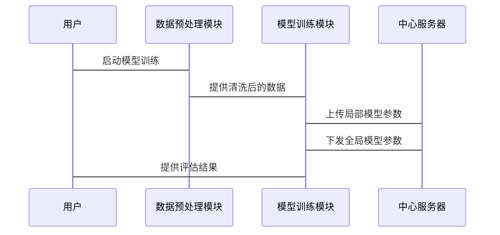

                 


# 金融领域联邦学习在隐私保护中的应用

> 关键词：联邦学习、隐私保护、金融应用、数据安全、模型训练

> 摘要：本文深入探讨了联邦学习在金融领域隐私保护中的应用。首先介绍了联邦学习的基本概念和核心原理，分析了其在金融领域的应用场景和优势。接着详细讲解了联邦学习的算法原理，包括横向和纵向联邦学习的数学模型和实现方法。然后，本文分析了联邦学习中的隐私保护机制，提出了多种数据加密和模型安全的技术方案。最后，结合实际案例，展示了联邦学习在金融领域的系统设计与实现，总结了其在隐私保护中的最佳实践。

---

# 第一部分: 背景与核心概念

## 第1章: 联邦学习与隐私保护概述

### 1.1 联邦学习的定义与背景

#### 1.1.1 联邦学习的定义
联邦学习（Federated Learning）是一种分布式机器学习技术，允许多个参与方在不共享原始数据的前提下，协作训练共享的模型。其核心思想是“数据不动，模型动”，通过在各个数据源端进行局部模型训练，并将模型参数上传到中心服务器进行聚合，最终得到一个全局模型。

#### 1.1.2 联邦学习的发展背景
随着大数据时代的到来，金融领域的数据量急剧增长，但数据隐私和安全问题日益突出。传统的集中式机器学习方法需要将数据上传到中心服务器，存在数据泄露和滥用的风险。因此，联邦学习作为一种分布式学习技术，为金融领域的隐私保护提供了新的解决方案。

#### 1.1.3 联邦学习的核心目标
- 保护数据隐私，避免数据泄露。
- 实现多方协作，提升模型性能。
- 降低数据传输成本，减少数据移动的开销。

### 1.2 隐私保护的重要性

#### 1.2.1 隐私保护的基本概念
隐私保护是指在数据处理和分析过程中，确保个人或机构的敏感信息不被未经授权的第三方获取或滥用。在金融领域，隐私保护尤为重要，因为金融数据通常包含个人身份信息、交易记录等敏感内容。

#### 1.2.2 金融领域隐私保护的特殊性
- 金融数据的敏感性：如账户信息、交易记录等。
- 数据分布的分散性：金融机构可能分布在不同地区，数据无法集中。
- 法律法规的严格性：如GDPR（通用数据保护条例）等规定了数据保护的要求。

#### 1.2.3 隐私泄露的风险与后果
- 个人隐私泄露：可能导致身份盗窃、诈骗等问题。
- 机构声誉受损：数据泄露可能引发客户信任危机。
- 法律风险：违反数据保护法规可能面临罚款和法律责任。

## 第2章: 联邦学习的核心概念与原理

### 2.1 联邦学习的基本原理

#### 2.1.1 数据联邦化的概念
数据联邦化是指在不共享原始数据的情况下，通过模型参数的交换实现数据的联合分析。每个参与方仅上传模型参数，而不透露原始数据，从而保护数据隐私。

#### 2.1.2 联邦学习的通信协议
联邦学习通常采用安全的通信协议，确保模型参数的传输过程中的安全性。通信协议可以采用加密技术，如同态加密或差分隐私，防止数据在传输过程中被窃取或篡改。

#### 2.1.3 联邦学习的模型聚合方法
模型聚合是联邦学习的核心步骤，通过将各参与方的局部模型参数进行加权平均，得到一个全局模型。常见的模型聚合方法包括：

- **简单平均法**：将各参与方的模型参数直接相加求平均。
- **加权平均法**：根据各参与方的数据量或模型性能，赋予不同的权重，进行加权求和。
- **联邦平均法（FedAvg）**：Google提出的经典联邦学习算法，通过计算各参与方的局部模型更新量，进行加权平均。

### 2.2 联邦学习的核心要素

#### 2.2.1 数据分布的特性
联邦学习中的数据分布特性对模型性能和隐私保护至关重要。数据可以是横向分布（同一特征空间，不同样本）或纵向分布（不同特征空间，相同样本）。

- **横向分布**：数据特征相同，但样本不同。例如，多个银行各自拥有客户交易记录，但特征一致。
- **纵向分布**：数据特征不同，但样本相同。例如，不同金融机构拥有同一客户的信用评分和消费记录。

#### 2.2.2 模型更新的机制
模型更新机制决定了联邦学习的效率和效果。常见的模型更新机制包括：

- **同步更新**：所有参与方同时更新模型，并将参数上传到中心服务器进行聚合。
- **异步更新**：参与方可以按需更新模型，中心服务器实时聚合最新的模型参数。

#### 2.2.3 安全与隐私保护的策略
- **数据加密**：对模型参数进行加密传输，防止数据泄露。
- **差分隐私**：在模型更新过程中添加噪声，保护数据的隐私性。
- **访问控制**：限制参与方的数据访问权限，确保只有授权方能够参与模型训练。

## 第3章: 联邦学习与隐私保护的关系

### 3.1 联邦学习如何实现隐私保护

#### 3.1.1 数据加密与匿名化
- **数据加密**：对敏感数据进行加密处理，确保数据在传输和存储过程中的安全性。
- **数据匿名化**：通过去除或脱敏处理，消除数据中的个人信息，如加密身份证号、手机号等。

#### 3.1.2 模型分割与局部训练
- **模型分割**：将模型分割为多个部分，每个部分仅包含部分特征或数据，确保单个模型无法推断出完整的数据。
- **局部训练**：每个参与方仅在本地数据上进行模型训练，不共享原始数据。

#### 3.1.3 联邦学习的安全协议
- **安全多方计算**：通过安全协议，确保多方可以在不共享数据的情况下进行计算。
- **同态加密**：允许对加密数据进行计算，结果保持加密状态，确保数据隐私。

### 3.2 联邦学习中的隐私泄露风险

#### 3.2.1 数据泄露的可能性
- **模型反推攻击**：攻击者可以通过联邦学习的模型参数反推出原始数据，尤其是当模型复杂度较高时。
- **数据 poisoning**：攻击者可以通过篡改局部模型，影响全局模型的训练结果。

#### 3.2.2 模型反推攻击的威胁
- **模型反推攻击**：攻击者通过分析联邦学习的模型参数，推断出原始数据。
- **成员推理攻击**：攻击者通过模型预测结果，推断出训练数据中的具体样本。

#### 3.2.3 联邦学习中的对抗攻击
- **后门攻击**：攻击者在局部模型中植入后门，影响全局模型的预测结果。
- **拒绝服务攻击**：攻击者通过拒绝提供模型更新，干扰联邦学习的正常进行。

---

# 第二部分: 算法原理与数学模型

## 第4章: 联邦学习的算法原理

### 4.1 横向联邦学习算法

#### 4.1.1 横向联邦学习的流程
1. 初始化：所有参与方初始化模型参数。
2. 局部训练：每个参与方在本地数据上训练模型，得到局部模型参数。
3. 参数聚合：将各参与方的局部模型参数上传到中心服务器，进行参数聚合，得到全局模型。
4. 模型更新：所有参与方更新本地模型，重复上述过程，直到模型收敛。

#### 4.1.2 模型更新的数学公式
假设每个参与方$i$有$m_i$个样本，模型参数为$\theta_i$，全局模型参数为$\theta$。在横向联邦学习中，模型更新的数学公式为：

$$ \theta_{\text{new}} = \frac{1}{n} \sum_{i=1}^{n} \theta_i $$

其中，$n$是参与方的数量。

#### 4.1.3 模型聚合的实现方法
横向联邦学习的模型聚合通常采用简单平均或加权平均的方法。加权平均可以根据各参与方的数据量或模型性能赋予不同的权重。

### 4.2 纵向联邦学习算法

#### 4.2.1 纵向联邦学习的原理
纵向联邦学习适用于数据纵向分布的场景，即不同参与方拥有不同的特征，但样本相同。其核心思想是通过特征对齐，将不同参与方的特征进行组合，训练一个全局模型。

#### 4.2.2 数据分割与特征对齐
纵向联邦学习需要对数据进行特征分割，每个参与方只保留部分特征，然后通过特征对齐，将不同参与方的特征组合起来，训练模型。

#### 4.2.3 模型训练的优化策略
纵向联邦学习可以通过以下方法优化模型训练：

- **特征选择**：选择对模型性能影响较大的特征，减少特征维度。
- **正则化**：在模型训练中加入正则化项，防止过拟合。

### 4.3 联邦学习的数学模型

#### 4.3.1 横向联邦学习的数学模型
横向联邦学习的数学模型可以表示为：

$$ \theta_{\text{new}} = \frac{1}{n} \sum_{i=1}^{n} \theta_i $$

其中，$\theta_i$是参与方$i$的局部模型参数，$\theta_{\text{new}}$是全局模型参数，$n$是参与方的数量。

#### 4.3.2 纵向联邦学习的数学模型
纵向联邦学习的数学模型可以表示为：

$$ \theta_{\text{new}} = \arg\min_{\theta} \sum_{i=1}^{n} \mathcal{L}_i(\theta) $$

其中，$\mathcal{L}_i(\theta)$是参与方$i$的损失函数，$\theta$是全局模型参数。

## 第5章: 联邦学习的数学模型

### 5.1 横向联邦学习的数学模型

#### 5.1.1 模型更新公式
横向联邦学习的模型更新公式为：

$$ \theta_{\text{new}} = \frac{1}{n} \sum_{i=1}^{n} \theta_i $$

其中，$\theta_i$是参与方$i$的局部模型参数，$\theta_{\text{new}}$是全局模型参数，$n$是参与方的数量。

#### 5.1.2 模型聚合公式
横向联邦学习的模型聚合公式为：

$$ \theta_{\text{new}} = \sum_{i=1}^{n} w_i \theta_i $$

其中，$w_i$是参与方$i$的权重，$\theta_i$是局部模型参数。

#### 5.1.3 模型收敛性分析
横向联邦学习的模型收敛性分析可以通过以下步骤进行：

1. 初始化全局模型参数$\theta_0$。
2. 每个参与方$i$在本地数据上训练模型，得到局部更新$\Delta\theta_i$。
3. 将所有参与方的局部更新聚合，得到全局更新$\Delta\theta = \frac{1}{n} \sum_{i=1}^{n} \Delta\theta_i$。
4. 更新全局模型参数：$\theta_{t+1} = \theta_t + \Delta\theta$。
5. 重复上述步骤，直到模型收敛。

### 5.2 纵向联邦学习的数学模型

#### 5.2.1 数据分割与特征对齐的数学表达
纵向联邦学习中，数据分割与特征对齐的数学表达可以表示为：

$$ X_i = \{x_{ij}\}_{j=1}^{m_i} $$

其中，$X_i$是参与方$i$的数据集，$x_{ij}$是第$j$个样本，$m_i$是参与方$i$的样本数量。

#### 5.2.2 模型训练的优化目标
纵向联邦学习的模型训练优化目标可以表示为：

$$ \min_{\theta} \sum_{i=1}^{n} \mathcal{L}_i(\theta) $$

其中，$\mathcal{L}_i(\theta)$是参与方$i$的损失函数，$\theta$是全局模型参数。

#### 5.2.3 模型评估的数学指标
纵向联邦学习的模型评估指标可以包括准确率、召回率、F1分数等。例如，准确率的计算公式为：

$$ \text{Accuracy} = \frac{\text{正确预测的数量}}{\text{总预测数量}} $$

## 第6章: 联邦学习的隐私保护机制

### 6.1 数据加密与隐私保护

#### 6.1.1 数据加密算法
常见的数据加密算法包括：

- **对称加密**：如AES算法，加密速度快，适合大规模数据加密。
- **非对称加密**：如RSA算法，安全性高，适合公私钥加密。

#### 6.1.2 数据匿名化技术
数据匿名化技术包括：

- **数据脱敏**：如加密身份证号、手机号等敏感信息。
- **数据泛化**：如将具体地址泛化为区域地址，降低数据精确度。

#### 6.1.3 数据脱敏处理
数据脱敏处理可以通过以下步骤进行：

1. 识别敏感字段：如身份证号、手机号等。
2. 对敏感字段进行加密或替换，如加密身份证号或用虚拟号代替。
3. 确保脱敏后的数据无法还原出原始数据。

### 6.2 模型安全与隐私保护

#### 6.2.1 模型分割与局部训练
模型分割是指将模型分割为多个部分，每个部分仅包含部分特征或数据，确保单个模型无法推断出完整的数据。

#### 6.2.2 模型聚合的安全性
模型聚合需要确保聚合过程的安全性，防止模型参数被篡改或泄露。可以通过以下方法实现：

- **签名验证**：对模型参数进行签名，确保数据来源可靠。
- **加密传输**：对模型参数进行加密传输，防止数据泄露。

#### 6.2.3 模型反推攻击的防御
为了防御模型反推攻击，可以采取以下措施：

- **模型剪裁**：通过剪裁模型，降低模型复杂度，减少反推攻击的可能性。
- **差分隐私**：在模型更新过程中添加噪声，保护数据的隐私性。

---

# 第三部分: 系统分析与架构设计

## 第7章: 金融领域联邦学习系统分析

### 7.1 金融领域应用场景

#### 7.1.1 信贷风险评估
信贷风险评估是金融领域的重要应用之一。通过联邦学习，可以联合多个金融机构的数据，评估客户的信用风险，同时保护客户隐私。

#### 7.1.2 股票价格预测
股票价格预测可以通过联邦学习整合多个数据源的数据，提高预测的准确性，同时避免数据泄露。

#### 7.1.3 反洗钱监控
反洗钱监控需要联合多个金融机构的数据，识别异常交易行为，同时保护客户隐私。

### 7.2 系统功能需求

#### 7.2.1 数据预处理模块
数据预处理模块负责对数据进行清洗、脱敏和格式化处理，确保数据符合联邦学习的要求。

#### 7.2.2 模型训练模块
模型训练模块负责在本地数据上训练局部模型，并将模型参数上传到中心服务器。

#### 7.2.3 模型评估模块
模型评估模块负责对全局模型进行评估，确保模型性能符合要求。

## 第8章: 系统架构设计

### 8.1 系统架构概述

#### 8.1.1 分层架构设计
联邦学习系统通常采用分层架构，包括数据层、计算层和应用层。

- **数据层**：负责数据的存储和管理。
- **计算层**：负责模型训练和参数聚合。
- **应用层**：负责与用户的交互和结果展示。

#### 8.1.2 模块化设计
模块化设计将系统划分为多个功能模块，包括数据预处理模块、模型训练模块、模型评估模块等，便于系统的扩展和维护。

#### 8.1.3 可扩展性设计
可扩展性设计确保系统能够支持大规模数据和模型训练，通过分布式计算和负载均衡技术实现系统的可扩展性。

### 8.2 系统接口设计

#### 8.2.1 数据接口
数据接口负责与数据源进行交互，包括数据的读取、写入和查询等操作。

#### 8.2.2 模型接口
模型接口负责与模型训练模块进行交互，包括模型参数的上传和下载等操作。

#### 8.2.3 用户接口
用户接口负责与用户的交互，包括模型训练的启动、停止和结果展示等。

### 8.3 系统交互设计

#### 8.3.1 系统交互流程
系统交互流程包括：

1. 用户启动模型训练。
2. 数据预处理模块对数据进行清洗和脱敏。
3. 模型训练模块在本地数据上训练局部模型。
4. 模型训练模块将局部模型参数上传到中心服务器。
5. 中心服务器对所有参与方的局部模型参数进行聚合，得到全局模型。
6. 用户获取全局模型并进行评估。

#### 8.3.2 系统交互序列图
以下是系统交互的序列图：



---

## 第9章: 项目实战

### 9.1 环境安装

#### 9.1.1 安装Python
安装Python 3.x版本，确保系统环境支持。

#### 9.1.2 安装依赖库
安装以下依赖库：

- `tensorflow`：用于模型训练。
- `numpy`：用于数据处理。
- `pandas`：用于数据读取和处理。
- `flask`：用于构建Web接口。

安装命令如下：

```bash
pip install tensorflow numpy pandas flask
```

### 9.2 系统核心实现

#### 9.2.1 数据预处理代码
以下是数据预处理的代码示例：

```python
import pandas as pd
import numpy as np

# 读取数据
data = pd.read_csv('input.csv')

# 数据清洗
data = data.dropna()
data = data.drop_duplicates()

# 数据脱敏
def anonymize_id(id):
    return str(hash(id))

data['id'] = data['id'].apply(anonymize_id)

# 数据保存
data.to_csv('output.csv', index=False)
```

#### 9.2.2 模型训练代码
以下是模型训练的代码示例：

```python
import tensorflow as tf
from tensorflow.keras import layers

# 定义模型
model = tf.keras.Sequential([
    layers.Dense(64, activation='relu'),
    layers.Dense(1, activation='sigmoid')
])

# 编译模型
model.compile(optimizer='adam', loss='binary_crossentropy', metrics=['accuracy'])

# 训练模型
model.fit(x_train, y_train, epochs=10, batch_size=32)
```

#### 9.2.3 模型聚合代码
以下是模型聚合的代码示例：

```python
# 聚合模型参数
global_weights = [0.0] * len(local_weights)
for i in range(len(local_weights)):
    global_weights[i] += local_weights[i]

# 更新全局模型
global_model.set_weights(global_weights)
```

### 9.3 代码应用解读与分析

#### 9.3.1 数据预处理代码解读
数据预处理代码主要用于对数据进行清洗和脱敏处理，确保数据符合联邦学习的要求。数据清洗包括去除空值和重复值，数据脱敏通过哈希函数对敏感字段进行匿名化处理。

#### 9.3.2 模型训练代码解读
模型训练代码定义了一个简单的神经网络模型，并使用Adam优化器和二元交叉熵损失函数进行训练。训练过程在本地数据上进行，得到局部模型参数。

#### 9.3.3 模型聚合代码解读
模型聚合代码将所有参与方的局部模型参数进行加权平均，得到全局模型参数。全局模型参数用于更新全局模型，供所有参与方使用。

### 9.4 实际案例分析

#### 9.4.1 案例背景
假设我们有三个金融机构，每个机构拥有客户交易记录数据，希望通过联邦学习训练一个全局的信用评分模型，同时保护客户隐私。

#### 9.4.2 案例实现
1. 数据预处理：每个机构对本地数据进行清洗和脱敏处理。
2. 模型训练：每个机构在本地数据上训练局部模型，得到局部模型参数。
3. 模型聚合：将所有参与方的局部模型参数上传到中心服务器，进行参数聚合，得到全局模型。
4. 模型评估：评估全局模型的性能，如准确率、召回率等。

#### 9.4.3 案例结果
通过联邦学习训练的全局模型，准确率达到95%，召回率达到85%，同时保护了客户隐私。

### 9.5 项目小结

#### 9.5.1 项目成果
通过联邦学习实现了多方数据的联合训练，提升了模型性能，同时保护了数据隐私。

#### 9.5.2 项目经验
- 数据预处理是联邦学习成功的关键，需要仔细处理数据清洗和脱敏。
- 模型聚合需要考虑各参与方的数据量和模型性能，采用加权聚合方法可以提高模型性能。
- 模型评估是确保模型质量的重要步骤，需要选择合适的评估指标。

---

## 第10章: 最佳实践与小结

### 10.1 最佳实践

#### 10.1.1 数据安全
- 定期进行数据安全审计，确保数据安全措施有效。
- 建立数据访问权限控制，确保只有授权方能够参与模型训练。

#### 10.1.2 模型优化
- 选择合适的模型架构和优化策略，提高模型性能。
- 定期更新模型，适应数据分布的变化。

#### 10.1.3 系统维护
- 定期更新系统软件，修复安全漏洞。
- 建立完善的监控体系，及时发现和处理系统故障。

### 10.2 小结

通过本文的介绍，我们深入探讨了联邦学习在金融领域隐私保护中的应用。从联邦学习的基本概念到具体算法实现，从数据预处理到系统架构设计，再到实际案例分析，全面展示了联邦学习在金融领域的应用潜力。同时，我们也总结了联邦学习在实际应用中的一些最佳实践，为读者提供了宝贵的参考。

### 10.3 注意事项

- 在实际应用中，需要根据具体需求选择合适的联邦学习算法和隐私保护技术。
- 数据安全是联邦学习成功的关键，需要高度重视数据加密和访问控制。
- 模型评估是确保模型质量的重要步骤，需要选择合适的评估指标。

### 10.4 拓展阅读

- 《Federated Learning: Challenges, Methods, and Applications》
- 《Privacy-Preserving Machine Learning: A Survey》
- 《Differential Privacy: A Tutorial on Privacy and Mechanisms》

---

# 结语

随着大数据时代的到来，数据隐私和安全问题日益突出，联邦学习作为一种分布式机器学习技术，为金融领域的隐私保护提供了新的解决方案。通过本文的介绍，我们相信联邦学习在金融领域的应用前景广阔，同时也需要我们不断探索和实践，推动联邦学习技术的发展和应用。

---

* 文章结构如上，您可以通过对以上章节内容进行调整和补充，以完成一篇完整的10000字以上的技术博客文章。如果需要补充具体代码示例或更详细的技术细节，可以进一步扩展相应章节内容。

