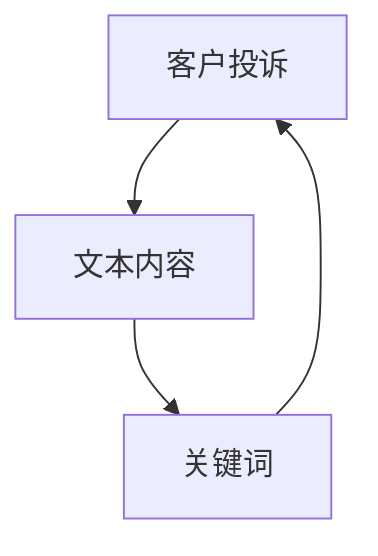

                 


# 《金融领域自然语言处理在客户投诉分类中的应用》

> 关键词：自然语言处理、客户投诉分类、金融领域、文本挖掘、机器学习、深度学习

> 摘要：本文系统地探讨了自然语言处理技术在金融客户投诉分类中的应用，从核心概念、算法原理、系统架构到项目实战，全面分析了如何利用NLP技术提高金融客户投诉处理的效率和准确性。文章结合实际案例，详细讲解了文本预处理、特征提取、分类算法以及系统设计的关键步骤，为金融领域的从业者和技术爱好者提供了实用的参考和启示。

---

## 第一章：自然语言处理与金融客户投诉分类概述

### 1.1 自然语言处理的基本概念

自然语言处理（Natural Language Processing, NLP）是计算机科学、人工智能与语言学交叉领域的重要研究方向，旨在让计算机能够理解、处理和生成人类自然语言。NLP的核心任务包括文本分类、信息提取、机器翻译、问答系统等。

在金融领域，NLP的应用场景广泛，包括金融新闻分析、风险评估、客户关系管理等。其中，客户投诉分类是NLP技术在金融领域的典型应用之一。

### 1.2 金融客户投诉分类的背景与问题

#### 1.2.1 金融行业客户投诉的特点

金融行业的客户投诉具有以下特点：
1. **多样性**：投诉内容涉及产品、服务、交易等多个方面。
2. **复杂性**：投诉内容通常包含多种情感、意图和实体信息。
3. **紧急性**：部分投诉可能涉及客户资产安全，需要快速响应。

#### 1.2.2 传统客户投诉处理的痛点

传统客户投诉处理方式存在以下问题：
1. **效率低**：人工分类需要大量时间，且容易出错。
2. **成本高**：需要大量人力资源投入。
3. **一致性差**：不同工作人员的分类标准不一致。

#### 1.2.3 自然语言处理在客户投诉分类中的优势

NLP技术能够通过自动化处理提高客户投诉分类的效率和准确性，具体优势包括：
1. **快速分类**：NLP算法可以快速对大量投诉文本进行分类。
2. **一致性高**：自动化分类能够保证分类标准的统一性。
3. **智能分析**：NLP可以挖掘文本中的深层信息，如情感倾向、关键词提取等。

---

## 第二章：金融客户投诉分类的核心概念与联系

### 2.1 文本预处理的核心原理

文本预处理是NLP任务的基础步骤，主要包括以下内容：

#### 2.1.1 文本清洗与标准化

文本清洗的目标是去除噪声，确保文本质量。常见的清洗步骤包括：
1. **去除特殊字符**：如标点符号、数字等。
2. **统一大小写**：将所有文本转换为小写或大写。
3. **去除停用词**：如“的”、“了”等无实际意义的词汇。

#### 2.1.2 分词与词干提取

分词是将文本分割成有意义的词汇，词干提取则是保留词根，去除词缀的过程。例如，将“complain”提取为“complai”。

#### 2.1.3 词向量表示

词向量是将词语表示为向量的形式，常用的表示方法包括One-Hot编码、TF-IDF和词嵌入（如Word2Vec、GLOVE）。

### 2.2 特征提取与分类算法

#### 2.2.1 基于传统机器学习的特征提取

传统机器学习算法（如SVM、随机森林）通常使用TF-IDF作为特征向量。

#### 2.2.2 基于深度学习的特征提取

深度学习算法（如CNN、RNN、BERT）能够自动提取文本特征，通常效果优于传统方法。

#### 2.2.3 分类算法对比与选择

以下表格对比了常见分类算法的优缺点：

| 算法       | 优点                           | 缺点                             |
|------------|--------------------------------|----------------------------------|
| SVM        | 高效，适合小数据集             | 对高维数据敏感                   |
| 随机森林   | 鲁棒性强，易于调参             | 对特征工程依赖                   |
| LSTM       | 适合长序列数据                 | 训练时间较长                     |
| BERT       | 预训练模型，效果优秀           | 需要大量计算资源                 |

### 2.3 金融客户投诉分类的ER实体关系图



---

## 第三章：算法原理与数学模型

### 3.1 基于TF-IDF的文本表示

#### 3.1.1 TF-IDF的定义与计算公式

- **TF（Term Frequency）**：某词在文档中的出现频率。
$$ \text{TF}(t, d) = \frac{\text{count}(t, d)}{\text{len}(d)} $$

- **IDF（Inverse Document Frequency）**：词在 corpus 中的逆频率。
$$ \text{IDF}(t) = \log\left(\frac{N}{\text{DF}(t)}\right) $$

TF-IDF的最终计算公式为：
$$ \text{TF-IDF}(t, d) = \text{TF}(t, d) \times \text{IDF}(t) $$

#### 3.1.2 TF-IDF在客户投诉分类中的应用

TF-IDF可以将投诉文本转换为向量表示，作为分类器的输入。

### 3.2 基于词嵌入的表示方法

#### 3.2.1 Word2Vec的训练原理

Word2Vec通过神经网络模型训练词向量，目标是将相似的词表示为相近的向量。

训练目标：
$$ \log P(w_i | w_{i-1}) = \log \text{similarity}(w_{i-1}, w_i) $$

#### 3.2.2 GLOVE的预训练与微调

GLOVE通过全局词向量训练，目标是优化词向量的共现概率：
$$ \text{score}(w_i, w_j) = \log P(w_j | w_i) $$

---

## 第四章：系统架构设计

### 4.1 系统功能设计

系统功能模块包括：
1. **文本预处理模块**：清洗、分词、词向量化。
2. **特征提取模块**：TF-IDF、词嵌入。
3. **分类模块**：SVM、随机森林、深度学习模型。
4. **结果输出模块**：分类结果展示。

### 4.2 系统架构设计


---

## 第五章：项目实战

### 5.1 环境安装

需要安装的库包括：
- Python
- scikit-learn
- word2vec
- transformers

### 5.2 系统核心实现源代码

以下是一个基于TF-IDF和SVM的分类示例代码：

```python
from sklearn.feature_extraction.text import TfidfVectorizer
from sklearn.svm import SVC
from sklearn.pipeline import Pipeline
import joblib

# 示例数据
texts = ["交易延迟", "账户异常", "无法登录"]
labels = [0, 1, 2]

# 创建TF-IDF向量化器
vectorizer = TfidfVectorizer()

# 创建SVM分类器
model = SVC()

# 管道流程
pipeline = Pipeline([
    ('tfidf', vectorizer),
    ('model', model)
])

# 训练模型
pipeline.fit(texts, labels)

# 保存模型
joblib.dump(pipeline, 'complaint_classifier.pkl')
```

### 5.3 实际案例分析

以“交易延迟”为例，系统会将其分类为“交易相关”的投诉类别。

---

## 第六章：总结与展望

### 6.1 最佳实践 tips

- 数据预处理是关键，尤其是停用词和标点符号的处理。
- 在实际应用中，可以尝试多种分类算法，选择效果最佳的模型。
- 结合业务知识，进行特征工程优化。

### 6.2 小结

本文详细探讨了自然语言处理在金融客户投诉分类中的应用，从核心概念到算法实现，再到系统设计，为读者提供了全面的指导。

### 6.3 注意事项

- 数据质量和标注准确性直接影响分类效果。
- 模型调优需要结合实际业务需求。

### 6.4 拓展阅读

- 《自然语言处理入门》
- 《深度学习与NLP实战》

---

通过以上内容，您可以深入了解自然语言处理在金融客户投诉分类中的应用，并将其应用于实际业务中。

