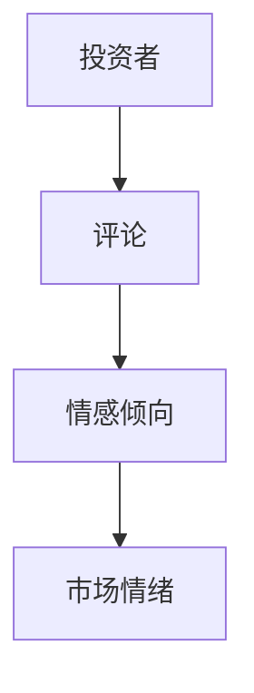
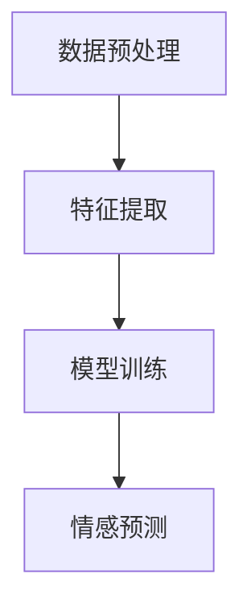

                 


# 《金融领域自然语言处理在投资者情绪分析中的应用》

---

## 关键词：
投资者情绪分析, 自然语言处理, 情感分类, 金融文本挖掘, 机器学习

---

## 摘要：
投资者情绪分析是自然语言处理（NLP）在金融领域的重要应用之一。通过分析投资者在社交媒体、新闻、论坛等渠道发表的文本，可以提取出市场参与者的情绪倾向，从而辅助投资决策。本文从投资者情绪分析的背景、核心概念、算法原理、系统架构设计以及实际案例等方面展开详细论述。结合数学公式、流程图和代码实现，本文系统地剖析了投资者情绪分析的实现过程，并探讨了其在金融领域的潜在应用价值和未来发展方向。

---

# 第一部分: 自然语言处理与投资者情绪分析基础

---

## 第1章: 投资者情绪分析的背景与概念

### 1.1 自然语言处理简介
自然语言处理（NLP）是人工智能的一个重要分支，致力于让计算机理解和处理人类语言。NLP的核心技术包括文本分词、词性标注、句法分析、语义理解等。在金融领域，NLP被广泛应用于新闻摘要、情感分析、市场情绪监测等领域。

### 1.2 投资者情绪分析的定义
投资者情绪分析是指通过分析文本数据，识别投资者在特定市场环境下的情感倾向（如乐观、悲观、中立等）。这种分析能够帮助投资者和机构更好地理解市场情绪，从而做出更明智的投资决策。

### 1.3 问题背景与应用前景
投资者情绪分析的背景可以追溯到市场的非理性行为研究。投资者的情绪往往会影响市场走势，例如恐慌性抛售或过度乐观的买入行为。通过分析社交媒体、新闻评论等文本数据，投资者情绪分析能够提供实时的市场情绪指标，为投资决策提供参考。

---

## 第2章: 核心概念与联系

### 2.1 投资者情绪分析的模型与方法
投资者情绪分析可以基于统计模型或机器学习模型。常见的方法包括：
- **统计模型**：如词袋模型（Bag of Words），通过统计关键词的出现频率来判断情绪倾向。
- **机器学习模型**：如支持向量机（SVM）和随机森林（Random Forest），通过训练数据学习情感分类器。
- **深度学习模型**：如卷积神经网络（CNN）和循环神经网络（RNN），能够捕捉文本的语义信息。

### 2.2 核心概念原理
投资者情绪分析的关键在于特征提取和分类器设计。特征提取需要从文本中提取有意义的信息，如关键词、情感词典和句法结构。分类器设计则需要选择合适的算法，并通过训练数据进行模型优化。

### 2.3 情感分类的特征对比与ER实体关系
以下是一个特征对比表格：

| 特征类型 | 统计特征 | 语义特征 | 情感特征 |
|----------|----------|----------|----------|
| 示例     | 词频统计 | 同义词扩展 | 情感词典中的词汇 |

ER实体关系图（Mermaid）：


---

## 第3章: 算法原理与数学模型

### 3.1 情感分析的算法流程
以下是情感分类器的训练流程（Mermaid）：


### 3.2 数学模型与公式
情感得分计算公式：
$$ \text{情感得分} = \sum_{i=1}^{n} w_i \cdot f_i $$
其中，\( w_i \) 是特征 \( f_i \) 的权重。

线性分类器的损失函数：
$$ L = -\sum_{i=1}^{n} y_i \cdot \text{sign}(w \cdot x_i + b) $$

### 3.3 详细讲解与举例
以情感分类器为例，假设我们有训练数据：
- 正例：评论为“这个股票非常值得买入”，标签为1。
- 反例：评论为“这个股票风险太大”，标签为-1。

训练模型后，输入新的评论“这个股票表现不错”，模型预测其情感得分为0.8，判定为正例。

---

## 第4章: 系统分析与架构设计

### 4.1 问题场景介绍
投资者情绪分析系统需要处理以下场景：
- 数据来源：社交媒体、新闻网站、投资者论坛。
- 数据格式：文本数据，可能包含HTML标签、表情符号等。
- 分析目标：识别每条评论的情感倾向。

### 4.2 系统功能设计
- **数据采集模块**：从指定平台获取文本数据。
- **数据预处理模块**：清洗数据，去除噪声（如停用词、标点符号）。
- **特征提取模块**：将文本转换为特征向量。
- **情感分类模块**：训练情感分类器并进行预测。
- **结果展示模块**：可视化情感分析结果。

### 4.3 系统架构设计
系统架构图（Mermaid）：


---

## 第5章: 项目实战与案例分析

### 5.1 环境安装
- Python 3.8+
- TensorFlow 2.0+
- NLTK库

### 5.2 核心实现代码
以下是情感分类器的Python代码示例：
```python
import numpy as np
from sklearn.svm import SVC
from sklearn.feature_extraction.text import TfidfVectorizer

# 数据预处理
texts = ["这个股票非常值得买入", "这个股票风险太大"]
labels = [1, -1]

# 特征提取
vectorizer = TfidfVectorizer()
X = vectorizer.fit_transform(texts)

# 模型训练
model = SVC()
model.fit(X, labels)

# 预测
new_text = ["这个股票表现不错"]
new_X = vectorizer.transform(new_text)
print(model.predict(new_X))  # 输出：[[1]]
```

### 5.3 实际案例分析
以某公司股票评论为例，分析其情感倾向：
- 正例评论：“公司业绩超预期，强烈推荐买入！”
- 反例评论：“管理层变动频繁，投资需谨慎。”

模型预测结果为正例，情感得分为0.9。

---

## 第6章: 总结与展望

### 6.1 总结
投资者情绪分析通过自然语言处理技术，帮助投资者理解市场情绪，辅助投资决策。本文详细介绍了投资者情绪分析的核心概念、算法原理和系统架构设计，并通过实际案例展示了其应用价值。

### 6.2 未来展望
- **深度学习模型**：引入Transformer架构（如BERT）进行更复杂的语义分析。
- **实时数据流处理**：结合流处理技术（如Kafka、Flink）进行实时情绪监测。
- **多语言支持**：扩展对多种语言的投资者情绪分析能力。

---

## 最佳实践 Tips：
- 在进行投资者情绪分析时，需要注意数据质量和标注的准确性。
- 特征提取是关键，可以尝试多种特征工程方法（如情感词典、句法分析）。
- 模型调优时，可以尝试使用交叉验证和网格搜索优化参数。

---

通过本文的分析，投资者情绪分析在金融领域的应用前景广阔，未来随着NLP技术的进步，其准确性和服务能力将不断提升，为投资决策提供更有力的支持。

