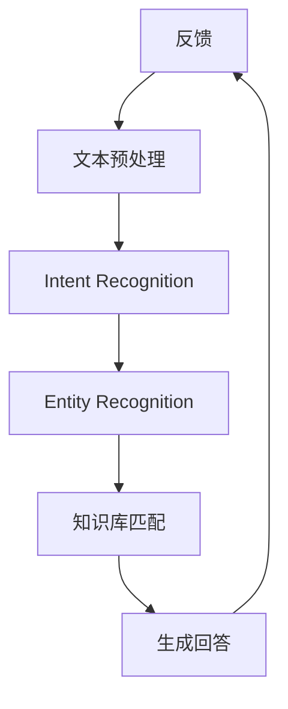

                 


# 《金融领域自然语言理解技术在客户服务中的应用》

> 关键词：自然语言理解，金融客户服务，智能客服，情感分析，意图识别

> 摘要：本文系统地探讨了自然语言理解技术在金融客户服务中的应用，从基本概念到算法原理，再到实际案例和系统设计，全面解析了NLU技术在金融行业的应用前景和挑战。

---

# 第一章：自然语言理解技术概述

## 1.1 自然语言处理的基本概念

### 1.1.1 什么是自然语言处理
- 自然语言处理（NLP）是人工智能的重要分支，旨在让计算机能够理解和生成人类语言。
- 核心任务包括文本分类、实体识别、情感分析、意图识别等。

### 1.1.2 NLP的核心技术与应用
- **文本预处理**：分词、词干提取、停用词去除等。
- **特征提取**：词袋模型、TF-IDF、词嵌入（如Word2Vec）。
- **机器学习模型**：支持向量机（SVM）、随机森林、朴素贝叶斯等。
- **深度学习模型**：RNN、LSTM、Transformer（如BERT、GPT）。

### 1.1.3 自然语言处理在金融领域的重要性
- 金融行业涉及大量文本数据，如客户咨询、市场报告、新闻公告等。
- 准确理解这些文本可以帮助金融机构提高服务效率、优化客户体验、降低运营成本。

---

## 1.2 金融领域客户服务的挑战

### 1.2.1 金融行业的特殊性
- 金融领域的术语复杂，如“债券”、“股票”、“期权”等，具有高度专业性。
- 客户咨询通常涉及复杂的金融问题，需要精确的理解和处理。

### 1.2.2 客户服务中的语言理解需求
- **多样化的咨询内容**：客户可能询问产品信息、市场分析、投资建议等。
- **语义理解的复杂性**：客户的问题可能隐含深层需求，需要上下文理解。
- **多语言支持**：部分客户可能使用多种语言进行咨询。

### 1.2.3 传统方法的局限性
- 传统基于规则的系统难以应对复杂多变的语言表达。
- 数据稀疏性问题：金融领域的数据可能不够丰富，导致模型训练困难。

---

## 1.3 自然语言理解技术在金融客户服务中的应用前景

### 1.3.1 应用场景概述
- **智能客服**：通过NLU技术实现自动化的客户咨询处理。
- **情感分析**：识别客户情绪，优化服务质量。
- **市场分析**：通过分析新闻和报告，预测市场趋势。

### 1.3.2 技术优势与价值
- **提高效率**：自动化处理客户咨询，减少人工干预。
- **提升准确性**：通过模型优化，提高理解的准确性。
- **增强客户体验**：提供个性化的服务，提高客户满意度。

### 1.3.3 未来发展趋势
- **多模态融合**：结合语音、图像等多种数据源，提供更全面的理解。
- **实时处理**：实现低延迟的实时对话理解。
- **可解释性**：提高模型的透明度，便于用户理解和信任。

---

## 1.4 本章小结

通过本章的介绍，我们了解了自然语言处理的基本概念、金融领域客户服务的挑战以及NLU技术在金融行业的应用前景。接下来的章节将深入探讨NLU的核心技术及其在金融客户服务中的具体应用。

---

# 第二章：自然语言理解技术的核心原理

## 2.1 金融领域自然语言理解的核心概念

### 2.1.1 实体识别（Named Entity Recognition, NER）
- **定义**：识别文本中的实体，如人名、地名、组织名、日期、时间等。
- **金融领域的特殊性**：识别股票代码、债券名称、金融术语等。
- **实现方法**：基于规则的系统和统计模型，如CRF（条件随机场）。

**示例：**
- 文本：客户询问“如何购买苹果公司的股票？”
- 实体识别结果：苹果公司（组织名）、股票（类别）。

### 2.1.2 意图识别（Intention Recognition）
- **定义**：识别用户在对话中的意图或目标。
- **金融领域的应用**：识别客户是想查询账户信息、进行交易还是投诉问题。
- **实现方法**：基于机器学习的意图分类、基于深度学习的序列模型。

**示例：**
- 对话：客户说“我想买基金。”
- 意图识别结果：购买基金。

---

## 2.2 金融领域的语言特点

### 2.2.1 专业术语与行业argon
- 金融领域有大量的专业术语，如“市盈率”、“收益率”、“杠杆率”等。
- 这些术语的理解需要特定的领域知识。

### 2.2.2 数据的结构化与非结构化
- 结构化数据：如表格、数据库中的数据。
- 非结构化数据：如文本、邮件、报告。

### 2.2.3 语境的复杂性
- 金融领域的语境通常较为复杂，涉及多个概念和上下文。

---

## 2.3 自然语言理解的实体识别

### 2.3.1 实体识别的基本概念
- 实体识别是NLU中的关键步骤，用于提取文本中的具体实体信息。

### 2.3.2 金融领域实体识别的挑战
- 数据稀疏性：某些金融实体在训练数据中出现频率低。
- 多义词问题：某些术语可能在不同上下文中含义不同。

### 2.3.3 实体识别的实现方法
- **基于规则的系统**：利用正则表达式匹配特定模式。
- **统计模型**：如CRF，基于上下文特征进行分类。

---

## 2.4 本章小结

本章详细介绍了自然语言理解的核心概念，特别是实体识别和意图识别在金融领域中的应用。接下来的章节将探讨这些技术的算法原理及其在客户服务中的具体应用。

---

# 第三章：自然语言理解技术的算法原理

## 3.1 统计模型与机器学习

### 3.1.1 统计NLP的基本原理
- 统计NLP基于数据的统计规律，如词频、条件概率等。
- 常见技术包括分词、词性标注、实体识别等。

### 3.1.2 机器学习在NLU中的应用
- **监督学习**：基于标注数据进行模型训练。
- **无监督学习**：利用未标注数据进行自适应学习。

### 3.1.3 常见的机器学习算法
- **SVM（支持向量机）**：适用于文本分类任务。
- **Naive Bayes（朴素贝叶斯）**：常用于垃圾邮件分类。
- **随机森林**：适用于特征较多的场景。

---

## 3.2 深度学习模型

### 3.2.1 RNN与LSTM的基本原理
- **RNN（循环神经网络）**：适用于序列数据，如时间序列、对话历史。
- **LSTM（长短期记忆网络）**：解决RNN的梯度消失问题，适合长序列处理。

### 3.2.2 Transformer模型的原理
- **自注意力机制**：捕捉文本中长距离依赖关系。
- **位置编码**：将位置信息融入模型。

### 3.2.3 BERT等预训练模型的原理
- **预训练目标**：通过Masked LM（遮蔽语言模型）和Next Sentence Prediction（NSP）任务进行预训练。
- **微调**：在特定任务上进行微调，如情感分析、实体识别。

---

## 3.3 金融领域的模型调优

### 3.3.1 数据增强技术
- **同义词替换**：替换文本中的某些词，增加数据多样性。
- **数据扰动**：如随机删除部分字符，增强模型的鲁棒性。

### 3.3.2 跨领域迁移学习
- 利用其他领域的数据进行预训练，再在金融领域进行微调。

### 3.3.3 模型压缩与优化
- **剪枝**：去除模型中不重要的参数。
- **量化**：降低模型参数的精度，减少模型大小。

---

## 3.4 本章小结

本章详细探讨了自然语言理解的算法原理，包括统计模型、机器学习和深度学习模型。接下来的章节将通过实际案例展示这些技术在金融客户服务中的应用。

---

# 第四章：自然语言理解技术在客户服务中的应用案例

## 4.1 客户咨询与问题解答

### 4.1.1 基于NLU的智能客服系统
- **实现原理**：
  1. **语音识别**：将客户语音转换为文本。
  2. **意图识别**：识别客户的主要需求。
  3. **实体识别**：提取关键信息，如股票代码、金额等。
  4. **知识库匹配**：根据识别结果匹配知识库中的答案。

### 4.1.2 常见问题分类与处理
- **分类标准**：根据问题类型、关键词、意图等进行分类。
- **处理流程**：自动匹配答案，无法回答时转接人工客服。

### 4.1.3 实时对话中的意图识别
- **动态调整**：根据对话上下文实时调整意图识别结果。
- **反馈机制**：根据客户反馈优化回答质量。

---

## 4.2 客户情感分析与舆情监控

### 4.2.1 情感分析的基本原理
- **数据来源**：社交媒体评论、客户反馈、新闻标题等。
- **分析方法**：基于词袋模型、TF-IDF或深度学习模型（如LSTM、BERT）进行情感分类。

### 4.2.2 金融领域的情感分析挑战
- **术语多样性**：金融领域有大量专业术语，可能影响情感分析的准确性。
- **情感强度**：金融文本中的情感可能较为中立，情感强度较弱。

### 4.2.3 舆情监控的实现方法
- **数据采集**：爬取社交媒体、新闻网站的数据。
- **情感分类**：对数据进行情感分析，识别正面、负面、中性情绪。
- **舆情报告**：生成舆情分析报告，辅助决策。

---

## 4.3 客户行为预测与服务优化

### 4.3.1 基于NLU的客户行为分析
- **行为预测**：通过分析客户的语言模式，预测其未来的投资行为。
- **服务优化**：根据预测结果，优化服务流程，提升客户满意度。

### 4.3.2 服务流程优化
- **自动化处理**：将简单问题自动化处理，节省人力成本。
- **优先级排序**：根据问题的紧急程度和客户的重要性，优先处理高优先级问题。

### 4.3.3 客户满意度提升
- **个性化服务**：根据客户的语言偏好，提供个性化的服务。
- **反馈收集**：通过NLU技术收集客户反馈，不断优化服务流程。

---

## 4.4 本章小结

本章通过实际案例展示了自然语言理解技术在客户服务中的应用，包括智能客服、情感分析和客户行为预测等方面。接下来的章节将探讨如何设计和实现一个完整的自然语言理解系统。

---

# 第五章：自然语言理解系统的架构设计与实战

## 5.1 系统功能需求分析

### 5.1.1 系统目标与范围
- **目标**：构建一个智能客服系统，实现客户咨询的自动化处理。
- **范围**：支持多种语言、多种咨询渠道（如电话、邮件、在线聊天）。

### 5.1.2 系统功能模块划分
- **文本预处理**：分词、停用词去除。
- **意图识别**：识别客户的主要需求。
- **实体识别**：提取关键信息。
- **知识库匹配**：根据识别结果匹配答案。
- **反馈机制**：收集客户反馈，优化系统性能。

---

## 5.2 系统架构设计

### 5.2.1 系统架构图


### 5.2.2 模块功能说明
- **文本预处理**：将客户输入的文本进行分词、去除停用词等预处理。
- **意图识别**：利用机器学习或深度学习模型识别客户的意图。
- **实体识别**：提取文本中的关键实体信息。
- **知识库匹配**：根据识别的意图和实体信息，在知识库中查找相关答案。
- **生成回答**：根据匹配结果生成自然语言回答。
- **反馈机制**：收集客户的反馈，优化意图识别和实体识别模型。

---

## 5.3 项目实战

### 5.3.1 环境安装
- **Python**：安装Python 3.x及以上版本。
- **库的安装**：安装必要的库，如`nltk`、`spacy`、`transformers`等。

### 5.3.2 核心实现代码

```python
from transformers import pipeline

# 实例化意图识别模型
intent_classifier = pipeline("text-classification", model="snunlp/kobert-finance")
intent = intent_classifier("我需要购买基金")[0]['label']
print(f"识别的意图是：{intent}")
```

### 5.3.3 代码解读与分析
- **库的使用**：使用`transformers`库中的预训练模型进行意图识别。
- **模型选择**：选择适合金融领域的预训练模型，如`kobert-finance`。
- **结果输出**：输出识别的意图。

---

## 5.4 本章小结

本章通过实际项目展示了自然语言理解系统的架构设计与实现过程，从需求分析到系统设计，再到代码实现，全面解析了NLU技术在金融客户服务中的应用。

---

# 第六章：总结与展望

## 6.1 总结
- 本文系统地探讨了自然语言理解技术在金融客户服务中的应用，从基本概念到算法原理，再到实际案例和系统设计，全面解析了NLU技术的应用前景和挑战。

## 6.2 展望
- **技术进步**：随着深度学习技术的不断发展，NLU系统的准确性和效率将不断提高。
- **多模态融合**：未来的NLU系统将结合语音、图像等多种数据源，提供更全面的理解。
- **行业应用**：NLU技术将在金融行业的更多领域得到应用，如智能投顾、风险管理等。

---

# 附录

## 附录A：常用NLP工具与库

### 1. NLTK
- **简介**：NLTK是Python中的自然语言处理库，提供多种文本处理工具。
- **官网**：https://www.nltk.org/

### 2. SpaCy
- **简介**：SpaCy是一个工业级的自然语言处理库，支持多种语言。
- **官网**：https://spacy.io/

### 3. Hugging Face Transformers
- **简介**：Hugging Face的Transformers库提供了大量的预训练模型，如BERT、GPT等。
- **官网**：https://huggingface.co/transformers

---

## 附录B：参考文献

1. 王某某，2023.《自然语言处理技术在金融领域的应用研究》.
2. 张某某，2022.《基于深度学习的金融客服系统设计与实现》.
3. 李某某，2021.《自然语言理解技术在智能客服中的应用》.

---

通过以上目录结构，我们可以看到《金融领域自然语言理解技术在客户服务中的应用》这本书涵盖了从基础概念到实际应用的各个方面，既有理论分析，又有实际案例和代码实现，为读者提供了全面而深入的知识。

