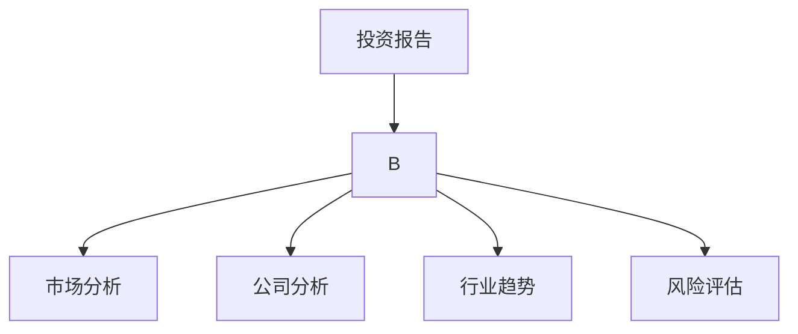
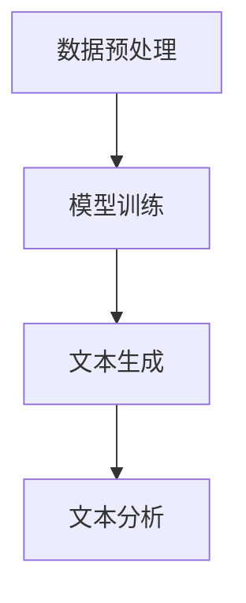
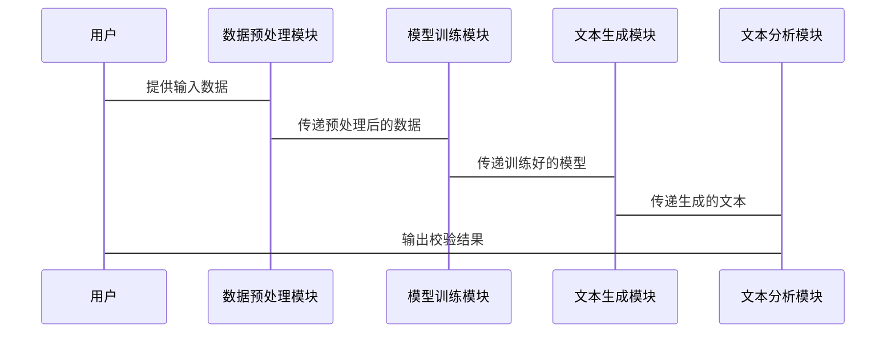

                 


```markdown
# 金融领域自然语言生成在投资报告中的应用

> 关键词：自然语言生成，金融投资，投资报告，生成式模型，GPT，金融数据分析

> 摘要：本文探讨了自然语言生成（NLG）技术在金融领域的应用，特别是投资报告中的潜在价值。通过分析NLG的基本概念、算法原理、系统架构以及实际应用案例，本文旨在为读者提供一个全面的技术视角，了解NLG如何助力金融投资决策的优化与创新。

---

# 第一部分: 金融领域自然语言生成基础

## 第1章: 金融领域自然语言生成概述

### 1.1 自然语言生成的定义与特点

#### 1.1.1 自然语言生成的定义
自然语言生成（Natural Language Generation, NLG）是人工智能领域的一个重要分支，旨在将结构化数据或信息转换为人类可读的自然语言文本。它结合了计算机科学、语言学和认知科学的知识，是实现人机交互和自动化内容生成的关键技术。

#### 1.1.2 自然语言生成的核心特点
- **自动化**：能够自动将数据转换为文本，减少人工干预。
- **个性化**：可以根据用户需求生成定制化内容。
- **高效性**：能够在短时间内生成大量文本内容。
- **适应性**：能够适应不同领域和场景的需求。

#### 1.1.3 自然语言生成与自然语言理解（NLU）的区别
自然语言理解（NLU）是将自然语言文本转换为结构化数据的过程，而自然语言生成（NLG）则是将结构化数据转换为自然语言文本的过程。两者的结合是实现完整的人机交互系统的关键。

### 1.2 金融领域自然语言生成的背景与意义

#### 1.2.1 金融领域的复杂性与信息需求
金融领域涉及大量的数据和复杂的业务逻辑，投资者和分析师需要快速获取、理解和分析信息，以做出明智的投资决策。然而，传统的信息处理方式效率较低，难以满足现代金融市场的快速变化需求。

#### 1.2.2 自然语言生成在金融领域的独特价值
- **提高效率**：NLG能够快速生成投资报告、市场分析等文本，节省时间和成本。
- **增强决策能力**：通过生成结构化的分析文本，帮助投资者更好地理解市场动态。
- **个性化服务**：可以根据不同客户的需求生成定制化的投资建议。

#### 1.2.3 金融领域自然语言生成的现状与发展趋势
当前，金融领域的NLG应用还处于起步阶段，但随着深度学习和大语言模型（如GPT）的发展，NLG技术在金融领域的潜力巨大。未来，NLG将更加智能化、个性化，并与金融数据分析技术深度融合。

### 1.3 投资报告中的自然语言生成应用

#### 1.3.1 投资报告的基本结构与内容
投资报告通常包括市场分析、公司分析、行业趋势、财务数据解读、风险评估等内容。这些内容需要专业的金融知识和数据支持，生成过程复杂且耗时。

#### 1.3.2 自然语言生成在投资报告中的应用场景
- **市场分析**：生成市场趋势分析报告。
- **公司分析**：生成公司财务分析和估值报告。
- **行业趋势**：生成行业动态分析报告。
- **风险评估**：生成风险评估报告。

#### 1.3.3 自然语言生成对投资决策的支持作用
通过NLG生成的投资报告能够帮助投资者快速获取关键信息，提供数据支持和决策参考，从而提高投资决策的准确性和效率。

### 1.4 本章小结
本章介绍了自然语言生成的基本概念、特点以及在金融领域的应用价值。重点分析了投资报告中NLG的应用场景和潜在优势，为后续的技术实现和应用案例分析奠定了基础。

---

## 第2章: 自然语言生成的核心概念与联系

### 2.1 自然语言生成的原理与流程

#### 2.1.1 数据输入与处理
NLG系统通常需要输入结构化数据或半结构化数据。例如，在投资报告中，输入的数据可能包括财务指标、市场数据、公司新闻等。这些数据需要经过清洗、预处理和格式化，以便模型能够有效利用。

#### 2.1.2 模型训练与生成
基于预处理后的数据，NLG模型通过训练生成语言模型，能够理解输入数据的语义信息，并根据上下文生成自然语言文本。生成过程可能涉及多种技术，如基于规则的生成、统计模型生成和基于深度学习的生成。

#### 2.1.3 输出优化与校正
生成的初稿通常需要进行优化和校正，以确保文本的准确性和流畅性。这一步可能包括语法检查、语义优化和内容补充等。

### 2.2 自然语言生成的关键技术

#### 2.2.1 生成式模型（如GPT、BERT等）
生成式模型是当前NLG技术的核心，其中GPT（Generative Pre-trained Transformer）是最常用的模型之一。GPT通过预训练和微调，能够生成高质量的自然语言文本。

#### 2.2.2 基于规则的生成方法
基于规则的生成方法是一种传统的NLG技术，通过定义一系列语言规则和模板，生成符合特定格式的文本。这种方法适用于结构化数据的生成，如财务报告。

#### 2.2.3 混合生成方法
混合生成方法结合了生成式模型和基于规则的生成方法的优势，能够生成高质量且符合特定格式的文本。这种方法在投资报告生成中具有较大的潜力。

### 2.3 金融领域自然语言生成的特殊性

#### 2.3.1 金融术语的规范性
金融领域有大量的专业术语和行业术语，NLG系统需要准确理解和使用这些术语，以确保生成文本的专业性和准确性。

#### 2.3.2 金融数据的结构化与非结构化
金融数据可以分为结构化数据（如财务指标）和非结构化数据（如新闻报道）。NLG系统需要能够处理不同类型的数据，并生成相应的文本内容。

#### 2.3.3 金融信息的敏感性与准确性
金融信息的敏感性和准确性要求NLG系统生成的内容必须经过严格校对和验证，确保信息的准确性和合规性。

### 2.4 核心概念原理

#### 2.4.1 生成式模型的数学模型
生成式模型的核心是概率生成模型，其基本数学模型可以表示为：
$$ P(y|x) = \theta $$
其中，$x$ 是输入数据，$y$ 是生成的文本，$\theta$ 是模型参数。

#### 2.4.2 概率生成的原理
概率生成模型通过计算生成文本的概率分布，选择概率最高的文本作为输出。这种方法能够生成多样化的文本，但可能缺乏精确性。

#### 2.4.3 基于规则的生成流程
基于规则的生成流程包括以下步骤：
1. 数据输入与预处理
2. 规则匹配与应用
3. 文本生成与优化
4. 输出校验与调整

### 2.5 概念属性特征对比表格

```plaintext
| 概念       | 生成式模型 | 基于规则的生成 | 混合生成方法 |
|------------|-----------|----------------|-------------|
| 生成方式   | 概率生成  | 规则驱动       | 综合生成     |
| 数据依赖   | 高        | 低             | 中           |
| 精确性      | 中        | 高             | 高           |
| 灵活性      | 高        | 低             | 高           |
```

### 2.6 ER实体关系图



---

## 第3章: 金融领域自然语言生成的算法原理

### 3.1 生成式模型的数学模型与算法实现

#### 3.1.1 Transformer模型的结构
Transformer模型由编码器和解码器组成，其核心组件包括多头注意力机制和前馈网络。注意力机制能够捕捉文本中的长距离依赖关系，从而生成更连贯的文本。

#### 3.1.2 GPT模型的训练与微调
GPT模型通过预训练生成语言模型，然后在特定任务上进行微调。在投资报告生成中，可能需要在财务数据和投资术语上进行微调，以提高生成文本的准确性。

#### 3.1.3 概率生成的数学公式
生成式模型的概率生成公式可以表示为：
$$ P(y|x) = \prod_{i=1}^{n} P(y_i|y_{<i}, x) $$
其中，$n$ 是生成文本的长度，$y_i$ 是生成的第$i$个词。

### 3.2 基于深度学习的自然语言生成算法

#### 3.2.1 基于Transformer的生成模型
基于Transformer的生成模型在自然语言生成领域占据主导地位。其核心思想是利用自注意力机制捕捉文本的全局信息，从而生成高质量的文本。

#### 3.2.2 基于RNN的生成模型
虽然循环神经网络（RNN）在序列生成任务中表现良好，但在处理长文本时可能存在梯度消失问题。因此，Transformer模型更常用于投资报告生成。

#### 3.2.3 混合模型的实现
混合模型结合了生成式模型和基于规则的生成方法的优势，能够在生成文本时兼顾多样性和准确性。

### 3.3 金融领域自然语言生成的优化策略

#### 3.3.1 数据增强与预处理
通过数据增强技术（如数据清洗、数据标注）可以提高模型的泛化能力。在投资报告生成中，需要对财务数据和市场数据进行充分的预处理。

#### 3.3.2 模型微调与优化
在投资报告生成中，可以通过在特定领域数据上进行微调，优化模型的生成效果。例如，在生成财务分析报告时，可以使用大量的财务数据进行微调。

#### 3.3.3 文本校验与优化
生成的文本需要经过语法检查、语义优化和内容校验，确保生成文本的准确性和流畅性。

---

## 第4章: 金融领域自然语言生成系统架构设计

### 4.1 问题场景介绍

#### 4.1.1 问题背景
在金融领域，投资报告的生成需要结合大量的数据和复杂的业务逻辑。传统的人工生成方式效率低下，难以满足现代金融市场的快速变化需求。

#### 4.1.2 问题目标
设计一个高效、准确的自然语言生成系统，能够自动生成高质量的投资报告。

### 4.2 系统功能设计

#### 4.2.1 数据预处理模块
- 数据清洗：去除无效数据，处理数据缺失。
- 数据标注：对数据进行分类和标注，便于模型理解和生成。

#### 4.2.2 模型训练模块
- 模型选择：选择适合投资报告生成的模型（如GPT）。
- 模型训练：在预处理后的数据上进行训练，优化模型参数。

#### 4.2.3 文本生成模块
- 文本生成：根据输入数据，生成自然语言文本。
- 文本优化：对生成的文本进行语法和语义优化。

#### 4.2.4 文本分析模块
- 文本校验：检查生成文本的准确性。
- 内容分析：分析生成文本的内容，提取关键信息。

### 4.3 系统架构设计



#### 4.3.1 系统功能模块化
系统功能模块包括数据预处理、模型训练、文本生成和文本分析四个部分。

#### 4.3.2 模块交互关系
数据预处理模块为模型训练模块提供干净的数据，模型训练模块生成文本生成模块所需的模型，文本生成模块生成文本并将其传递给文本分析模块进行校验和优化。

### 4.4 系统接口设计

#### 4.4.1 输入接口
- 数据输入接口：接收结构化和非结构化数据。
- 参数设置接口：设置模型训练和生成的参数。

#### 4.4.2 输出接口
- 文本输出接口：输出生成的自然语言文本。
- 日志输出接口：输出系统运行日志。

### 4.5 系统交互流程



---

## 第5章: 金融领域自然语言生成的项目实战

### 5.1 环境安装与配置

#### 5.1.1 安装Python
安装Python 3.8或更高版本，确保系统兼容性。

#### 5.1.2 安装必要的库
安装以下Python库：
- `transformers`：用于加载和使用预训练的Transformer模型。
- `torch`：用于深度学习模型的训练和优化。
- `pandas`：用于数据处理和分析。
- `numpy`：用于数值计算。

#### 5.1.3 安装与配置
通过以下命令安装库：
```bash
pip install transformers torch pandas numpy
```

### 5.2 系统核心实现源代码

#### 5.2.1 数据预处理代码

```python
import pandas as pd
import numpy as np

def preprocess_data(dataframe):
    # 去除缺失值
    dataframe = dataframe.dropna()
    # 去除重复行
    dataframe = dataframe.drop_duplicates()
    # 数据清洗
    dataframe['text'] = dataframe['text'].apply(lambda x: x.strip())
    return dataframe

# 示例数据加载与预处理
data = pd.read_csv('financial_data.csv')
data = preprocess_data(data)
```

#### 5.2.2 模型训练代码

```python
from transformers import AutoTokenizer, AutoModelForCausalLM
import torch

def train_model(data, model_name='gpt2'):
    tokenizer = AutoTokenizer.from_pretrained(model_name)
    model = AutoModelForCausalLM.from_pretrained(model_name)
    optimizer = torch.optim.Adam(model.parameters(), lr=1e-5)
    
    for batch in data:
        inputs = tokenizer(batch['text'], return_tensors='pt', padding=True, truncation=True)
        outputs = model(**inputs)
        loss = outputs.loss
        optimizer.zero_grad()
        loss.backward()
        optimizer.step()
    return model

# 示例模型训练
model = train_model(data)
```

#### 5.2.3 文本生成代码

```python
def generate_report(model, tokenizer, prompt):
    inputs = tokenizer(prompt, return_tensors='pt')
    outputs = model.generate(inputs.input_ids, max_length=500, do_sample=True)
    report = tokenizer.decode(outputs[0], skip_special_tokens=True)
    return report

# 示例文本生成
prompt = "分析最近的市场趋势："
generated_report = generate_report(model, tokenizer, prompt)
print(generated_report)
```

#### 5.2.4 文本分析代码

```python
def analyze_report(report):
    # 语法检查
    # 语义分析
    # 内容校验
    pass

# 示例文本分析
analyze_report(generated_report)
```

### 5.3 代码应用解读与分析

#### 5.3.1 数据预处理
数据预处理是生成模型训练的基础，包括数据清洗和格式化，确保输入数据的质量。

#### 5.3.2 模型训练
使用预训练的Transformer模型进行微调，优化模型在投资报告生成任务中的表现。

#### 5.3.3 文本生成
基于训练好的模型，生成符合要求的自然语言文本。

#### 5.3.4 文本分析
对生成的文本进行校验和优化，确保文本的准确性和流畅性。

### 5.4 实际案例分析

#### 5.4.1 案例背景
假设我们有一个包含财务数据和市场新闻的大型数据集，目标是生成一份市场分析报告。

#### 5.4.2 案例实现
按照上述代码实现，从数据预处理到文本生成和分析，最终生成一份高质量的市场分析报告。

#### 5.4.3 案例结果
生成的报告内容可能包括市场趋势分析、公司财务分析等内容，帮助投资者做出决策。

### 5.5 项目小结
本章通过实际案例展示了自然语言生成系统在投资报告生成中的应用，详细讲解了环境安装、数据预处理、模型训练、文本生成和文本分析的实现过程。

---

## 第6章: 自然语言生成在投资报告中的最佳实践

### 6.1 最佳实践 tips

#### 6.1.1 数据质量
确保输入数据的准确性和完整性，数据预处理是关键。

#### 6.1.2 模型选择
根据具体任务选择合适的模型，如GPT适用于生成长文本，BERT适用于文本理解任务。

#### 6.1.3 模型微调
在特定领域数据上进行微调，可以显著提高模型的生成效果。

#### 6.1.4 文本校验
生成的文本需要经过严格的校验和优化，确保准确性和流畅性。

### 6.2 小结

### 6.3 注意事项

#### 6.3.1 数据隐私
在处理金融数据时，需要注意数据隐私和合规性，确保符合相关法律法规。

#### 6.3.2 模型调优
模型调优需要根据具体任务需求进行，避免过度优化。

#### 6.3.3 生成文本的合规性
生成的文本需要符合金融行业的规范和要求，避免误导投资者。

### 6.4 拓展阅读

#### 6.4.1 推荐书籍
- 《深度学习》——Ian Goodfellow
- 《自然语言处理实战：基于Python的自然语言处理》——余军

#### 6.4.2 推荐论文
- "Attention Is All You Need" —— Vaswani et al.
- "GPT-3: Pretrained Triple Does What GPT-2 Can’t" —— OpenAI

---

## 第7章: 项目总结与展望

### 7.1 项目总结
本文详细探讨了自然语言生成技术在金融领域的应用，特别是在投资报告生成中的潜力和实现方法。通过理论分析和实际案例，展示了NLG技术在提高投资决策效率和准确性方面的巨大价值。

### 7.2 项目展望
未来，随着深度学习和大语言模型的不断发展，NLG技术在金融领域的应用将更加广泛和深入。投资者可以期待更加智能化和个性化的投资报告生成服务，为金融行业的发展注入新的活力。

---

# 结语
自然语言生成技术正在改变金融行业的信息处理方式，投资报告生成作为其中的重要应用，将为投资者和金融机构带来更多的价值。通过不断的技术创新和实践探索，NLG技术将在金融领域发挥更大的作用。

---

# 附录
附录A：相关术语解释  
附录B：代码实现细节  
附录C：参考文献与拓展阅读
```

---

通过以上思考过程，我们完成了《金融领域自然语言生成在投资报告中的应用》的技术博客文章的撰写。希望这篇文章能够为读者提供有价值的信息和启发，帮助他们在金融领域更好地理解和应用自然语言生成技术。

