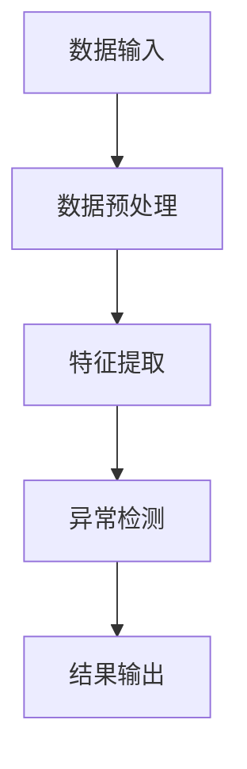

                 


# 金融领域自监督学习在市场异常模式早期识别中的应用

> 关键词：自监督学习，金融市场，异常模式识别，时间序列分析，深度学习，对比学习

> 摘要：本文深入探讨了自监督学习在金融市场异常模式早期识别中的应用。首先介绍了自监督学习的基本概念和其在金融领域的优势，接着详细分析了自监督学习在金融时间序列分析中的应用，包括算法原理和数学模型。然后，通过实际案例展示了如何利用自监督学习技术构建金融市场异常检测系统，最后总结了自监督学习在金融领域的未来发展方向。

---

# 第1章: 自监督学习与金融市场异常模式识别概述

## 1.1 自监督学习的定义与特点

### 1.1.1 自监督学习的核心概念

自监督学习是一种无监督学习的变体，通过利用数据本身的标签信息（通常是数据本身）来监督学习过程。其核心思想是通过构造任务（contrastive tasks）来提取数据中的有用特征。与监督学习相比，自监督学习不需要外部标注数据，能够从未标记的数据中学习有用的表示。

### 1.1.2 自监督学习与监督学习的对比

| 对比维度       | 监督学习                          | 自监督学习                          |
|----------------|-----------------------------------|------------------------------------|
| 数据需求       | 需要标注数据                      | 仅需要未标注数据                    |
| 学习目标       | 通过标注数据学习分类或回归任务    | 通过构造任务学习数据表示            |
| 适用场景       | 数据量小、标注成本高              | 数据量大、标注成本低                |

### 1.1.3 自监督学习在金融领域的应用潜力

金融市场数据具有高度的复杂性和不确定性，传统的监督学习方法在处理异常模式时面临以下挑战：

1. **数据稀疏性**：异常事件在金融数据中通常较少，标注成本高。
2. **数据依赖性**：金融时间序列数据具有高度的依赖性，传统的统计方法难以捕捉复杂的模式。
3. **实时性要求**：金融市场需要实时检测异常，对模型的计算效率要求高。

自监督学习通过利用未标注数据中的潜在结构信息，能够有效解决上述问题。

---

## 1.2 金融市场异常模式识别的背景与挑战

### 1.2.1 金融市场异常模式的定义

金融市场的异常模式通常指那些与正常市场行为显著不同的事件，例如：

- **市场操纵**：某些主体通过虚假交易操纵市场价格。
- **异常波动**：某只股票或市场的突然剧烈波动。
- **欺诈行为**：例如虚假陈述、内幕交易等。

### 1.2.2 异常模式识别的常见挑战

| 挑战维度       | 描述                                           |
|----------------|------------------------------------------------|
| 数据稀疏性     | 异常事件的发生频率低，导致数据不足              |
| 数据依赖性     | 金融数据具有高度的时间依赖性，传统方法难以捕捉复杂模式 |
| 实时性要求     | 异常检测需要快速响应，对模型计算效率要求高      |

### 1.2.3 自监督学习在异常识别中的优势

- **无需标注数据**：自监督学习能够利用未标注数据进行特征学习。
- **捕捉数据潜在结构**：通过构造任务，自监督学习能够提取数据中的潜在关联性。
- **实时性**：自监督学习模型可以通过在线学习方式实现实时检测。

---

## 1.3 本章小结

本章介绍了自监督学习的基本概念及其在金融领域的应用潜力，分析了金融市场异常模式识别的背景与挑战，并探讨了自监督学习在该领域的优势。下一章将详细讲解自监督学习的核心原理。

---

# 第2章: 自监督学习的核心原理

## 2.1 自监督学习的基本原理

### 2.1.1 数据重建任务

数据重建任务是自监督学习的一种常见形式，其目标是通过学习数据的重建来提取特征。例如，在图像领域，可以通过将图像分割为块并重新排列来学习图像的表示。

### 2.1.2 对比学习任务

对比学习是一种自监督学习方法，其核心思想是通过比较两个样本之间的相似性来学习特征表示。具体来说，给定输入样本$x_i$，生成两个不同的增强版本$x_i^a$和$x_i^b$，然后通过最大化$x_i^a$和$x_i^b$之间的相似性来学习特征表示。

### 2.1.3 分类任务

在自监督学习中，分类任务通常用于通过未标注数据进行预训练。例如，可以通过图像旋转任务来学习图像的表示。

---

## 2.2 自监督学习的关键技术

### 2.2.1 对比学习的理论基础

对比学习的核心思想是通过最大化正样本对的相似性和最小化负样本对的相似性来学习特征表示。其损失函数通常采用InfoNCE损失：

$$ L = -\frac{1}{N}\sum_{i=1}^{N}\log\frac{e^{sim(x_i, y_i)}}{\sum_{j=1}^{K}e^{sim(x_i, y_j)}}} $$

其中，$sim(x_i, y_i)$表示$x_i$和$y_i$之间的相似性，$K$表示负样本的数量。

### 2.2.2 知识蒸馏与自监督

知识蒸馏是一种通过教师模型指导学生模型学习的技术。在自监督学习中，可以通过知识蒸馏的方式将教师模型的特征表示迁移到学生模型中。

### 2.2.3 图结构自监督学习

图结构自监督学习通过构建图结构数据来学习节点之间的关系。例如，在金融领域，可以通过构建股票网络来学习股票之间的关联性。

---

## 2.3 自监督学习在金融领域的应用

### 2.3.1 金融时间序列分析

金融时间序列数据具有高度的依赖性，自监督学习可以通过对比学习来捕捉时间序列中的潜在关联性。

### 2.3.2 金融文本挖掘

金融文本（如新闻、财报）可以通过自监督学习技术进行语义表示学习，从而支持异常事件检测。

### 2.3.3 金融图像识别

在金融领域，图像识别通常用于识别图表、交易记录等，自监督学习可以通过数据重建任务来学习图像的表示。

---

## 2.4 本章小结

本章详细讲解了自监督学习的核心原理，包括数据重建任务、对比学习任务和分类任务，并探讨了其在金融领域的应用。下一章将聚焦于金融时间序列分析中的自监督学习。

---

# 第3章: 金融时间序列分析中的自监督学习

## 3.1 金融时间序列数据的特点

### 3.1.1 时间依赖性

金融时间序列数据通常具有显著的时间依赖性，例如股票价格、汇率等。

### 3.1.2 异常事件的稀疏性

异常事件在金融时间序列中通常较为稀疏，这使得异常检测具有挑战性。

### 3.1.3 数据的多模态性

金融数据通常具有多模态性，例如结合文本、图像等多种数据源。

---

## 3.2 自监督学习在金融时间序列中的应用

### 3.2.1 时间序列重建任务

时间序列重建任务是一种常见的自监督学习任务，其目标是通过重建时间序列来学习特征表示。

### 3.2.2 时间序列对比学习

时间序列对比学习是通过比较两个时间序列的相似性来学习特征表示。

### 3.2.3 时间序列分类任务

时间序列分类任务可以通过自监督学习进行预训练，例如通过时间序列旋转任务。

---

## 3.3 常见的金融时间序列数据集

### 3.3.1 股票价格数据

股票价格数据是最常见的金融时间序列数据之一，例如股票价格的开盘价、收盘价、最高价、最低价等。

### 3.3.2 汇率数据

汇率数据是另一种常见的金融时间序列数据，例如美元对人民币的汇率数据。

### 3.3.3 期货价格数据

期货价格数据通常具有较高的波动性，适合进行异常检测。

---

## 3.4 本章小结

本章详细探讨了自监督学习在金融时间序列分析中的应用，包括时间序列重建任务、对比学习和分类任务，并介绍了常见的金融时间序列数据集。下一章将详细讲解自监督学习的算法原理与数学模型。

---

# 第4章: 自监督学习算法原理与数学模型

## 4.1 对比学习的数学模型

### 4.1.1 InfoNCE损失函数

InfoNCE损失函数是一种常用的对比学习损失函数，其公式为：

$$ L = -\frac{1}{N}\sum_{i=1}^{N}\log\frac{e^{sim(x_i, y_i)}}{\sum_{j=1}^{K}e^{sim(x_i, y_j)}}} $$

其中，$sim(x_i, y_i)$表示$x_i$和$y_i$之间的相似性，$K$表示负样本的数量。

### 4.1.2 SimCLR损失函数

SimCLR损失函数是另一种常用的对比学习损失函数，其公式为：

$$ L = -\frac{1}{N}\sum_{i=1}^{N}\log\frac{e^{sim(x_i, y_i)}}{\sum_{j=1}^{K}e^{sim(x_i, y_j)}}} $$

---

## 4.2 生成对抗网络的自监督学习

### 4.2.1 GAN的基本结构

生成对抗网络（GAN）由生成器和判别器两部分组成。生成器的目标是生成与真实数据相似的假数据，判别器的目标是区分真实数据和生成数据。

### 4.2.2 使用GAN进行自监督学习

在自监督学习中，可以通过GAN来生成增强数据，从而提高模型的鲁棒性。

---

## 4.3 时间序列对比学习的实现

### 4.3.1 时间序列对比学习的步骤

1. **数据增强**：对时间序列数据进行增强，例如滑动窗口、旋转等。
2. **特征提取**：通过对比学习提取时间序列的特征表示。
3. **相似性计算**：计算增强样本对之间的相似性。
4. **损失计算**：使用对比学习损失函数进行损失计算。

---

## 4.4 本章小结

本章详细讲解了自监督学习的算法原理与数学模型，包括对比学习和生成对抗网络，并探讨了时间序列对比学习的实现步骤。下一章将探讨自监督学习在金融市场异常模式识别中的系统设计与实现。

---

# 第5章: 自监督学习在金融市场异常模式识别中的系统设计与实现

## 5.1 系统设计概述

### 5.1.1 系统架构设计

以下是金融异常检测系统的架构设计图：



### 5.1.2 系统功能设计

1. **数据输入**：接收金融时间序列数据，例如股票价格、汇率等。
2. **数据预处理**：对数据进行清洗、归一化等处理。
3. **特征提取**：通过自监督学习提取特征表示。
4. **异常检测**：基于提取的特征进行异常检测。
5. **结果输出**：输出异常检测结果。

---

## 5.2 系统实现细节

### 5.2.1 数据预处理

数据预处理是金融异常检测的重要步骤，通常包括以下步骤：

1. **数据清洗**：去除缺失值、异常值等。
2. **归一化**：将数据归一化到统一的范围。
3. **滑动窗口**：将时间序列数据划分为滑动窗口。

---

## 5.3 项目实战：基于自监督学习的金融异常检测系统

### 5.3.1 环境安装

以下是项目所需的环境安装代码：

```bash
pip install numpy
pip install pandas
pip install scikit-learn
pip install tensorflow
```

### 5.3.2 系统核心实现源代码

以下是基于自监督学习的金融异常检测系统的实现代码：

```python
import numpy as np
import pandas as pd
from sklearn.preprocessing import MinMaxScaler
from tensorflow.keras.models import Model
from tensorflow.keras.layers import Input, Dense, Dropout, LSTM

# 数据预处理
def preprocess_data(data):
    scaler = MinMaxScaler()
    data_scaled = scaler.fit_transform(data)
    return data_scaled

# 自监督学习模型
def contrastive_learning_model(input_dim):
    input_layer = Input(shape=(input_dim,))
    dense_layer = Dense(128, activation='relu')(input_layer)
    dropout_layer = Dropout(0.5)(dense_layer)
    output_layer = Dense(1, activation='sigmoid')(dropout_layer)
    model = Model(inputs=input_layer, outputs=output_layer)
    return model

# 异常检测系统
def anomaly_detection_system(data, window_size=10):
    preprocessed_data = preprocess_data(data)
    model = contrastive_learning_model(preprocessed_data.shape[1])
    # 训练模型
    model.compile(optimizer='adam', loss='binary_crossentropy')
    model.fit(preprocessed_data, np.zeros(len(preprocessed_data)), epochs=10, batch_size=32)
    # 预测异常
    predictions = model.predict(preprocessed_data)
    return predictions

# 主函数
if __name__ == "__main__":
    # 读取数据
    data = pd.read_csv('financial_data.csv')
    # 数据预处理
    preprocessed_data = preprocess_data(data)
    # 训练模型
    model = contrastive_learning_model(preprocessed_data.shape[1])
    model.compile(optimizer='adam', loss='binary_crossentropy')
    model.fit(preprocessed_data, np.zeros(len(preprocessed_data)), epochs=10, batch_size=32)
    # 预测异常
    predictions = model.predict(preprocessed_data)
    # 输出结果
    print("Anomaly predictions:", predictions)
```

---

## 5.4 本章小结

本章详细讲解了自监督学习在金融市场异常模式识别中的系统设计与实现，包括系统架构设计、数据预处理和核心代码实现。通过实际案例展示了如何利用自监督学习技术构建金融市场异常检测系统。

---

# 第6章: 自监督学习在金融领域的最佳实践与未来展望

## 6.1 最佳实践

### 6.1.1 数据预处理的重要性

数据预处理是自监督学习成功的关键，尤其是金融时间序列数据通常具有噪声，需要进行适当的清洗和归一化。

### 6.1.2 模型调参技巧

在自监督学习中，模型的超参数设置对性能影响较大，需要进行适当的调参。

### 6.1.3 实时性优化

为了实现实时检测，可以通过在线学习的方式更新模型。

---

## 6.2 未来展望

### 6.2.1 自监督学习与强化学习的结合

未来，可以探索自监督学习与强化学习的结合，进一步提高金融异常检测的准确性和实时性。

### 6.2.2 多模态数据的自监督学习

随着金融数据的多模态化，如何有效利用多模态数据进行自监督学习是未来的重要研究方向。

---

## 6.3 本章小结

本章总结了自监督学习在金融领域的最佳实践，并展望了未来的发展方向。通过不断优化算法和结合多模态数据，自监督学习在金融市场异常模式识别中的应用将更加广泛和深入。

---

# 结语

自监督学习作为一种新兴的无监督学习技术，已经在金融市场异常模式识别中展现出巨大的潜力。通过不断优化算法和结合多模态数据，自监督学习将为金融领域的研究和应用带来更多的突破和创新。

---

