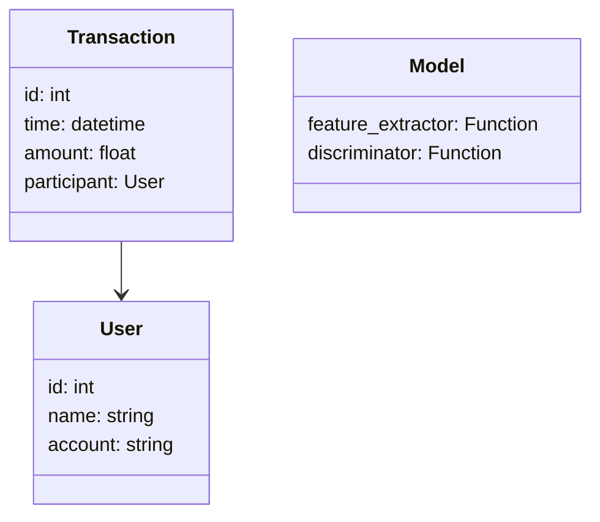
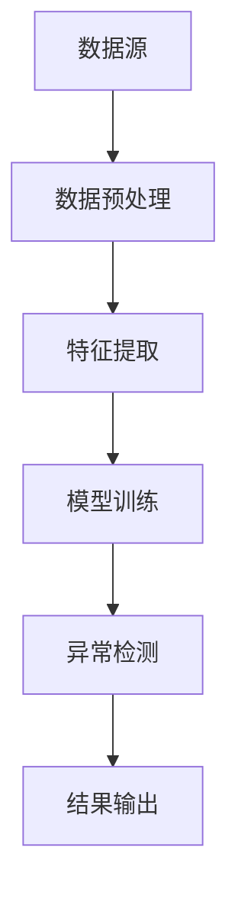
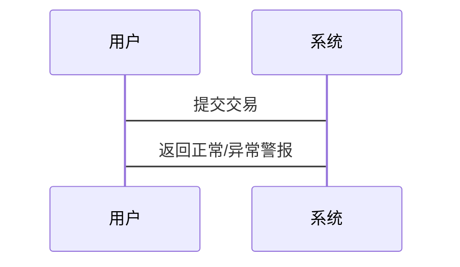

                 


# 《金融领域自监督学习在异常交易检测中的应用》

> 关键词：自监督学习，异常交易检测，金融数据分析，机器学习，深度学习

> 摘要：自监督学习是一种新兴的机器学习技术，在金融领域中，异常交易检测是一个关键任务，涉及高维数据和复杂的模式识别。本文深入探讨了自监督学习在金融异常交易检测中的应用，分析了其核心概念、算法原理、系统架构，并通过具体案例展示了其实际应用效果。

---

## 第一部分：自监督学习与异常交易检测的背景介绍

### 第1章：自监督学习的基本概念

#### 1.1 自监督学习的定义
自监督学习是一种无监督学习的变体，通过利用数据本身的标签信息来构建监督信号。其核心思想是通过预训练任务，从数据中提取有用的特征表示，而无需额外的标注数据。

#### 1.2 自监督学习的核心特点
- **自监督信号**：利用数据本身生成监督信号。
- **无监督学习**：无需外部标注数据，适用于大规模数据场景。
- **特征提取能力强**：能够捕捉数据的高层次特征。

#### 1.3 自监督学习与监督学习、无监督学习的对比
| 特性                | 监督学习             | 无监督学习           | 自监督学习          |
|---------------------|----------------------|----------------------|---------------------|
| 数据需求            | 需标注数据           | 无标注数据           | 部分自动生成标签    |
| 适用场景            | 明确的任务目标       | 探索数据结构         | 特征提取与任务驱动 |
| 训练效率            | 高                   | 低                   | 较高                |

### 第2章：异常交易检测的定义与挑战

#### 2.1 异常交易检测的定义
异常交易检测是指识别金融市场中的异常交易行为，如欺诈交易、市场操纵等，通常表现为交易数据中的异常模式。

#### 2.2 异常交易检测的常见场景
- **欺诈检测**：识别非法交易行为。
- **市场操纵检测**：发现操纵市场价格的行为。
- **异常市场行为监测**：识别不符合市场规律的交易模式。

#### 2.3 异常交易检测的难点与解决方案
- **数据稀疏性**：异常交易样本较少，难以训练模型。
- **数据复杂性**：金融数据具有高维性和非线性特征。
- **模型鲁棒性**：需要模型能够适应数据分布的变化。

---

## 第二部分：自监督学习的核心概念与原理

### 第3章：自监督学习的核心原理

#### 3.1 自监督学习的三要素
1. **预训练任务**：通过任务生成监督信号，如对比学习。
2. **特征提取器**：用于提取数据的特征表示。
3. **目标函数**：衡量特征表示与监督信号的匹配程度。

#### 3.2 自监督学习的数学模型
自监督学习的目标是通过优化以下目标函数来学习特征表示：
$$ L = \text{contrastive}(x_+, x_-) $$
其中，$x_+$ 和 $x_-$ 分别是正样本和负样本的特征表示。

#### 3.3 自监督学习的训练流程
1. 生成正样本和负样本对。
2. 使用预训练任务生成监督信号。
3. 优化模型参数以最小化损失函数。

### 第4章：异常交易检测的核心要素

#### 4.1 异常交易的特征分析
- **时间序列特征**：如交易频率、金额波动。
- **参与者特征**：如交易方的关联性。
- **市场特征**：如交易量、价格波动。

#### 4.2 异常交易检测的关键指标
- **交易金额**：突然的高金额交易可能表明异常。
- **交易频率**：短时间内频繁交易可能异常。
- **参与者行为**：同一IP或账户多次交易可能异常。

#### 4.3 异常交易检测的评价标准
- **准确率**：正确识别异常交易的比例。
- **召回率**：发现实际异常交易的比例。
- **F1分数**：综合准确率和召回率的指标。

---

## 第三部分：自监督学习算法的原理与实现

### 第5章：对比学习算法

#### 5.1 对比学习的定义
对比学习通过对比正样本和负样本的特征相似性来生成监督信号。

#### 5.2 对比学习的核心思想
$$ \text{损失函数} = \text{交叉熵损失}(x_+, x_-) $$

#### 5.3 对比学习的数学模型
$$ L = -\log\left(\frac{e^{f(x_+ - x_-)}}{e^{f(x_+ - x_-)} + 1}\right) $$
其中，$f$ 是非线性变换函数。

### 第6章：生成对抗网络（GAN）算法

#### 6.1 GAN的基本原理
GAN由生成器和判别器组成，生成器生成假数据，判别器区分真实数据和假数据。

#### 6.2 GAN在自监督学习中的应用
- **数据增强**：生成更多样化的数据。
- **特征提取**：判别器可以作为特征提取器。

#### 6.3 GAN的优缺点分析
- **优点**：能够生成高质量的数据。
- **缺点**：训练不稳定，易陷入鞍点。

---

## 第四部分：系统分析与架构设计

### 第7章：问题场景介绍

#### 7.1 异常交易检测的场景描述
金融市场中的异常交易行为可能对市场稳定性和投资者利益造成威胁，因此需要实时监测和识别。

### 第8章：系统功能设计

#### 8.1 领域模型类图


#### 8.2 系统架构设计


### 第9章：接口设计与交互

#### 9.1 系统接口设计
- **输入接口**：接收交易数据。
- **输出接口**：输出异常交易警报。

#### 9.2 系统交互序列图


---

## 第五部分：项目实战

### 第10章：环境安装与配置

#### 10.1 安装Python环境
使用Anaconda安装Python 3.8及以上版本。

#### 10.2 安装依赖库
安装TensorFlow、Keras、PyTorch等深度学习库。

### 第11章：核心代码实现

#### 11.1 对比学习实现
```python
import tensorflow as tf
from tensorflow.keras import layers

def contrastive_loss(y_true, y_pred):
    margin = 1.0
    loss = tf.reduce_mean(tf.square(y_true - y_pred))
    return 0.5 * loss

# 特征提取器
def feature_extractor():
    model = tf.keras.Sequential([
        layers.Dense(128, activation='relu'),
        layers.Dense(128, activation='relu'),
        layers.Dense(128, activation='relu')
    ])
    return model

# 对比学习模型
def contrastive_model():
    input_1 = tf.keras.Input(shape=(input_dim,))
    input_2 = tf.keras.Input(shape=(input_dim,))
    feat_1 = feature_extractor()(input_1)
    feat_2 = feature_extractor()(input_2)
    diff = tf.keras.layers.Lambda(lambda x: tf.abs(x[0] - x[1]))([feat_1, feat_2])
    prediction = layers.Dense(1, activation='sigmoid')(diff)
    model = tf.keras.Model(inputs=[input_1, input_2], outputs=prediction)
    model.compile(optimizer='adam', loss=contrastive_loss)
    return model
```

### 第12章：代码解读与分析

#### 12.1 代码功能解读
对比学习模型通过输入正样本和负样本，学习特征表示，用于区分正常和异常交易。

#### 12.2 案例分析
训练模型后，输入真实交易数据和生成的异常交易数据，模型能够识别出异常交易。

### 第13章：项目小结

- **实现效果**：模型能够有效识别异常交易。
- **优化方向**：引入更复杂的预训练任务，如掩码预测任务。

---

## 第六部分：最佳实践与小结

### 第14章：总结与注意事项

#### 14.1 总结
自监督学习在金融异常交易检测中具有显著优势，能够有效处理标注数据不足的问题。

#### 14.2 注意事项
- 数据预处理：确保数据质量。
- 模型调参：选择合适的超参数。
- 实际应用：结合业务规则，优化模型性能。

### 第15章：拓展阅读

- 推荐阅读《Deep Learning》（Ian Goodfellow等著）。
- 关注最新的自监督学习研究论文。

---

通过以上内容，读者可以全面了解自监督学习在金融异常交易检测中的应用，从理论到实践，逐步掌握相关技术的核心要点。

