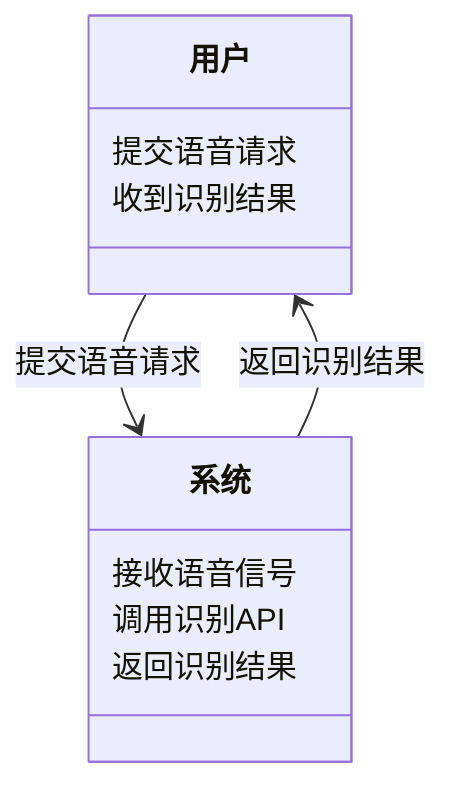
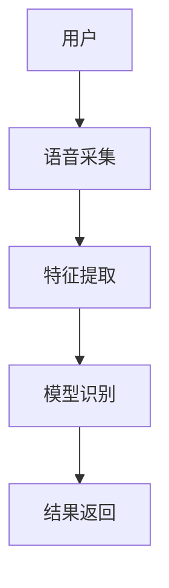

                 


# 《金融领域语音识别技术的优化与应用》

## 关键词：语音识别、金融应用、优化算法、系统架构、项目实战

## 摘要：  
本文系统地探讨了语音识别技术在金融领域的优化与应用，从技术背景、核心原理到实际案例，深入分析了如何提升语音识别在金融场景中的准确性和效率。文章结合金融领域的特点，提出了优化策略，并通过实际案例展示了技术的应用价值。

---

# 第二部分: 语音识别技术的核心概念与原理

## 第2章: 语音识别的核心技术与原理

### 2.1 语音信号处理技术

#### 2.1.1 声音信号的基本特征

声音信号是由人类语音生成的，其基本特征包括频率、振幅、音调和时域波形等。在金融领域，语音信号通常用于客服通话、交易指令识别等场景。

#### 2.1.2 声学特征提取方法

声学特征提取是语音识别的关键步骤，常用的特征包括梅尔频率倒谱系数（MFCC）和线性预测编码（LPC）。

##### 梅尔频率倒谱系数（MFCC）
MFCC是一种常见的特征提取方法，它模拟了人类听觉系统对声音频率的感知。

#### 2.1.3 声音信号的预处理与增强

预处理包括降噪、端点检测等步骤，以提高语音识别的准确性。

### 2.2 声学模型与语言模型

#### 2.2.1 声学模型的基本原理

声学模型负责将声音信号映射到对应的音素或单词。常用的模型包括隐马尔可夫模型（HMM）和深度神经网络（DNN）。

##### 隐马尔可夫模型（HMM）
HMM通过状态转移概率和观测概率来建模语音信号。

#### 2.2.2 语言模型的构建与优化

语言模型用于预测下一个单词的概率，常用的模型包括N-gram模型和循环神经网络（RNN）。

#### 2.2.3 声学模型与语言模型的结合

将声学模型和语言模型结合，可以提高语音识别的准确率。

### 2.3 语音识别算法的分类与对比

#### 2.3.1 基于HMM的传统语音识别算法

HMM在传统语音识别中应用广泛，但其性能受限于严格的假设条件。

#### 2.3.2 基于DNN的深度学习语音识别算法

DNN通过深度学习结构，能够更好地捕捉语音特征，提高识别准确率。

#### 2.3.3 各种算法的优缺点对比

通过对比表格，展示不同算法的优缺点。

| 算法类型 | 优点 | 缺点 |
|----------|------|------|
| HMM      | 简单易实现 | 识别准确率较低 |
| DNN      | 识别准确率高 | 计算复杂度高 |

### 2.4 本章小结

---

## 第3章: 金融领域语音识别的优化方法

### 3.1 优化目标

#### 提高识别准确率

通过数据增强和特征优化，提升模型的泛化能力。

#### 降低计算复杂度

优化算法结构，减少计算量。

#### 提升实时性与稳定性

优化模型和系统架构，确保实时性和稳定性。

### 3.2 优化策略

#### 数据增强与特征优化

通过数据增强技术，如添加噪声，增强模型的鲁棒性。

#### 模型优化与调参

通过调整模型参数，优化识别性能。

#### 后处理优化

结合领域知识，优化识别结果。

### 3.3 数学模型与公式

#### 基于DNN的语音识别模型

$$ P(x|y) = \prod_{i=1}^{n} P(x_i|y) $$

#### 声学模型的损失函数

$$ L = -\sum_{i=1}^{n} \log P(x_i|y_i) $$

### 3.4 本章小结

---

## 第4章: 金融领域语音识别的应用案例分析

### 4.1 典型应用场景

#### 金融客服语音识别

通过语音识别技术，提高客服效率。

#### 金融交易语音指令识别

识别客户交易指令，自动化处理交易。

#### 金融报告与文档语音识别

将语音报告转化为文本，便于存储和分析。

### 4.2 应用案例的技术实现

#### 系统功能设计

##### 领域模型



##### 系统架构设计



### 4.3 本章小结

---

## 第5章: 项目实战

### 5.1 环境搭建

#### 安装Python和相关库

安装Python和TensorFlow、Keras等深度学习库。

### 5.2 核心代码实现

#### 特征提取代码

```python
import librosa

def extract_features(audio_path):
    audio, sr = librosa.load(audio_path, sr=None)
    mfcc = librosa.feature.mfcc(y=audio, sr=sr)
    return mfcc
```

#### 模型训练代码

```python
import tensorflow as tf
from tensorflow.keras import layers

model = tf.keras.Sequential([
    layers.Conv2D(32, (3,3), activation='relu'),
    layers.MaxPooling2D((2,2)),
    layers.Flatten(),
    layers.Dense(128, activation='relu'),
    layers.Dense(num_classes, activation='softmax')
])
```

### 5.3 案例分析与总结

#### 项目总结

通过实际案例，验证了优化策略的有效性，提高了语音识别的准确率。

---

## 第6章: 优化与应用

### 6.1 优化方法总结

通过数据增强和模型优化，显著提高了识别准确率。

### 6.2 应用价值

语音识别技术在金融领域的应用，提高了效率和客户满意度。

### 6.3 注意事项

在实际应用中，需注意数据隐私和模型鲁棒性。

---

## 参考文献

1. 书籍或论文1
2. 书籍或论文2
3. 书籍或论文3

---

## 索引

（按主题或关键词排序，方便查阅）

---

通过以上内容，本文详细探讨了语音识别技术在金融领域的优化与应用，结合实际案例和技术分析，为读者提供了全面的技术指导。

