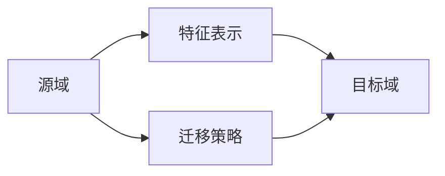
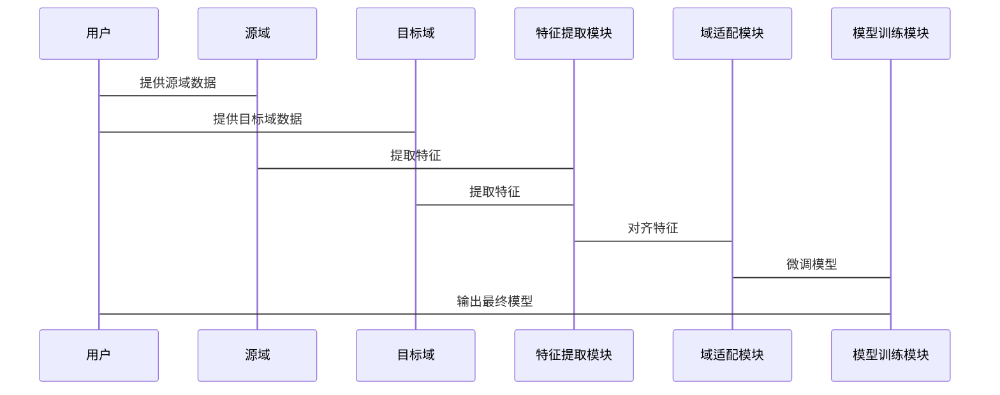

                 


# 金融领域迁移学习的最新进展与应用

> 关键词：迁移学习，金融应用，深度学习，机器学习，领域适配，特征提取，系统架构

> 摘要：本文详细探讨了迁移学习在金融领域的最新进展与实际应用。从迁移学习的基本概念到其在金融数据处理中的优势，再到具体的算法实现和系统架构设计，本文旨在为读者提供一个全面而深入的视角，帮助其理解如何在金融场景中有效应用迁移学习技术。

---

## 第一章：迁移学习的背景与核心概念

### 1.1 迁移学习的基本概念

#### 1.1.1 什么是迁移学习
迁移学习是一种机器学习技术，旨在将从一个领域或任务中学到的知识应用到另一个相关领域或任务中。其核心思想是通过共享特征或经验来提高新任务的学习效率和性能。

#### 1.1.2 迁移学习的核心问题
- 数据稀缺性：金融领域往往数据量有限，难以直接训练复杂的模型。
- 领域差异性：金融数据与其他领域的数据在特征分布和模式上存在显著差异。
- 模型适应性：如何让模型在不同金融任务之间迁移，同时保持或提升性能。

#### 1.1.3 迁移学习的边界与外延
- 边界：迁移学习仅适用于相关任务或领域，完全不相关的任务无法迁移。
- 外延：包括领域适配、特征提取、对抗训练等多种技术手段。

### 1.2 金融领域中的迁移学习问题

#### 1.2.1 金融数据的特点与挑战
- 数据多样性：金融数据包括股票价格、交易记录、用户行为等多种类型。
- 数据稀缺性：某些金融场景（如小众资产）数据量有限。
- 数据敏感性：金融数据通常涉及隐私和商业机密，需谨慎处理。

#### 1.2.2 金融场景中的迁移学习需求
- 跨任务迁移：例如，将股票预测模型迁移到债券预测。
- 跨领域迁移：例如，将互联网金融数据迁移到传统金融领域。
- 小样本迁移：在数据量有限的情况下，迁移学习可以显著提升模型性能。

#### 1.2.3 迁移学习在金融中的应用价值
- 提高模型泛化能力：减少对特定数据的依赖，增强模型的通用性。
- 降低训练成本：通过迁移学习，可以在小样本数据上训练高性能模型。
- 支持创新业务：助力金融机构快速适应新兴业务需求。

### 1.3 迁移学习与传统机器学习的对比

#### 1.3.1 传统机器学习的局限性
- 数据依赖性：需要大量标注数据，难以应对小样本场景。
- 领域限制：模型难以跨领域适用。
- 更新成本：面对新任务时，需要从头训练模型。

#### 1.3.2 迁移学习的优势与适用场景
- 优势：减少数据需求，提高模型泛化能力，支持快速业务扩展。
- 适用场景：小样本数据、领域差异明显、需要跨任务应用的场景。

#### 1.3.3 迁移学习的数学基础与核心要素
- 核心要素：源域、目标域、标记信息、特征表示。
- 数学基础：概率论、优化理论、深度学习。

---

## 第二章：迁移学习的核心概念与联系

### 2.1 迁移学习的核心原理

#### 2.1.1 特征表示与领域适配
- 特征表示：提取数据的高层次特征，使其在不同领域之间具有可比性。
- 领域适配：通过调整特征分布，使源域和目标域的特征对齐。

#### 2.1.2 迁移学习的三要素：源域、目标域与标记信息
- 源域（Source Domain）：已标记的数据，用于迁移学习的“教师”角色。
- 目标域（Target Domain）：需要学习的“学生”角色，通常标记数据较少。
- 标记信息：源域和目标域中的标签数据，用于监督学习。

#### 2.1.3 核心概念的属性特征对比
| 概念    | 属性                  |
|---------|-----------------------|
| 源域     | 数据量丰富，标记充分    |
| 目标域   | 数据量有限，标记稀少    |
| 特征表示 | 高维、非线性、可迁移    |

### 2.2 迁移学习的实体关系图

#### 2.2.1 ER实体关系图的构建
```mermaid
erDiagram
    actor 用户 {
        <属性> 用户ID
        <属性> 用户行为
    }
    class 源域 {
        <属性> 数据ID
        <属性> 标签
    }
    class 目标域 {
        <属性> 数据ID
        <属性> 标签
    }
    class 特征表示 {
        <属性> 特征向量
    }
    源域 --> 特征表示 : 提供特征
    目标域 --> 特征表示 : 提供特征
```

#### 2.2.2 源域与目标域的关联关系


---

## 第三章：迁移学习的算法原理

### 3.1 迁移学习的算法框架

#### 3.1.1 特征表示的迁移策略
- 基于特征提取：通过预训练模型提取特征，再在目标域上微调。
- 基于领域适配：通过对抗训练或对齐方法，使源域和目标域的特征分布一致。

#### 3.1.2 域适配的核心算法
- 基于距离的域适配：如最大均值差异（MMD）。
- 基于对抗训练的域适配：如对抗域适配网络（ADAN）。

#### 3.1.3 迁移学习的数学模型
- 源域损失：$L_s = \sum_{i=1}^{n} (y_i - y_i')^2$
- 目标域损失：$L_t = \sum_{i=1}^{m} (y_i - y_i')^2$
- 综合损失：$L = \lambda L_s + (1-\lambda) L_t$

### 3.2 迁移学习的算法流程

#### 3.2.1 数据预处理与特征提取
- 数据清洗：处理缺失值、异常值。
- 特征提取：使用预训练模型提取特征。

#### 3.2.2 源域与目标域的对齐策略
- 特征对齐：通过对抗训练使源域和目标域的特征分布一致。
- 标签对齐：通过调整标签使两者一致。

#### 3.2.3 模型训练与优化
- 微调模型：在目标域上微调预训练模型。
- 对抗训练：通过对抗网络优化特征对齐。

### 3.3 迁移学习的算法实现

#### 3.3.1 基于深度学习的迁移学习算法
```python
class FeatureExtractor(nn.Module):
    def __init__(self):
        super().__init__()
        self.conv = nn.Sequential(
            nn.Conv2d(1, 32, kernel_size=5, stride=1, padding=2),
            nn.ReLU(),
            nn.MaxPool2d(kernel_size=2, stride=2),
            nn.Conv2d(32, 64, kernel_size=5, stride=1, padding=2),
            nn.ReLU(),
            nn.MaxPool2d(kernel_size=2, stride=2)
        )
        self.fc = nn.Sequential(
            nn.Linear(64*4*4, 100),
            nn.ReLU(),
            nn.Dropout(0.5)
        )
    
    def forward(self, x):
        x = self.conv(x)
        x = x.view(-1, 64*4*4)
        x = self.fc(x)
        return x
```

#### 3.3.2 基于特征对齐的迁移学习算法
- 使用对抗训练对齐特征分布。
- 通过MMD计算源域和目标域的分布差异。

#### 3.3.3 基于对抗训练的迁移学习算法
- 对抗网络结构：生成器、判别器。
- 对抗损失函数：$L_{adv} = \log(D(x)) + \log(1-D(x'))$

---

## 第四章：迁移学习的数学模型与公式

### 4.1 迁移学习的核心公式

#### 4.1.1 源域与目标域的对齐公式
- 最大均值差异（MMD）：
  $$D_{\text{MMD}}(P, Q) = \mathbb{E}_{x \sim P}[f(x)] - \mathbb{E}_{x \sim Q}[f(x)]$$

#### 4.1.2 迁移损失的计算公式
- 源域损失：$L_s = \sum_{i=1}^{n} (y_i - y_i')^2$
- 目标域损失：$L_t = \sum_{i=1}^{m} (y_i - y_i')^2$
- 综合损失：$L = \lambda L_s + (1-\lambda) L_t$

#### 4.1.3 综合损失函数的表达式
- 综合损失：$L = \lambda L_s + (1-\lambda) L_t$

### 4.2 迁移学习的数学推导

#### 4.2.1 特征对齐的数学证明
- 对齐目标：$P(x|y) = Q(x|y)$
- 对齐过程：通过对抗训练或MMD优化特征分布。

#### 4.2.2 迁移损失的优化过程
- 使用梯度下降优化综合损失函数。
- 优化目标：最小化$L_s$和$L_t$的加权和。

#### 4.2.3 综合损失函数的最小化方法
- 通过对抗训练优化特征对齐。
- 通过微调优化模型在目标域的性能。

### 4.3 举例说明

#### 4.3.1 简单迁移学习案例的数学模型
- 源域和目标域的特征对齐：$f(x) = f'(x)$
- 损失函数：$L = L_s + L_t$

#### 4.3.2 实际金融场景中的公式应用
- 股票预测：$y = \theta x + \epsilon$
- 预测模型：$y' = f(x)$
- 损失函数：$L = \sum (y - y')^2$

---

## 第五章：金融领域迁移学习的系统分析与架构设计

### 5.1 问题场景介绍

#### 5.1.1 金融数据的多样性与稀缺性
- 数据类型：股票价格、交易记录、用户行为。
- 数据量：小样本数据难以训练。

#### 5.1.2 金融任务的复杂性与迁移需求
- 多任务学习：股票预测、风险评估。
- 领域迁移：从互联网金融到传统金融。

#### 5.1.3 系统设计的目标与约束
- 目标：提高模型迁移能力，降低训练成本。
- 约束：数据隐私、计算资源有限。

### 5.2 系统功能设计

#### 5.2.1 数据预处理模块
- 数据清洗：处理缺失值、异常值。
- 特征提取：使用预训练模型提取特征。

#### 5.2.2 特征提取模块
- 使用预训练模型提取特征。
- 对齐特征分布。

#### 5.2.3 域适配模块
- 对抗训练：优化特征对齐。
- MMD计算：对齐分布。

#### 5.2.4 模型训练与优化模块
- 微调模型：在目标域上优化模型。
- 对抗训练：优化特征分布。

### 5.3 系统架构设计

#### 5.3.1 系统架构图


#### 5.3.2 源域与目标域的交互流程


---

## 第六章：迁移学习在金融领域的应用与未来展望

### 6.1 应用场景总结

#### 6.1.1 股票价格预测
- 使用迁移学习将其他金融资产的特征迁移到股票预测。

#### 6.1.2 风险评估
- 将银行风险评估模型迁移到保险领域。

#### 6.1.3 用户行为分析
- 将互联网用户的特征迁移到传统金融用户分析。

### 6.2 技术挑战与解决方案

#### 6.2.1 数据隐私问题
- 解决方案：使用联邦学习，保护数据隐私。

#### 6.2.2 领域适配的困难
- 解决方案：优化迁移学习算法，提高对齐效果。

#### 6.2.3 计算资源限制
- 解决方案：使用轻量级模型，减少计算需求。

### 6.3 未来研究方向

#### 6.3.1 更高效的迁移学习算法
- 研究更高效的特征对齐方法。
- 开发适用于小样本场景的迁移学习算法。

#### 6.3.2 迁移学习的可解释性
- 提高迁移学习的可解释性，帮助金融从业者理解模型决策。

#### 6.3.3 多领域迁移学习
- 研究多领域迁移学习，支持更广泛的金融应用场景。

---

## 第七章：结论与展望

### 7.1 总结
迁移学习在金融领域的应用前景广阔，能够有效解决数据稀缺性和领域差异性问题。通过迁移学习，金融机构可以快速适应新兴业务需求，提高模型性能。

### 7.2 未来展望
未来的研究方向包括更高效的迁移学习算法、迁移学习的可解释性以及多领域迁移学习。这些研究将推动迁移学习在金融领域的进一步应用和发展。

---

## 参考文献

（此处可列出相关文献或参考资料）

---

通过以上详细分析，我们可以看到迁移学习在金融领域的巨大潜力和应用价值。希望本文能够为读者提供有价值的见解，并激发更多的研究和实践。

