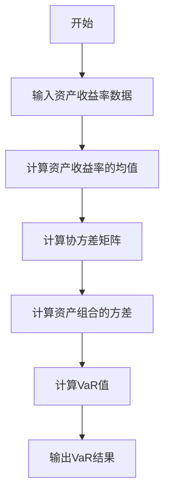
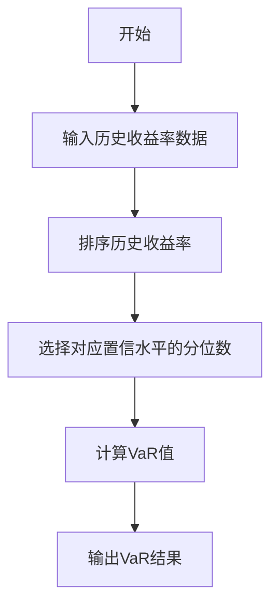
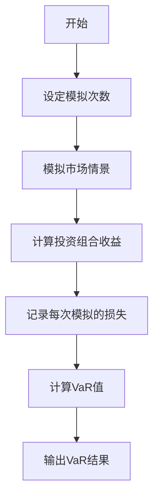

                 


# 《金融风险VaR模型比较与选择》

## 关键词：金融风险，VaR模型，风险度量，风险管理，风险模型

## 摘要：  
VaR（Value at Risk，VaR）是金融风险管理中的核心工具之一，用于量化投资组合在特定时间窗口内可能遭受的最大损失。本文深入探讨了VaR模型的核心概念、计算方法及其优缺点，通过比较分析，为读者提供选择适合自身需求的VaR模型的清晰指导。文章从理论基础到实际应用，系统性地阐述了VaR模型的比较与选择过程。

---

# 第1章: 金融风险VaR模型概述

## 1.1 金融风险的基本概念  
### 1.1.1 金融风险的定义  
金融风险是指在金融活动中，由于市场波动、经济变化或其他不确定性因素，导致资产损失或收益减少的可能性。  

### 1.1.2 金融风险的主要类型  
- **市场风险**：由于市场价格波动导致的损失。  
- **信用风险**：由于债务人违约导致的损失。  
- **流动性风险**：无法以合理价格迅速变现资产的风险。  
- **操作风险**：由于内部流程或系统故障导致的损失。  

### 1.1.3 VaR模型在金融风险管理中的作用  
VaR模型是量化市场风险的最常用工具，能够帮助金融机构在不同时间窗口内，估算投资组合的潜在损失。  

---

## 1.2 VaR模型的定义与特点  
### 1.2.1 VaR的定义  
VaR是指在给定的时间窗口和置信水平下，投资组合可能遭受的最大损失。  

### 1.2.2 VaR模型的核心特点  
- **统计学基础**：基于概率分布和历史数据。  
- **直观性**：VaR值可以直接解释为“在某一时点，某置信水平下，可能的最大损失”。  
- **综合性**：考虑了投资组合中多个资产的联动风险。  

### 1.2.3 VaR模型与其他风险度量方法的对比  
| 方法         | 优点                         | 缺点                         |  
|--------------|------------------------------|------------------------------|  
| VaR          | 综合考虑多种风险因素         | 无法反映“尾部”风险           |  
| 标准差        | 易计算                       | 无法反映非对称性风险           |  

---

## 1.3 VaR模型的应用场景  
### 1.3.1 投资组合风险管理  
- 帮助投资者量化投资组合的风险，制定风险预算。  

### 1.3.2 金融机构的风险控制  
- 用于银行、基金公司等金融机构的内部风险管理和资本充足性评估。  

### 1.3.3 VaR模型在监管中的应用  
- 监管机构通过VaR模型评估金融机构的风险敞口，确保金融体系的稳定性。  

---

## 1.4 VaR模型的计算方法  
### 1.4.1 方差-协方差法  
- 假设资产收益率服从正态分布，通过计算资产的方差和协方差矩阵来估算VaR。  

### 1.4.2 历史模拟法  
- 使用历史市场数据，模拟投资组合的历史收益分布，计算VaR值。  

### 1.4.3 蒙特卡洛模拟法  
- 通过随机模拟市场情景，估计投资组合在不同情景下的损失分布，进而计算VaR。  

---

## 1.5 本章小结  
本章介绍了金融风险的基本概念、VaR模型的定义及其特点，并对比了VaR与其他风险度量方法的优缺点。通过分析VaR模型的应用场景和计算方法，为后续章节的深入探讨奠定了基础。

---

# 第2章: VaR模型的核心概念与原理  

## 2.1 VaR模型的数学表达式  
### 2.1.1 VaR的公式表示  
$$ VaR = -\mu + z \times \sigma $$  
其中，$\mu$是资产收益率的均值，$\sigma$是标准差，$z$是对应置信水平的分位数。  

### 2.1.2 VaR的统计学意义  
VaR值反映了在给定置信水平下，投资组合的潜在损失。  

### 2.1.3 VaR的置信水平与时间窗口  
- **置信水平**：如95%或99%，表示在该置信水平下，损失不超过VaR的概率。  
- **时间窗口**：通常为1天、1周或1个月，表示计算VaR的时间范围。  

---

## 2.2 VaR模型的计算流程  
### 2.2.1 数据收集与预处理  
- 收集资产的历史收益率数据，剔除异常值。  

### 2.2.2 风险因子的选择  
- 确定影响投资组合的主要风险因子（如市场指数、行业因子）。  

### 2.2.3 模型参数的估计  
- 估计资产收益率的均值、方差和协方差矩阵。  

---

## 2.3 VaR模型的优缺点  
### 2.3.1 VaR模型的优点  
- **直观性**：VaR值易于理解和解释。  
- **综合性**：考虑了资产之间的联动风险。  

### 2.3.2 VaR模型的缺点  
- **假设的局限性**：假设资产收益率分布是已知的（如正态分布）。  
- **尾部风险**：无法准确反映“尾部事件”（即极端市场情况）的风险。  

---

## 2.4 VaR模型的选择标准  
### 2.4.1 模型的准确性  
- 模型能否准确反映市场的真实风险情况。  

### 2.4.2 模型的计算效率  
- 模型的计算速度是否能满足实时性需求。  

### 2.4.3 模型的可解释性  
- 模型是否易于理解和解释。  

---

## 2.5 本章小结  
本章深入探讨了VaR模型的数学表达式、计算流程及其优缺点，并提出了选择VaR模型的标准。这些内容为后续章节的模型比较与选择提供了理论基础。

---

# 第3章: VaR模型的算法原理与实现  

## 3.1 方差-协方差法  
### 3.1.1 方法概述  
方差-协方差法假设资产收益率服从正态分布，通过计算资产的方差和协方差矩阵来估算VaR值。  

### 3.1.2 算法流程图  


---

## 3.2 历史模拟法  
### 3.2.1 方法概述  
历史模拟法通过模拟投资组合的历史收益分布，计算VaR值。  

### 3.2.2 算法流程图  


---

## 3.3 蒙特卡洛模拟法  
### 3.3.1 方法概述  
蒙特卡洛模拟法通过随机模拟市场情景，计算投资组合的潜在损失分布，进而估算VaR值。  

### 3.3.2 算法流程图  


---

## 3.4 三种方法的对比  
| 方法         | 优点                         | 缺点                         |  
|--------------|------------------------------|------------------------------|  
| 方差-协方差法 | 计算简单                   | 依赖正态分布假设             |  
| 历史模拟法    | 不依赖分布假设             | 需要大量历史数据             |  
| 蒙特卡洛模拟法 | 可模拟极端市场情况         | 计算复杂且耗时               |  

---

## 3.5 本章小结  
本章详细讲解了三种VaR模型的算法原理，并通过流程图和对比分析，帮助读者理解每种方法的优缺点及适用场景。

---

# 第4章: VaR模型的系统分析与架构设计  

## 4.1 问题场景介绍  
- 投资组合风险控制：某机构需要选择合适的VaR模型，对投资组合进行风险管理。  

## 4.2 系统功能设计  
- 数据采集与处理模块：收集和预处理市场数据。  
- 模型计算模块：实现三种VaR模型的计算功能。  
- 结果展示模块：可视化VaR值和风险分析结果。  

## 4.3 系统架构设计  


## 4.4 系统接口设计  
- 数据接口：提供API用于数据输入和输出。  
- 模型接口：支持多种VaR模型的调用。  

## 4.5 系统交互设计  


---

## 4.6 本章小结  
本章通过系统设计的方法，分析了VaR模型的实际应用场景，并提出了系统的整体架构和接口设计，为后续的项目实施提供了理论支持。

---

# 第5章: VaR模型的项目实战  

## 5.1 项目背景与目标  
- 项目目标：开发一个基于VaR模型的投资组合风险管理系统。  

## 5.2 环境安装与配置  
- **工具安装**：安装Python、NumPy、Pandas、Matplotlib等库。  
- **数据获取**：从金融数据源获取历史收益率数据。  

## 5.3 核心代码实现  
### 5.3.1 方差-协方差法  
```python
import numpy as np

def var_gaussian(returns, confidence_level=0.95):
    mu = np.mean(returns)
    sigma = np.std(returns)
    z = np.quantile(np.random.standard_normal(10000), confidence_level)
    var = -mu + z * sigma
    return var
```

### 5.3.2 历史模拟法  
```python
def var Historical(returns, confidence_level=0.95):
    returns_sorted = sorted(returns)
    percentile = int(len(returns_sorted) * (1 - confidence_level))
    var = returns_sorted[percentile]
    return var
```

### 5.3.3 蒙特卡洛模拟法  
```python
import numpy as np
import random

def var_MonteCarlo(returns, num_simulations=10000):
    simulations = []
    for _ in range(num_simulations):
        simulated_return = random.choice(returns)
        simulations.append(simulated_return)
    simulations.sort()
    percentile = int(num_simulations * (1 - confidence_level))
    var = simulations[percentile]
    return var
```

---

## 5.4 代码解读与分析  
- **方差-协方差法**：假设收益率服从正态分布，通过计算均值和标准差来估算VaR值。  
- **历史模拟法**：直接使用历史收益率数据，排序后选择对应置信水平的分位数。  
- **蒙特卡洛模拟法**：通过模拟市场情景，生成大量收益分布，进而计算VaR值。  

---

## 5.5 项目小结  
本章通过实际项目案例，详细讲解了VaR模型的环境配置、核心代码实现及结果分析，帮助读者掌握VaR模型的实际应用方法。

---

# 第6章: VaR模型的最佳实践与总结  

## 6.1 选型建议  
- 根据数据特点选择模型：  
  - 若数据符合正态分布，优先选择方差-协方差法。  
  - 若数据分布复杂，优先选择蒙特卡洛模拟法。  

## 6.2 注意事项  
- 确保数据质量和完整性。  
- 定期更新模型参数，以适应市场变化。  

## 6.3 未来发展趋势  
- 结合机器学习技术，提高VaR模型的预测精度。  
- 开发更加智能化的风险管理平台，实现实时VaR计算与监控。  

## 6.4 拓展阅读  
- 推荐阅读《风险管理与VaR模型》（书籍名称）。  

---

## 6.5 本章小结  
本章总结了全书的核心内容，提出了VaR模型的选型建议，并展望了未来的发展方向，为读者提供了进一步学习和实践的指导。

---

# 附录: VaR模型的数学公式与代码示例  

## 附录A: VaR模型的数学公式  
- 方差-协方差法：  
$$ VaR = -\mu + z \times \sigma $$  
- 历史模拟法：  
$$ VaR = \text{排序后第} (n \times (1 - \alpha)) \text{个值} $$  
- 蒙特卡洛模拟法：  
$$ VaR = \text{模拟结果中第} (m \times (1 - \alpha)) \text{小的损失} $$  

---

## 附录B: 核心代码示例  
- 方差-协方差法：  
```python
import numpy as np

def var_gaussian(returns, confidence_level=0.95):
    mu = np.mean(returns)
    sigma = np.std(returns)
    z = np.quantile(np.random.standard_normal(10000), confidence_level)
    var = -mu + z * sigma
    return var
```

---

# 参考文献  
- 文献1：风险管理与VaR模型（书籍或论文）。  
- 文献2：蒙特卡洛模拟法在金融中的应用。  
- 文献3：历史模拟法的理论与实践。  

---

# 结束语  
感谢您的阅读！希望本文能够帮助您更好地理解和应用VaR模型，为金融风险管理提供有力支持。

