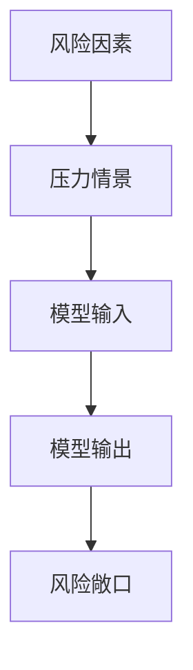
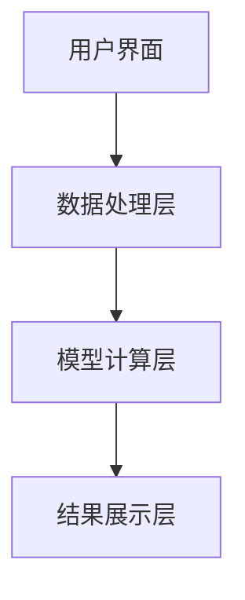

                 


# 金融风险压力测试模型

## 关键词
金融风险, 压力测试, 风险模型, 数学模型, 系统架构, 项目实战, 最佳实践

## 摘要
金融风险压力测试模型是评估金融机构在极端市场条件下的风险承受能力的重要工具。本文从背景介绍、核心概念、数学基础、系统架构、项目实战和高级主题等方面，详细阐述了压力测试模型的构建与应用，帮助读者全面理解并掌握这一关键的金融风险管理技术。

---

## 第一部分: 金融风险压力测试模型概述

### 第1章: 金融风险压力测试模型的背景与概念

#### 1.1 金融风险的基本概念
金融风险是指在金融活动中，由于市场波动、信用违约、流动性不足等因素导致的资产损失或收益下降的可能性。常见的金融风险包括市场风险、信用风险、流动性风险和操作风险。

#### 1.2 压力测试的定义与作用
压力测试是一种模拟极端市场条件下的情景分析方法，用于评估金融机构在不利环境下的风险敞口和承受能力。其主要作用包括：
1. 识别潜在风险点。
2. 评估风险管理策略的有效性。
3. 帮助制定资本规划和应急预案。

#### 1.3 金融风险压力测试模型的发展历程
压力测试的起源可以追溯到20世纪80年代，随着金融市场的复杂化和全球化，压力测试模型逐渐从简单的假设情景发展为复杂的数学模型，结合统计分析和模拟技术，成为现代金融风险管理的核心工具。

---

### 第2章: 压力测试模型的核心概念与联系

#### 2.1 压力测试模型的原理
压力测试模型通过模拟极端市场情景，分析资产组合在不同压力条件下的表现，从而评估其风险承受能力。模型的核心在于构建合理的压力情景和准确的输入变量。

#### 2.2 核心概念与联系
压力测试模型涉及多个核心概念，包括风险因素、压力情景、模型输入输出等。这些概念之间的关系可以通过实体关系图清晰展示：



#### 2.3 压力测试模型的假设条件
压力测试模型基于一系列假设，如市场波动性、相关性、极端情景的选择等。这些假设直接影响模型的准确性和适用性，需要结合实际情况进行调整和验证。

---

## 第二部分: 压力测试模型的数学基础

### 第3章: 压力测试模型的数学模型

#### 3.1 线性回归模型
线性回归模型用于分析变量之间的线性关系，常用于压力测试中对资产收益与风险因素的回归分析。其基本公式为：
$$ y = \beta_0 + \beta_1x + \epsilon $$

#### 3.2 Monte Carlo 模拟方法
Monte Carlo 模拟是一种基于随机数生成的数值模拟方法，广泛应用于压力测试中对复杂系统的概率分析。其核心步骤包括：
1. 确定输入变量的分布。
2. 生成随机样本。
3. 计算输出结果。
4. 统计分析。

#### 3.3 风险价值（VaR）模型
VaR 是衡量金融资产在正常市场条件下可能遭受的最大损失的指标，计算公式为：
$$ VaR = \mu + z \cdot \sigma $$
其中，$\mu$ 是平均值，$z$ 是分位数，$\sigma$ 是标准差。

---

### 第4章: 压力测试模型的系统架构设计

#### 4.1 系统功能需求
压力测试系统的功能需求包括数据输入、模型计算、结果展示和报告生成。

#### 4.2 系统架构设计
系统架构采用分层设计，包括用户界面层、数据处理层、模型计算层和结果展示层。架构图如下：



#### 4.3 系统接口设计
系统接口包括数据输入接口、模型调用接口和结果输出接口，确保各模块之间的高效协作。

---

## 第三部分: 项目实战——构建一个简单的压力测试模型

### 第5章: 项目实战

#### 5.1 环境安装与配置
安装 Python 环境，并安装必要的库（如 numpy、pandas、scipy）。

#### 5.2 核心代码实现
以下是压力测试模型的Python实现代码：

```python
import numpy as np
import pandas as pd
import scipy.stats as stats

# 数据预处理
data = pd.read_csv('input.csv')
returns = data['returns'].values

# 计算 VaR
mu = np.mean(returns)
sigma = np.std(returns)
alpha = 0.05
z = stats.norm.ppf(1 - alpha)

VaR = mu + z * sigma
print(f"VaR at {alpha} confidence level: {VaR}")
```

#### 5.3 实际案例分析
以某银行的资产组合为例，分析其在极端市场情景下的 VaR 值，并根据结果制定相应的风险控制策略。

---

## 第四部分: 高级主题与最佳实践

### 第6章: 高级主题

#### 6.1 多因素压力测试模型
多因素模型同时考虑多个风险因素，如市场波动、信用违约和流动性风险，能够更全面地评估资产组合的风险。

#### 6.2 模型验证与校准
模型验证包括历史回测和现实检验，确保模型的准确性和可靠性。模型校准则需要根据市场数据不断调整参数。

#### 6.3 智能化压力测试模型
结合机器学习技术，智能化压力测试模型能够自动识别风险因素和优化压力情景，提高测试的效率和准确性。

---

## 结语

金融风险压力测试模型是现代金融风险管理的重要工具，其应用范围广泛，技术含量高。通过本文的详细介绍，读者可以系统地理解压力测试模型的构建与应用，并在实际工作中灵活运用这些方法，提升金融机构的风险管理能力。

