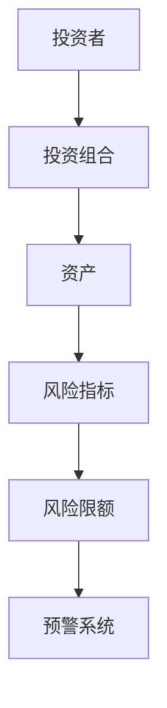
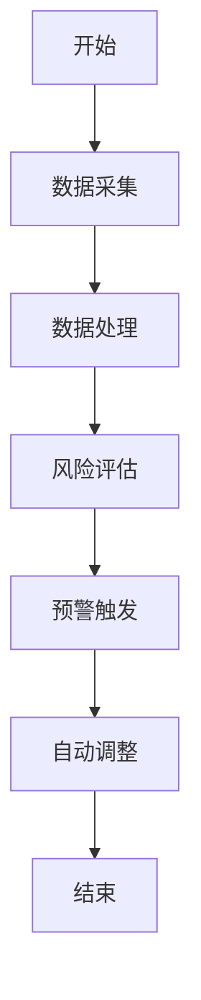
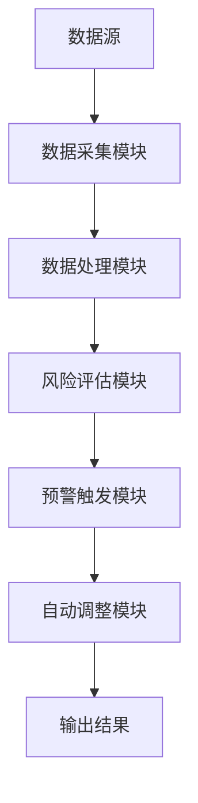

                 


# 《金融风险限额突破预警与自动调整系统》

## 关键词：金融风险，限额突破，预警机制，自动调整，系统架构

## 摘要：金融风险管理是金融机构稳健运营的核心，限额突破预警与自动调整系统通过实时监控和智能算法，能够在风险发生前发出预警并自动调整策略，从而有效降低风险损失。本文详细介绍了该系统的核心概念、算法原理、系统架构及项目实战，帮助读者全面理解并掌握其实现方法。

---

# 第1章 问题背景与核心概念

## 1.1 问题背景

### 1.1.1 金融风险管理的重要性
金融市场的波动性和不确定性使得风险管理成为金融机构的核心任务。限额管理是其中的关键环节，用于控制投资组合的风险暴露。

### 1.1.2 限额突破的潜在风险
当投资组合的风险超过设定的限额时，可能导致重大损失，甚至引发系统性风险。因此，及时发现并处理限额突破情况至关重要。

### 1.1.3 当前金融风险管理系统的主要挑战
传统系统依赖人工监控，存在效率低、响应慢等问题。随着市场波动加剧，亟需智能化的解决方案。

## 1.2 核心概念

### 1.2.1 金融风险的定义与分类
金融风险包括市场风险、信用风险、流动性风险等，不同类型的风崄需要不同的管理策略。

### 1.2.2 风险限额的定义与作用
风险限额是对单一资产或投资组合在特定市场条件下的最大允许风险暴露，旨在控制潜在损失。

### 1.2.3 限额突破预警的机制与目标
通过实时监控和数据分析，系统能够在风险超过设定限额时发出预警，并触发相应的调整机制。

## 1.3 系统边界与外延

### 1.3.1 系统的输入与输出
- 输入：市场数据、投资组合数据、风险参数
- 输出：预警信号、调整建议

### 1.3.2 系统的适用范围与限制
适用于金融机构的投资组合管理，但不包括信用风险的具体评估。

## 1.4 核心要素组成

### 1.4.1 数据源与数据处理
包括市场数据、投资组合数据、历史数据等，需要进行清洗、整合和标准化处理。

### 1.4.2 风险评估模型
基于统计学和概率论的模型，用于计算投资组合的风险值。

### 1.4.3 预警触发机制
设定阈值，当风险指标超过阈值时触发预警。

### 1.4.4 自动调整策略
根据预警情况，自动调整投资组合的权重或头寸，以降低风险。

---

# 第2章 核心概念与联系

## 2.1 核心概念原理

### 2.1.1 风险评估的核心原理
通过数学模型计算投资组合的风险值，包括波动率、VaR（在险价值）等指标。

### 2.1.2 预警机制的逻辑框架
实时监控风险指标，当超过阈值时触发预警。

### 2.1.3 自动调整策略的实现方式
根据预警情况，自动调整投资组合的配置，以降低风险暴露。

## 2.2 概念属性特征对比表

| 概念       | 属性       | 特征               | 描述                           |
|------------|------------|--------------------|--------------------------------|
| 风险评估   | 数据来源   | 多源性             | 包括市场数据、历史数据等       |
| 预警机制   | 触发条件   | 多维度             | 包括时间、金额、交易频率等       |
| 自动调整   | 调整方式   | 动态性             | 根据实时风险情况调整             |

## 2.3 ER实体关系图



---

# 第3章 算法原理讲解

## 3.1 风险评估模型

### 3.1.1 基于VaR的风险评估
VaR（在险价值）是衡量投资组合风险的重要指标，公式为：
$$ VaR = \alpha \times \sigma $$
其中，$\alpha$是分位数，$\sigma$是投资组合的标准差。

### 3.1.2 基于历史数据的风险评估
通过历史数据分析，计算投资组合在不同市场条件下的风险暴露。

## 3.2 预警触发机制

### 3.2.1 预警触发条件
当风险指标超过设定的阈值时，触发预警。

### 3.2.2 多重条件组合预警
结合多种风险指标，设置逻辑条件，避免单一指标误报。

## 3.3 自动调整策略

### 3.3.1 动态再平衡
根据预警情况，调整投资组合的权重，以降低风险暴露。

### 3.3.2 风险对冲
通过衍生品交易对冲风险，降低投资组合的整体风险。

## 3.4 算法流程图



## 3.5 Python代码实现

```python
import numpy as np
import pandas as pd

def calculate VaR(data, alpha=0.95):
    # 计算投资组合的收益率
    returns = data.pct_change().dropna()
    # 计算VaR
    VaR = np.percentile(returns, (1-alpha)*100)
    return VaR

# 示例数据
data = pd.DataFrame({
    'return': [0.01, -0.02, 0.03, -0.01, 0.02]
})
VaR = calculate VaR(data)
print(VaR)
```

---

# 第4章 系统分析与架构设计方案

## 4.1 系统功能设计

### 4.1.1 数据采集模块
从多个数据源采集市场数据和投资组合数据。

### 4.1.2 数据处理模块
清洗、整合和标准化数据，确保数据质量。

### 4.1.3 风险评估模块
计算投资组合的风险指标，如VaR、波动率等。

### 4.1.4 预警触发模块
当风险指标超过阈值时，触发预警。

### 4.1.5 自动调整模块
根据预警情况，自动调整投资组合的配置。

## 4.2 系统架构设计

### 4.2.1 系统架构图



### 4.2.2 模块交互关系
数据采集模块接收数据，数据处理模块清洗数据，风险评估模块计算风险指标，预警触发模块判断是否触发预警，自动调整模块根据预警结果调整投资组合。

## 4.3 系统接口设计

### 4.3.1 数据接口
- 输入接口：接收市场数据和投资组合数据
- 输出接口：输出风险评估结果和调整建议

### 4.3.2 调用接口
- 风险评估接口：调用风险评估模块计算VaR
- 预警触发接口：调用预警触发模块判断是否触发预警

## 4.4 系统交互流程图


---

# 第5章 项目实战

## 5.1 环境安装

### 5.1.1 安装Python
安装Python 3.8及以上版本。

### 5.1.2 安装依赖库
安装numpy、pandas、scikit-learn等库。

## 5.2 核心功能实现

### 5.2.1 数据采集模块
编写代码从API获取市场数据。

### 5.2.2 数据处理模块
对数据进行清洗和标准化处理。

### 5.2.3 风险评估模块
实现VaR计算和风险指标分析。

### 5.2.4 预警触发模块
设置预警阈值，判断是否触发预警。

### 5.2.5 自动调整模块
根据预警结果调整投资组合的配置。

## 5.3 代码实现与解读

```python
import numpy as np
import pandas as pd

def calculate VaR(data, alpha=0.95):
    returns = data.pct_change().dropna()
    VaR = np.percentile(returns, (1-alpha)*100)
    return VaR

# 示例数据
data = pd.DataFrame({
    'return': [0.01, -0.02, 0.03, -0.01, 0.02]
})
VaR = calculate VaR(data)
print(VaR)
```

## 5.4 实际案例分析

### 5.4.1 案例背景
假设某投资组合的风险限额为5%的VaR，市场波动加剧，VaR超过限额。

### 5.4.2 系统响应
系统触发预警，并自动调整投资组合，降低风险暴露。

## 5.5 项目小结

通过实际案例分析，验证了系统的有效性和实用性。

---

# 第6章 最佳实践与小结

## 6.1 小结

本文详细介绍了金融风险限额突破预警与自动调整系统的核心概念、算法原理、系统架构和项目实战，帮助读者全面理解系统的实现方法。

## 6.2 注意事项

在实际应用中，需根据具体业务需求调整系统参数和算法模型。

## 6.3 拓展阅读

建议进一步研究高级风险评估模型和更复杂的预警机制。

---

通过以上目录大纲，您可以逐步深入理解金融风险限额突破预警与自动调整系统的实现方法和应用价值。

