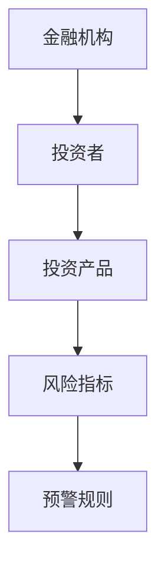
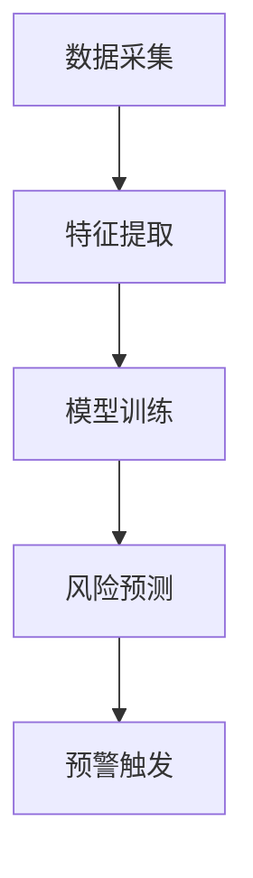
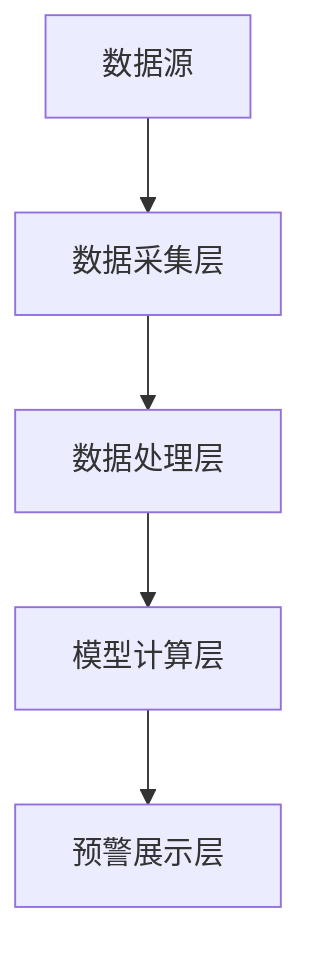
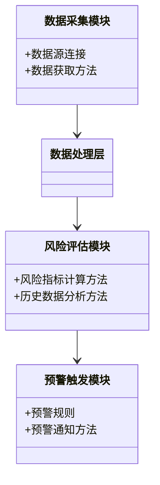
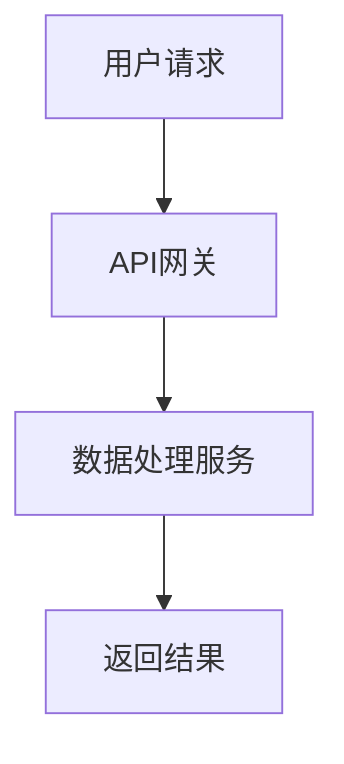

                 


# 金融风险限额突破预警系统

## 关键词：金融风险，限额突破，预警系统，时间序列分析，机器学习，系统架构

## 摘要：  
金融风险限额突破预警系统通过实时监控和分析金融市场数据，识别潜在风险，提前发出预警信号，帮助金融机构规避或减少损失。本文详细阐述了系统的核心算法原理、系统架构设计、项目实现方案以及实际应用场景，为金融机构构建高效的风险管理工具提供参考。

---

# 第1章 金融风险限额突破预警系统背景介绍

## 1.1 问题背景与描述

### 1.1.1 金融风险的定义与类型
金融风险是指在金融市场中，由于各种不确定性因素导致的资产价值损失或收益下降的可能性。常见的金融风险类型包括市场风险、信用风险、流动性风险和操作风险。

- **市场风险**：由于市场价格波动引起的损失，例如股票市场的波动。
- **信用风险**：由于交易对手无法履行合同义务而引起的损失。
- **流动性风险**：无法及时以合理价格买卖资产的风险。
- **操作风险**：由于内部操作失误或外部事件引起的损失。

### 1.1.2 限额突破的定义与影响
限额突破是指金融机构在进行交易或投资时，某些关键风险指标（如VaR、最大回撤等）超过预先设定的风险容忍度。一旦突破限额，可能会引发以下问题：

- **损失扩大**：未能及时干预可能导致更大的损失。
- **声誉风险**：限额突破可能引发客户信任危机。
- **合规风险**：许多监管机构要求金融机构严格遵守风险限额规定。

### 1.1.3 问题解决与边界
为了应对限额突破问题，金融机构需要实时监控各项风险指标，并在突破阈值时及时发出预警信号。系统的核心目标是：

- 实时监控：持续跟踪关键风险指标。
- 预警触发：当指标超过阈值时，立即通知相关人员。
- 自动化干预：在某些情况下，系统可以自动执行纠正措施。

系统的边界包括：

- **输入**：金融市场数据、交易记录、风险指标。
- **输出**：预警信号、风险报告。
- **限制**：仅处理已设定的风险指标，不考虑非定量风险因素。

## 1.2 核心概念与联系

### 1.2.1 实体关系图（ER图）



### 1.2.2 本章小结
本章介绍了金融风险的定义与类型，分析了限额突破的定义与影响，并通过ER图展示了系统的核心概念及其联系。接下来将深入探讨系统的算法原理。

---

# 第2章 金融风险限额突破预警系统的核心算法原理

## 2.1 算法原理概述

### 2.1.1 时间序列分析
时间序列分析是一种通过分析历史数据来预测未来趋势的方法。常用的模型包括ARIMA（自回归积分滑动平均模型）和GARCH（广义自回归条件异方差模型）。

#### ARIMA模型
ARIMA模型适用于具有趋势性和周期性的数据。其数学公式为：

$$ARIMA(p, d, q) = 0$$

其中：
- $p$ 是自回归阶数。
- $d$ 是差分阶数。
- $q$ 是移动平均阶数。

#### GARCH模型
GARCH模型用于捕捉金融数据中的波动性特征，公式为：

$$R_t = \alpha_0 + \alpha_1 R_{t-1} + \beta_1 \sigma_{t-1}^2 + \epsilon_t$$

其中：
- $R_t$ 是收益率。
- $\sigma_t^2$ 是波动率。
- $\epsilon_t$ 是误差项。

### 2.1.2 机器学习模型
机器学习模型（如随机森林、神经网络）可以用于分类或回归任务，帮助识别非线性风险因素。

## 2.2 算法流程图



## 2.3 算法实现代码

### 数据采集代码

```python
import pandas as pd
import numpy as np

def fetch_data(start_date, end_date):
    # 从数据库或API获取数据
    data = pd.DataFrame({
        'date': pd.date_range(start=start_date, end=end_date),
        'value': np.random.randn(100) * 100 + 1000
    })
    return data
```

### 模型训练代码

```python
from sklearn.linear_model import LinearRegression

def train_model(X, y):
    model = LinearRegression()
    model.fit(X, y)
    return model
```

### 预警触发代码

```python
def trigger预警(threshold, predicted_value):
    if predicted_value > threshold:
        return True
    else:
        return False
```

## 2.4 数学模型与公式

### 时间序列模型

$$ARIMA(p, d, q) = 0$$

### 风险评估公式

$$风险值 = \sum_{i=1}^{n} (预测值_i - 实际值_i)^2$$

## 2.5 本章小结
本章介绍了系统的核心算法原理，包括时间序列分析和机器学习模型，并通过流程图和代码示例展示了算法实现。接下来将从系统架构设计的角度进行详细分析。

---

# 第3章 金融风险限额突破预警系统分析与架构设计

## 3.1 系统功能模块

### 3.1.1 数据采集模块
数据采集模块负责从交易系统、市场数据源等处获取实时数据。

### 3.1.2 风险评估模块
该模块基于历史数据和实时数据，计算各项风险指标。

### 3.1.3 预警触发模块
当风险指标超过阈值时，系统触发预警信号。

## 3.2 系统架构设计

### 3.2.1 系统架构图



### 3.2.2 功能模块类图



## 3.3 系统接口设计

### 3.3.1 API接口定义
- GET /data：获取实时数据。
- POST /predict：进行风险预测。
- PUT /threshold：设置预警阈值。

### 3.3.2 接口交互流程图



## 3.4 本章小结
本章通过系统架构设计和功能模块分析，详细阐述了系统的整体结构和各部分的协作关系。接下来将通过项目实战部分，展示系统的具体实现。

---

# 第4章 金融风险限额突破预警系统项目实战

## 4.1 环境安装与配置

### 4.1.1 Python环境安装
建议使用Anaconda或虚拟环境来管理依赖项。

### 4.1.2 库依赖安装
运行以下命令安装所需库：

```bash
pip install pandas numpy scikit-learn mermaid4jupyter jupyterlab
```

## 4.2 核心代码实现

### 4.2.1 数据采集代码

```python
import pandas as pd
import requests

def fetch_data(api_key, start_date, end_date):
    url = f"https://api.example.com/data?api_key={api_key}&start={start_date}&end={end_date}"
    response = requests.get(url)
    data = pd.DataFrame(response.json())
    return data
```

### 4.2.2 模型训练代码

```python
from sklearn.model_selection import train_test_split
from sklearn.metrics import mean_squared_error
from sklearn.linear_model import LinearRegression

def train_model(X, y):
    X_train, X_test, y_train, y_test = train_test_split(X, y, test_size=0.2, random_state=42)
    model = LinearRegression()
    model.fit(X_train, y_train)
    print(f"均方误差: {mean_squared_error(model.predict(X_test), y_test)}")
    return model
```

### 4.2.3 预警触发代码

```python
def trigger预警(model, threshold, new_data):
    predicted_value = model.predict(new_data)
    if predicted_value > threshold:
        return True
    else:
        return False
```

## 4.3 代码解读与分析
- **数据采集**：通过API获取实时数据，确保数据的准确性和及时性。
- **模型训练**：使用线性回归模型进行风险预测，训练完成后输出均方误差以评估模型性能。
- **预警触发**：根据预测值与阈值的比较，决定是否触发预警信号。

## 4.4 项目小结
本章通过具体的代码实现，展示了如何构建一个完整的金融风险限额突破预警系统。实际案例分析和详细讲解帮助读者更好地理解系统的应用场景和实现细节。

---

# 第5章 最佳实践与注意事项

## 5.1 最佳实践
- **数据清洗**：确保输入数据的准确性和完整性。
- **模型调优**：根据实际需求调整模型参数，优化预测性能。
- **多模型对比**：结合不同模型的优势，选择最适合的方案。

## 5.2 小结
通过本文的详细讲解，读者可以掌握金融风险限额突破预警系统的核心算法和系统架构设计方法。系统化的项目实战部分为读者提供了实际操作的经验，帮助其更好地理解和应用这套预警系统。

## 5.3 注意事项
- **数据隐私**：确保数据的保密性和合规性。
- **系统稳定性**：保证系统的高可用性和快速响应能力。
- **持续优化**：根据市场变化和业务需求，不断优化系统性能。

---

# 总结

本文从金融风险限额突破预警系统的背景出发，详细阐述了系统的算法原理、系统架构设计、项目实现方案以及实际应用场景。通过本文的学习，读者可以掌握构建高效金融风险管理工具的核心方法，并将其应用于实际业务中。未来，随着技术的进步和市场的变化，这套系统将进一步完善，为金融机构的风险管理提供更有力的支持。

