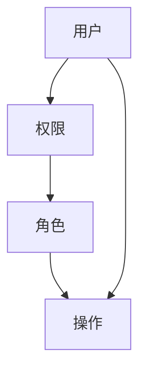
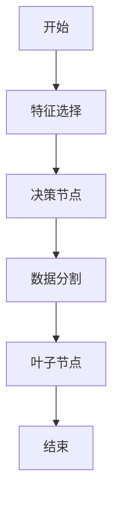
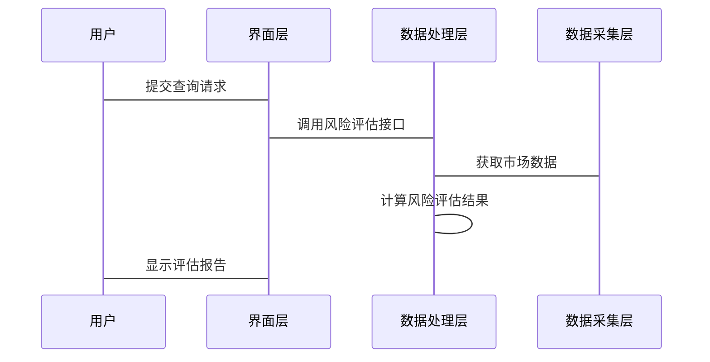

                 


# 《金融风险限额管理自动化系统》

## 关键词
- 金融风险管理
- 自动化系统
- 风险评估
- 系统架构
- 机器学习算法

## 摘要
本文将详细探讨金融风险限额管理自动化系统的构建与实现。通过分析传统风险管理的局限性，介绍自动化系统的核心概念与架构设计，阐述基于机器学习的算法原理，并通过实际案例展示系统在金融领域的应用。内容涵盖从背景介绍到项目实战的各个层面，旨在为金融机构提供高效的风险管理解决方案。

---

## 第一部分: 金融风险限额管理的背景与挑战

### 第1章: 金融风险限额管理的背景与挑战

#### 1.1 金融风险限额管理的定义与重要性
- **1.1.1 什么是金融风险限额管理**
  - 风险限额管理是金融机构控制风险的关键手段，通过设定和监控风险敞口，确保在可承受范围内的风险暴露。
- **1.1.2 限额管理在金融机构中的作用**
  - 防范系统性风险，保护投资者利益，确保金融机构稳健运营。
- **1.1.3 限额管理的必要性与挑战**
  - 随着金融市场的复杂化，传统手工管理效率低下，容易出现人为错误，且难以实时监控和调整。

#### 1.2 传统限额管理的局限性
- **1.2.1 手动管理的低效性**
  - 依赖人工计算和监控，耗时且容易出错。
- **1.2.2 信息孤岛与数据不一致的问题**
  - 数据分散在不同系统中，难以整合和分析，导致决策不准确。
- **1.2.3 风险评估的不准确性**
  - 传统方法依赖历史数据和经验判断，难以应对市场变化带来的非线性风险。

#### 1.3 自动化系统的引入
- **1.3.1 自动化技术在金融领域的应用趋势**
  - 金融机构 increasingly adopt automation to enhance efficiency and accuracy.
- **1.3.2 自动化限额管理系统的概念**
  - 利用技术手段实现风险评估、限额设定和实时监控的自动化。
- **1.3.3 自动化带来的效率与准确性提升**
  - 实现实时数据处理和动态调整，显著提高风险管理的效率和准确性。

#### 1.4 本章小结
- 介绍了金融风险限额管理的定义、重要性和传统管理的局限性。
- 强调了引入自动化系统的必要性及其带来的优势。

---

## 第二部分: 核心概念与系统架构

### 第2章: 核心概念与系统架构原理

#### 2.1 核心概念分析
- **2.1.1 风险评估模型**
  - 使用数学模型对风险进行量化评估，如VaR（Value at Risk）和CVaR（Conditional Value at Risk）。
- **2.1.2 限额计算方法**
  - 基于风险评估结果，设定各业务部门的风险敞口上限。
- **2.1.3 数据流与信息处理流程**
  - 数据采集、清洗、分析、评估、限额设定和监控的全过程。

#### 2.2 系统架构设计
- **2.2.1 分层架构设计**
  - 数据采集层、数据处理层、业务逻辑层和用户界面层，确保系统的模块化和高扩展性。
- **2.2.2 模块化设计原则**
  - 各功能模块独立开发和维护，便于升级和扩展。
- **2.2.3 高可用性与容错机制**
  - 采用负载均衡、冗余设计和故障容错技术，确保系统稳定运行。

#### 2.3 实体关系图（ER图）


#### 2.4 本章小结
- 介绍了系统的核心概念和架构设计，展示了实体关系图，明确了系统各部分的关联。

---

## 第三部分: 算法原理与数学模型

### 第3章: 风险评估算法原理

#### 3.1 风险评估模型的选择
- **3.1.1 线性回归模型**
  - 简单线性回归用于预测单一变量对风险的影响。
- **3.1.2 支持向量机（SVM）**
  - 适用于高维数据的分类和回归问题，适合处理复杂的非线性关系。
- **3.1.3 随机森林与决策树**
  - 集成学习方法，通过多个决策树的组合提高预测准确性和鲁棒性。

#### 3.2 基于机器学习的风险评估
- **3.2.1 数据预处理与特征提取**
  - 数据清洗、标准化和特征选择，确保模型输入的有效性。
- **3.2.2 模型训练与优化**
  - 使用训练数据训练模型，并通过交叉验证优化模型参数。
- **3.2.3 模型评估与验证**
  - 通过测试数据评估模型的准确率、召回率和F1分数，确保模型性能。

#### 3.3 数学模型与公式
- **3.3.1 线性回归模型公式**
  $$ y = \beta_0 + \beta_1x + \epsilon $$
- **3.3.2 决策树算法流程图**


#### 3.4 本章小结
- 介绍了几种常用的风险评估算法，展示了线性回归模型的公式和决策树的流程图，为后续系统设计提供理论基础。

---

## 第四部分: 系统分析与架构设计

### 第4章: 系统分析与架构设计方案

#### 4.1 问题场景介绍
- **4.1.1 风险限额管理的典型场景**
  - 银行、证券公司等金融机构在日常业务中的风险监控需求。
- **4.1.2 系统需要解决的问题**
  - 实时监控、动态调整、多部门协作和数据安全性。
- **4.1.3 系统的目标与范围**
  - 建立自动化系统，实现风险评估、限额设定和实时监控的自动化。

#### 4.2 系统功能设计
- **4.2.1 风险评估模块**
  - 输入市场数据，计算VaR和CVaR，生成风险评估报告。
- **4.2.2 限额管理模块**
  - 根据风险评估结果，设定各业务部门的风险敞口上限，并实时监控。
- **4.2.3 报告生成模块**
  - 生成定期风险报告，供管理层决策参考。

#### 4.3 系统架构设计
- **4.3.1 分层架构**
  - 数据采集层：负责从各个业务系统中采集数据。
  - 数据处理层：对数据进行清洗、转换和分析。
  - 业务逻辑层：实现风险评估、限额计算和监控功能。
  - 用户界面层：提供直观的用户界面，供用户操作和查看报告。
- **4.3.2 模块化设计**
  - 各功能模块独立开发，便于维护和升级。

#### 4.4 接口设计与交互序列图
- **4.4.1 系统接口设计**
  - 定义RESTful API接口，实现不同模块之间的数据交互。
- **4.4.2 交互序列图**


#### 4.5 本章小结
- 描述了系统需要解决的问题和目标，详细设计了系统的功能模块和架构，并展示了交互序列图。

---

## 第五部分: 项目实战

### 第5章: 项目实战

#### 5.1 环境安装与配置
- **5.1.1 安装Python环境**
  - 使用Anaconda安装Python 3.8及以上版本。
- **5.1.2 安装必要的库**
  - 使用pip安装numpy、pandas、scikit-learn、flask等库。

#### 5.2 系统核心代码实现
- **5.2.1 数据处理模块**
  ```python
  import pandas as pd
  import numpy as np

  # 数据清洗
  def clean_data(df):
      df = df.dropna()
      df = df.replace([np.inf, -np.inf], np.nan)
      return df.dropna()
  ```

- **5.2.2 风险评估模块**
  ```python
  from sklearn.ensemble import RandomForestRegressor
  from sklearn.metrics import mean_squared_error

  def risk_assessment(X_train, y_train):
      model = RandomForestRegressor(n_estimators=100, random_state=42)
      model.fit(X_train, y_train)
      return model
  ```

- **5.2.3 限额计算模块**
  ```python
  def calculate_limits(portfolio_value, risk_tolerance):
      max_limit = portfolio_value * risk_tolerance
      return max_limit
  ```

#### 5.3 代码应用解读与分析
- **5.3.1 数据处理模块解读**
  - 该模块负责清洗数据，确保数据的完整性和准确性。
- **5.3.2 风险评估模块解读**
  - 使用随机森林回归模型进行风险评估，模型训练后可用于预测风险值。
- **5.3.3 限额计算模块解读**
  - 根据投资组合的价值和风险容忍度，计算出每个业务部门的风险敞口上限。

#### 5.4 实际案例分析
- **5.4.1 案例背景**
  - 假设某银行的投资组合价值为10亿元，风险容忍度为2%。
- **5.4.2 数据处理**
  - 采集市场数据，清洗后得到可用于模型训练的数据集。
- **5.4.3 风险评估**
  - 使用随机森林模型计算出各资产的风险值，并生成风险评估报告。
- **5.4.4 限额设定**
  - 根据风险评估结果和风险容忍度，计算出各业务部门的风险敞口上限，并实时监控。

#### 5.5 项目总结
- **5.5.1 系统实现的关键点**
  - 数据处理的准确性、模型训练的效率和限额计算的实时性。
- **5.5.2 系统的优势**
  - 实现了自动化风险评估和限额管理，提高了效率和准确性，降低了人为错误的风险。
- **5.5.3 未来的优化方向**
  - 引入更复杂的机器学习模型，如神经网络，提高风险评估的准确性。
  - 实现多语言支持和移动端访问，提升用户体验。

#### 5.6 本章小结
- 通过实际案例展示了系统的核心功能和实现过程，总结了系统的优势和优化方向。

---

## 第六部分: 最佳实践与小结

### 第6章: 最佳实践与总结

#### 6.1 小结
- 本文详细探讨了金融风险限额管理自动化系统的构建与实现，涵盖了从背景介绍到项目实战的各个方面。
- 系统的核心功能包括数据处理、风险评估、限额计算和实时监控，通过自动化技术显著提高了风险管理的效率和准确性。

#### 6.2 注意事项
- 数据安全是系统设计的重要考虑因素，必须采取加密和访问控制措施，防止数据泄露和非法访问。
- 系统的实时性要求较高，需要选择高效的算法和优化数据处理流程，确保系统能够快速响应。

#### 6.3 拓展阅读
- 推荐阅读《机器学习实战》和《软件架构设计》，深入了解机器学习算法和系统架构设计的相关知识。

#### 6.4 本章小结
- 总结了本文的主要内容，强调了数据安全和系统实时性的注意事项，并推荐了进一步阅读的资料。

---

## 结语

金融风险限额管理自动化系统的引入，标志着金融风险管理进入了新的阶段。通过自动化技术，金融机构能够更高效、更准确地进行风险评估和限额管理，有效降低风险敞口，保障机构的稳健运行。希望本文的内容能够为金融机构的风险管理提供有益的参考和指导。

