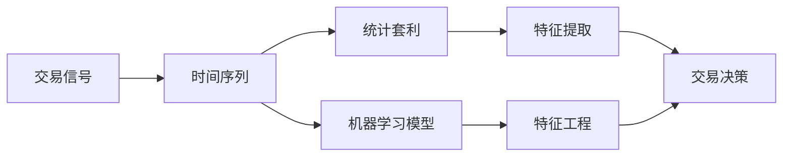
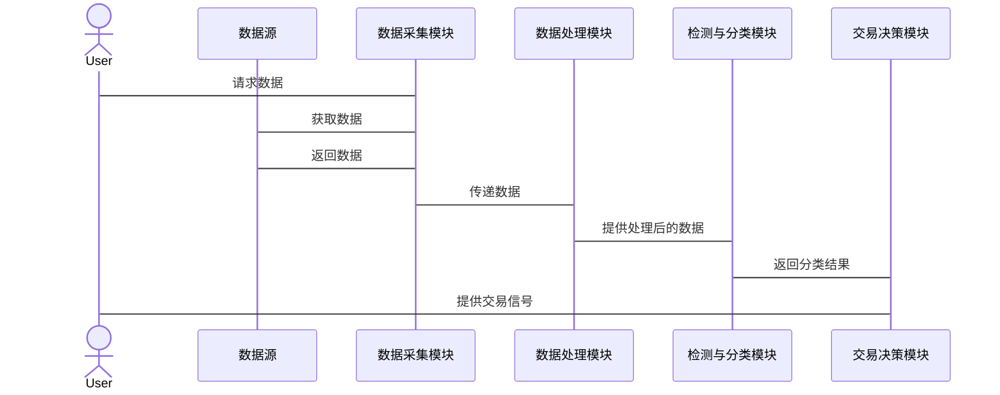

                 

# 《金融高频交易信号检测与分类》

> 关键词：高频交易，信号检测，信号分类，统计套利，机器学习，时间序列分析

> 摘要：本文深入探讨了金融高频交易中的信号检测与分类问题，从理论基础到实际应用，系统性地分析了高频交易的特点、信号检测与分类的核心概念、算法原理、系统架构设计以及项目实战。文章结合统计套利与机器学习方法，通过详细的技术分析和代码实现，展示了如何在高频交易中有效检测和分类信号，为交易者提供决策支持。

---

# 第一部分: 金融高频交易信号检测与分类概述

## 第1章: 高频交易与信号检测的背景介绍

### 1.1 高频交易的定义与特点
#### 1.1.1 高频交易的定义
高频交易是指在极短时间内进行大量金融资产交易的策略，通常利用算法和计算机技术，捕捉市场中的微小价格波动，以获取利润。高频交易的特点包括高频、高速、高效。

#### 1.1.2 高频交易的核心特点
- **高频性**：交易频率极高，通常在毫秒级别完成。
- **高速性**：依赖高速网络和低延迟硬件。
- **高效性**：利用算法快速决策，减少人为干预。

#### 1.1.3 高频交易的市场影响
高频交易对市场的影响包括增加流动性、降低买卖价差，但也可能导致市场波动加剧和交易不透明。

### 1.2 信号检测与分类的背景
#### 1.2.1 信号检测的定义
信号检测是指在金融市场中，通过分析价格、成交量等数据，识别出潜在的交易信号。

#### 1.2.2 信号分类的必要性
在高频交易中，信号分类可以帮助交易者区分不同的市场状态，例如趋势、震荡、反转等。

#### 1.2.3 高频交易中信号检测与分类的应用场景
- **统计套利**：利用资产价格的短期偏差进行套利。
- **市场情绪分析**：通过高频数据判断市场情绪。
- **风险控制**：实时监控市场波动，避免重大损失。

---

## 第2章: 高频交易信号检测与分类的核心概念

### 2.1 核心概念与原理
#### 2.1.1 信号检测的基本原理
信号检测基于时间序列分析，通过统计方法或机器学习模型识别数据中的异常点或模式。

#### 2.1.2 信号分类的基本原理
信号分类是对检测到的信号进行分类，通常使用监督学习方法，例如随机森林、支持向量机等。

#### 2.1.3 高频交易信号的特征分析
高频交易信号的特征包括波动性、均值回归性、趋势性等。

### 2.2 核心概念对比分析
#### 2.2.1 统计套利与机器学习方法的对比
统计套利依赖于资产价格的统计特性，而机器学习方法则通过数据驱动的方式发现模式。

#### 2.2.2 时间序列分析与模式识别的对比
时间序列分析侧重于序列的时序特性，而模式识别侧重于数据的整体结构。

#### 2.2.3 信号强度与交易机会的关系
信号强度反映了交易机会的大小，强度越高，交易机会越大。

### 2.3 实体关系图

---

# 第二部分: 高频交易信号检测与分类的算法原理

## 第3章: 统计套利与信号检测

### 3.1 统计套利的基本原理
#### 3.1.1 均值回归策略
均值回归策略假设价格会回归其历史均值，适用于检测短期价格偏差。

#### 3.1.2 股价配对分析
股价配对分析通过比较两只股票的价格关系，寻找套利机会。

#### 3.1.3 统计套利的数学模型
统计套利的数学模型包括均值回归模型、协方差矩阵等。

### 3.2 统计套利的实现流程
#### 3.2.1 数据采集与预处理
数据采集包括从市场数据源获取高频数据，预处理包括数据清洗和标准化。

#### 3.2.2 统计套利模型的构建
构建统计套利模型，例如基于协方差矩阵的配对策略。

#### 3.2.3 信号检测与分类的实现
通过统计套利模型检测信号，并对信号进行分类，例如“买入”、“卖出”或“观望”。

## 第4章: 机器学习与信号分类

### 4.1 机器学习的基本原理
#### 4.1.1 监督学习与无监督学习
监督学习适用于有标签的数据，无监督学习适用于无标签的数据。

#### 4.1.2 分类算法的优缺点
常用的分类算法包括决策树、随机森林、支持向量机等。

#### 4.1.3 机器学习在信号分类中的应用
机器学习可以用于时间序列分类，例如识别市场状态。

### 4.2 机器学习的实现流程
#### 4.2.1 数据特征提取
特征提取包括从高频数据中提取有用的特征，例如波动率、均值、标准差等。

#### 4.2.2 模型训练与优化
使用训练数据训练模型，并通过交叉验证优化模型参数。

#### 4.2.3 信号分类的实现与评估
通过测试数据评估模型的分类性能，例如准确率、召回率等。

---

# 第三部分: 高频交易信号检测与分类的系统架构

## 第5章: 系统分析与架构设计

### 5.1 系统功能设计
#### 5.1.1 数据采集模块
数据采集模块负责从市场数据源获取高频数据。

#### 5.1.2 数据处理模块
数据处理模块对数据进行清洗、标准化等预处理。

#### 5.1.3 检测与分类模块
检测与分类模块利用统计套利或机器学习方法检测信号并进行分类。

#### 5.1.4 交易决策模块
交易决策模块根据分类结果生成交易指令。

### 5.2 系统架构设计

### 5.3 系统接口设计
系统接口设计包括数据接口、算法接口和交易接口。

### 5.4 系统交互设计

---

## 第6章: 项目实战与代码实现

### 6.1 项目实战
#### 6.1.1 环境安装
环境安装包括安装Python、Pandas、NumPy、Scikit-learn等库。

#### 6.1.2 核心代码实现
核心代码实现包括数据处理、特征提取、模型训练与分类。

#### 6.1.3 代码应用解读
代码解读包括数据预处理、模型训练和分类结果展示。

### 6.2 实际案例分析
实际案例分析包括从数据获取、特征提取到模型训练的完整流程。

### 6.3 项目小结
项目小结包括项目实现的关键点、遇到的挑战以及解决方案。

---

## 第7章: 最佳实践与小结

### 7.1 最佳实践 tips
- 数据预处理是关键。
- 选择合适的算法和模型。
- 持续优化和监控模型性能。

### 7.2 小结
本文系统性地探讨了金融高频交易中的信号检测与分类问题，从理论到实践，全面分析了相关技术和方法。

### 7.3 注意事项
- 注意数据质量和样本偏差。
- 模型需要持续监控和优化。
- 遵守金融市场的交易规则和法律法规。

### 7.4 拓展阅读
- 推荐相关书籍和论文。
- 提供进一步学习的资源。

---

通过以上内容，我们完成了《金融高频交易信号检测与分类》的目录大纲和部分内容的撰写。后续可以根据需要继续补充各个章节的具体内容，包括详细的数学公式推导、代码实现和案例分析。

