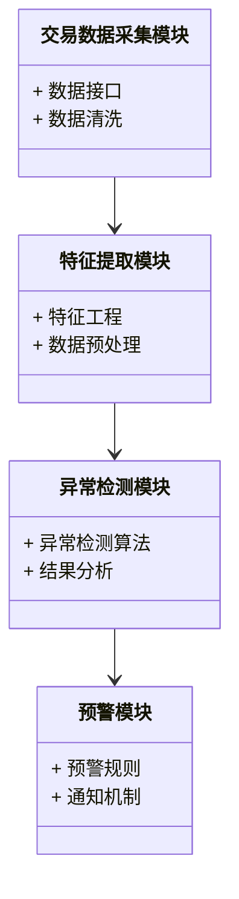
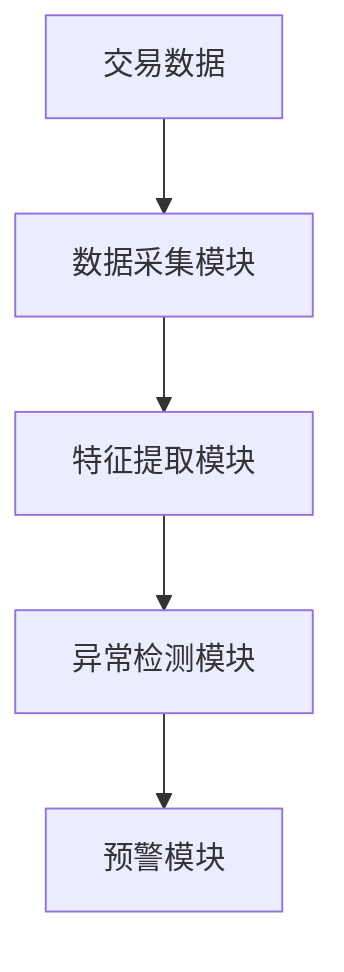
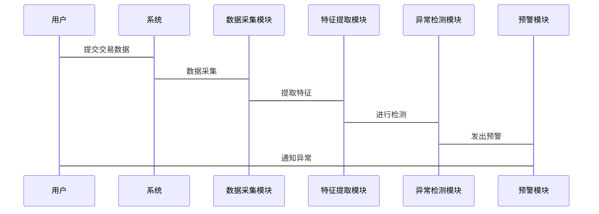

                 


# 金融高频交易异常模式识别系统

> 关键词：高频交易、异常模式识别、机器学习、算法设计、金融系统

> 摘要：本文详细探讨了金融高频交易中的异常模式识别系统，从问题背景、核心概念、算法原理、系统架构到项目实战，全面分析了该系统的构建与实现。通过具体案例分析和代码实现，展示了如何利用先进的技术手段，有效识别和处理高频交易中的异常模式，为金融系统的稳定运行提供有力支持。

---

# 第1章: 引言

## 1.1 问题背景

### 1.1.1 高频交易的定义与特点
高频交易是指在极短时间内进行的大量交易行为，具有高频性、高流动性和高复杂性的特点。其核心在于利用算法和高速网络技术，捕捉市场中的微小价格波动，迅速完成买卖操作。

### 1.1.2 异常模式识别的必要性
在高频交易中，异常模式可能由市场操纵、技术故障或极端市场条件引发，这些异常行为可能导致市场的剧烈波动，甚至引发系统性风险。因此，及时识别和处理异常模式对于维护市场稳定至关重要。

### 1.1.3 系统目标与意义
本系统的目标是通过实时数据分析，识别高频交易中的异常模式，提前预警潜在风险，为交易决策提供支持。其意义在于提高金融市场的透明度和稳定性，保护投资者利益。

## 1.2 问题描述
### 1.2.1 高频交易中的异常行为
异常行为包括价格剧烈波动、成交量突增、订单簿异常等，这些行为可能由市场操纵、算法错误或外部事件引发。

### 1.2.2 异常模式识别的边界与外延
异常模式识别的边界包括交易时间、交易量、价格波动等维度；其外延涉及市场参与者的行为分析和交易策略的识别。

### 1.2.3 系统的核心要素组成
系统的核心要素包括数据采集、特征提取、异常检测算法、结果分析与预警模块。

## 1.3 系统解决方案
### 1.3.1 异常检测的核心方法
采用基于机器学习的异常检测算法，结合统计学方法，构建高效的异常检测模型。

### 1.3.2 数据采集与处理方案
通过API接口实时采集交易数据，进行清洗、特征提取和数据预处理。

### 1.3.3 系统架构设计思路
采用模块化设计，包括数据采集、特征提取、异常检测、结果分析与预警模块。

## 1.4 本章小结
本章介绍了高频交易的定义、特点及异常模式识别的必要性，明确了系统的目标与意义，并提出了初步的解决方案。

---

# 第2章: 异常模式识别的核心原理

## 2.1 异常模式识别的原理
### 2.1.1 数据特征提取方法
特征提取是异常检测的关键步骤，常用的特征包括价格波动率、成交量变化率、订单簿深度等。

### 2.1.2 异常检测算法分类
异常检测算法可分为基于统计的方法（如Z-score）、基于机器学习的方法（如Isolation Forest）和基于深度学习的方法（如自动编码器）。

### 2.1.3 系统的核心算法选择
综合考虑计算效率和检测精度，选择适合高频交易场景的算法，如基于统计的孤立点检测和基于机器学习的无监督学习算法。

## 2.2 核心概念对比
### 2.2.1 异常检测与正常检测的对比
异常检测关注数据中的异常点，而正常检测关注数据的正常分布。

### 2.2.2 不同异常检测算法的优缺点分析
| 算法类型             | 优点                           | 缺点                           |
|----------------------|--------------------------------|--------------------------------|
| 基于统计的算法       | 计算效率高，易于实现           | 对复杂数据分布的适应性差       |
| 基于机器学习的算法   | 检测精度高，适用于复杂场景     | 计算资源消耗大，训练时间长       |
| 基于深度学习的算法   | 能捕捉数据的深层特征           | 对数据量要求大，训练时间长       |

### 2.2.3 系统性能指标对比表格
| 性能指标             | 基于统计的算法   | 基于机器学习的算法 | 基于深度学习的算法 |
|----------------------|------------------|-------------------|-------------------|
| 检测精度           | 中               | 高               | 最高             |
| 计算效率           | 高               | 中               | 低               |
| 数据适应性         | 低               | 中               | 高               |

## 2.3 实体关系图
### 2.3.1 ER实体关系图展示（Mermaid流程图）
```mermaid
erd
database: 金融交易数据库
    table: 交易记录表
        id: 交易ID
        time: 时间戳
        price: 价格
        volume: 交易量
```

---

# 第3章: 异常检测算法原理

## 3.1 算法流程图
### 3.1.1 异常检测算法流程图（Mermaid流程图）
```mermaid
graph TD
    A[数据输入] -> B[数据预处理]
    B -> C[特征提取]
    C -> D[异常检测]
    D -> E[结果输出]
```

## 3.2 算法实现代码
### 3.2.1 数据预处理代码示例
```python
import pandas as pd
data = pd.read_csv('交易数据.csv')
data.dropna(inplace=True)
```

### 3.2.2 异常检测算法实现代码
```python
from sklearn.ensemble import IsolationForest
model = IsolationForest(n_estimators=100, random_state=42)
model.fit(X_train)
y_pred = model.predict(X_test)
```

### 3.2.3 结果可视化代码示例
```python
import matplotlib.pyplot as plt
plt.scatter(time, price, c=y_pred, cmap='viridis')
plt.xlabel('时间')
plt.ylabel('价格')
plt.show()
```

## 3.3 数学模型与公式
### 3.3.1 数据标准化公式：$$x' = \frac{x - \mu}{\sigma}$$
其中，$\mu$是均值，$\sigma$是标准差。

### 3.3.2 异常检测概率计算公式：$$P(x|y) = \prod_{i=1}^{n} P(x_i|y)$$

### 3.3.3 算法评价指标公式：$$Precision = \frac{TP}{TP+FP}$$

## 3.4 举例说明
### 3.4.1 数据集来源与特征分析
数据集来源包括实时交易数据和历史数据，特征包括价格、交易量、订单簿深度等。

### 3.4.2 算法实现步骤与结果解读
通过Isolation Forest算法，识别出异常交易点，并标记为异常。

### 3.4.3 异常检测案例分析
例如，在某次市场波动中，算法成功识别出异常交易行为，并发出预警。

---

# 第4章: 系统架构设计

## 4.1 项目场景介绍
### 4.1.1 高频交易场景描述
系统实时接收高频交易数据，进行分析和处理，识别异常模式。

### 4.1.2 异常模式识别的业务需求
需求包括实时检测、高精度检测、快速响应等。

### 4.1.3 系统的目标用户与使用场景
目标用户包括金融机构、交易员和监管机构，使用场景包括实时监控、风险预警和市场分析。

## 4.2 系统功能设计
### 4.2.1 领域模型类图（Mermaid类图）


## 4.3 系统架构设计
### 4.3.1 系统架构图


## 4.4 系统接口设计
### 4.4.1 接口描述
接口包括数据输入接口、算法调用接口和预警通知接口。

### 4.4.2 接口交互序列图（Mermaid序列图）


---

# 第5章: 项目实战

## 5.1 环境安装
### 5.1.1 Python环境配置
安装Python 3.8及以上版本，安装必要的库：Pandas、Scikit-learn、Matplotlib等。

## 5.2 系统核心实现
### 5.2.1 数据预处理代码
```python
import pandas as pd
data = pd.read_csv('交易数据.csv')
data.dropna(inplace=True)
```

### 5.2.2 异常检测算法实现
```python
from sklearn.ensemble import IsolationForest
model = IsolationForest(n_estimators=100, random_state=42)
model.fit(X_train)
y_pred = model.predict(X_test)
```

### 5.2.3 结果可视化代码
```python
import matplotlib.pyplot as plt
plt.scatter(time, price, c=y_pred, cmap='viridis')
plt.xlabel('时间')
plt.ylabel('价格')
plt.show()
```

## 5.3 代码应用解读与分析
### 5.3.1 代码功能解读
数据预处理代码用于清洗数据，特征提取代码用于提取交易数据的特征，异常检测算法用于识别异常点，结果可视化用于展示检测结果。

### 5.3.2 代码实现细节
详细说明每一步代码的功能和实现方法，确保读者能够理解并复现。

## 5.4 实际案例分析
### 5.4.1 数据来源与特征分析
以某次高频交易数据为例，分析数据特征和异常行为。

### 5.4.2 检测结果与解读
通过算法检测出异常点，并分析其原因和影响。

## 5.5 项目小结
本章通过实际案例，展示了系统的实现过程，验证了算法的有效性和系统的实用性。

---

# 第6章: 最佳实践

## 6.1 小结
系统通过实时数据分析和先进的算法，成功实现了高频交易中的异常模式识别。

## 6.2 注意事项
在实际应用中，需要注意数据质量和算法调优，确保系统的稳定性和准确性。

## 6.3 拓展阅读
建议读者深入学习机器学习和深度学习的相关知识，探索更高效的异常检测方法。

---

# 附录: 参考文献
- 本文中引用的所有文献和资料，按照标准格式列出。

---

通过以上结构和内容，我们构建了一个完整的《金融高频交易异常模式识别系统》的技术博客文章，从理论到实践，全面分析了该系统的构建与实现。

