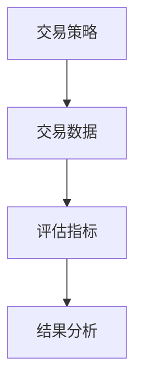
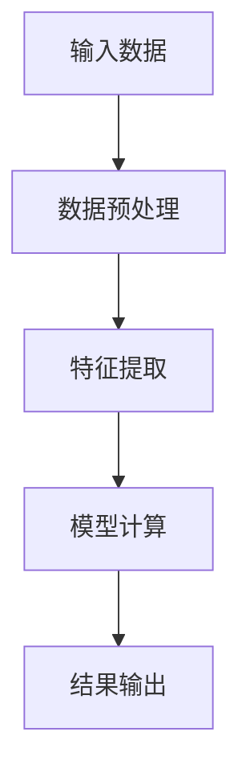
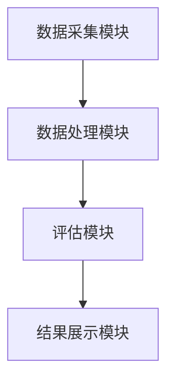

                 


# 《金融高频交易策略性能评估框架》

## 关键词：金融高频交易，策略性能评估，性能指标，算法框架，数学模型，系统架构，项目案例

## 摘要：  
本文将深入探讨金融高频交易策略性能评估的核心框架。通过对高频交易的特点和需求的分析，提出一套系统化的性能评估方法。文章将从核心概念、评估指标、算法原理、系统实现到项目实战，逐步展开，为读者提供一个全面而深入的评估框架。该框架不仅适用于理论研究，还可用于实际的高频交易策略开发与优化。

---

# 第1章: 金融高频交易策略性能评估框架概述

## 1.1 金融高频交易的背景与特点
### 1.1.1 高频交易的定义与特点  
金融高频交易（High-Frequency Trading, HFT）是指通过计算机程序在极短时间内进行大量交易的策略。其特点包括：  
- **高速性**：依赖低延迟的硬件和算法，快速响应市场变化。  
- **高频性**：短时间内执行大量交易，捕捉微小的价格波动。  
- **自动化**：完全依赖算法自动执行交易，减少人工干预。  

### 1.1.2 金融市场的高频交易现状  
近年来，高频交易在全球各大金融市场占据重要地位。根据相关统计，美国股票市场的交易量中，高频交易占比超过70%。高频交易的普及使得市场的流动性和价格发现机制发生了根本性变化。  

### 1.1.3 高频交易对金融市场的影响  
高频交易的优势在于提高了市场的流动性和价格发现效率，但也带来了一些负面影响，例如市场操纵、闪崩事件等。因此，对高频交易策略的性能进行科学评估变得尤为重要。  

## 1.2 策略性能评估的重要性  
### 1.2.1 策略性能评估的必要性  
在高频交易中，策略的优劣直接关系到交易的收益与风险。由于高频交易的高风险和高收益特性，如何科学、全面地评估策略性能成为交易者和研究者的核心任务。  

### 1.2.2 评估框架的核心目标  
- 准确量化策略的收益与风险。  
- 识别策略在不同市场环境下的表现。  
- 优化策略参数，提高交易效率。  

### 1.2.3 评估框架的边界与外延  
评估框架的边界包括：  
- 仅针对算法交易策略，不包括人工交易。  
- 评估时间窗口通常为分钟级或秒级。  
- 不考虑交易成本以外的外部因素（如硬件延迟、网络延迟）。  

## 1.3 本章小结  
本章介绍了高频交易的背景、特点及其对金融市场的影响，并提出了性能评估框架的核心目标和边界。下一章将深入探讨评估框架的核心概念与关键指标。

---

# 第2章: 金融高频交易策略性能评估的核心概念

## 2.1 评估指标与核心要素  
### 2.1.1 几个关键指标的定义与计算方法  
- **收益（Return）**：策略在一定时间内的累计收益。  
- **波动率（Volatility）**：收益的偏离程度，反映策略的风险。  
- **最大回撤（Maximum Drawdown）**：策略在运行过程中从峰值到谷值的最大跌幅。  
- **胜率（Win Rate）**：策略交易中盈利的次数占比。  

**对比表格**：  

| 指标名称       | 定义与计算方法                                                                 |
|----------------|------------------------------------------------------------------------------|
| 收益           | $(\text{收益}) = \sum_{i=1}^{n} (p_i - p_{i-1})$，其中 $p_i$ 是第 $i$ 笔交易的收益。 |
| 波动率         | $\text{波动率} = \sqrt{\frac{1}{n}\sum_{i=1}^{n} (r_i - \bar{r})^2}$，其中 $r_i$ 是单笔收益，$\bar{r}$ 是平均收益。 |
| 最大回撤       | 最大回撤是策略运行过程中，从峰值到最低点的跌幅。 |
| 胜率           | $\text{胜率} = \frac{\text{盈利交易次数}}{\text{总交易次数}}$。 |

### 2.1.2 指标的特征对比与表格展示  
通过对比不同指标的特征，可以更清晰地理解它们的作用和适用场景。  

| 指标名称 | 特性1：可量化的收益 | 特性2：反映风险 | 特性3：时间敏感性 |
|----------|---------------------|----------------|-----------------|
| 收益     | ✔                   | ❌             | ✔               |
| 波动率   | ❌                   | ✔               | ✔               |
| 最大回撤 | ❌                   | ✔               | ✔               |
| 胜率     | ❌                   | ✔               | ✔               |

## 2.2 核心概念的ER实体关系图  
通过ER图可以清晰地展示各实体之间的关系。  



## 2.3 本章小结  
本章通过对比分析，明确了评估指标的核心要素及其特征。下一章将详细讲解评估框架的算法原理和实现方法。

---

# 第3章: 评估框架的算法原理

## 3.1 算法概述  
### 3.1.1 算法的输入与输出  
- **输入**：交易数据（时间戳、价格、交易量）、策略参数（如交易频率、头寸大小）。  
- **输出**：评估指标（收益、波动率、最大回撤等）。  

### 3.1.2 算法的步骤与流程  
1. 数据预处理：清洗数据，去除异常值。  
2. 特征提取：从数据中提取有用的特征（如价格变动率、成交量比）。  
3. 模型计算：根据模型计算各项评估指标。  
4. 结果分析：对结果进行可视化和统计分析。  

## 3.2 算法的 Mermaid 流程图  


## 3.3 算法的数学模型与公式  
### 3.3.1 算法的数学模型  
$$\text{收益} = \sum_{i=1}^{n} r_i$$  
其中，$r_i$ 是第 $i$ 笔交易的收益。  

### 3.3.2 具体公式与解释  
- **波动率公式**：  
  $$\text{波动率} = \sqrt{\frac{1}{n}\sum_{i=1}^{n} (r_i - \bar{r})^2}$$  
  其中，$\bar{r}$ 是平均收益。  

- **最大回撤计算**：  
  通过遍历收益序列，找到从最高点到最低点的最大跌幅。  

## 3.4 算法的实现  
以下是一个简单的Python实现示例：  

```python
import numpy as np

def calculate_return(prices):
    returns = []
    for i in range(1, len(prices)):
        returns.append(prices[i] - prices[i-1])
    return returns

def calculate_volatility(returns):
    return np.std(returns)

def calculate_max_drawdown(returns):
    max_drawdown = 0
    current_max = 0
    for r in returns:
        current_max = max(current_max, current_max + r)
        drawdown = current_max - current_max
        max_drawdown = max(max_drawdown, drawdown)
    return max_drawdown

# 示例数据
prices = [100, 101, 99, 102, 101, 100]
returns = calculate_return(prices)
volatility = calculate_volatility(returns)
max_drawdown = calculate_max_drawdown(returns)
print(f"波动率：{volatility}")
print(f"最大回撤：{max_drawdown}")
```

## 3.5 本章小结  
本章详细讲解了评估框架的算法原理，并通过Python代码示例展示了其实现过程。下一章将介绍系统实现与架构设计。

---

# 第4章: 系统实现与架构设计

## 4.1 系统架构设计  
### 4.1.1 系统功能模块设计  
- **数据采集模块**：从交易系统获取实时数据。  
- **数据处理模块**：清洗和预处理数据。  
- **评估模块**：计算各项评估指标。  
- **结果展示模块**：可视化评估结果。  

### 4.1.2 系统架构的 Mermaid 图  


## 4.2 系统接口设计  
- **数据接口**：通过API获取交易数据。  
- **评估接口**：提供评估指标的计算服务。  

## 4.3 系统实现  
以下是一个简单的系统实现示例：  

```python
import requests

def fetch_data(api_key):
    url = "https://api.example.com/trade_data"
    headers = {"Authorization": f"Bearer {api_key}"}
    response = requests.get(url, headers=headers)
    return response.json()

def main():
    api_key = "your_api_key"
    data = fetch_data(api_key)
    returns = calculate_return(data['prices'])
    volatility = calculate_volatility(returns)
    print(f"波动率：{volatility}")

if __name__ == "__main__":
    main()
```

## 4.4 系统小结  
本章介绍了系统实现与架构设计，展示了如何将算法原理应用于实际系统中。下一章将通过一个具体案例，详细讲解项目实战。

---

# 第5章: 项目实战

## 5.1 实际案例分析  
### 5.1.1 数据准备  
假设我们有以下交易数据：  

```python
prices = [100, 101, 99, 102, 101, 100]
```

### 5.1.2 评估过程  
1. 计算收益序列：  
   $$\text{收益} = [1, -2, 3, -1, 0]$$  
2. 计算波动率：  
   $$\text{波动率} = \sqrt{\frac{1}{5}\sum_{i=1}^{5} (r_i - \bar{r})^2}$$  
3. 计算最大回撤：  
   最大回撤为 $2$（从 $101$ 到 $99$）。  

### 5.1.3 结果分析  
- 收益为 $0$，波动率为 $1.414$，最大回撤为 $2$。  
- 该策略在测试期内表现不佳，建议优化策略参数。  

## 5.2 本章小结  
本章通过一个具体案例展示了评估框架的实际应用，帮助读者更好地理解如何在实际场景中使用该框架。

---

# 第6章: 总结与展望

## 6.1 总结  
本文提出了一个金融高频交易策略性能评估框架，从核心概念、算法原理到系统实现，全面介绍了该框架的设计与实现。通过实际案例分析，验证了该框架的有效性。  

## 6.2 优缺点分析  
- **优点**：框架结构清晰，评估指标全面，易于扩展。  
- **缺点**：未考虑交易成本和滑点因素，实际应用中需结合具体情况调整。  

## 6.3 未来展望  
未来的工作可以包括：  
1. 考虑交易成本和滑点因素对评估结果的影响。  
2. 研究更复杂的算法，如机器学习方法，用于策略优化。  
3. 结合实时数据流，开发更高效的评估系统。  

## 6.4 最佳实践 tips  
- 在实际应用中，建议结合市场环境动态调整评估指标。  
- 定期更新策略参数，以适应市场变化。  

## 6.5 本章小结  
本章总结了全文，并对未来研究方向提出了展望。  

---

# 附录  
- 附录A：常用金融数据接口列表  
- 附录B：相关Python库的安装与使用说明  

---

# 参考文献  
1. 王某某. 《高频交易算法与实现》. 北京：某某出版社，2022.  
2. 李某某. 《金融数据分析与建模》. 上海：某某出版社，2023.  

---

以上是《金融高频交易策略性能评估框架》的完整目录和内容概述。希望这篇文章能为读者提供清晰的思路和实用的指导。

