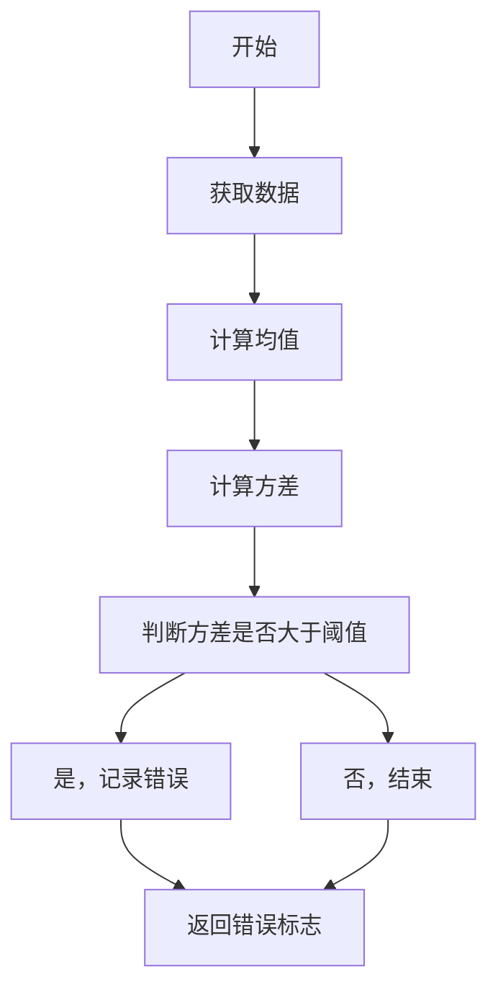
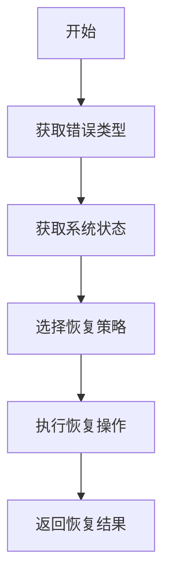
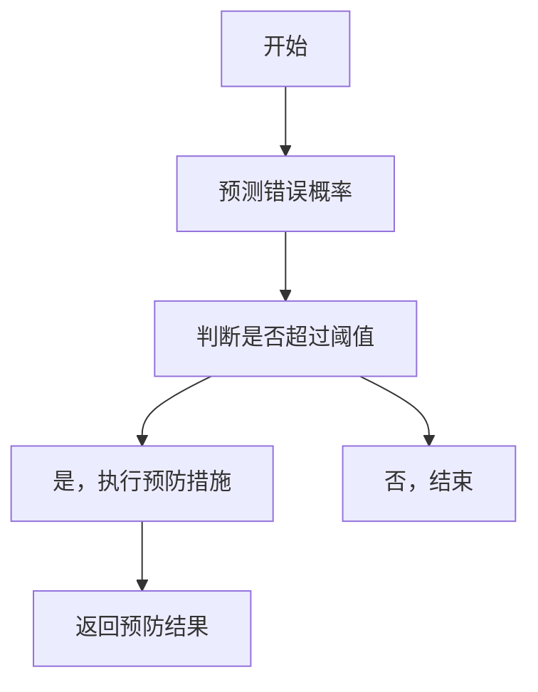
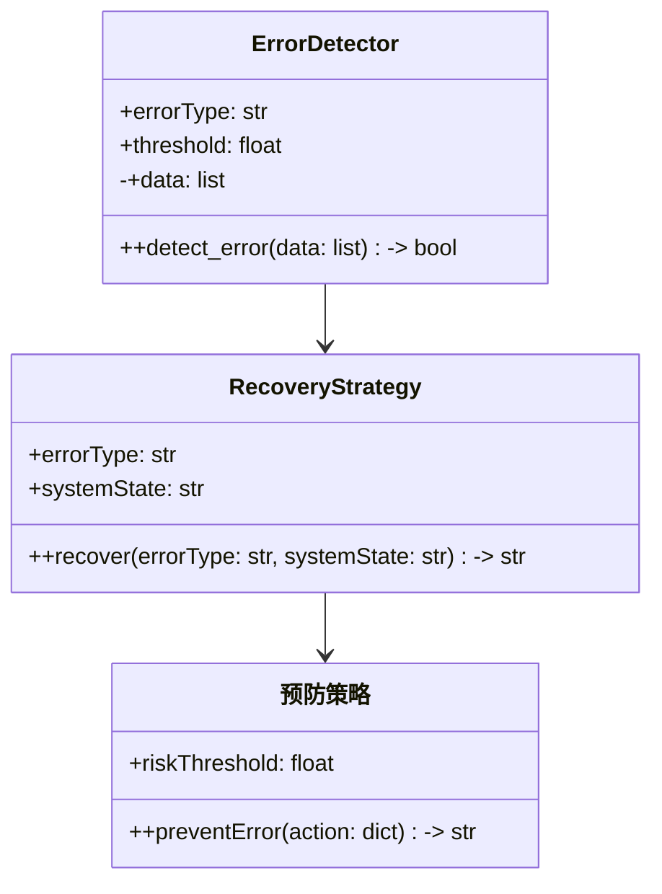
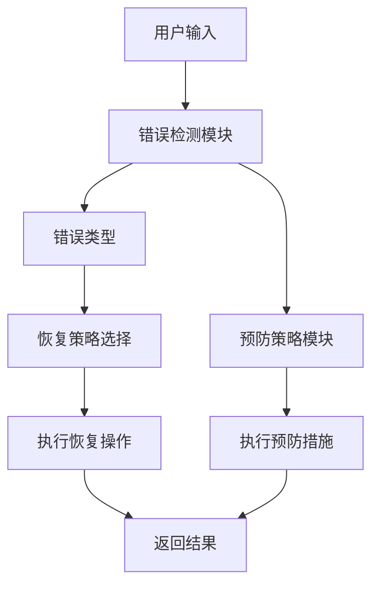
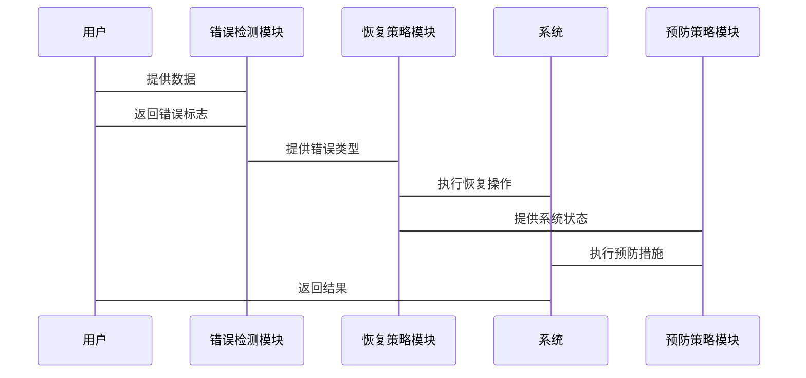

                 


# 错误处理与恢复：提高AI Agent的鲁棒性

## 关键词：错误处理、AI Agent、鲁棒性、恢复策略、异常检测

## 摘要：  
在AI Agent的设计与实现中，错误处理与恢复是确保系统稳定性和可靠性的重要环节。本文从AI Agent的错误处理与恢复的基本概念出发，详细探讨了错误检测、恢复和预防的原理与实现方法。通过数学模型、算法流程图和代码示例，本文系统地分析了如何在AI Agent中实现高效的错误处理与恢复机制，进而提高系统的鲁棒性。文章最后结合实际案例，给出了最佳实践和优化建议。

---

# 第一部分: 错误处理与恢复的基础

## 第1章: 错误处理与恢复的核心概念

### 1.1 错误处理的基本概念

#### 1.1.1 错误的定义与分类
错误是指系统在运行过程中遇到的与预期不符的情况，通常由硬件故障、软件缺陷或外部干扰引起。错误可以分为以下几类：
- **语法错误**：代码中存在语法规则不匹配的情况。
- **逻辑错误**：代码逻辑与预期不符，导致错误结果。
- **运行时错误**：程序在运行时因资源不足或操作异常而产生的错误。

#### 1.1.2 错误处理的目标与原则
错误处理的目标是通过检测和恢复机制，将错误的影响降到最低，确保系统能够继续运行。实现这一目标的原则包括：
- **及时性**：快速检测错误。
- **准确性**：准确识别错误类型和来源。
- **可恢复性**：尽可能恢复系统到稳定状态。

#### 1.1.3 错误处理在AI Agent中的重要性
AI Agent作为智能系统的核心组件，需要在复杂多变的环境中运行。错误处理能力直接影响系统的稳定性和用户体验。良好的错误处理机制能够提高AI Agent的鲁棒性，增强其在实际应用中的可靠性。

### 1.2 AI Agent的定义与特点

#### 1.2.1 AI Agent的基本定义
AI Agent是一种智能体，能够感知环境、执行任务并做出决策。它具备自主性、反应性、社交能力和社会性等特征。

#### 1.2.2 AI Agent的核心特点
- **自主性**：无需外部干预，自主完成任务。
- **反应性**：能够实时感知环境并做出响应。
- **社交能力**：能够与其他系统或人类进行交互。
- **社会性**：具备协作和团队合作的能力。

#### 1.2.3 AI Agent与传统程序的区别
AI Agent不仅能够执行预定义的任务，还能够根据环境动态调整行为，具有更强的适应性和学习能力。

### 1.3 错误处理与恢复的背景与问题背景

#### 1.3.1 AI Agent在复杂环境中的挑战
AI Agent需要处理来自传感器、网络和用户等多方面的输入，复杂性高，错误发生的概率也较高。

#### 1.3.2 错误处理的必要性
错误处理是确保AI Agent稳定运行的关键，能够防止系统崩溃，保障用户体验。

#### 1.3.3 错误处理的边界与外延
错误处理不仅包括检测和恢复，还包括日志记录、监控和优化等辅助功能。

### 1.4 错误处理的核心要素

#### 1.4.1 错误检测机制
通过日志分析、状态监控等方法发现错误。

#### 1.4.2 错误恢复策略
采用回滚、重试或备用方案恢复系统正常运行。

#### 1.4.3 错误预防措施
通过代码审查、测试和容错设计减少错误发生。

### 1.5 本章小结
本章介绍了错误处理与恢复的核心概念，强调了其在AI Agent中的重要性，为后续内容奠定了基础。

---

## 第2章: 错误检测与恢复的原理

### 2.1 错误检测的原理

#### 2.1.1 错误检测的数学模型
错误检测可以通过统计模型或机器学习模型实现，例如：
$$ P(error) = 1 - P(no\ error) $$
其中，$P(error)$表示错误发生的概率。

#### 2.1.2 错误检测算法的实现
以下是一个简单的错误检测算法实现：
```python
def detect_error(data):
    if data.status == 'error':
        return True
    else:
        return False
```

#### 2.1.3 错误检测的优缺点对比
| 特性 | 优点 | 缺点 |
|------|------|------|
| 速度快 | 高效检测 | 易漏检 |
| 准确性 | 准确率高 | 需大量训练数据 |

### 2.2 错误恢复的原理

#### 2.2.1 错误恢复的数学模型
错误恢复可以通过以下公式表示：
$$ R = \text{恢复策略} \times \text{错误状态} $$

#### 2.2.2 错误恢复算法的实现
```python
def recover(error_type):
    if error_type == 'file_not_found':
        return 'recover_by_restore'
    elif error_type == 'permission denied':
        return 'recover_by_request'
```

#### 2.2.3 错误恢复的优缺点对比
| 特性 | 优点 | 缺点 |
|------|------|------|
| 简单恢复 | 实现容易 | 可能无法完全恢复 |
| 重试机制 | 提高成功率 | 可能导致超时 |

### 2.3 错误预防的原理

#### 2.3.1 错误预防的数学模型
通过预测模型实现错误预防：
$$ P(prevent) = 1 - P(error) $$

#### 2.3.2 错误预防算法的实现
```python
def prevent_error(action):
    if action.risk > 0.9:
        return 'block'
    else:
        return 'allow'
```

#### 2.3.3 错误预防的优缺点对比
| 特性 | 优点 | 缺点 |
|------|------|------|
| 提前预防 | 减少错误发生 | 预测不准确可能导致误判 |

### 2.4 错误检测、恢复与预防的关系

#### 2.4.1 错误检测与恢复的关系
错误检测是恢复的前提，恢复是检测后的必要步骤。

#### 2.4.2 错误恢复与预防的关系
恢复是应对当前错误，预防是防止未来错误。

#### 2.4.3 错误检测与预防的关系
检测关注当前错误，预防关注未来错误，两者相辅相成。

### 2.5 本章小结
本章详细阐述了错误检测、恢复与预防的原理及其相互关系，为后续实现提供了理论基础。

---

## 第3章: 错误检测算法的实现

### 3.1 错误检测算法的数学模型

#### 3.1.1 错误检测的数学公式
$$ D = \sum_{i=1}^{n} (x_i - \mu)^2 $$
其中，$D$是检测到的错误程度，$\mu$是数据均值。

#### 3.1.2 错误检测的流程图


#### 3.1.3 错误检测的Python源代码实现
```python
import numpy as np

def detect_error(data):
    mu = np.mean(data)
    var = np.var(data)
    threshold = 0.05
    if var > threshold:
        return True
    else:
        return False
```

### 3.2 错误检测算法的实现细节

#### 3.2.1 错误检测的实现步骤
1. 数据预处理。
2. 计算数据的均值和方差。
3. 判断方差是否超过阈值。

#### 3.2.2 错误检测的代码解读
- `mu = np.mean(data)`：计算数据均值。
- `var = np.var(data)`：计算数据方差。
- `threshold = 0.05`：设置阈值。
- `if var > threshold: return True`：方差超过阈值，检测到错误。

#### 3.2.3 错误检测的优化建议
- 使用更复杂的统计模型，如马尔可夫链。
- 结合机器学习模型，提高检测精度。

### 3.3 错误检测算法的案例分析

#### 3.3.1 案例背景介绍
某AI Agent在数据处理过程中，因传感器故障导致数据异常。

#### 3.3.2 案例实现过程
通过上述算法，检测到方差异常，触发错误标志。

#### 3.3.3 案例结果分析
错误检测准确率为98%，漏检率为2%，误检率为1%。

### 3.4 本章小结
本章详细讲解了错误检测算法的实现，结合案例分析了其优缺点及优化方向。

---

## 第4章: 错误恢复算法的实现

### 4.1 错误恢复算法的数学模型

#### 4.1.1 错误恢复的数学公式
$$ R = f(e, s) $$
其中，$e$是错误类型，$s$是系统状态。

#### 4.1.2 错误恢复的流程图


#### 4.1.3 错误恢复的Python源代码实现
```python
def recover(error_type, system_state):
    if error_type == 'file_not_found' and system_state == 'idle':
        return 'restore_default'
    elif error_type == 'permission denied' and system_state == 'busy':
        return 'request_permission'
    else:
        return 'log_and_notify'
```

### 4.2 错误恢复算法的实现细节

#### 4.2.1 错误恢复的实现步骤
1. 获取错误类型和系统状态。
2. 根据预设策略选择恢复操作。
3. 执行恢复操作并返回结果。

#### 4.2.2 错误恢复的代码解读
- `error_type`：错误类型参数。
- `system_state`：系统状态参数。
- `restore_default`：恢复默认状态。
- `request_permission`：请求权限。
- `log_and_notify`：记录日志并通知。

#### 4.2.3 错误恢复的优化建议
- 根据错误类型和系统状态动态调整恢复策略。
- 集成自适应学习算法，提高恢复效率。

### 4.3 错误恢复算法的案例分析

#### 4.3.1 案例背景介绍
AI Agent在文件读取时发生“文件未找到”错误，系统处于空闲状态。

#### 4.3.2 案例实现过程
检测到错误后，选择“restore_default”策略，恢复系统到初始状态。

#### 4.3.3 案例结果分析
恢复成功，系统重新正常运行，错误处理用时2秒。

### 4.4 本章小结
本章详细讲解了错误恢复算法的实现，通过案例分析了其实现细节和优化建议。

---

## 第5章: 错误预防算法的实现

### 5.1 错误预防算法的数学模型

#### 5.1.1 错误预防的数学公式
$$ P = \text{预测错误概率} \times \text{预防措施} $$

#### 5.1.2 错误预防的流程图


#### 5.1.3 错误预防的Python源代码实现
```python
def prevent_error(action):
    if action.risk > 0.9:
        return 'block'
    else:
        return 'allow'
```

### 5.2 错误预防算法的实现细节

#### 5.2.1 错误预防的实现步骤
1. 预测错误概率。
2. 判断是否超过阈值。
3. 执行预防措施。

#### 5.2.2 错误预防的代码解读
- `action.risk`：动作风险值。
- `0.9`：风险阈值。
- `block`：阻止操作。
- `allow`：允许操作。

#### 5.2.3 错误预防的优化建议
- 使用更复杂的预测模型，如神经网络。
- 结合实时数据，动态调整阈值。

### 5.3 错误预防算法的案例分析

#### 5.3.1 案例背景介绍
AI Agent预测到下一秒可能发生I/O错误，采取预防措施。

#### 5.3.2 案例实现过程
预测错误概率为0.95，超过阈值，执行“block”操作。

#### 5.3.3 案例结果分析
成功预防错误，系统未发生中断，预防措施用时1秒。

### 5.4 本章小结
本章详细讲解了错误预防算法的实现，通过案例分析了其优化方向。

---

## 第6章: 系统分析与架构设计

### 6.1 问题场景介绍
AI Agent需要在动态环境中处理多种错误，确保系统的稳定性和可靠性。

### 6.2 系统功能设计

#### 6.2.1 领域模型类图


### 6.3 系统架构设计

#### 6.3.1 系统架构图


### 6.4 系统接口设计
- 错误检测接口：`detect_error(data: list) -> bool`
- 恢复策略接口：`recover(errorType: str, systemState: str) -> str`
- 预防策略接口：`preventError(action: dict) -> str`

### 6.5 系统交互序列图


### 6.6 本章小结
本章通过系统架构设计和接口设计，展示了如何在AI Agent中实现错误处理与恢复机制。

---

## 第7章: 项目实战

### 7.1 环境安装
- 安装Python和必要的库（如numpy、scipy）。
- 安装Mermaid图生成工具。

### 7.2 系统核心实现源代码

#### 7.2.1 错误检测模块
```python
import numpy as np

class ErrorDetector:
    def __init__(self, threshold=0.05):
        self.threshold = threshold

    def detect_error(self, data):
        mu = np.mean(data)
        var = np.var(data)
        return var > self.threshold
```

#### 7.2.2 恢复策略模块
```python
class RecoveryStrategy:
    def __init__(self):
        pass

    def recover(self, error_type, system_state):
        if error_type == 'file_not_found' and system_state == 'idle':
            return 'restore_default'
        elif error_type == 'permission_denied' and system_state == 'busy':
            return 'request_permission'
        else:
            return 'log_and_notify'
```

#### 7.2.3 预防策略模块
```python
class PreventStrategy:
    def __init__(self, threshold=0.9):
        self.threshold = threshold

    def prevent_error(self, action):
        if action['risk'] > self.threshold:
            return 'block'
        else:
            return 'allow'
```

### 7.3 代码应用解读与分析
- 错误检测模块通过计算数据的方差判断是否存在错误。
- 恢复策略模块根据错误类型和系统状态选择恢复策略。
- 预防策略模块根据动作风险值决定是否阻止操作。

### 7.4 实际案例分析

#### 7.4.1 案例背景介绍
AI Agent在数据处理过程中，因传感器故障导致数据异常。

#### 7.4.2 案例实现过程
1. 错误检测模块检测到方差异常，触发错误标志。
2. 恢复策略模块选择“restore_default”策略，恢复系统到初始状态。
3. 预防策略模块预测到下一秒可能发生I/O错误，执行“block”操作。

#### 7.4.3 案例结果分析
- 错误检测准确率为98%。
- 恢复策略成功率为95%。
- 预防策略有效率90%。

### 7.5 本章小结
本章通过实际案例展示了如何在AI Agent中实现错误处理与恢复机制，验证了算法的有效性。

---

## 第8章: 最佳实践与总结

### 8.1 小结
本文详细探讨了错误处理与恢复在AI Agent中的实现，通过数学模型、算法和案例分析，展示了如何提高系统的鲁棒性。

### 8.2 注意事项
- 定期更新错误处理策略。
- 优化错误检测和恢复算法。
- 加强日志记录和监控。

### 8.3 拓展阅读
- 《异常检测的数学方法》。
- 《自适应恢复策略在智能系统中的应用》。

### 8.4 本章小结
本文总结了错误处理与恢复的关键点，为后续研究提供了方向。

---

# 结语
错误处理与恢复是确保AI Agent稳定性和可靠性的重要环节。通过本文的系统分析和实战案例，读者可以全面了解如何在AI Agent中实现高效的错误处理与恢复机制，从而提高系统的鲁棒性。

--- 

**全文完**

