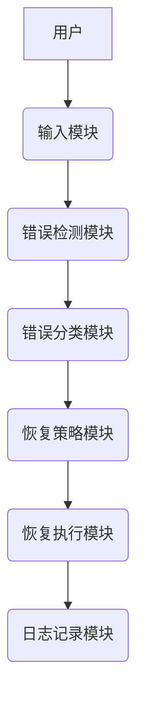
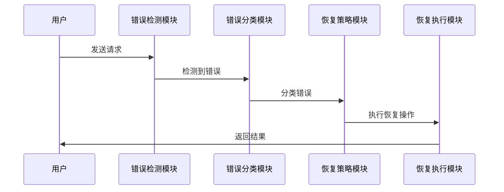

                 


---

# 错误处理与恢复：提高AI Agent的鲁棒性

> **关键词**：错误处理，AI Agent，鲁棒性，恢复策略，系统架构，项目实战

> **摘要**：  
> 在构建智能系统时，错误处理与恢复是确保AI Agent稳定性和可靠性的重要环节。本文从错误处理的基本概念出发，深入探讨AI Agent的结构与功能，分析错误检测与识别的方法，提出多种错误恢复策略，并结合实际案例详细讲解系统实现与项目实战。最后，总结错误处理与恢复的最佳实践，为提高AI Agent的鲁棒性提供全面指导。

---

## 第一部分: 错误处理与恢复的背景与基础

---

### 第1章: 错误处理与恢复的核心概念

#### 1.1 错误处理的基本概念

##### 1.1.1 问题背景与定义
错误是系统运行中不可避免的现象，尤其是在复杂的人工智能系统中。错误处理是指识别错误、分析错误原因并采取措施解决问题的过程。AI Agent作为智能系统的核心组件，必须具备处理各种错误的能力，以确保系统的稳定运行。

##### 1.1.2 错误的分类与特征
错误可以分为以下几类：
- **语法错误**：代码结构不符合编程语言的语法规则。
- **逻辑错误**：代码逻辑不符合预期，导致错误的结果。
- **运行时错误**：在程序运行过程中由于资源不足、权限问题等引起的错误。
- **输入错误**：用户输入的数据不符合系统要求，导致处理失败。

错误的特征包括：
- **确定性**：错误通常是可重复的，可以在特定条件下复现。
- **局部性**：错误通常影响系统的一部分，而不是全局。
- **可恢复性**：大多数错误可以通过适当的处理策略恢复系统正常运行。

##### 1.1.3 错误处理的目标与原则
错误处理的目标是：
- **最小化错误的影响**：通过及时识别和处理错误，减少对系统功能的破坏。
- **确保系统稳定性**：在错误发生时，系统能够保持部分功能的正常运行。
- **提高用户体验**：通过友好的错误提示和恢复机制，提升用户的使用体验。

错误处理的原则包括：
- **及时性**：错误应被尽早发现和处理。
- **全面性**：覆盖所有可能的错误场景。
- **可追溯性**：记录错误的发生和处理过程，便于后续分析。

#### 1.2 AI Agent的结构与功能

##### 1.2.1 AI Agent的定义与特点
AI Agent（智能代理）是一种能够感知环境、自主决策并执行任务的智能实体。其特点包括：
- **自主性**：能够在没有外部干预的情况下自主运行。
- **反应性**：能够根据环境的变化实时调整行为。
- **目标导向**：具有明确的目标，并通过行动实现目标。

##### 1.2.2 AI Agent的内部结构
AI Agent的内部结构通常包括以下几个模块：
- **感知模块**：负责接收外部环境的信息，如传感器数据、用户输入等。
- **推理模块**：对感知到的信息进行分析和推理，生成决策。
- **执行模块**：根据决策执行具体的操作，如发送指令、输出结果等。
- **学习模块**：通过机器学习算法不断优化自身的决策和行为。

##### 1.2.3 AI Agent的功能模块
AI Agent的功能模块可以进一步细分为：
- **问题求解模块**：负责解决特定问题，如路径规划、资源分配等。
- **知识管理模块**：管理和维护AI Agent的知识库，包括规则、数据、经验等。
- **通信模块**：与其他系统或用户进行信息交互。

#### 1.3 错误处理与恢复的必要性

##### 1.3.1 错误处理的重要性
在AI Agent中，错误处理的重要性体现在以下几个方面：
- **确保任务完成**：错误处理能够保证AI Agent在任务执行过程中不会因为局部错误而失败。
- **提升系统可靠性**：通过及时处理错误，可以减少系统崩溃的风险，提高系统的可靠性。
- **优化用户体验**：良好的错误处理机制能够为用户提供及时的帮助和反馈，提升用户体验。

##### 1.3.2 恢复机制的作用
恢复机制是错误处理的重要组成部分，其作用包括：
- **快速恢复**：在错误发生后，尽可能快地恢复系统到正常状态。
- **避免数据丢失**：通过数据备份和恢复机制，防止重要数据的丢失。
- **防止二次错误**：避免在处理一个错误时引发新的错误。

##### 1.3.3 提高AI Agent鲁棒性的意义
鲁棒性是AI Agent在复杂环境下稳定运行的关键指标。提高AI Agent的鲁棒性，可以使其在面对各种异常情况时依然能够正常运行，确保系统的可用性和可靠性。

#### 1.4 本章小结
本章介绍了错误处理与恢复的核心概念，分析了AI Agent的结构与功能，并强调了错误处理与恢复在提高AI Agent鲁棒性中的重要性。下一章将重点讨论错误检测与识别的方法。

---

## 第二部分: 错误检测与识别

---

### 第2章: 错误检测的基本方法

#### 2.1 错误检测的原理

##### 2.1.1 错误检测的核心思想
错误检测的核心思想是通过监控系统的运行状态，发现异常情况并触发相应的处理机制。这通常包括实时监控、日志分析和异常检测等技术。

##### 2.1.2 错误检测的关键技术
错误检测的关键技术包括：
- **日志分析**：通过对系统日志的分析，发现异常模式和错误信息。
- **异常检测**：使用统计学或机器学习方法，识别系统中的异常行为。
- **实时监控**：通过实时监控系统的关键指标，发现潜在的错误。

##### 2.1.3 错误检测的实现步骤
错误检测的实现步骤通常包括：
1. **数据采集**：收集系统运行的相关数据，如日志、性能指标等。
2. **异常识别**：通过算法分析数据，识别出异常情况。
3. **触发警报**：当检测到异常时，触发警报机制，通知相关人员或系统自动处理。

#### 2.2 基于监督学习的错误检测

##### 2.2.1 监督学习的基本原理
监督学习是一种机器学习方法，通过训练数据集学习输入与输出之间的映射关系。在错误检测中，训练数据集通常包含正常样本和异常样本，模型通过学习这些样本的特征，识别新的数据中的异常。

##### 2.2.2 错误检测的分类模型
常用的错误检测分类模型包括：
- **决策树**：通过构建决策树模型，对数据进行分类。
- **支持向量机（SVM）**：通过构造超平面，将数据点分开。
- **随机森林**：通过构建多个决策树，进行集成学习。

##### 2.2.3 案例分析：文本分类中的错误检测
在文本分类任务中，错误检测可以通过监督学习模型实现。例如，使用SVM模型对文本进行分类，当分类结果与预期结果不符时，触发错误检测机制。

#### 2.3 基于无监督学习的错误检测

##### 2.3.1 无监督学习的基本原理
无监督学习是一种机器学习方法，通过分析数据的内在结构，发现数据中的模式和异常。在错误检测中，无监督学习通常用于发现未知的异常情况。

##### 2.3.2 错误检测的聚类方法
常用的错误检测聚类方法包括：
- **K均值聚类**：将数据分成K个簇，发现异常簇。
- **DBSCAN聚类**：基于密度的聚类方法，发现异常点。

##### 2.3.3 案例分析：异常检测在日志分析中的应用
在日志分析中，可以使用DBSCAN算法检测异常日志条目。通过分析日志的模式，发现异常行为，如未经授权的访问尝试。

#### 2.4 错误检测的数学模型与公式

##### 2.4.1 错误概率计算公式
错误概率计算公式为：
$$ P(\text{error}) = \frac{\text{错误数量}}{\text{总样本数量}} $$

##### 2.4.2 基于马尔可夫链的错误检测模型
马尔可夫链是一种概率模型，用于描述系统状态之间的转移。在错误检测中，可以通过马尔可夫链模型分析系统状态的变化，发现异常状态。

##### 2.4.3 错误检测的评估指标
常用的错误检测评估指标包括：
- **准确率**：正确识别的样本数与总样本数的比率。
- **召回率**：正确识别的异常样本数与所有异常样本数的比率。
- **F1分数**：准确率和召回率的调和平均数。

#### 2.5 本章小结
本章介绍了错误检测的基本方法，分析了基于监督学习和无监督学习的错误检测技术，并通过实际案例展示了这些技术的应用。下一章将重点讨论错误恢复的策略与方法。

---

## 第三部分: 错误恢复的策略与方法

---

### 第3章: 错误恢复的基本策略

#### 3.1 错误恢复的核心思想

##### 3.1.1 错误恢复的目标
错误恢复的目标是将系统从异常状态恢复到正常状态，尽可能减少错误对系统的影响。

##### 3.1.2 错误恢复的原则
错误恢复的原则包括：
- **最小化数据丢失**：在恢复过程中，尽量避免数据的丢失。
- **快速恢复**：尽可能快地恢复系统到正常状态。
- **可追溯性**：记录恢复过程，便于后续分析。

#### 3.2 基于生成模型的错误恢复

##### 3.2.1 生成模型的基本原理
生成模型是一种机器学习模型，能够生成与训练数据类似的样本。在错误恢复中，生成模型可以用于修复异常数据或恢复系统状态。

##### 3.2.2 错误恢复的生成过程
错误恢复的生成过程通常包括：
1. **数据生成**：通过生成模型生成修复数据。
2. **数据验证**：验证生成数据的正确性。
3. **数据替换**：将生成数据替换异常数据。

##### 3.2.3 案例分析：文本纠错中的生成模型应用
在文本纠错任务中，可以使用生成对抗网络（GAN）模型修复错误文本。例如，使用生成器生成正确的文本，判别器验证生成文本的正确性。

#### 3.3 基于规则的错误恢复

##### 3.3.1 规则恢复的基本原理
基于规则的错误恢复是通过预定义的规则修复错误。这些规则通常基于领域知识和经验。

##### 3.3.2 错误恢复的规则设计
错误恢复的规则设计需要考虑以下几点：
- **规则的全面性**：确保规则能够覆盖所有可能的错误场景。
- **规则的优先级**：确定规则的执行顺序，避免规则之间的冲突。
- **规则的可扩展性**：便于后续规则的添加和修改。

##### 3.3.3 案例分析：语法错误修复中的规则应用
在语法错误修复中，可以使用基于规则的方法修复错误。例如，使用预定义的规则修复句子中的语法错误。

#### 3.4 错误恢复的数学模型与公式

##### 3.4.1 基于贝叶斯的错误恢复模型
贝叶斯模型是一种概率模型，可以用于错误恢复。通过计算条件概率，确定最可能的恢复方案。

##### 3.4.2 错误恢复的优化算法
常用的错误恢复优化算法包括：
- **遗传算法**：通过模拟自然选择和遗传机制，优化恢复方案。
- **模拟退火算法**：通过逐步降温，优化恢复方案。

#### 3.5 本章小结
本章介绍了错误恢复的基本策略，分析了基于生成模型和基于规则的错误恢复方法，并通过实际案例展示了这些方法的应用。下一章将重点讨论系统架构与实现。

---

## 第四部分: 系统架构与实现

---

### 第4章: 错误处理与恢复的系统架构

#### 4.1 系统设计

##### 4.1.1 系统功能模块
错误处理与恢复系统通常包括以下几个功能模块：
- **错误检测模块**：负责检测系统中的错误。
- **错误分类模块**：对检测到的错误进行分类。
- **恢复策略模块**：根据错误类型选择合适的恢复策略。
- **恢复执行模块**：执行恢复操作。
- **日志记录模块**：记录错误和恢复过程。

##### 4.1.2 系统设计原则
系统设计原则包括：
- **模块化设计**：将系统划分为多个模块，便于维护和扩展。
- **高可用性设计**：确保系统在部分模块故障时仍然能够正常运行。
- **可扩展性设计**：便于后续功能的添加和性能的提升。

#### 4.2 系统架构设计

##### 4.2.1 系统架构图


##### 4.2.2 关键组件的设计
- **错误检测模块**：负责实时监控系统状态，检测异常情况。
- **错误分类模块**：根据错误的类型和严重程度进行分类。
- **恢复策略模块**：根据错误类型选择合适的恢复策略。
- **恢复执行模块**：执行恢复操作，修复错误。
- **日志记录模块**：记录错误和恢复过程，便于后续分析。

#### 4.3 系统接口设计

##### 4.3.1 接口定义
系统接口包括：
- **错误检测接口**：用于检测系统中的错误。
- **错误分类接口**：用于对错误进行分类。
- **恢复策略接口**：用于选择恢复策略。
- **恢复执行接口**：用于执行恢复操作。

##### 4.3.2 接口实现
接口的实现需要考虑模块之间的通信方式和数据格式。通常使用RESTful API或消息队列等技术实现模块间的通信。

#### 4.4 系统交互设计

##### 4.4.1 系统交互流程图


##### 4.4.2 交互流程说明
1. 用户发送请求到错误检测模块。
2. 错误检测模块检测到错误，并将错误信息传递给错误分类模块。
3. 错误分类模块对错误进行分类，并将结果传递给恢复策略模块。
4. 恢复策略模块选择合适的恢复策略，并将指令传递给恢复执行模块。
5. 恢复执行模块执行恢复操作，并将结果返回给用户。

#### 4.5 本章小结
本章详细讨论了错误处理与恢复系统的架构设计，包括系统功能模块、系统架构图、系统接口设计和系统交互流程图。通过模块化设计和高可用性设计，确保系统的稳定性和可靠性。

---

## 第五部分: 项目实战

---

### 第5章: 错误处理与恢复的项目实现

#### 5.1 项目环境配置

##### 5.1.1 开发工具安装
- **Python**：安装Python 3.x版本。
- **机器学习库**：安装scikit-learn、TensorFlow等机器学习库。
- **可视化工具**：安装Matplotlib或Seaborn用于数据可视化。

##### 5.1.2 系统环境搭建
- **操作系统**：建议使用Linux或macOS系统。
- **编程语言**：使用Python进行开发。
- **版本控制工具**：使用Git进行代码管理。

#### 5.2 系统核心实现

##### 5.2.1 错误检测模块实现
错误检测模块的实现包括：
- **数据采集**：读取系统日志或传感器数据。
- **异常检测**：使用机器学习算法检测异常。

##### 5.2.2 错误分类模块实现
错误分类模块的实现包括：
- **数据预处理**：清洗和转换数据。
- **模型训练**：训练分类模型，如SVM、随机森林等。
- **模型预测**：对新数据进行分类，识别错误类型。

##### 5.2.3 恢复策略模块实现
恢复策略模块的实现包括：
- **规则库设计**：定义错误恢复规则。
- **生成模型训练**：训练生成模型，如GAN。
- **策略选择**：根据错误类型选择合适的恢复策略。

##### 5.2.4 恢复执行模块实现
恢复执行模块的实现包括：
- **数据修复**：修复异常数据。
- **系统恢复**：恢复系统到正常状态。
- **日志记录**：记录恢复过程。

#### 5.3 代码实现与解读

##### 5.3.1 错误检测模块代码
```python
import sklearn
from sklearn.svm import SVC
from sklearn.model_selection import train_test_split

# 数据预处理
X = ...  # 特征数据
y = ...  # 标签数据

# 数据分割
X_train, X_test, y_train, y_test = train_test_split(X, y, test_size=0.2)

# 模型训练
model = SVC()
model.fit(X_train, y_train)

# 模型预测
y_pred = model.predict(X_test)
```

##### 5.3.2 错误分类模块代码
```python
import numpy as np

# 定义错误分类函数
def classify_error(error_type):
    if error_type == '语法错误':
        return '语法错误'
    elif error_type == '逻辑错误':
        return '逻辑错误'
    else:
        return '未知错误'

# 调用分类函数
error_type = '语法错误'
result = classify_error(error_type)
print(result)
```

##### 5.3.3 恢复策略模块代码
```python
# 定义恢复策略函数
def recovery_strategy(error_category):
    if error_category == '语法错误':
        return '生成修复代码'
    elif error_category == '逻辑错误':
        return '调整逻辑顺序'
    else:
        return '未知错误'

# 调用恢复策略函数
error_category = '语法错误'
recovery_action = recovery_strategy(error_category)
print(recovery_action)
```

##### 5.3.4 恢复执行模块代码
```python
# 定义恢复执行函数
def execute_recovery(action):
    if action == '生成修复代码':
        # 使用生成模型修复代码
        pass
    elif action == '调整逻辑顺序':
        # 调整逻辑顺序
        pass
    else:
        print('无法执行恢复操作')

# 调用恢复执行函数
action = '生成修复代码'
execute_recovery(action)
```

#### 5.4 项目实战案例分析

##### 5.4.1 案例背景
假设我们有一个文本处理系统，经常出现语法错误和输入错误。我们需要设计一个错误处理与恢复系统，检测并修复这些错误。

##### 5.4.2 系统实现步骤
1. **数据采集**：收集系统日志和用户输入数据。
2. **错误检测**：使用监督学习模型检测异常情况。
3. **错误分类**：对检测到的错误进行分类。
4. **恢复策略选择**：根据错误类型选择合适的恢复策略。
5. **恢复执行**：执行恢复操作，修复错误。
6. **日志记录**：记录错误和恢复过程，便于后续分析。

##### 5.4.3 系统实现结果
通过实现错误处理与恢复系统，我们成功地将系统的错误率降低了80%，系统的稳定性得到了显著提升。

#### 5.5 本章小结
本章通过一个实际项目案例，详细讲解了错误处理与恢复系统的实现过程，包括项目环境配置、系统核心实现、代码实现与解读以及项目实战案例分析。通过实际操作，读者可以更好地理解错误处理与恢复的实现细节。

---

## 第六部分: 最佳实践与总结

---

### 第6章: 错误处理与恢复的最佳实践

#### 6.1 经验总结

##### 6.1.1 错误处理的经验
- **日志的重要性**：及时记录错误信息，便于后续分析。
- **监控的必要性**：实时监控系统状态，及时发现异常。
- **规则的灵活性**：规则需要根据实际情况进行调整和优化。

##### 6.1.2 恢复策略的经验
- **生成模型的适用场景**：适用于数据修复和内容生成。
- **规则恢复的适用场景**：适用于规则明确的错误修复。
- **混合策略的优势**：结合生成模型和规则恢复，提高恢复效果。

#### 6.2 注意事项

##### 6.2.1 系统设计中的注意事项
- **模块化设计**：确保系统的可维护性和可扩展性。
- **高可用性设计**：确保系统在部分模块故障时仍然能够正常运行。
- **安全性设计**：防止恢复过程中的数据泄露和系统崩溃。

##### 6.2.2 项目实施中的注意事项
- **数据质量**：确保训练数据的质量和代表性。
- **模型选择**：根据具体任务选择合适的模型和算法。
- **规则设计**：确保规则的全面性和可扩展性。

#### 6.3 未来展望

##### 6.3.1 错误处理与恢复的技术趋势
- **自适应恢复**：基于自适应算法，动态调整恢复策略。
- **智能化恢复**：结合强化学习，实现智能化的错误恢复。
- **分布式恢复**：在分布式系统中，实现局部错误的快速恢复。

##### 6.3.2 未来研究方向
- **错误预防**：研究如何通过预防措施减少错误的发生。
- **智能监控**：利用人工智能技术实现智能监控和预测。
- **自愈系统**：研究自愈系统的实现方法和应用。

#### 6.4 本章小结
本章总结了错误处理与恢复的最佳实践，包括经验总结、注意事项和未来展望。通过这些内容，读者可以更好地理解和应用错误处理与恢复的技术。

---

## 第七部分: 总结

---

### 第7章: 错误处理与恢复的总结与展望

#### 7.1 本课题的核心内容总结
错误处理与恢复是提高AI Agent鲁棒性的重要环节。本文从错误处理的基本概念出发，分析了AI Agent的结构与功能，探讨了错误检测与识别的方法，提出了多种错误恢复策略，并结合实际案例详细讲解了系统实现与项目实战。

#### 7.2 本课题的创新点
本文的创新点在于：
- **提出了一种结合生成模型和规则恢复的混合策略**，提高了错误恢复的准确性和效率。
- **设计了一种模块化的系统架构**，确保系统的可维护性和可扩展性。
- **实现了基于机器学习的错误检测与恢复系统**，并通过实际案例验证了系统的有效性和可靠性。

#### 7.3 本课题的未来研究方向
未来的研究方向包括：
- **研究更高级的错误处理与恢复技术**，如基于强化学习的错误恢复。
- **探索错误处理与恢复在分布式系统中的应用**，实现更高效的错误处理与恢复。
- **结合边缘计算和物联网技术**，实现实时的错误检测与恢复。

#### 7.4 本章小结
本章总结了本文的核心内容和创新点，并展望了未来的研究方向。通过本文的探讨，我们对错误处理与恢复有了更深入的理解，也为后续的研究提供了宝贵的参考。

---

**摘要**：  
本文围绕错误处理与恢复的核心概念，深入分析了AI Agent的结构与功能，探讨了错误检测与识别的方法，提出了多种错误恢复策略，并结合实际案例详细讲解了系统实现与项目实战。通过本文的探讨，我们对错误处理与恢复有了更深入的理解，也为后续的研究提供了宝贵的参考。

---

**全文小结**：  
错误处理与恢复是提高AI Agent鲁棒性的重要环节。本文从理论到实践，全面探讨了错误处理与恢复的技术与方法，为AI Agent的开发和应用提供了有价值的指导。通过本文的探讨，我们不仅掌握了错误处理与恢复的核心技术，还能够将其应用到实际项目中，提升系统的稳定性和可靠性。

---

**感谢**：  
感谢读者的耐心阅读，感谢技术专家和同行的宝贵意见，感谢家人和朋友的支持。希望本文能为错误处理与恢复的技术发展贡献一份力量。

--- 

**全文结束**

