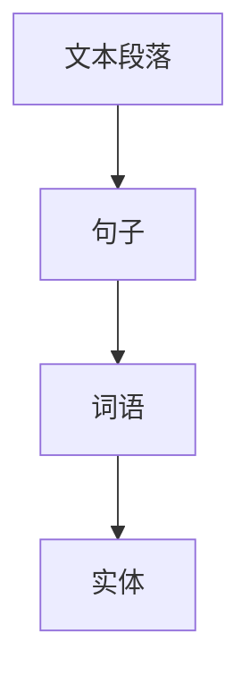
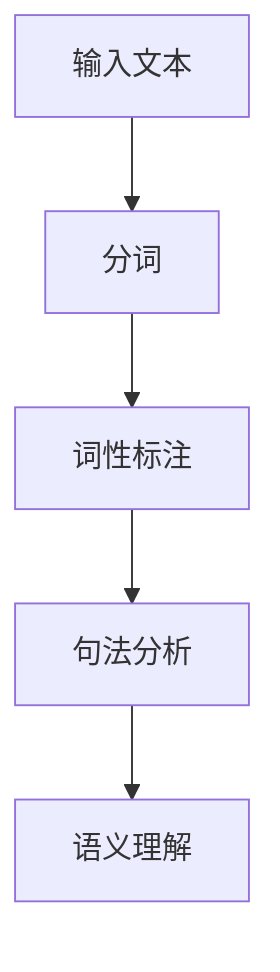

                 


# 长文本处理：增强AI Agent的阅读理解能力

## 关键词：长文本处理，AI Agent，阅读理解，自然语言处理，深度学习

## 摘要：  
长文本处理是AI Agent实现高效阅读理解的关键技术。本文从长文本处理的核心概念出发，详细分析其算法原理，并通过实际案例展示如何增强AI Agent的阅读理解能力。文章内容涵盖背景介绍、核心概念、算法原理、系统架构设计、项目实战以及未来趋势，为读者提供全面的技术解读。

---

# 第一部分：长文本处理与AI Agent阅读理解基础

## 第1章：长文本处理的背景与挑战

### 1.1 长文本处理的背景  
随着自然语言处理技术的快速发展，长文本处理逐渐成为AI Agent的核心能力之一。AI Agent需要能够理解并处理数千甚至数万字的文本，例如书籍章节、学术论文或法律文件。这些场景要求AI Agent不仅能够理解单句话，还能在长文本中捕捉上下文关系、识别关键信息，并基于这些信息做出决策或回答问题。

### 1.2 长文本处理的核心问题  
长文本处理涉及多个关键问题：  
1. **文本的理解与关联**：如何在长文本中建立句子之间的关系，理解整体内容。  
2. **信息提取**：如何从长文本中提取关键实体、事件或主题。  
3. **阅读理解的边界与外延**：明确阅读理解的范围和限制，避免信息过载或遗漏。  

### 1.3 AI Agent的阅读理解能力  
AI Agent的阅读理解能力是其智能水平的重要体现。通过长文本处理，AI Agent可以：  
1. **理解复杂场景**：例如分析合同条款、诊断医疗文档或处理技术文档。  
2. **提供深度服务**：基于长文本内容，生成总结、提取关键信息或提出解决方案。  
3. **支持决策过程**：利用长文本中的深层信息辅助决策。  

---

## 第2章：长文本处理的核心概念与联系

### 2.1 核心概念原理  
1. **文本结构化分析**：将长文本划分为段落、句子和词语，便于后续处理。  
2. **语义分析与上下文关联**：通过上下文理解词语和句子的深层含义。  
3. **阅读理解的模型架构**：采用深度学习模型（如Transformer）进行文本表示和理解。  

### 2.2 核心概念对比分析  
| 对比维度       | 基于RNN的模型 | 基于Transformer的模型 |  
|----------------|--------------|---------------------|  
| 处理长文本能力 | 较弱          | 强                  |  
| 并行计算能力   | 低            | 高                  |  
| 应用场景       | 短文本任务    | 长文本任务          |  

### 2.3 实体关系图与流程图  
#### 实体关系图（ER图）  


#### 流程图  


---

## 第3章：长文本处理的算法原理

### 3.1 基于Transformer的长文本处理  
#### 3.1.1 Transformer模型简介  
Transformer由编码器和解码器组成，通过自注意力机制捕捉文本中的全局关系。其核心公式为：  
$$\text{Attention}(Q,K,V) = \text{softmax}\left(\frac{QK^T}{\sqrt{d_k}}\right)V$$  

#### 3.1.2 BERT模型  
BERT通过双向Transformer结构实现上下文理解。其训练目标包括：  
1. **Masked LM**：随机遮蔽部分词并预测其值。  
2. **Next Sentence Prediction**：预测下一句是否是原文的下一句。  

#### 3.1.3 GPT模型  
GPT通过单向Transformer结构生成文本，适用于长文本的生成任务。  

### 3.2 基于LSTM的长文本处理  
LSTM通过长短期记忆单元（LSTM）捕捉长文本中的时序关系。其核心公式为：  
$$f_t = \text{sigmoid}(W_f h_{t-1} + U_f x_t + b_f)$$  
$$i_t = \text{sigmoid}(W_i h_{t-1} + U_i x_t + b_i)$$  
$$o_t = \text{sigmoid}(W_o h_{t-1} + U_o x_t + b_o)$$  
$$h_t = f_t \cdot c_{t-1} + i_t \cdot \tilde{c}_t$$  

---

## 第4章：系统分析与架构设计方案

### 4.1 问题场景介绍  
AI Agent需要处理长文本场景，例如：  
1. **医疗文档分析**：阅读病历并提供诊断建议。  
2. **法律合同审查**：识别合同中的关键条款。  
3. **学术论文分析**：总结论文内容并提取关键词。  

### 4.2 系统功能设计  
| 模块       | 功能描述           |  
|------------|--------------------|  
| 文本预处理 | 分词、词性标注     |  
| 语义理解   | 基于模型的阅读理解 |  
| 知识库     | 存储和检索信息     |  
| 交互模块   | 与用户进行对话     |  

### 4.3 系统架构设计  


---

## 第5章：项目实战

### 5.1 环境安装  
安装必要的库：  
```bash
pip install transformers torch numpy
```

### 5.2 核心代码实现  
#### 5.2.1 文本预处理  
```python
from transformers import BertTokenizer

tokenizer = BertTokenizer.from_pretrained('bert-base-cased')
text = "This is a long text processing example."
tokens = tokenizer.encode(text)
```

#### 5.2.2 模型训练  
```python
import torch
from torch import nn

class BERTModel(nn.Module):
    def __init__(self, vocab_size):
        super(BERTModel, self).__init__()
        self.embedding = nn.Embedding(vocab_size, 512)
        self.transformer = nn.TransformerEncoder(...)
```

### 5.3 实际案例分析  
以法律合同审查为例，展示如何通过长文本处理提取关键条款并生成总结。

---

## 第6章：高级应用与未来趋势

### 6.1 高级应用  
1. **多模态模型**：结合图像和文本进行联合处理。  
2. **可解释性AI**：提升模型的可解释性，便于用户理解AI的决策过程。  

### 6.2 未来趋势  
1. **模型小型化**：优化模型大小，便于在资源受限的环境中部署。  
2. **实时处理能力**：提升模型的实时处理速度，满足实时应用需求。  

---

## 第7章：总结与展望

### 7.1 总结  
长文本处理是AI Agent实现深度阅读理解的关键技术。通过本文的介绍，读者可以全面了解其核心概念、算法原理和实际应用。  

### 7.2 展望  
未来，长文本处理将结合更多先进技术，如多模态学习和边缘计算，进一步提升AI Agent的智能水平。  

---

## 第8章：最佳实践与注意事项

### 8.1 最佳实践  
1. **数据质量**：确保训练数据的多样性和代表性。  
2. **模型调优**：通过超参数调优提升模型性能。  
3. **性能优化**：采用模型压缩和并行计算技术提升处理效率。  

### 8.2 注意事项  
1. **文本长度限制**：部分模型对长文本处理效果不佳，需选择合适的模型架构。  
2. **计算资源**：长文本处理通常需要大量计算资源，需合理配置硬件。  

---

## 第9章：拓展阅读

### 9.1 推荐书籍  
1. 《Effective Pre-trained Transfer Learning for Image Classification》  
2. 《Attention Is All You Need》  

### 9.2 推荐论文  
1. BERT: Pre-training of Deep Bidirectional Transformers for NLP  
2. GPT-3: Generating Longer High-Quality Text with fewer Parameters  

---

通过以上内容，读者可以系统地了解长文本处理的核心技术及其在AI Agent阅读理解中的应用。

