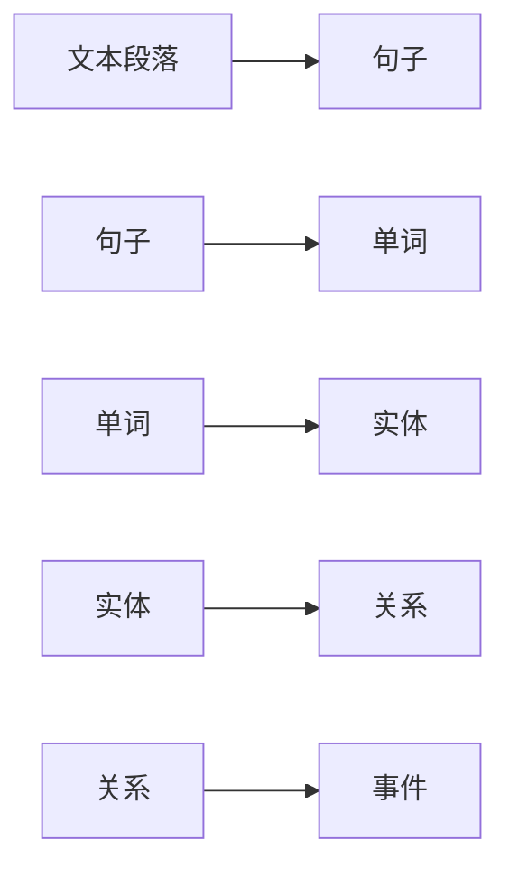
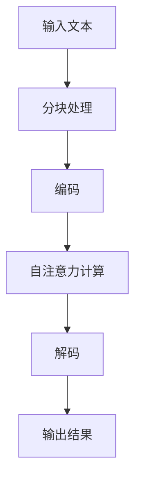
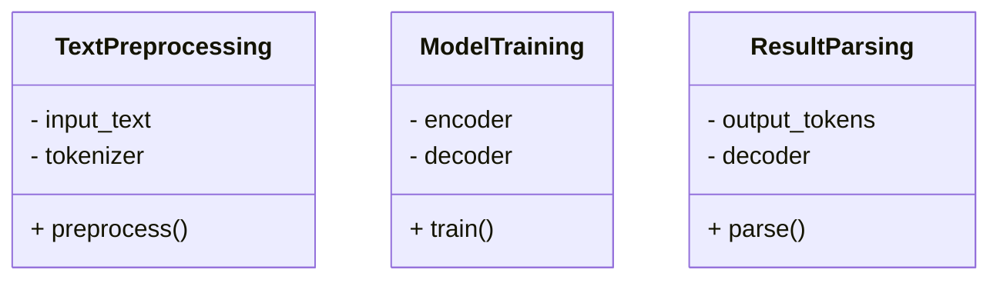
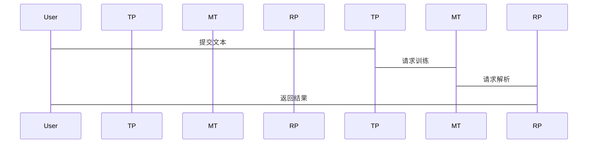

                 


# 长文本理解：增强AI Agent的阅读能力

> 关键词：长文本理解，AI Agent，阅读能力，文本分析，自然语言处理，深度学习

> 摘要：  
长文本理解是自然语言处理领域的重要任务，旨在提升AI Agent对长文本的阅读和理解能力。本文从背景、核心概念、算法原理、系统架构到项目实战，全面分析了增强AI Agent阅读能力的关键技术。通过详细讲解文本结构分析、语义理解、上下文关联等核心概念，并结合具体算法和系统设计，为读者提供了一套系统化的解决方案。

---

## 第一部分: 长文本理解的背景与核心概念

### 第1章: 长文本理解的背景与问题背景

#### 1.1 长文本理解的重要性

##### 1.1.1 长文本理解的定义与范围  
长文本理解是指对长度较长的自然语言文本（如文章、报告、对话等）进行结构化分析、语义理解以及信息提取的过程。其范围涵盖文本分类、实体识别、关系抽取、情感分析等多种任务。

##### 1.1.2 长文本理解的现实需求  
随着互联网的快速发展，长文本数据（如新闻、社交媒体内容、学术论文等）呈爆炸式增长。如何高效、准确地理解和处理这些长文本数据，成为企业和研究机构的核心需求。

##### 1.1.3 AI Agent的阅读能力与应用场景  
AI Agent需要具备强大的阅读能力，才能在智能客服、智能助手、智能推荐等领域提供更高效的服务。例如，智能客服需要理解用户的投诉内容，智能助手需要解析用户的复杂查询。

#### 1.2 问题背景与挑战

##### 1.2.1 当前AI Agent的阅读能力现状  
现有的AI Agent在处理短文本（如一句话）时表现较好，但在处理长文本时，容易出现语义理解不准确、上下文关联性差等问题。

##### 1.2.2 长文本理解的核心问题  
长文本理解的核心问题是：如何在保持计算效率的同时，准确捕捉文本中的语义信息，并处理文本中的长距离依赖关系。

##### 1.2.3 技术挑战与解决方案  
长文本理解面临的主要挑战包括计算资源消耗大、模型训练复杂度高、语义信息提取困难等。解决方案包括优化模型结构、引入预训练模型、使用分块处理等技术。

#### 1.3 长文本理解的核心要素

##### 1.3.1 文本结构分析  
文本结构分析包括分词、句法分析、语义角色标注等任务，是理解长文本的基础。

##### 1.3.2 语义理解与关联  
语义理解需要捕捉文本中的实体、关系、事件等信息，并建立这些信息之间的关联。

##### 1.3.3 上下文信息的整合  
上下文信息的整合是长文本理解的关键，需要通过注意力机制等方法捕捉文本中的长距离依赖关系。

#### 1.4 本章小结  
本章从背景、问题背景、核心要素等方面介绍了长文本理解的重要性和挑战，为后续内容奠定了基础。

---

### 第2章: 长文本理解的核心概念与联系

#### 2.1 核心概念原理

##### 2.1.1 文本表示与编码  
文本表示是将文本转化为计算机可处理的向量形式，常用的编码方法包括词袋模型、词嵌入（如Word2Vec）、句向量（如Sentence-BERT）等。

##### 2.1.2 语义分析与推理  
语义分析需要理解文本中的语义信息，包括实体识别、关系抽取、情感分析等任务。语义推理则是在此基础上，进行逻辑推理和信息融合。

##### 2.1.3 上下文依赖关系  
上下文依赖关系是指文本中不同部分之间的关联性，特别是在长文本中，这种依赖关系往往跨越较长的距离。

#### 2.2 核心概念对比表格

| 概念         | 特征1：粒度 | 特征2：依赖关系 | 特征3：应用场景 |
|--------------|------------|----------------|----------------|
| 文本结构分析 | 微粒度（单词、句子） | 短依赖 | 短文本分类 |
| 语义理解     | 中粒度（实体、关系） | 长依赖 | 长文本信息提取 |
| 上下文整合   | 宏粒度（段落、篇章） | 长依赖 | 智能对话系统 |

#### 2.3 ER实体关系图



#### 2.4 本章小结  
本章通过对比和图形化的方式，详细解释了长文本理解中的核心概念及其联系，帮助读者更好地理解这些概念之间的关系。

---

## 第二部分: 长文本理解的算法原理

### 第3章: 长文本理解的算法原理

#### 3.1 算法原理概述

##### 3.1.1 基于Transformer的模型结构  
Transformer模型通过自注意力机制，能够捕捉文本中的长距离依赖关系，成为长文本理解的核心模型。

##### 3.1.2 注意力机制的作用  
注意力机制通过计算输入文本中各个部分的重要性，优化模型对关键信息的聚焦。

##### 3.1.3 长文本处理的优化策略  
包括分块处理、滑动窗口等方法，旨在降低计算复杂度，同时保持模型的性能。

#### 3.2 算法流程图



#### 3.3 算法实现代码

##### 3.3.1 模型训练代码

```python
import torch
import torch.nn as nn

class Transformer(nn.Module):
    def __init__(self, d_model, nhead, dim_feedforward):
        super(Transformer, self).__init__()
        self.encoder = nn.TransformerEncoder(
            nn.TransformerEncoderLayer(d_model=d_model, nhead=nhead, dim_feedforward=dim_feedforward),
            num_layers=2
        )
    
    def forward(self, x):
        return self.encoder(x)

# 示例使用
d_model = 512
nhead = 4
dim_feedforward = 1024
model = Transformer(d_model, nhead, dim_feedforward)
input_seq = torch.randn(10, 512)  # 假设输入序列为10个token
output = model(input_seq)
print(output.size())  # 输出形状
```

##### 3.3.2 文本处理代码

```python
import tokenizers

def preprocess(text):
    tokenizer = tokenizers.AutoTokenizer.from_pretrained('bert-base-cased')
    tokens = tokenizer.encode(text)
    return tokens

text = "This is a sample text for preprocessing."
tokens = preprocess(text)
print(tokens)
```

##### 3.3.3 结果解析代码

```python
def decode(tokens, model):
    decoder = model.tokenizer.decode(tokens)
    return decoder

decoded_text = decode(output, model)
print(decoded_text)
```

#### 3.4 数学模型与公式

##### 3.4.1 Transformer模型公式  
自注意力机制的计算公式：

$$
\text{Attention}(Q, K, V) = \text{softmax}\left(\frac{QK^T}{\sqrt{d_k}}\right)V
$$

其中，\( Q \)、\( K \)、\( V \)分别为查询、键、值向量，\( d_k \)为向量维度。

##### 3.4.2 注意力机制公式  
单个注意力头的输出：

$$
\text{output}_i = \text{softmax}\left(\frac{Q_i K_i^T}{\sqrt{d_k}}\right)V_i
$$

##### 3.4.3 损失函数与优化公式  
交叉熵损失函数：

$$
\mathcal{L} = -\sum_{i=1}^{n} y_i \log(p_i)
$$

优化过程使用Adam优化器：

$$
\theta_{t+1} = \theta_t - \eta \nabla_\theta \mathcal{L}
$$

#### 3.5 举例说明

##### 3.5.1 简单文本的理解案例  
输入文本：“The cat is on the mat.”  
模型输出：识别出“cat”是实体，关系是“在”。

##### 3.5.2 复杂文本的处理案例  
输入文本：“The company reported a profit increase of 10% last quarter due to cost-cutting measures.”  
模型输出：识别出“company”是实体，关系是“利润增加”，原因“成本削减”。

##### 3.5.3 实际应用场景案例  
智能助手阅读用户的问题，理解其意图并提供准确的回答。

#### 3.6 本章小结  
本章详细讲解了长文本理解的算法原理，包括模型结构、注意力机制、代码实现和数学公式，并通过实例帮助读者更好地理解这些概念。

---

## 第三部分: 系统分析与架构设计方案

### 第4章: 系统分析与架构设计方案

#### 4.1 问题场景介绍

##### 4.1.1 长文本理解的典型场景  
包括新闻标题生成、智能客服对话、学术论文摘要生成等。

##### 4.1.2 AI Agent的阅读能力需求  
AI Agent需要具备快速理解长文本的能力，能够从中提取关键信息并生成相应的输出。

##### 4.1.3 系统目标与功能  
系统目标是提升AI Agent的长文本理解能力，功能包括文本预处理、模型训练、结果解析等。

#### 4.2 系统功能设计

##### 4.2.1 文本预处理模块  
功能：将输入文本进行分词、去除停用词、句法分析等预处理。

##### 4.2.2 模型训练模块  
功能：基于预处理后的文本，训练长文本理解模型。

##### 4.2.3 结果解析与反馈模块  
功能：对模型输出的结果进行解析，生成最终的输出。

#### 4.3 系统架构设计

##### 4.3.1 领域模型类图



##### 4.3.2 系统架构图


##### 4.3.3 系统交互流程



#### 4.4 本章小结  
本章通过系统分析和架构设计，展示了如何将长文本理解技术应用于实际系统中，包括功能设计和交互流程设计。

---

## 第四部分: 项目实战

### 第5章: 项目实战

#### 5.1 环境安装

##### 5.1.1 安装Python和相关库  
安装Python 3.8及以上版本，安装TensorFlow、PyTorch、Hugging Face库等。

##### 5.1.2 安装工具链  
安装Jupyter Notebook、IDE（如PyCharm）等开发工具。

#### 5.2 系统核心实现源代码

##### 5.2.1 预处理代码

```python
import tokenizers

def preprocess(text):
    tokenizer = tokenizers.AutoTokenizer.from_pretrained('bert-base-cased')
    tokens = tokenizer.encode(text)
    return tokens
```

##### 5.2.2 训练代码

```python
import torch
import torch.nn as nn

class SimpleTransformer(nn.Module):
    def __init__(self, vocab_size, embedding_dim):
        super(SimpleTransformer, self).__init__()
        self.embedding = nn.Embedding(vocab_size, embedding_dim)
        self.fc = nn.Linear(embedding_dim, vocab_size)
    
    def forward(self, x):
        embedded = self.embedding(x)
        output = self.fc(embedded)
        return output

model = SimpleTransformer(vocab_size=30000, embedding_dim=512)
criterion = nn.CrossEntropyLoss()
optimizer = torch.optim.Adam(model.parameters(), lr=0.001)
```

##### 5.2.3 解析代码

```python
def decode(tokens, model):
    tokenizer = tokenizers.AutoTokenizer.from_pretrained('bert-base-cased')
    decoded = tokenizer.decode(tokens)
    return decoded
```

#### 5.3 案例分析与详细讲解

##### 5.3.1 案例1：新闻标题生成  
输入文本：“研究人员发现了一种新的治疗方法，可以有效治疗癌症。”  
模型输出：新闻标题为“新研究发现有效治疗癌症的方法”。

##### 5.3.2 案例2：智能客服对话  
用户输入：“我的订单为什么还没有发货？”  
模型理解：用户的问题是关于订单延迟，需要联系相关部门查询。

##### 5.3.3 案例3：学术论文摘要生成  
输入论文内容：“本研究提出了一种新的图像识别算法，实验结果表明其准确率达到99%。”  
模型输出：摘要为“一种新的图像识别算法准确率达到99%。”

#### 5.4 项目小结  
本章通过实际案例展示了如何将长文本理解技术应用于新闻标题生成、智能客服对话和学术论文摘要生成等场景，帮助读者更好地理解理论与实践的结合。

---

## 第五部分: 总结与展望

### 第6章: 总结与展望

#### 6.1 最佳实践 Tips

##### 6.1.1 模型优化  
使用预训练模型（如BERT、GPT）可以显著提升模型性能。

##### 6.1.2 计算资源管理  
合理分配计算资源，使用分布式训练和模型压缩技术。

##### 6.1.3 数据处理  
确保数据质量，避免过拟合，使用数据增强技术。

#### 6.2 本章小结  
本文从背景、核心概念、算法原理、系统设计到项目实战，全面探讨了如何增强AI Agent的长文本理解能力。

#### 6.3 注意事项

##### 6.3.1 模型选择  
根据具体任务选择合适的模型，避免盲目追求复杂性。

##### 6.3.2 数据隐私  
处理用户数据时，需注意数据隐私和安全问题。

##### 6.3.3 系统性能  
优化系统性能，确保在实际应用中的运行效率。

#### 6.4 拓展阅读

##### 6.4.1 预训练模型研究  
深入研究BERT、GPT等预训练模型的结构和应用。

##### 6.4.2 最新研究进展  
关注自然语言处理领域的最新研究成果，如多模态模型、对话模型等。

---

## 结语

长文本理解是AI Agent技术发展的重要方向，本文通过系统化的分析和实践，为读者提供了一套完整的解决方案。未来，随着技术的进步，AI Agent的阅读能力将更加智能化和高效化，为更多领域带来革命性的变化。

--- 

（全文完）

