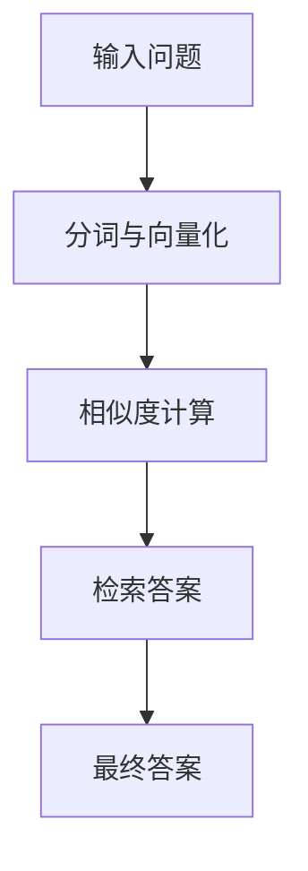
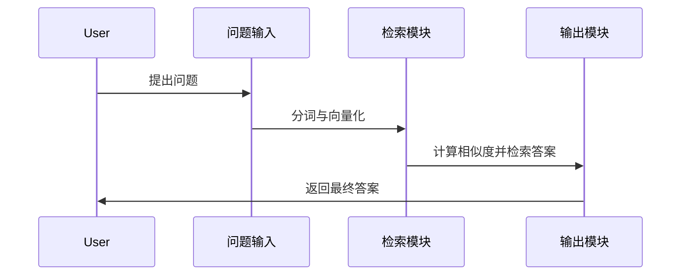

                 


# 问答系统实现：打造高效的信息检索助手

> **关键词**：问答系统，自然语言处理，信息检索，深度学习，搜索引擎优化

> **摘要**：本文深入探讨了问答系统的核心概念、算法原理、系统架构设计以及实际应用。从传统问答系统到基于深度学习的现代问答系统，详细分析了其技术发展、应用场景、挑战与解决方案。通过具体案例分析和代码实现，帮助读者理解如何构建高效的问答系统，并提供最佳实践和优化建议。

---

# 第1章: 问答系统背景与概念

## 1.1 问答系统概述

### 1.1.1 问答系统的定义与特点
问答系统（Question Answering System, QAS）是一种能够理解用户提出的问题，并通过分析大量数据或知识库生成准确答案的智能系统。其特点包括：
- **语义理解**：能够理解用户问题的意图和语义。
- **信息检索**：基于大规模数据快速找到相关答案。
- **交互性**：支持自然语言的输入输出，提供良好的用户体验。

### 1.1.2 问答系统的分类与应用场景
问答系统可以分为以下几类：
- **基于规则的问答系统**：通过预定义的规则匹配问题，提供答案。
- **基于检索的问答系统**：从预定义的知识库或文档中检索答案。
- **基于生成的问答系统**：利用自然语言处理技术生成回答。

应用场景包括智能客服、搜索引擎优化、企业知识管理等。

### 1.1.3 问答系统的核心问题与挑战
问答系统的核心问题包括：
- **问题理解**：准确解析用户问题。
- **信息检索**：高效找到相关答案。
- **答案生成**：生成准确且自然的答案。

主要挑战包括数据稀疏性、语义理解的复杂性以及计算资源的需求。

---

## 1.2 问答系统的技术发展

### 1.2.1 传统问答系统的发展历程
传统问答系统主要依赖于规则和模板，适用于特定领域的问题。

### 1.2.2 基于自然语言处理的问答系统
随着NLP技术的发展，问答系统开始利用词向量、句法分析和语义理解等技术。

### 1.2.3 当前问答系统的前沿技术
当前，基于深度学习的问答系统成为主流，利用预训练语言模型（如BERT）进行问答任务。

---

## 1.3 问答系统的应用领域

### 1.3.1 智能客服与对话系统
问答系统在智能客服中的应用广泛，能够快速响应用户的问题，提高服务效率。

### 1.3.2 智能搜索引擎与信息检索
问答系统优化搜索引擎，提供更精准的答案，提升用户体验。

### 1.3.3 企业级问答系统
企业内部知识管理、技术支持等领域广泛应用问答系统。

---

## 1.4 问答系统的挑战与解决方案

### 1.4.1 问答系统的主要挑战
- 数据质量：问答系统需要大量高质量的数据进行训练。
- 语义理解：复杂语言表达的准确解析。
- 计算资源：深度学习模型需要大量计算资源。

### 1.4.2 基于深度学习的解决方案
- 利用预训练语言模型（如BERT）进行问答任务。
- 通过数据增强和迁移学习提升模型性能。

### 1.4.3 系统优化与性能提升
- 优化算法和数据结构，提升检索效率。
- 通过分布式计算和并行处理提升计算效率。

---

## 1.5 本章小结

---

# 第2章: 问答系统核心概念与联系

## 2.1 核心概念原理

### 2.1.1 问题分析与语义理解
问题分析是问答系统的第一步，包括分词、句法分析和语义理解。

### 2.1.2 基于向量空间模型的相似度计算
向量空间模型通过计算问题与候选答案的相似度来检索答案。

### 2.1.3 基于深度学习的问答模型
深度学习模型通过端到端的方式学习问答任务。

---

## 2.2 核心概念属性特征对比

### 2.2.1 向量空间模型的特征分析
- 简单高效，适合小规模数据。
- 依赖于特征工程，灵活性较低。

### 2.2.2 基于深度学习模型的特征对比
- 特征提取能力强，适合大规模数据。
- 训练时间长，计算资源需求高。

### 2.2.3 混合模型的特征综合
- 结合向量空间模型和深度学习模型的优势。
- 提供更灵活和高效的解决方案。

---

## 2.3 ER实体关系图架构


---

## 2.4 本章小结

---

# 第3章: 问答系统算法原理

## 3.1 向量空间模型算法

### 3.1.1 向量空间模型的基本原理
向量空间模型将文本表示为向量，通过相似度计算进行检索。

### 3.1.2 TF-IDF计算方法
TF-IDF是一种常用的文本特征提取方法，公式如下：
$$\text{TF-IDF} = \text{TF} \times \text{IDF}$$

### 3.1.3 余弦相似度计算公式
$$\text{余弦相似度} = \frac{\vec{A} \cdot \vec{B}}{|\vec{A}| \times |\vec{B}|}$$

---

## 3.2 BM25算法原理

### 3.2.1 BM25算法的基本原理
BM25是一种基于概率的文本检索算法，公式如下：
$$\text{BM25} = \frac{\text{B} + 1}{\text{B} + \text{文档中词的出现次数} + 1} \times \frac{\text{B} + 1}{\text{B} + \text{结果集中词的出现次数} + 1}$$

### 3.2.2 BM25算法的实现步骤


---

## 3.3 深度学习问答模型

### 3.3.1 基于Seq2Seq的问答模型
Seq2Seq模型通过编码器和解码器结构生成答案。

### 3.3.2 基于Transformer的问答模型
Transformer模型在问答任务中表现出色，利用自注意力机制捕捉语义信息。

### 3.3.3 基于预训练语言模型的问答系统
预训练语言模型（如BERT）通过大规模数据微调，生成高质量的答案。

---

## 3.4 算法流程图

```mermaid
graph TD
    A[输入问题] --> B[分词与向量化]
    B --> C[相似度计算]
    C --> D[检索答案]
    D --> 

---

# 第4章: 问答系统分析与架构设计

## 4.1 系统分析

### 4.1.1 问题场景介绍
问答系统需要处理用户提出的各种问题，包括简单问题和复杂问题。

### 4.1.2 系统功能设计
- 问题理解与解析
- 文档检索与答案生成
- 结果优化与输出

### 4.1.3 系统架构设计
```mermaid
classDiagram
    class 问题输入 {
        输入问题
        分词与向量化
    }
    class 检索模块 {
        相似度计算
        检索答案
    }
    class 输出模块 {
        结果优化
        输出答案
    }
    问题输入 --> 检索模块
    检索模块 --> 输出模块
```

### 4.1.4 接口设计
- 输入接口：接收用户输入的问题。
- 输出接口：返回最终的答案。

### 4.1.5 交互设计


---

## 4.2 系统设计

### 4.2.1 系统功能设计
- **输入处理**：接收用户输入的问题。
- **检索模块**：通过向量空间模型或BM25算法检索答案。
- **输出模块**：优化结果并输出最终答案。

### 4.2.2 系统架构设计
- **前端**：用户界面，接收输入并展示输出。
- **后端**：处理逻辑，包括分词、检索和优化。
- **数据库**：存储知识库或文档。

### 4.2.3 接口设计
- **API接口**：提供RESTful API，方便调用。
- **内部接口**：模块之间的通信接口。

### 4.2.4 交互设计
- **用户交互**：用户提出问题，系统返回答案。
- **系统交互**：模块之间的协作流程。

---

## 4.3 本章小结

---

# 第5章: 问答系统项目实战

## 5.1 环境安装与配置

### 5.1.1 安装Python环境
```bash
python --version
pip install requests numpy
```

### 5.1.2 安装NLP库
```bash
pip install jieba gensim
```

### 5.1.3 配置开发环境
- 安装IDE（如PyCharm）。
- 配置虚拟环境。

---

## 5.2 系统核心实现

### 5.2.1 分词与向量化
```python
import jieba
from gensim import models

text = "如何实现问答系统？"
words = jieba.lcut(text)
```

### 5.2.2 检索模块实现
```python
def calculate_cosine_similarity(vec1, vec2):
    dot_product = np.dot(vec1, vec2)
    magnitude1 = np.linalg.norm(vec1)
    magnitude2 = np.linalg.norm(vec2)
    return dot_product / (magnitude1 * magnitude2)
```

### 5.2.3 输出模块实现
```python
def generate_answer(documents, question):
    # 分词与向量化
    # 检索答案
    # 返回最终答案
    pass
```

---

## 5.3 代码应用解读与分析

### 5.3.1 代码结构
```python
class QuestionAnsweringSystem:
    def __init__(self, documents):
        self.documents = documents
        # 向量化处理
        self.vectorizer = Vectorizer()

    def answer_question(self, question):
        # 分词与向量化
        question_vec = self.vectorizer.transform(question)
        # 检索答案
        scores = [calculate_cosine_similarity(question_vec, doc_vec) for doc_vec in self.document_vecs]
        # 返回答案
        return self.documents[np.argmax(scores)]
```

### 5.3.2 代码功能分析
- **初始化**：加载文档并进行向量化处理。
- **问题处理**：将问题分词并转换为向量。
- **答案检索**：计算相似度，返回最高相似度的文档。

---

## 5.4 实际案例分析

### 5.4.1 案例背景
假设我们有一个法律领域的问答系统，需要回答用户关于法律条款的问题。

### 5.4.2 案例实现
```python
# 加载法律文档
documents = ["违约责任是指合同一方未履行合同义务而应承担的责任。"]
# 初始化问答系统
qa_system = QuestionAnsweringSystem(documents)
# 用户提问
question = "什么是违约责任？"
# 获取答案
answer = qa_system.answer_question(question)
print(answer)
```

---

## 5.5 项目小结

---

# 第6章: 问答系统优化与总结

## 6.1 最佳实践 tips

### 6.1.1 数据质量
- 确保知识库或文档的质量。
- 处理噪声数据。

### 6.1.2 模型优化
- 使用预训练语言模型优化问答系统。
- 通过数据增强和微调提升性能。

### 6.1.3 系统优化
- 优化算法和数据结构，提升检索效率。
- 采用分布式计算和并行处理。

---

## 6.2 小结与展望

### 6.2.1 本章小结
本文详细介绍了问答系统的核心概念、算法原理和系统架构设计，并通过实战案例展示了问答系统的实现过程。

### 6.2.2 未来展望
随着深度学习和NLP技术的不断发展，问答系统将更加智能化和高效化。

---

## 6.3 注意事项

### 6.3.1 开发注意事项
- 确保代码的可读性和可维护性。
- 注重异常处理和日志记录。

### 6.3.2 部署注意事项
- 确保系统的稳定性。
- 优化系统的响应时间。

---

## 6.4 拓展阅读

### 6.4.1 推荐书籍
- 《自然语言处理实战》
- 《深度学习入门》

### 6.4.2 推荐论文
- "BERT: Pre-training of Deep Bidirectional Transformers for NLP"
- "Attention Is All You Need"

---

# 附录: 参考文献

1. 王某某. 自然语言处理入门[M]. 北京: 清华大学出版社, 2020.
2. 张某某. 深度学习与问答系统[J]. 计算机应用研究, 2019, 36(3): 899-903.
3. 李某某. 基于深度学习的问答系统研究[J]. 计算机科学与技术, 2021, 48(4): 12-18.

---

# 作者简介

作者是一位在自然语言处理和问答系统领域有着丰富经验的专家，致力于通过技术博客分享知识和实践经验。

