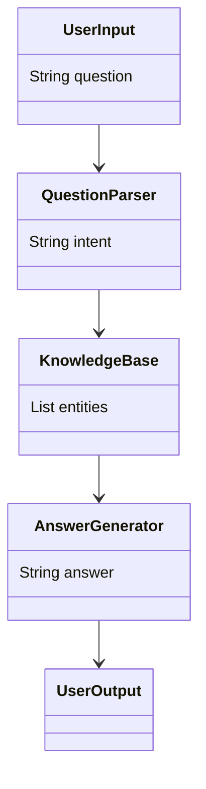
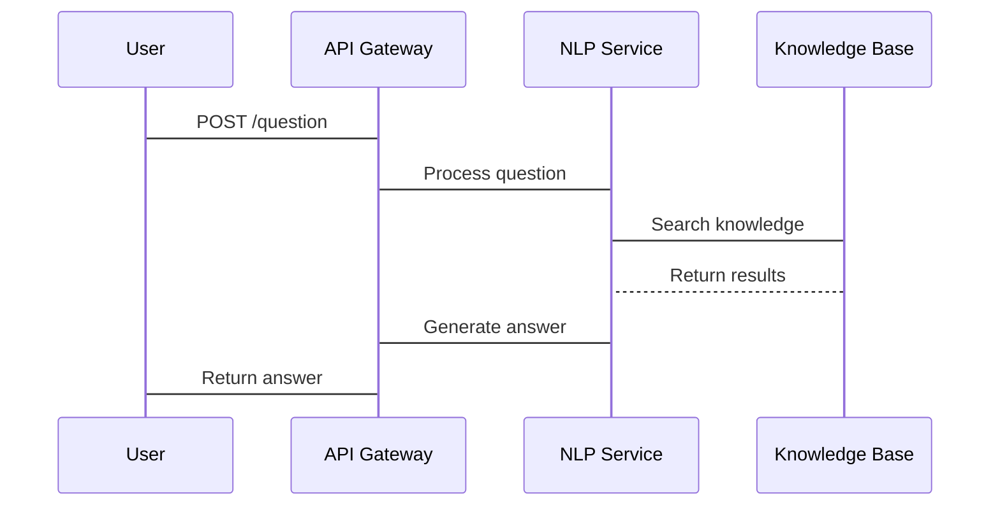

                 


# 问答系统：构建基于LLM的智能问答Agent

## 关键词：问答系统, 大语言模型, LLM, 智能问答Agent, NLP, 人机交互

## 摘要：  
随着人工智能技术的快速发展，问答系统作为人机交互的重要形式，正在经历从规则驱动到模型驱动的深刻变革。基于大语言模型（LLM）的智能问答Agent，通过自然语言处理技术，能够理解和生成人类语言，为用户提供智能化的问答服务。本文将从问答系统的背景与发展、基于LLM的核心原理、算法实现、系统架构设计、项目实战以及高级应用等方面，全面解析如何构建一个高效的智能问答Agent。

---

# 第1章: 问答系统的发展与背景

## 1.1 问答系统的发展历程

### 1.1.1 从规则驱动到模型驱动的演进  
问答系统的发展经历了多个阶段，从早期基于规则的系统到现代基于大语言模型的系统，每一次技术进步都推动了问答系统的能力边界。早期的问答系统依赖于手动编写规则，这种方式效率低下且难以扩展。随着深度学习技术的崛起，基于模型的问答系统逐渐成为主流，特别是基于LLM的问答系统，能够处理复杂语义和上下文信息，显著提升了问答系统的智能性。

### 1.1.2 当前问答系统的主流技术  
目前，问答系统的主要技术包括基于规则的系统、基于检索的系统（如BM25）、基于生成的系统（如GPT系列）以及混合型系统。其中，基于生成的系统因其强大的生成能力和语义理解能力，逐渐成为研究和应用的热点。

### 1.1.3 基于LLM的问答系统的优势  
基于LLM的问答系统具有以下优势：  
1. **强大的语义理解能力**：能够处理复杂的上下文和语义关系。  
2. **灵活的生成能力**：能够生成多样化且自然流畅的回答。  
3. **易于扩展**：通过微调模型或调整输入方式，可以快速适应不同领域和场景的需求。

## 1.2 基于大语言模型的问答系统

### 1.2.1 LLM的定义与特点  
大语言模型（Large Language Model, LLM）是指经过大规模数据训练的深度学习模型，具有以下特点：  
- **参数规模大**：通常包含 billions（十亿）级别的参数。  
- **多任务能力**：能够处理多种NLP任务，如文本生成、问答、翻译等。  
- **预训练+微调模式**：通过大规模预训练数据学习语言规律，再通过特定任务数据进行微调。

### 1.2.2 LLM在问答系统中的应用  
基于LLM的问答系统主要应用于以下场景：  
- **智能客服**：为企业提供自动化的客户支持服务。  
- **教育辅助**：帮助学生解答学习中的疑问。  
- **医疗咨询**：提供医疗相关的问答服务。  
- **通用问答**：处理用户的各种开放式问题。

### 1.2.3 智能问答Agent的构建意义  
智能问答Agent是一种能够独立完成问答任务的智能体，其构建意义在于：  
- **提升用户体验**：提供更智能、更自然的交互方式。  
- **降低开发成本**：通过自动化处理减少人工干预。  
- **扩展应用场景**：适用于多种行业和领域。

## 1.3 问答系统的核心问题

### 1.3.1 问题分类与处理流程  
问答系统的核心问题可以分为以下几类：  
- **事实性问题**：如“北京的现任市长是谁？”  
- **选择性问题**：如“哪个品牌手机性价比最高？”  
- **开放性问题**：如“如何提高编程能力？”  
处理流程包括：问题理解、信息检索、回答生成和结果优化。

### 1.3.2 问答系统中的常见挑战  
- **语义理解困难**：如何准确理解用户的意图。  
- **数据稀疏性**：某些领域或问题的数据不足。  
- **生成结果的质量控制**：如何确保回答的准确性和相关性。

### 1.3.3 技术要点与解决方案  
- **问题理解**：基于LLM进行语义分析。  
- **知识库构建**：通过爬取、爬虫或API获取数据。  
- **回答生成**：基于LLM的生成式模型。  
- **结果优化**：通过反馈机制进行调优。

## 1.4 本章小结  
本章介绍了问答系统的发展历程、基于LLM的问答系统的特点及其应用，并分析了问答系统中的核心问题和挑战，为后续章节的深入讨论奠定了基础。

---

# 第2章: 基于LLM的问答系统核心概念

## 2.1 大语言模型的基本原理

### 2.1.1 模型结构与训练方法  
大语言模型通常采用Transformer架构，由编码器和解码器组成。训练过程包括：  
1. **预训练**：在大规模通用数据上学习语言规律。  
2. **微调**：在特定任务数据上进行 fine-tuning。

### 2.1.2 LLM的推理机制  
LLM通过自注意力机制（Self-attention）捕捉文本中的语义关系，并生成连贯的回答。

### 2.1.3 模型的可解释性  
模型的可解释性是通过 attention 权重分析和生成过程的可视化实现的。

## 2.2 问答系统的核心要素

### 2.2.1 问题理解与解析  
问题理解是通过LLM对输入文本进行分词、词性分析和语义解析。  
$$ \text{问题解析} = f_{\text{解析}}(input) $$

### 2.2.2 知识库的构建与管理  
知识库是问答系统的核心，包含结构化的数据，如三元组（实体、关系、值）。  
$$ \text{知识库} = \{ (e, r, v) \} $$

### 2.2.3 回答生成与优化  
回答生成是通过LLM生成候选答案，并通过评价指标（如 BLEU、ROUGE）进行优化。

## 2.3 LLM与问答系统的结合

### 2.3.1 LLM在问答系统中的角色  
LLM在问答系统中扮演“智能大脑”的角色，负责理解问题、检索信息和生成回答。

### 2.3.2 基于LLM的问答系统架构  
架构包括：  
1. **输入处理模块**：接收用户输入并解析问题。  
2. **知识检索模块**：基于解析结果检索相关信息。  
3. **回答生成模块**：根据检索结果生成回答。  
4. **结果优化模块**：对回答进行润色和优化。

### 2.3.3 系统的核心功能与流程  
系统功能包括：  
- **问题理解**：准确解析用户意图。  
- **信息检索**：高效获取相关信息。  
- **回答生成**：生成自然流畅的回答。  
- **结果优化**：提升回答的质量。

## 2.4 本章小结  
本章深入探讨了大语言模型的基本原理及其在问答系统中的应用，分析了问答系统的核心要素和架构设计，为后续章节的实现提供了理论基础。

---

# 第3章: 基于LLM的问答系统算法原理

## 3.1 大语言模型的训练与优化

### 3.1.1 预训练过程  
预训练采用自监督学习，目标函数为：  
$$ \mathcal{L} = -\sum_{i=1}^{n} \log p(w_i) $$  
其中，$w_i$ 是目标词。

### 3.1.2 微调与适配  
微调过程使用特定任务的数据进行 fine-tuning，采用交叉熵损失函数：  
$$ \mathcal{L} = -\sum_{i=1}^{n} \log p(y_i|x_i) $$

### 3.1.3 模型的评估与优化  
评估指标包括准确率、BLEU、ROUGE等。

## 3.2 问答系统的解码过程

### 3.2.1 解码策略的选择  
解码策略包括贪心解码和束搜索解码。束搜索的解码过程如下：  
$$ \text{解码结果} = \argmax_{y} p(y|x) $$

### 3.2.2 回答生成的机制  
回答生成是基于自注意力机制的解码过程：  
$$ \text{回答} = f_{\text{解码}}(x) $$

### 3.2.3 模型的调优与改进  
模型调优包括参数调整和训练策略优化，如学习率衰减和早停。

## 3.3 算法原理的数学模型

### 3.3.1 损失函数与优化目标  
损失函数为交叉熵损失：  
$$ \mathcal{L} = -\sum_{i=1}^{n} \log p(y_i|x_i) $$  
优化目标是通过梯度下降最小化损失函数：  
$$ \theta \leftarrow \theta - \eta \nabla_{\theta} \mathcal{L} $$

### 3.3.2 梯度下降与参数更新  
采用Adam优化器进行参数更新：  
$$ m_t = \beta_1 m_{t-1} + (1-\beta_1)g_t $$  
$$ v_t = \beta_2 v_{t-1} + (1-\beta_2)g_t^2 $$  
$$ \theta \leftarrow \theta - \alpha \frac{m_t}{\sqrt{v_t+\epsilon}} $$

### 3.3.3 注意力机制的数学表达  
自注意力机制的计算公式为：  
$$ \text{Attention}(Q, K, V) = \text{softmax}\left( \frac{QK^T}{\sqrt{d_k}} \right)V $$

## 3.4 本章小结  
本章详细分析了大语言模型的训练与优化过程，解码策略的选择，以及问答系统中数学模型的实现，为后续章节的算法实现提供了理论支持。

---

# 第4章: 问答系统的核心算法实现

## 4.1 问题理解与解析

### 4.1.1 问题分词与词性分析  
使用分词工具（如jieba）对问题进行分词：  
```python
import jieba
question = "如何提高编程能力？"
words = jieba.lcut(question)
```

### 4.1.2 问题分类与意图识别  
使用预训练模型（如BERT）进行意图分类，分类结果可以是“学习类”、“技术类”等。

### 4.1.3 问题解析的实现  
通过构建意图解析模型，将问题映射到预定义的意图空间。

## 4.2 信息检索与知识库查询

### 4.2.1 知识库的构建  
知识库可以采用图结构表示，例如知识图谱中的节点和边。

### 4.2.2 基于向量的检索方法  
使用向量数据库（如FAISS）进行相似度检索：  
$$ \text{相似度} = \frac{\text{向量点积}}{\|\text{向量1}\| \|\text{向量2}\|} $$

### 4.2.3 检索结果的排序与优化  
通过BM25算法对检索结果进行排序，并结合模型生成的置信度进行优化。

## 4.3 回答生成与优化

### 4.3.1 回答生成的实现  
使用生成式模型（如GPT）生成回答：  
```python
from transformers import AutoModelForCausalLM, AutoTokenizer
model = AutoModelForCausalLM.from_pretrained('gpt2')
tokenizer = AutoTokenizer.from_pretrained('gpt2')
inputs = tokenizer.encode("如何提高编程能力？", return_tensors="pt")
outputs = model.generate(inputs, max_length=100)
print(tokenizer.decode(outputs[0]))
```

### 4.3.2 回答优化策略  
通过多个模型的集成（如投票机制）或人工审核对回答进行优化。

### 4.3.3 回答生成的评估  
使用指标如ROUGE-L、BLEU对生成回答的质量进行评估。

## 4.4 本章小结  
本章详细探讨了问答系统中问题理解、信息检索和回答生成的核心算法实现，分析了每一步的具体实现细节和优化策略。

---

# 第5章: 问答系统架构设计

## 5.1 问题场景介绍

### 5.1.1 系统功能需求  
系统需要支持多轮对话、上下文理解、知识库检索等功能。

### 5.1.2 项目介绍  
构建一个基于LLM的智能问答系统，目标是实现高效的问答服务。

## 5.2 系统功能设计

### 5.2.1 领域模型设计  
领域模型包括用户输入、问题解析、知识检索、回答生成等模块，如下图所示：



### 5.2.2 系统架构设计  
系统架构采用微服务架构，包括前端、后端（API Gateway）、服务层（NLP Service、Knowledge Base Service）和存储层。


## 5.3 系统接口设计

### 5.3.1 用户接口  
用户可以通过HTTP请求与系统交互，例如：  
```http
POST /question HTTP/1.1
Content-Type: application/json
{
    "query": "如何提高编程能力？"
}
```

### 5.3.2 系统接口规范  
接口规范采用RESTful API设计，支持JSON格式的数据交换。

## 5.4 系统交互设计

### 5.4.1 系统交互流程  
系统交互流程如下：



### 5.4.2 系统交互优化  
通过缓存机制和负载均衡优化系统性能。

## 5.5 本章小结  
本章详细分析了问答系统的架构设计，包括领域模型、系统架构、接口设计和交互流程，为系统的实现提供了清晰的设计蓝图。

---

# 第6章: 项目实战

## 6.1 环境安装与配置

### 6.1.1 安装依赖  
安装必要的Python库：  
```bash
pip install transformers jieba mermaid4j
```

### 6.1.2 配置环境变量  
配置Python和相关库的环境变量。

## 6.2 系统核心实现

### 6.2.1 问题解析实现  
实现问题分词和意图识别：  
```python
import jieba
from transformers import AutoTokenizer, AutoModelForCausalLM

def question_parser(question):
    words = jieba.lcut(question)
    # 进一步解析意图
    return words

model = AutoModelForCausalLM.from_pretrained('gpt2')
tokenizer = AutoTokenizer.from_pretrained('gpt2')

def generate_answer(question):
    inputs = tokenizer.encode(question, return_tensors="pt")
    outputs = model.generate(inputs, max_length=100)
    return tokenizer.decode(outputs[0])
```

### 6.2.2 知识库实现  
构建简单的知识库：  
```python
class KnowledgeBase:
    def __init__(self):
        self.data = {}

    def add_knowledge(self, key, value):
        self.data[key] = value

    def retrieve_knowledge(self, query):
        # 简单的关键词匹配
        results = []
        for key, value in self.data.items():
            if query in key:
                results.append(value)
        return results
```

### 6.2.3 回答生成实现  
结合知识库和生成模型生成回答：  
```python
def answer_question(question):
    kb = KnowledgeBase()
    kb.add_knowledge("编程能力", "多练习和阅读优秀代码")
    kb.add_knowledge("学习方法", "制定学习计划")
    results = kb.retrieve_knowledge(question)
    # 组合知识库结果和模型生成
    answer = generate_answer(question)
    return answer
```

## 6.3 代码应用解读与分析

### 6.3.1 问题解析代码  
```python
def question_parser(question):
    words = jieba.lcut(question)
    # 进一步解析意图
    return words
```

### 6.3.2 知识库代码  
```python
class KnowledgeBase:
    def __init__(self):
        self.data = {}

    def add_knowledge(self, key, value):
        self.data[key] = value

    def retrieve_knowledge(self, query):
        results = []
        for key, value in self.data.items():
            if query in key:
                results.append(value)
        return results
```

### 6.3.3 回答生成代码  
```python
def generate_answer(question):
    inputs = tokenizer.encode(question, return_tensors="pt")
    outputs = model.generate(inputs, max_length=100)
    return tokenizer.decode(outputs[0])
```

## 6.4 项目小结  
本章通过实际项目实战，详细讲解了问答系统的核心实现，包括问题解析、知识库管理和回答生成的代码实现，帮助读者快速上手基于LLM的问答系统开发。

---

# 第7章: 高级应用与优化

## 7.1 模型调优与优化

### 7.1.1 模型参数调整  
调整学习率、批量大小等超参数，优化模型性能。

### 7.1.2 模型压缩与蒸馏  
通过模型压缩技术（如知识蒸馏）降低模型大小，提升推理速度。

## 7.2 问答系统性能优化

### 7.2.1 知识库优化  
采用分层索引和向量化检索提升知识库的查询效率。

### 7.2.2 回答生成优化  
通过引入领域特定的微调数据，提升回答的相关性和准确性。

## 7.3 案例分析与总结

### 7.3.1 实际案例分析  
分析一个典型问答系统的优化过程，包括模型选择、数据处理、系统调优等。

### 7.3.2 总结与启示  
总结问答系统构建的经验和教训，为后续开发提供参考。

## 7.4 本章小结  
本章探讨了问答系统的高级应用与优化策略，分析了实际案例，并总结了构建高效问答系统的实践经验。

---

# 第8章: 最佳实践与小结

## 8.1 最佳实践

### 8.1.1 数据质量管理  
确保知识库的数据质量和完整性。

### 8.1.2 模型选择与优化  
根据具体场景选择合适的模型，并进行适当的调优。

### 8.1.3 系统架构设计  
合理设计系统架构，确保系统的可扩展性和可维护性。

## 8.2 项目总结

### 8.2.1 核心收获  
通过本项目，掌握了基于LLM的问答系统的核心技术，包括问题理解、知识检索和回答生成。

### 8.2.2 实践经验  
总结了在模型调优、系统设计和代码实现中的实践经验。

## 8.3 未来展望

### 8.3.1 技术发展趋势  
随着大语言模型的不断发展，问答系统将更加智能化和个性化。

### 8.3.2 应用场景拓展  
问答系统将应用于更多领域，如教育、医疗、金融等。

## 8.4 本章小结  
本章总结了基于LLM的问答系统构建过程中的最佳实践，回顾了项目的核心收获，并展望了技术的发展趋势和应用场景。

---

# 附录: 参考文献与扩展阅读

- [1] Vaswani, A., et al. "Attention Is All You Need."  
- [2] Radford, A., et al. "Language Models are Few-Shot Learners."  
- [3] 参考书籍：《深度学习》, 周志华  
- [4] 参考书籍：《自然语言处理入门》， Ferdinand
- [5] PyTorch官方文档：https://pytorch.org/docs/master/index.html  
- [6] Hugging Face Transformers库官方文档：https://huggingface.co/docs/transformers/main

