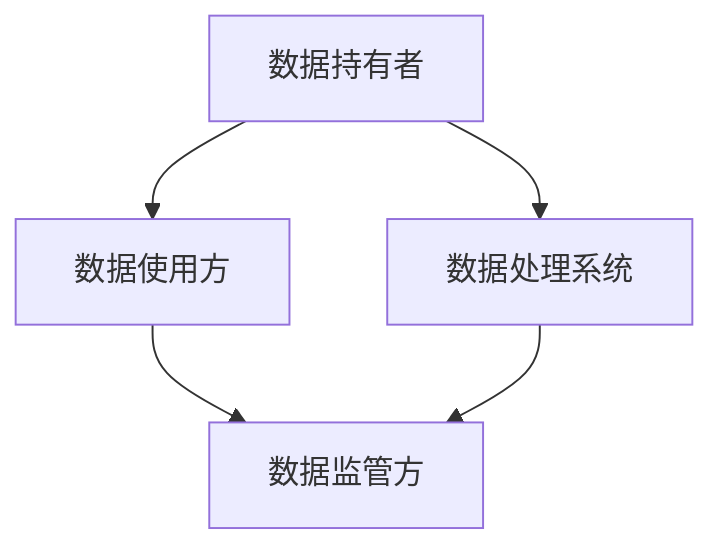
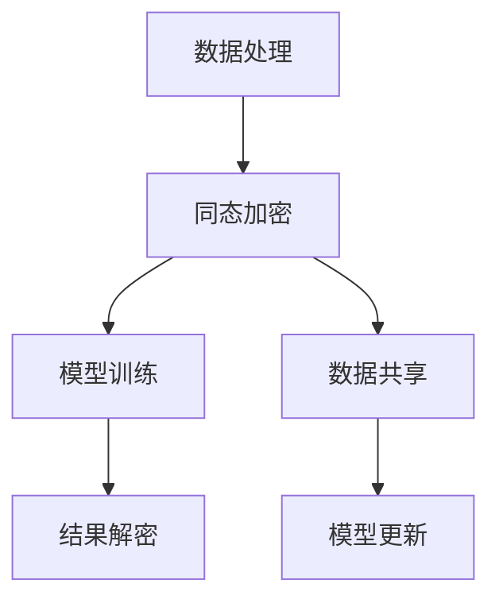

                 


# 隐私保护AI：在数据安全与功能之间寻找平衡

## 关键词：隐私保护、人工智能、数据安全、数据脱敏、数据加密、数据匿名化、平衡点

## 摘要

随着人工智能技术的快速发展，数据安全与隐私保护成为社会关注的焦点。AI模型的训练和应用依赖大量数据，这使得数据隐私保护变得至关重要。本文探讨了在数据安全与AI功能之间寻找平衡的方法，详细介绍了隐私保护的核心技术、AI的基本原理，以及如何通过数据脱敏、加密和匿名化等技术实现隐私保护与AI功能的平衡。文章还通过实际案例分析，展示了如何在项目中应用这些技术，并提出了未来的挑战与展望。

---

## 第一部分：隐私保护与AI概述

### 第1章：隐私保护与AI的背景与概述

#### 1.1 隐私保护的核心概念

- **1.1.1 隐私保护的定义与核心要素**
  隐私保护是指在数据的收集、存储、处理和共享过程中，保护个人隐私不被泄露。核心要素包括数据最小化、目的特定、数据安全和数据主体同意。

- **1.1.2 数据安全的基本原则**
  数据安全原则包括数据分类、访问控制、加密存储和安全传输。

- **1.1.3 隐私保护的法律框架与合规要求**
  相关法律如GDPR、CCPA等，要求企业采取措施保护用户数据隐私。

#### 1.2 AI技术的基本原理

- **1.2.1 人工智能的定义与分类**
  AI分为弱人工智能和强人工智能，主要应用于数据分析、模式识别等领域。

- **1.2.2 数据驱动的AI模型特点**
  AI模型依赖大量数据进行训练，数据质量和多样性直接影响模型性能。

- **1.2.3 AI在数据处理中的关键环节**
  包括数据预处理、特征提取、模型训练和结果解释。

#### 1.3 隐私保护与AI的相互作用

- **1.3.1 隐私保护对AI发展的挑战**
  数据隐私限制了AI模型的训练数据量，可能影响模型的泛化能力。

- **1.3.2 AI技术对隐私保护的潜在威胁**
  模型可能通过推理泄露数据中的敏感信息。

- **1.3.3 寻找数据安全与AI功能的平衡点**
  在保护数据隐私的前提下，确保AI模型的有效性和实用性。

---

## 第二部分：隐私保护的核心概念与技术

### 第2章：隐私保护的核心技术与方法

#### 2.1 数据分类与隐私级别

- **2.1.1 数据分类标准**
  数据按敏感程度分为公开数据、一般数据和敏感数据。

- **2.1.2 隐私级别的划分**
  高隐私级别数据需要更严格的保护措施。

- **2.1.3 数据敏感性评估**
  评估数据泄露可能带来的风险，制定保护策略。

#### 2.2 隐私保护模型

- **2.2.1 数据脱敏技术**
  通过脱敏处理，将敏感数据转化为不可逆的形式，如替换、删除和加密。

- **2.2.2 数据加密方法**
  包括对称加密和非对称加密，用于保护数据在传输和存储中的安全性。

- **2.2.3 数据匿名化处理**
  通过技术手段去除数据中可能识别个人的信息，如K-anonymity和L-diversity模型。

#### 2.3 隐私保护技术对比

- **2.3.1 数据加密与数据匿名化对比**
  | 技术 | 特点 | 适用场景 |
  |------|------|----------|
  | 加密 | 数据不可逆 | 传输和存储 |
  | 匿名化 | 数据可逆 | 分析和共享 |

- **2.3.2 数据脱敏与数据加密的优缺点**
  - 数据脱敏：数据不可逆，但处理后数据可用。
  - 数据加密：数据可逆，但需要密钥。

- **2.3.3 数据共享机制的实体关系图（ER图）**



---

## 第三部分：AI技术的基本原理与隐私保护的关联

### 第3章：AI的基本原理与隐私保护的关联

#### 3.1 AI的数据驱动特性

- **3.1.1 数据在AI模型中的作用**
  数据是AI模型训练的基础，数据量越大，模型越准确。

- **3.1.2 数据量与模型性能的关系**
  数据量直接影响模型的泛化能力和过拟合风险。

- **3.1.3 数据多样性对AI的影响**
  多样化的数据有助于模型更好地泛化，减少偏差。

#### 3.2 AI模型的训练与隐私保护

- **3.2.1 数据训练的基本流程**
  数据预处理、特征工程、模型选择和训练、模型评估和优化。

- **3.2.2 隐私保护对数据训练的影响**
  数据脱敏和加密会影响数据的多样性，可能导致模型欠拟合。

- **3.2.3 隐私保护技术在模型训练中的应用**
  如同态加密和隐私保护的机器学习算法。

#### 3.3 隐私保护对AI性能的影响

- **3.3.1 隐私保护对模型准确性的挑战**
  过度保护数据可能导致模型训练数据不足，影响性能。

- **3.3.2 数据匿名化对模型的影响**
  匿名化处理可能导致数据丢失，影响模型的准确性。

- **3.3.3 数据共享机制对AI的影响**
  通过联邦学习等技术，可以在保护数据隐私的前提下进行模型训练。

---

## 第四部分：隐私保护与AI的平衡点

### 第4章：隐私保护与AI的平衡点

#### 4.1 数据匿名化与AI模型

- **4.1.1 数据匿名化的实现方法**
  包括K-anonymity和L-diversity模型。

- **4.1.2 数据匿名化对AI模型的影响**
  匿名化处理可能导致数据丢失，影响模型性能。

- **4.1.3 数据匿名化与AI模型的平衡**
  在保护隐私的前提下，确保数据的可用性。

#### 4.2 数据共享机制与AI模型

- **4.2.1 联邦学习（Federated Learning）**
  多个数据源在本地训练模型，通过参数交换更新全局模型，保护数据隐私。

- **4.2.2 同态加密与AI模型**
  在加密数据上进行模型训练，确保数据隐私。

- **4.2.3 数据共享机制的实现**
  使用安全多方计算（SMPC）和同态加密技术。

#### 4.3 AI模型的隐私性

- **4.3.1 模型的隐私性评估**
  包括模型鲁棒性、模型安全性等指标。

- **4.3.2 模型隐私保护技术**
  如对抗训练和差分隐私。

- **4.3.3 模型隐私保护的挑战**
  如模型解释性和攻击性。

---

## 第五部分：隐私保护算法的原理与实现

### 第5章：隐私保护算法的原理与实现

#### 5.1 隐私保护算法的原理

- **5.1.1 同态加密算法**
  允许在加密数据上进行计算，结果解密后与原始数据计算结果一致。

- **5.1.2 差分隐私**
  通过添加噪声，保护数据的隐私性，同时保持数据的统计特性。

- **5.1.3 安全多方计算（SMPC）**
  多个参与方在不泄露各自数据的情况下，共同计算结果。

#### 5.2 隐私保护算法的实现

- **5.2.1 同态加密实现**
  使用Paillier加密算法，支持加法和乘法操作。

- **5.2.2 差分隐私实现**
  在数据发布前添加噪声，如拉普拉斯噪声。

- **5.2.3 安全多方计算实现**
  使用秘密共享技术，如 Shamir's Secret Sharing。

#### 5.3 隐私保护算法的流程图



---

## 第六部分：项目实战

### 第6章：项目实战

#### 6.1 项目背景与目标

- **项目背景**：开发一个隐私保护的AI模型，用于数据分析，同时保护用户隐私。

- **项目目标**：实现数据脱敏、加密和匿名化处理，确保数据安全。

#### 6.2 项目环境配置

- **工具与库**：Python、TensorFlow、PyTorch、Paillier库。

#### 6.3 系统核心实现源代码

```python
import numpy as np
from paillier import PaillierPublicKey, PaillierPrivateKey, Paillier encrypt, Paillier decrypt

# 初始化密钥
public_key = PaillierPublicKey(n)
private_key = PaillierPrivateKey(p, q, public_key)

# 数据加密
encrypted_data = [Paillier_encrypt(x, public_key) for x in raw_data]

# 模型训练
model.fit(encrypted_data)

# 结果解密
decrypted_result = [Paillier_decrypt(x, private_key) for x in encrypted_predictions]
```

#### 6.4 案例分析与实现

- **案例分析**：使用联邦学习训练一个分类模型，保护数据隐私。

- **代码实现**：使用联邦学习框架FATE，实现数据本地训练和参数共享。

#### 6.5 项目总结

- **项目总结**：展示了如何在保护数据隐私的前提下，进行AI模型的训练和应用。

---

## 第七部分：总结与展望

### 第7章：总结与展望

#### 7.1 总结

本文探讨了隐私保护与AI技术的平衡，介绍了数据脱敏、加密和匿名化等技术，并通过实际案例展示了这些技术的应用。

#### 7.2 展望

未来，隐私保护AI技术将更加成熟，隐私计算技术如联邦学习和同态加密将得到更广泛应用。同时，需要解决模型解释性和攻击性等挑战，推动AI技术与数据隐私保护的和谐发展。

---

## 最佳实践 Tips

- 在项目中，优先选择数据脱敏和匿名化技术，确保数据可用性的同时保护隐私。
- 使用联邦学习等隐私计算技术，实现在数据不共享的情况下进行模型训练。
- 定期进行安全审计和漏洞检测，确保数据安全和合规性。

---

## 结束语

隐私保护与AI技术的平衡是一个复杂的系统工程，需要技术、法律和伦理的共同推动。通过不断的技术创新和实践，我们可以实现数据安全与AI功能的和谐共存。

