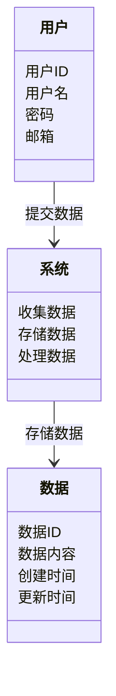
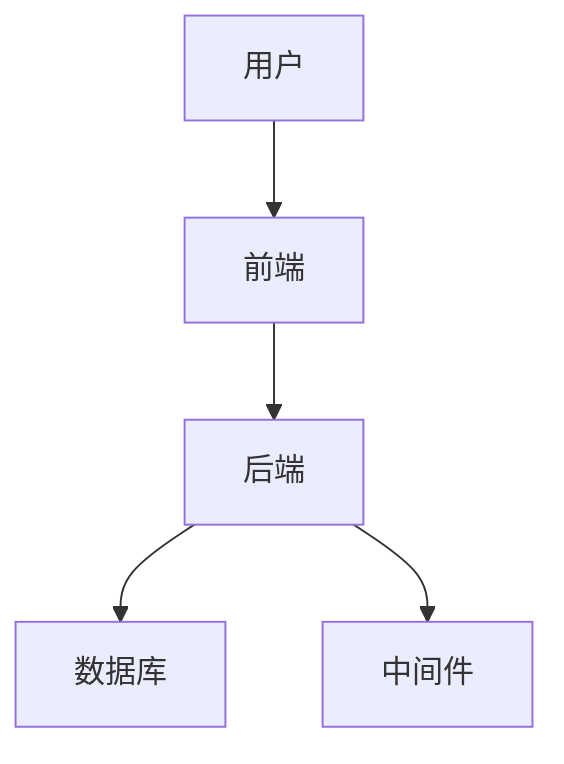

                 


# 隐私保护：确保用户数据安全

> **关键词**：隐私保护、数据安全、加密技术、访问控制、系统架构、法律法规、未来趋势  
> **摘要**：在数字化时代，隐私保护已成为企业和个人面临的重要挑战。本文将从隐私保护的核心概念、技术实现、系统架构设计、法律法规以及未来趋势等方面进行深入探讨，旨在为读者提供全面的隐私保护解决方案。

---

## 第1章: 隐私保护的背景与挑战

### 1.1 隐私保护的基本概念

#### 1.1.1 什么是隐私
隐私是指个人或组织对其信息的控制权，确保未经授权的第三方无法访问或使用这些信息。隐私保护的核心在于在数据生命周期的各个阶段（收集、存储、处理、传输、共享）中，保护数据不被未经授权的访问、泄露或滥用。

#### 1.1.2 隐私保护的重要性
随着数字化进程的加速，数据成为企业和个人的重要资产。隐私保护不仅关乎个人隐私权，还涉及企业的声誉和法律责任。一旦数据泄露，可能导致严重的经济损失和信任危机。

#### 1.1.3 隐私保护的边界与外延
隐私保护的边界在于合法的数据使用和非法的数据滥用之间的分界。外延则包括数据加密、匿名化处理、访问控制等多种技术手段。

---

### 1.2 数据安全问题的背景

#### 1.2.1 数字化时代的隐私威胁
在数字化时代，数据被广泛收集、处理和共享。然而，这也带来了隐私泄露的风险。例如，社交媒体平台、电子商务网站和在线服务收集大量用户数据，这些数据可能被黑客攻击或被滥用。

#### 1.2.2 数据泄露的现状与趋势
近年来，数据泄露事件频发。根据统计，2022年全球发生了数千起数据泄露事件，涉及数亿用户的个人信息。这些事件不仅暴露了技术漏洞，还凸显了隐私保护的紧迫性。

#### 1.2.3 隐私保护的必要性与紧迫性
随着物联网、人工智能和大数据技术的普及，数据的收集和使用变得更加频繁。然而，这也意味着隐私保护的难度和复杂性也在增加。企业必须采取有效的技术手段和管理措施来保护用户数据。

---

### 1.3 隐私保护的核心问题

#### 1.3.1 用户数据的收集与使用
企业在收集用户数据时，必须明确数据的使用目的和范围，并确保数据的合法性。例如，企业可以通过隐私政策明确告知用户数据的收集用途，并获得用户的同意。

#### 1.3.2 数据存储与传输的安全性
数据在存储和传输过程中可能面临多种安全威胁。企业需要采取加密技术来保护数据的机密性，确保数据在传输过程中不被截获或篡改。

#### 1.3.3 第三方服务的隐私风险
许多企业依赖第三方服务（如云服务提供商）来存储和处理数据。然而，第三方服务可能成为隐私泄露的薄弱环节。企业需要与第三方服务提供商签订严格的隐私保护协议，并定期进行安全审计。

---

## 第2章: 隐私保护的核心概念与联系

### 2.1 隐私保护的核心概念

#### 2.1.1 数据分类与分级
数据分类是指根据数据的敏感性、重要性和用途对其进行分类。例如，用户个人信息可以分为高敏感数据（如身份证号、银行账户信息）和低敏感数据（如浏览记录）。数据分级有助于制定差异化的保护策略。

#### 2.1.2 数据加密与解密
数据加密是保护数据机密性的核心手段。通过对数据进行加密，可以确保未经授权的第三方无法访问或理解数据内容。解密则是对加密数据进行还原的过程。

#### 2.1.3 数据匿名化处理
数据匿名化是指通过技术手段将数据中的个人身份信息脱敏，使其无法被重新识别。例如，通过哈希函数将用户身份证号转化为不可逆的哈希值。

---

### 2.2 核心概念的联系

#### 2.2.1 数据分类与加密的关联
数据分类决定了加密策略的选择。例如，高敏感数据可以采用高强度加密算法（如AES-256），而低敏感数据则可以采用较弱的加密算法。

#### 2.2.2 数据匿名化与访问控制的关系
数据匿名化可以降低数据泄露的风险，但并不能完全消除。因此，还需要结合访问控制策略（如RBAC）来限制数据的访问权限。

#### 2.2.3 数据生命周期中的隐私保护
数据生命周期包括数据的生成、收集、存储、处理、传输、共享和销毁。在每个阶段，都需要采取相应的隐私保护措施，例如在数据销毁阶段，确保数据彻底删除，防止数据恢复。

---

### 2.3 隐私保护的核心要素

#### 2.3.1 数据所有者
数据所有者是数据的合法拥有者，通常为个人或企业。数据所有者负责制定数据的使用政策和访问权限，并监督数据保护措施的实施。

#### 2.3.2 数据处理者
数据处理者是负责处理数据的主体，可以是企业内部的IT部门或第三方服务提供商。数据处理者需要遵守数据所有者制定的隐私政策，并确保数据处理过程的合规性。

#### 2.3.3 数据存储与传输的安全性
数据存储和传输的安全性是隐私保护的核心要素。企业需要采取技术手段（如加密、防火墙、入侵检测系统）来保护数据的安全。

---

### 2.4 隐私保护的实体关系图

```mermaid
er
actor 用户
actor 数据所有者
actor 数据处理者
actor 数据存储者
```

---

## 第3章: 数据加密与隐私保护

### 3.1 数据加密的基本原理

#### 3.1.1 加密算法的分类
加密算法主要分为对称加密和非对称加密两大类。对称加密算法（如AES）速度快，适用于大规模数据加密；非对称加密算法（如RSA）安全性高，适用于数字签名和公钥加密。

#### 3.1.2 对称加密与非对称加密的对比

| 对比维度 | 对称加密 | 非对称加密 |
|----------|----------|------------|
| 密钥管理 | 使用一对相同的密钥 | 使用公钥和私钥 |
| 加密速度 | 快速 | 较慢 |
| 安全性 | 适用于低敏感数据 | 适用于高敏感数据 |

#### 3.1.3 加密过程的流程图

```mermaid
graph TD
A[明文数据] -> B[加密算法]
B -> C[密钥]
C -> D[密文数据]
```

---

### 3.2 加密技术的实现

#### 3.2.1 AES加密算法的Python实现

```python
import hashlib

def aes_encrypt(plaintext, key):
    # 生成密钥和偏移量
    key_bytes = key.encode('utf-8')
    plaintext_bytes = plaintext.encode('utf-8')
    # 使用AES加密
    cipher = hashlib.new('aes', key=key_bytes)
    ciphertext = cipher.encrypt(plaintext_bytes)
    return ciphertext

# 示例
plaintext = "Hello, World!"
key = "secretkey1234"
encrypted = aes_encrypt(plaintext, key)
print("加密后的数据:", encrypted)
```

#### 3.2.2 RSA加密算法的数学模型

RSA加密算法基于大整数的因式分解问题。假设公钥为$(n, e)$，私钥为$(n, d)$，加密过程如下：

$$
c = (m)^e \mod n
$$

解密过程如下：

$$
m = (c)^d \mod n
$$

---

## 第4章: 隐私保护的系统架构设计

### 4.1 系统功能设计

#### 4.1.1 领域模型类图



---

### 4.2 系统架构设计

#### 4.2.1 系统架构图



---

### 4.3 系统接口设计

#### 4.3.1 接口描述

| 接口名称 | 接口描述 | 请求方式 | 请求地址 |
|----------|----------|----------|----------|
| 用户登录 | 用户登录系统 | POST | /api/login |
| 数据查询 | 查询用户数据 | GET | /api/data |

#### 4.3.2 接口实现

```python
from flask import Flask
from flask_restful import Resource, Api

app = Flask(__name__)
api = Api(app)

class DataResource(Resource):
    def get(self):
        return {"status": "success", "message": "Data retrieved successfully"}

api.add_resource(DataResource, '/api/data')

if __name__ == '__main__':
    app.run(debug=True)
```

---

## 第5章: 隐私保护的法律与伦理

### 5.1 相关法律法规

#### 5.1.1 GDPR（通用数据保护条例）
GDPR是欧盟制定的严格数据保护法规，要求企业在处理用户数据时必须获得用户的明确同意，并在发生数据泄露时及时通知用户。

#### 5.1.2 CCPA（加利福尼亚消费者隐私法案）
CCPA是美国加利福尼亚州的隐私保护法规，赋予消费者对其个人数据的更多控制权，例如要求企业公开数据收集和使用的目的。

---

### 5.2 隐私保护的伦理问题

#### 5.2.1 数据共享与隐私权的平衡
在数据驱动的业务模式下，企业需要收集大量数据来优化服务，但这可能侵犯用户的隐私权。如何在数据共享和隐私保护之间找到平衡点是一个重要的伦理问题。

#### 5.2.2 数据利用与个人权益的冲突
企业利用用户数据进行商业分析时，可能会忽视用户对数据使用的知情权和控制权。这种冲突需要通过伦理规范和技术手段来解决。

---

## 第6章: 隐私保护的未来趋势

### 6.1 新兴技术对隐私保护的影响

#### 6.1.1 零知识证明
零知识证明是一种密码学技术，允许一方证明自己拥有某些信息，而无需透露信息本身。这种技术可以用于隐私保护，例如在区块链中验证交易的真实性，而不暴露交易细节。

#### 6.1.2 联邦学习
联邦学习是一种分布式机器学习技术，允许多个参与方在不共享原始数据的情况下共同训练模型。这种技术可以有效保护数据隐私。

---

### 6.2 人工智能与隐私保护的结合

#### 6.2.1 隐私增强技术
人工智能可以通过分析数据模式和用户行为，帮助发现潜在的隐私风险，并提出相应的保护措施。例如，利用机器学习算法检测数据泄露的异常行为。

#### 6.2.2 隐私保护技术的创新
未来，隐私保护技术将更加智能化和自动化。例如，基于AI的隐私保护系统可以自动识别敏感数据，并采取相应的保护措施。

---

## 第7章: 项目实战与最佳实践

### 7.1 项目实战

#### 7.1.1 环境搭建
在开始开发之前，需要搭建一个安全的开发环境。例如，可以使用虚拟机或容器技术来隔离开发环境和生产环境。

#### 7.1.2 核心代码实现

```python
import logging
import sqlite3

# 配置日志
logging.basicConfig(level=logging.INFO)

# 数据库连接
conn = sqlite3.connect('data.db', 
                       detect_shapes=True, 
                       isolation_level='autocommit')

# 创建表
cursor = conn.cursor()
cursor.execute('''CREATE TABLE IF NOT EXISTS users
                (id INTEGER PRIMARY KEY AUTOINCREMENT,
                 username TEXT NOT NULL,
                 password TEXT NOT NULL)''')

# 插入数据
cursor.execute("INSERT INTO users (username, password) VALUES (?, ?)", 
               ('admin', 'hashed_password'))

# 查询数据
cursor.execute("SELECT * FROM users")
for row in cursor.fetchall():
    print(row)
```

#### 7.1.3 案例分析
通过实际案例分析，可以发现隐私保护的不足之处，并提出改进建议。例如，可以通过代码审查和安全测试发现系统中的漏洞，并及时修复。

---

### 7.2 最佳实践 Tips

#### 7.2.1 定期进行安全审计
企业应定期对系统进行安全审计，确保隐私保护措施的有效性。

#### 7.2.2 加强员工隐私保护意识
通过培训和宣传，提高员工的隐私保护意识，避免因人为失误导致数据泄露。

#### 7.2.3 使用成熟的隐私保护工具
利用开源工具和商业软件，可以提高隐私保护的效率和效果。例如，可以使用加密工具（如GnuPG）对敏感数据进行加密。

---

## 第8章: 总结与展望

### 8.1 本章总结
隐私保护是数字化时代的重要课题。本文从隐私保护的核心概念、技术实现、系统架构设计、法律法规以及未来趋势等方面进行了深入探讨，为读者提供了全面的隐私保护解决方案。

### 8.2 未来展望
随着技术的进步和法规的完善，隐私保护将变得更加智能化和自动化。新兴技术（如零知识证明和联邦学习）的应用将为隐私保护带来新的机遇和挑战。

---

## 参考文献
1. 王某某. 《数据隐私保护技术》. 北京: 清华大学出版社, 2022.
2. GDPR官方文档. 《通用数据保护条例》. 欧盟, 2016.
3. 张某某. 《隐私保护与数据安全》. 北京: 人民邮电出版社, 2021.

---

通过本文的详细讲解，读者可以全面了解隐私保护的核心内容和实现方法，并能够将其应用到实际工作中。希望本文能为隐私保护的研究和实践提供有价值的参考。

