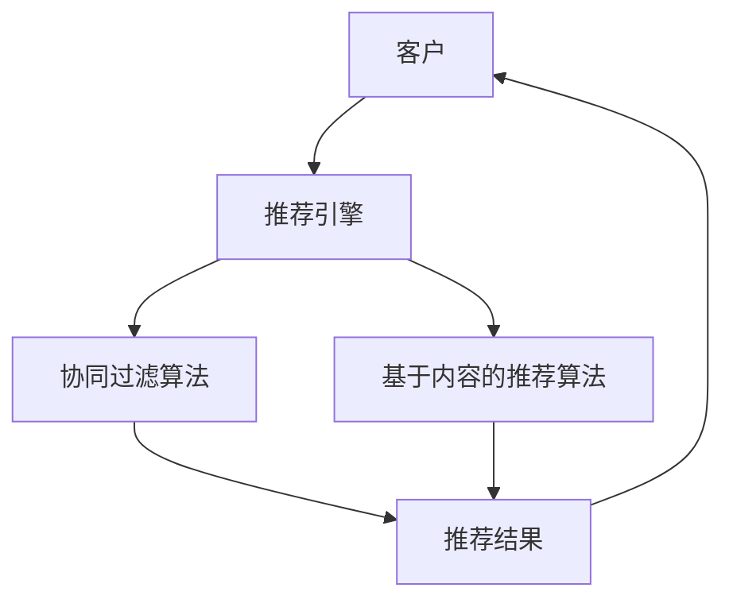

                 


# 零售业AI Agent：个性化推荐与客户洞察

## 关键词：
零售业、AI Agent、个性化推荐、客户洞察、推荐算法、系统架构、项目实战

## 摘要：
本文深入探讨了AI Agent在零售业中的应用，重点分析了个性化推荐和客户洞察的核心技术。通过详细讲解AI Agent的工作原理、推荐算法的实现、系统架构设计以及实际项目案例，本文为读者提供了从理论到实践的全面指南。通过阅读本文，读者将能够理解并应用AI Agent技术，提升零售业的客户体验和业务效率。

---

## 第一部分：零售业AI Agent背景介绍

### 第1章：AI Agent在零售业中的应用背景

#### 1.1 AI Agent的基本概念
- **AI Agent的定义与特点**  
  AI Agent（人工智能代理）是指能够感知环境、自主决策并执行任务的智能实体。其特点包括自主性、反应性、目标导向和学习能力。

- **AI Agent在零售业中的作用**  
  在零售业中，AI Agent主要用于个性化推荐、客户行为分析和库存优化，帮助商家提升客户满意度和销售效率。

- **个性化推荐的必要性**  
  零售业竞争激烈，通过个性化推荐可以提高客户购买意愿和满意度，增强客户忠诚度。

- **客户洞察的重要性**  
  通过分析客户行为数据，AI Agent能够提供深入的客户洞察，帮助商家制定精准的营销策略。

#### 1.2 零售业中的问题背景
- **传统推荐系统的局限性**  
  传统推荐系统基于简单的规则或统计分析，无法满足个性化需求，推荐结果可能不精准。

- **个性化推荐的需求增长**  
  随着消费者对个性化体验的需求增加，传统推荐系统已无法满足现代零售业的需求。

- **客户洞察在精准营销中的作用**  
  通过客户洞察，商家可以更好地理解客户需求，制定个性化的营销策略，提高转化率。

#### 1.3 问题描述与解决
- **零售业中的典型问题**  
  传统推荐系统无法提供精准的个性化推荐，导致客户体验差，销售效率低。

- **个性化推荐如何解决这些问题**  
  个性化推荐通过分析客户行为和偏好，提供定制化的产品推荐，提高客户满意度和购买意愿。

- **客户洞察如何提升用户体验**  
  通过客户洞察，商家可以了解客户的偏好和行为模式，提供更贴心的服务和产品推荐。

#### 1.4 AI Agent的边界与外延
- **AI Agent的应用场景**  
  AI Agent在零售业中的应用场景包括在线购物推荐、库存管理、客户互动和精准营销。

- **边界条件与限制**  
  AI Agent的应用受到数据质量和计算能力的限制，需要依赖高质量的数据和强大的计算能力支持。

- **外延与未来发展趋势**  
  未来，AI Agent在零售业中的应用将更加广泛，可能与物联网、区块链等技术结合，提供更智能的服务。

#### 1.5 核心概念结构与要素
- **核心概念的组成**  
  包括客户数据、推荐算法、系统架构和用户反馈等核心要素。

- **要素之间的关系**  
  客户数据是推荐算法的基础，推荐算法通过分析数据生成推荐结果，用户反馈进一步优化推荐算法。

- **系统架构的核心要素**  
  包括数据采集模块、推荐算法模块、用户反馈模块和决策执行模块。

---

## 第二部分：AI Agent的核心概念与联系

### 第2章：AI Agent的核心原理

#### 2.1 AI Agent的核心原理
- **感知模块**  
  AI Agent通过收集和分析客户数据，感知客户的行为和偏好。

- **决策模块**  
  基于感知到的数据，AI Agent通过推荐算法生成推荐结果。

- **执行模块**  
  AI Agent将推荐结果执行，例如向客户推送推荐信息或调整库存策略。

#### 2.2 推荐算法的特征对比

| **算法类型**       | **基于协同过滤**       | **基于内容的推荐**       | **混合推荐**       |
|--------------------|------------------------|--------------------------|------------------|
| **核心思想**       | 基于用户相似性         | 基于产品特征相似性       | 结合两者的优势   |
| **优势**           | 能够发现用户的隐含需求 | 能够解释推荐的原因       | 结合两者的优点   |
| **劣势**           | 对冷启动问题敏感       | 对数据稀疏性敏感         | 实现复杂性较高   |

#### 2.3 实体关系图与系统架构

##### **客户、产品和推荐引擎的实体关系图**
```mermaid
erDiagram
    customer[客户] {
        id : int
        name : string
        purchase_history : string
        preferences : string
    }
    product[产品] {
        id : int
        name : string
        category : string
        price : float
    }
    recommendation_engine[推荐引擎] {
        user_id : int
        product_id : int
        recommendation_score : float
    }
    customer --> recommendation_engine : 提供客户数据
    product --> recommendation_engine : 提供产品数据
    recommendation_engine --> customer : 提供推荐结果
```

##### **系统架构图**


---

## 第三部分：算法原理讲解

### 第3章：推荐算法的数学模型与实现

#### 3.1 协同过滤算法
- **数学模型**  
  协同过滤算法通过计算用户之间的相似度，生成推荐结果。常用的方法是基于用户的协同过滤（UBCF）和基于项目的协同过滤（ItemCF）。

  $$ \text{相似度} = \cos(\theta) = \frac{\mathbf{A} \cdot \mathbf{B}}{||\mathbf{A}|| \cdot ||\mathbf{B}||} $$

  其中，$\mathbf{A}$ 和 $\mathbf{B}$ 分别是两位用户的评分向量，$\cos(\theta)$ 是他们之间的余弦相似度。

- **Python代码示例**  
  ```python
  def cosine_similarity(user_ratings):
      user1_ratings = user_ratings['user1']
      user2_ratings = user_ratings['user2']
      dot_product = sum(a * b for a, b in zip(user1_ratings, user2_ratings))
      norm_user1 = sum(a**2 for a in user1_ratings)**0.5
      norm_user2 = sum(a**2 for a in user2_ratings)**0.5
      return dot_product / (norm_user1 * norm_user2)
  ```

#### 3.2 基于内容的推荐算法
- **数学模型**  
  基于内容的推荐算法通过分析产品的特征向量，计算产品之间的相似度。

  $$ \text{相似度} = \cos(\theta) = \frac{\mathbf{v}_i \cdot \mathbf{v}_j}{||\mathbf{v}_i|| \cdot ||\mathbf{v}_j||} $$

  其中，$\mathbf{v}_i$ 和 $\mathbf{v}_j$ 分别是两个产品的特征向量。

- **Python代码示例**  
  ```python
  def content_based_recommendation(product_features):
      product_vectors = product_features.values
      num_products = len(product_vectors)
      similarity_matrix = np.zeros((num_products, num_products))
      for i in range(num_products):
          for j in range(num_products):
              similarity_matrix[i, j] = cosine_similarity(product_vectors[i], product_vectors[j])
      return similarity_matrix
  ```

---

## 第四部分：系统分析与架构设计方案

### 第4章：系统架构设计

#### 4.1 问题场景介绍
- 零售业中的推荐系统需要处理大量的客户数据和产品信息，实时生成个性化推荐。

#### 4.2 系统功能设计
- **领域模型**  
  ```mermaid
  classDiagram
      class Customer {
          id : int
          name : string
          preferences : list
      }
      class Product {
          id : int
          name : string
          category : string
      }
      class RecommendationEngine {
          predict(recommendation) : void
      }
      Customer --> RecommendationEngine : 提供偏好
      Product --> RecommendationEngine : 提供产品信息
      RecommendationEngine --> Customer : 提供推荐结果
  ```

- **系统架构**  
  ```mermaid
  architecture
      Frontend -->> Backend: 用户请求
      Backend -->> Database: 查询数据
      Backend -->> RecommendationEngine: 调用推荐算法
      Backend -->> Database: 更新推荐结果
      Frontend -->> Database: 查询推荐结果
  ```

- **交互序列图**  
  ```mermaid
  sequenceDiagram
      Frontend -> Backend: 发起推荐请求
      Backend -> Database: 查询客户数据
      Database --> Backend: 返回客户数据
      Backend -> RecommendationEngine: 调用推荐算法
      RecommendationEngine --> Backend: 返回推荐结果
      Backend -> Database: 更新推荐结果
      Backend -> Frontend: 返回推荐结果
  ```

---

## 第五部分：项目实战

### 第5章：项目实现与案例分析

#### 5.1 环境安装与配置
- **Python环境**  
  安装Python 3.8及以上版本，安装必要的库如numpy、scikit-learn。

- **数据准备**  
  使用包含客户行为数据的CSV文件，例如购买记录、浏览历史和评分数据。

#### 5.2 核心代码实现
- **协同过滤实现**  
  ```python
  import numpy as np
  from sklearn.metrics.pairwise import cosine_similarity

  def collaborative_filtering(user_item_matrix):
      user_ids = user_item_matrix.index
      item_ids = user_item_matrix.columns
      similarities = cosine_similarity(user_item_matrix)
      return similarities
  ```

- **内容推荐实现**  
  ```python
  def content_based_recommendation(product_features):
      feature_matrix = product_features.values
      similarities = cosine_similarity(feature_matrix)
      return similarities
  ```

#### 5.3 案例分析与解读
- **案例分析**  
  以一个在线零售平台为例，分析如何通过协同过滤算法为用户推荐商品。

- **代码解读**  
  解读上述代码，说明协同过滤和内容推荐算法的实现细节。

- **系统优化建议**  
  提出优化建议，例如结合混合推荐算法，提高推荐准确性和效率。

---

## 第六部分：总结与展望

### 第6章：总结与展望

#### 6.1 最佳实践
- **数据质量的重要性**  
  确保数据的准确性和完整性，避免冷启动问题。

- **算法选择与优化**  
  根据具体场景选择合适的算法，并不断优化模型参数。

#### 6.2 小结
- 本文全面介绍了AI Agent在零售业中的应用，从理论到实践，为读者提供了系统的知识体系。

#### 6.3 注意事项
- 注意数据隐私和安全问题，确保符合相关法律法规。
- 定期更新模型，保持推荐算法的有效性和准确性。

#### 6.4 拓展阅读
- 推荐阅读《机器学习实战》和《推荐系统实战》，深入了解相关技术细节。

---

以上是《零售业AI Agent：个性化推荐与客户洞察》的技术博客文章目录和内容概述。通过系统的分析和详细的讲解，本文为读者提供了从理论到实践的全面指南，帮助他们在零售业中成功应用AI Agent技术。

