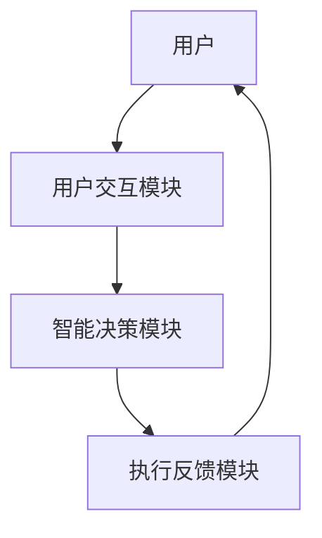
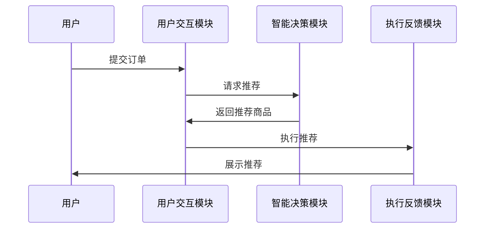

                 


# 零售业AI Agent：提升客户体验与销售效率

## 关键词：人工智能、零售业、客户体验、销售效率、AI Agent、算法、系统架构

## 摘要：  
本文探讨了AI Agent在零售业中的应用，分析了其如何通过智能化决策和个性化服务提升客户体验和销售效率。文章从AI Agent的基本概念入手，详细讲解了其核心技术、算法原理、系统架构，并通过实际案例展示了AI Agent在零售业中的具体应用。最后，总结了AI Agent的优势及未来发展趋势，为零售业的数字化转型提供了有价值的参考。

---

# 第1章: 零售业AI Agent的背景与概念

## 1.1 AI Agent的基本概念  
### 1.1.1 什么是AI Agent  
AI Agent（人工智能代理）是指能够感知环境、自主决策并执行任务的智能系统。它可以理解用户需求、提供个性化服务，并通过学习优化自身行为。  

### 1.1.2 AI Agent的核心特征  
- **自主性**：能够独立决策，无需人工干预。  
- **反应性**：能够实时感知环境变化并做出响应。  
- **学习性**：通过数据和经验不断优化自身性能。  
- **交互性**：能够与用户、系统或其他设备进行有效通信。  

### 1.1.3 AI Agent与传统零售系统的区别  
传统零售系统通常依赖人工操作和固定规则，而AI Agent能够通过数据驱动的方式实现动态优化和个性化服务。  

## 1.2 零售业的现状与挑战  
### 1.2.1 当前零售业的主要问题  
- **客户体验不足**：传统零售缺乏个性化服务，客户感受较差。  
- **效率低下**：人工操作效率低，难以满足大规模需求。  
- **数据孤岛**：各部门数据分散，难以实现高效协同。  

### 1.2.2 零售业的数字化转型趋势  
随着技术进步，零售业正从传统模式向数字化、智能化转型。AI、大数据和云计算等技术的应用成为趋势。  

### 1.2.3 AI Agent在零售业中的应用潜力  
AI Agent能够通过数据分析、智能推荐和实时互动提升客户体验，同时优化库存管理和销售流程，降低成本。  

## 1.3 AI Agent在零售业中的应用价值  
### 1.3.1 提升客户体验  
通过个性化推荐和实时互动，AI Agent能够为客户提供更贴心的服务，增强客户满意度和忠诚度。  

### 1.3.2 提高销售效率  
AI Agent能够自动化处理订单、优化库存管理和预测销售趋势，从而提高整体销售效率。  

### 1.3.3 优化运营成本  
通过智能化管理和资源优化，AI Agent能够降低运营成本，提高整体利润水平。  

## 1.4 本章小结  
本章介绍了AI Agent的基本概念及其在零售业中的应用价值，为后续章节奠定了基础。  

---

# 第2章: 任务规划与决策算法  

## 2.1 任务规划的基本原理  
### 2.1.1 状态空间与动作空间的定义  
- **状态空间**：系统当前所处的状态集合，例如“客户正在浏览商品”。  
- **动作空间**：系统可以执行的动作集合，例如“推荐商品”或“提供优惠信息”。  

### 2.1.2 策略与价值函数的构建  
- **策略**：决定系统在某个状态下选择哪个动作的规则。  
- **价值函数**：评估某个动作在特定状态下带来的收益或损失。  

### 2.1.3 强化学习算法在任务规划中的应用  
强化学习是一种通过试错机制优化决策的算法，常用于任务规划中。  

## 2.2 基于强化学习的推荐系统  
### 2.2.1 Q-learning算法的实现  
Q-learning是一种经典的强化学习算法，通过更新Q值表来优化决策。  

### 2.2.2 DQN算法的改进与优化  
深度Q网络（DQN）通过神经网络近似Q值函数，能够处理高维状态空间。  

### 2.2.3 在零售推荐中的应用案例  
例如，DQN算法可以用于优化商品推荐顺序，提升客户购买率。  

## 2.3 算法实现的数学模型  
### 2.3.1 Q-learning算法的数学公式  
$$ Q(s, a) = Q(s, a) + \alpha (r + \max Q(s', a') - Q(s, a)) $$  

### 2.3.2 DQN网络结构的数学描述  
输入层 → 隐藏层 → 输出层，输出为Q值。  

### 2.3.3 算法实现的伪代码示例  
```python
class AI_Agent:
    def __init__(self):
        self.model = DQN_network()
        self.memory = Memory()
        self.epsilon = 0.1

    def take_action(self, state):
        if random.random() < self.epsilon:
            return random.choice(actions)
        else:
            return self.model.predict(state)
```

## 2.4 本章小结  
本章详细讲解了AI Agent的任务规划与决策算法，重点介绍了Q-learning和DQN算法，并通过案例展示了它们在零售推荐中的应用。  

---

# 第3章: 零售业AI Agent的系统架构设计  

## 3.1 系统模块划分  
### 3.1.1 用户交互模块  
负责与客户互动，收集用户需求并反馈系统。  

### 3.1.2 数据采集模块  
收集客户行为数据、销售数据等，为AI Agent提供输入。  

### 3.1.3 智能决策模块  
基于数据和算法，生成推荐方案或优化策略。  

### 3.1.4 执行反馈模块  
将决策结果执行并收集反馈，用于优化系统性能。  

## 3.2 系统功能设计  
### 3.2.1 用户画像构建  
通过分析客户数据，建立详细的用户画像，用于个性化推荐。  

### 3.2.2 智能推荐系统  
基于用户画像和历史数据，实时推荐商品或优惠信息。  

### 3.2.3 销售预测与库存优化  
通过机器学习模型预测销售趋势，优化库存管理。  

### 3.2.4 客户行为分析  
分析客户行为，识别潜在需求并优化营销策略。  

## 3.3 系统架构图  
### 3.3.1 系统整体架构图（Mermaid）  


### 3.3.2 关键模块交互图（Mermaid）  


## 3.4 本章小结  
本章从系统架构的角度，详细描述了AI Agent在零售业中的模块划分和功能设计，并通过图示展示了各模块的交互关系。  

---

# 第4章: 零售业AI Agent的项目实战  

## 4.1 项目背景与目标  
### 4.1.1 项目需求分析  
提升客户体验和销售效率，优化库存管理。  

### 4.1.2 项目目标设定  
开发一个基于AI Agent的智能导购系统，实现个性化推荐和实时互动。  

### 4.1.3 项目范围界定  
涵盖用户交互、数据采集、智能决策和执行反馈四个模块。  

## 4.2 系统核心实现  
### 4.2.1 环境搭建与数据准备  
- **环境搭建**：安装Python、TensorFlow、Keras等工具。  
- **数据准备**：收集用户行为数据、商品数据等，清洗并预处理。  

### 4.2.2 模型训练与优化  
- **模型选择**：选择适合的推荐算法（如协同过滤、深度学习模型）。  
- **模型训练**：使用历史数据训练模型，优化参数。  

### 4.2.3 系统集成与测试  
- **系统集成**：将各模块整合，测试整体流程。  
- **系统测试**：通过实际数据验证系统性能。  

## 4.3 项目实战案例分析  
### 4.3.1 案例背景  
某零售企业希望通过AI Agent提升客户购买率和满意度。  

### 4.3.2 系统实现  
- **用户交互模块**：通过网页或APP与用户互动。  
- **智能决策模块**：基于用户画像推荐商品。  
- **执行反馈模块**：记录客户行为，优化推荐策略。  

## 4.4 本章小结  
本章通过一个实际案例，详细讲解了AI Agent的项目开发流程，从需求分析到系统实现，为读者提供了实践指导。  

---

# 第5章: 总结与展望  

## 5.1 总结  
本文全面介绍了AI Agent在零售业中的应用，从技术原理到系统架构，再到实际案例，详细讲解了如何利用AI Agent提升客户体验和销售效率。  

## 5.2 展望  
随着技术进步，AI Agent在零售业中的应用将更加广泛，未来的趋势包括更个性化的服务、更高效的决策算法和更智能化的系统架构。  

## 5.3 注意事项  
- 数据隐私保护是AI Agent应用中的重要问题。  
- 系统的可解释性也是实际应用中需要关注的点。  

## 5.4 拓展阅读  
推荐阅读相关书籍和论文，深入了解AI Agent在其他领域的应用。  

---

# 附录：代码示例  

## 附录A: AI Agent的核心算法代码  
```python
import numpy as np
import random

class DQN:
    def __init__(self, state_space, action_space):
        self.state_space = state_space
        self.action_space = action_space
        self.model = self.build_model()

    def build_model(self):
        # 定义神经网络模型
        return Sequential([
            Dense(64, activation='relu'),
            Dense(32, activation='relu'),
            Dense(self.action_space, activation='linear')
        ])

    def remember(self, state, action, reward, next_state):
        # 记忆单元格存储经验
        pass

    def act(self, state):
        # 根据当前状态选择动作
        return np.random.randint(self.action_space)

    def train(self, batch):
        # 网络训练
        pass
```

## 附录B: 系统架构代码示例  
```python
class RetailAI:
    def __init__(self):
        self.user_data = {}  # 用户数据
        self.product_data = {}  # 商品数据
        self.recommendation_engine = Recommender()  # 推荐引擎

    def process_request(self, request):
        # 处理用户请求
        pass

    def update_data(self, new_data):
        # 更新数据
        pass
```

---

# 结语  
通过本文的详细讲解，读者可以全面了解AI Agent在零售业中的应用，从理论到实践，为未来的数字化转型提供了有力支持。

