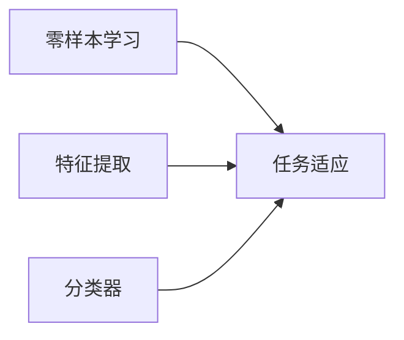
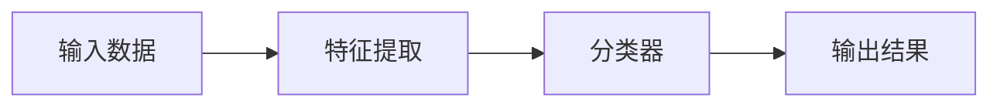
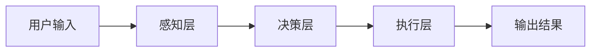

                 


# 零样本学习在AI Agent新任务适应中的应用

> 关键词：零样本学习，AI Agent，任务适应，机器学习，特征提取

> 摘要：本文探讨零样本学习在AI Agent中的应用，分析其核心概念、算法原理、系统架构，并通过实际案例展示其在新任务适应中的优势和实现方法。

---

## 第一部分: 零样本学习与AI Agent概述

### 第1章: 零样本学习的背景与概念

#### 1.1 零样本学习的定义与特点
- **零样本学习的定义**：零样本学习（Zero-shot Learning, ZSL）是指在没有特定任务的训练数据的情况下，模型能够识别或处理新任务的能力。其核心假设是模型能够通过预训练的知识或通用特征提取，推断出新任务的解决方案。
- **零样本学习的核心特点**：
  - **零数据训练**：无需新任务的训练数据。
  - **通用性**：依赖于预训练模型的特征提取能力。
  - **实时适应**：能够在新任务出现时快速调整。
- **零样本学习与传统机器学习的对比**：
  | 方面       | 零样本学习               | 传统机器学习          |
  |------------|--------------------------|-----------------------|
  | 数据需求   | 无新任务数据              | 需要大量标注数据       |
  | 适应性     | 高                      | 低                    |
  | 应用场景   | 新任务实时适应            | 固定任务处理          |

#### 1.2 AI Agent的基本概念
- **AI Agent的定义**：AI Agent是具有感知、决策、执行能力的智能体，能够根据环境信息自主完成任务。
- **AI Agent的核心功能**：
  - **感知**：通过传感器或接口获取环境信息。
  - **决策**：基于感知信息做出决策。
  - **执行**：通过执行机构完成任务。
- **AI Agent的应用场景**：
  - 智能助手（如Siri、Alexa）。
  - 自动驾驶系统。
  - 智能客服机器人。

#### 1.3 零样本学习在AI Agent中的应用价值
- **AI Agent任务适应性的需求**：AI Agent需要在动态环境中快速适应新任务，如处理未见过的用户请求或环境变化。
- **零样本学习如何解决新任务适应问题**：通过预训练的通用特征提取能力，AI Agent可以在没有新任务数据的情况下快速适应新任务。
- **零样本学习在AI Agent中的优势**：
  - **快速响应**：无需重新训练模型。
  - **节省资源**：减少数据收集和处理成本。
  - **灵活性高**：适用于多样化任务。

---

### 第2章: 零样本学习的核心概念与联系

#### 2.1 零样本学习的核心原理
- **零样本学习的基本假设**：模型通过预训练的特征提取能力，能够在没有新任务数据的情况下，推断出新任务的解决方案。
- **零样本学习的关键技术**：
  - **特征提取**：提取通用且可迁移的特征。
  - **分类器设计**：基于通用特征进行分类或回归。
- **零样本学习的实现流程**：
  1. 预训练：使用大规模通用数据训练特征提取模型。
  2. 任务适应：在新任务中，使用预训练的特征提取模型提取特征，并通过分类器进行预测。

#### 2.2 零样本学习与其他学习范式的对比
- **迁移学习的对比**：
  - **迁移学习**：利用源任务数据进行迁移，辅助目标任务学习。
  - **零样本学习**：无需目标任务数据，仅依赖预训练特征。
- **小样本学习的对比**：
  - **小样本学习**：在目标任务上有少量数据，需要高效利用。
  - **零样本学习**：目标任务无数据，依赖预训练特征。
- **零样本学习的独特性**：
  - 无需目标任务数据。
  - 强调通用特征的可迁移性。

#### 2.3 零样本学习的实体关系图


---

## 第二部分: 零样本学习的算法原理与实现

### 第3章: 零样本学习的算法原理

#### 3.1 零样本学习的实现流程
- **预训练阶段**：
  - 使用大规模通用数据（如ImageNet）训练特征提取模型（如ResNet）。
- **任务适应阶段**：
  - 对于新任务，提取输入数据的特征，并通过分类器进行预测。

#### 3.2 零样本学习的算法流程图


#### 3.3 零样本学习的Python实现示例
```python
import torch
import torch.nn as nn

# 预训练的特征提取模型（如ResNet）
class FeatureExtractor(nn.Module):
    def __init__(self):
        super(FeatureExtractor, self).__init__()
        self.conv = nn.Conv2d(3, 64, kernel_size=3, stride=1, padding=1)
        self.relu = nn.ReLU()
    
    def forward(self, x):
        x = self.conv(x)
        x = self.relu(x)
        return x

# 分类器
class Classifier(nn.Module):
    def __init__(self, input_dim, output_dim):
        super(Classifier, self).__init__()
        self.fc = nn.Linear(input_dim, output_dim)
    
    def forward(self, x):
        return self.fc(x)

# 使用零样本学习进行预测
def zero_shot_learning_predict(feature_extractor, classifier, input_data):
    features = feature_extractor(input_data)
    output = classifier(features)
    return output

# 示例使用
feature_extractor = FeatureExtractor()
classifier = Classifier(64, 10)
input_data = torch.randn(1, 3, 32, 32)
result = zero_shot_learning_predict(feature_extractor, classifier, input_data)
print(result)
```

#### 3.4 零样本学习的数学模型和公式
- **特征提取函数**：将输入数据映射到特征空间。
  $$ f(x) = h(x) $$
  其中，$h(x)$是特征提取函数。
- **分类器函数**：基于特征进行分类。
  $$ g(h(x)) = y $$
  其中，$y$是预测结果。

---

### 第4章: 零样本学习的系统架构与设计

#### 4.1 系统分析与架构设计方案
- **系统架构**：
  - **感知层**：负责数据的获取和预处理。
  - **决策层**：负责特征提取和任务决策。
  - **执行层**：负责输出结果或执行动作。

#### 4.2 系统架构图


---

## 第三部分: 零样本学习在AI Agent中的应用

### 第5章: 项目实战与案例分析

#### 5.1 项目背景与目标
- **项目背景**：设计一个能够适应新任务的AI对话系统。
- **项目目标**：实现零样本学习，使系统能够处理未见过的用户请求。

#### 5.2 系统功能设计
- **功能模块**：
  - 用户输入处理模块。
  - 零样本学习处理模块。
  - 输出结果生成模块。

#### 5.3 项目实现代码
```python
import torch
import torch.nn as nn

# 预训练的特征提取模型
class FeatureExtractor(nn.Module):
    def __init__(self):
        super(FeatureExtractor, self).__init__()
        self.conv = nn.Conv1d(in_channels=100, out_channels=256, kernel_size=3, padding=1)
        self.relu = nn.ReLU()
    
    def forward(self, x):
        x = self.conv(x)
        x = self.relu(x)
        return x

# 分类器
class Classifier(nn.Module):
    def __init__(self, input_dim, output_dim):
        super(Classifier, self).__init__()
        self.fc = nn.Linear(input_dim, output_dim)
    
    def forward(self, x):
        return self.fc(x)

# 整体系统架构
class ZeroShotAgent(nn.Module):
    def __init__(self):
        super(ZeroShotAgent, self).__init__()
        self.feature_extractor = FeatureExtractor()
        self.classifier = Classifier(256, 5)

    def forward(self, input_data):
        features = self.feature_extractor(input_data)
        output = self.classifier(features)
        return output

# 示例使用
agent = ZeroShotAgent()
input_data = torch.randn(1, 100, 32)
result = agent(input_data)
print(result)
```

#### 5.4 案例分析与总结
- **案例分析**：通过具体案例展示零样本学习在AI对话系统中的应用。
- **总结**：零样本学习能够有效提高AI Agent的任务适应能力，减少数据依赖，实现快速响应。

---

## 第四部分: 最佳实践与总结

### 第6章: 最佳实践与注意事项

#### 6.1 实践建议
- **选择合适的预训练模型**：根据任务需求选择适合的预训练模型。
- **处理数据稀疏性**：在零样本学习中，数据稀疏性可能导致性能下降，需采取数据增强等方法。

#### 6.2 注意事项
- **模型泛化能力**：零样本学习依赖于预训练模型的泛化能力，需选择性能良好的模型。
- **任务相关性**：确保新任务与预训练任务具有一定的相关性，以提高准确率。

### 第7章: 总结与展望

#### 7.1 总结
- 零样本学习为AI Agent的新任务适应提供了有效的解决方案。
- 通过预训练模型的特征提取能力，AI Agent能够在没有新任务数据的情况下快速适应新任务。

#### 7.2 展望
- 零样本学习在AI Agent中的应用将更加广泛。
- 结合其他技术（如强化学习）进一步提升任务适应能力。

---

通过本文的分析与实践，我们深入探讨了零样本学习在AI Agent新任务适应中的应用，展示了其在实际项目中的巨大潜力和应用价值。未来，随着技术的不断发展，零样本学习将在更多领域发挥重要作用。

