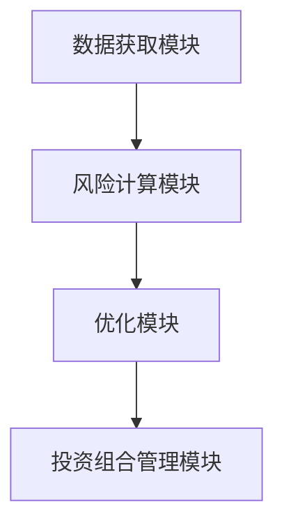

                 


# 雷·达里奥的风险平价投资策略

> 关键词：风险平价，投资策略，雷·达里奥，现代投资组合理论，风险因子，资产配置，投资组合优化

> 摘要：本文深入探讨了雷·达里奥的风险平价投资策略，从其核心概念、数学模型、算法原理到实际应用，结合现代投资组合理论，详细分析了风险平价策略的优势与不足。通过Mermaid流程图和Python代码示例，展示了风险平价策略的优化过程，并结合实际案例分析，探讨了其在不同市场环境下的表现与应用前景。

---

# 第1章: 风险平价投资策略的背景与概念

## 1.1 风险平价的定义与背景

### 1.1.1 风险平价的定义
风险平价（Risk Parity）是一种投资策略，旨在通过平衡投资组合中各个资产或资产类别所承担的风险，来优化整体投资组合的风险收益比。与传统的基于收益的资产配置方法不同，风险平价关注的是资产的波动性或风险贡献，而非单纯的收益或权重。

### 1.1.2 风险平价的背景与发展
风险平价的概念起源于20世纪80年代，但在2008年全球金融危机后，随着市场对风险管理的重视，风险平价策略逐渐受到广泛关注。雷·达里奥（Ray Dalio）作为桥水基金（Bridgewater Associates）的创始人，是风险平价策略的倡导者之一。

### 1.1.3 风险平价在现代投资中的地位
风险平价策略的核心思想是通过分散风险来降低投资组合的整体波动性，同时捕捉不同资产类别之间的低相关性收益。这种方法在机构投资和资产配置中具有重要的理论和实践意义。

## 1.2 风险平价与其他投资策略的对比

### 1.2.1 传统均值-方差模型的局限性
传统均值-方差模型（由哈里·马科维茨提出）基于资产的预期收益和协方差矩阵进行优化，但在实际操作中，由于对收益的预测难度较大，且容易受到市场波动的影响，导致其在实际应用中存在一定的局限性。

### 1.2.2 风险平价的核心优势
风险平价策略的核心优势在于其以风险为核心，通过平衡各资产的风险贡献，降低投资组合的尾部风险，同时提高收益的稳定性。这种方法在市场波动较大时表现尤为突出。

### 1.2.3 风险平价与现代投资组合理论的联系
风险平价策略是对现代投资组合理论的补充和完善，特别是在风险度量和资产配置方面，提供了更直观和实用的解决方案。

## 1.3 风险平价投资策略的现状与应用

### 1.3.1 风险平价在机构投资中的应用
机构投资者（如养老基金、保险公司等）通常面临资产配置和风险管理的双重挑战。风险平价策略通过平衡风险贡献，帮助机构投资者在不同市场环境下实现稳定的收益。

### 1.3.2 风险平价在不同市场环境下的表现
在市场波动较大的情况下，风险平价策略能够有效降低投资组合的整体风险；而在市场平稳运行时，风险平价策略则通过分散风险实现稳健的收益。

### 1.3.3 风险平价策略的边界与外延
风险平价策略的局限性主要体现在其对资产类别流动性的依赖、对尾部风险的控制能力以及对市场周期的适应性等方面。这些都需要在实际应用中进行动态调整。

## 1.4 本章小结
通过本章的介绍，我们了解了风险平价策略的定义、背景、核心优势以及其与其他投资策略的对比。接下来，我们将深入探讨风险平价的核心概念与原理。

---

# 第2章: 风险平价的核心概念与原理

## 2.1 风险平价的数学模型

### 2.1.1 风险平价的目标函数
风险平价的目标是通过优化各资产的风险贡献，使得整个投资组合的风险最小化。目标函数可以表示为：
$$
\text{Minimize} \quad \sum_{i=1}^{n} w_i^2 \sigma_i^2
$$
其中，$w_i$ 是资产 $i$ 的权重，$\sigma_i$ 是资产 $i$ 的波动率。

### 2.1.2 风险平价的约束条件
风险平价模型通常需要满足以下约束条件：
1. 投资组合的总权重为1：
   $$
   \sum_{i=1}^{n} w_i = 1
   $$
2. 各资产的权重非负：
   $$
   w_i \geq 0 \quad \text{for all } i
   $$

### 2.1.3 风险平价的优化过程
风险平价的优化过程可以通过以下步骤实现：
1. 计算各资产的波动率 $\sigma_i$。
2. 构建目标函数 $\sum_{i=1}^{n} w_i^2 \sigma_i^2$。
3. 使用拉格朗日乘数法求解优化问题。

## 2.2 风险因子的定义与选择

### 2.2.1 风险因子的分类
风险因子通常包括以下几类：
1. 市场风险（Market Risk）
2. 利率风险（Interest Rate Risk）
3. 汇率风险（Currency Risk）
4. 信用风险（Credit Risk）

### 2.2.2 风险因子的权重分配
风险因子的权重分配可以通过以下公式实现：
$$
w_i = \frac{\sigma_i}{\sum_{j=1}^{n} \sigma_j}
$$

### 2.2.3 风险因子的动态调整
为了适应市场环境的变化，风险因子的权重需要定期进行动态调整。

## 2.3 风险平价与现代投资组合理论的联系

### 2.3.1 马科维茨均值-方差模型的回顾
马科维茨均值-方差模型的目标是最优化投资组合的收益与风险的组合，但其对收益的预测依赖性较高，导致其在实际应用中存在一定的局限性。

### 2.3.2 风险平价对现代投资组合理论的改进
风险平价策略通过关注资产的风险贡献，弱化了对收益的预测，从而提高了模型的稳健性。

### 2.3.3 风险平价在实际投资中的应用
风险平价策略已经被广泛应用于机构投资、资产配置等领域，并取得了较好的效果。

## 2.4 本章小结
通过本章的介绍，我们深入理解了风险平价的核心概念与数学模型。接下来，我们将探讨风险平价策略的算法原理及其在实际中的应用。

---

# 第3章: 风险平价的算法原理与实现

## 3.1 风险平价的优化算法

### 3.1.1 优化算法的步骤
1. 收集各资产的历史数据。
2. 计算各资产的波动率。
3. 构建目标函数和约束条件。
4. 使用优化算法求解权重。

### 3.1.2 优化算法的实现
以下是使用Python实现风险平价优化的代码示例：

```python
import numpy as np
from scipy.optimize import minimize

def risk_parity Objective(weights, cov_matrix):
    return np.dot(weights, np.dot(cov_matrix, weights))

def risk_parity(w_init, cov_matrix):
    return minimize(risk_parity_Objective, w_init, method='SLSQP', bounds=[(0,1)] * len(w_init), 
                   constraints={'type': 'eq', 'fun': lambda w: sum(w) - 1})
```

## 3.2 风险平价的数学推导

### 3.2.1 优化目标函数的推导
通过求解目标函数的导数，我们可以得到以下条件：
$$
2 w_i \sigma_i^2 + \lambda = 0
$$
其中，$\lambda$ 是拉格朗日乘子。

### 3.2.2 权重的计算公式
根据上述条件，我们可以推导出权重的计算公式：
$$
w_i = \frac{\sigma_i}{\sum_{j=1}^{n} \sigma_j}
$$

## 3.3 风险平价算法的实现步骤

### 3.3.1 数据准备
收集各资产的历史价格数据，计算各资产的收益率和波动率。

### 3.3.2 构建协方差矩阵
通过计算各资产收益率的协方差矩阵，我们可以得到各资产之间的相关性。

### 3.3.3 进行优化
通过优化算法求解权重，使得投资组合的风险最小化。

## 3.4 本章小结
通过本章的介绍，我们了解了风险平价策略的实现步骤及其优化算法。接下来，我们将探讨风险平价策略的数学模型及其在实际中的应用。

---

# 第4章: 风险平价的数学模型与实际应用

## 4.1 风险平价的数学模型

### 4.1.1 风险平价模型的数学表达
风险平价模型的目标函数可以表示为：
$$
\text{Minimize} \quad \sum_{i=1}^{n} w_i^2 \sigma_i^2
$$
其中，$w_i$ 是资产 $i$ 的权重，$\sigma_i$ 是资产 $i$ 的波动率。

### 4.1.2 权重的计算公式
根据优化结果，权重的计算公式为：
$$
w_i = \frac{\sigma_i}{\sum_{j=1}^{n} \sigma_j}
$$

## 4.2 风险平价模型的实现步骤

### 4.2.1 数据准备
收集各资产的历史价格数据，计算各资产的收益率和波动率。

### 4.2.2 构建协方差矩阵
通过计算各资产收益率的协方差矩阵，我们可以得到各资产之间的相关性。

### 4.2.3 进行优化
通过优化算法求解权重，使得投资组合的风险最小化。

## 4.3 风险平价策略的实际应用

### 4.3.1 机构投资中的应用
机构投资者通常通过风险平价策略来优化其资产配置，降低投资组合的整体风险。

### 4.3.2 风险平价策略的优缺点
优点：风险平价策略能够有效降低投资组合的波动性，提高收益的稳定性。缺点：在市场波动较大时，风险平价策略可能会面临较大的流动性压力。

## 4.4 本章小结
通过本章的介绍，我们深入理解了风险平价策略的数学模型及其在实际中的应用。接下来，我们将探讨风险平价策略的系统架构与实现。

---

# 第5章: 风险平价策略的系统架构与实现

## 5.1 系统架构设计

### 5.1.1 系统功能模块
1. 数据获取模块
2. 风险计算模块
3. 优化模块
4. 投资组合管理模块

### 5.1.2 系统架构图
以下是系统架构的Mermaid图：



## 5.2 系统实现步骤

### 5.2.1 数据获取
通过API接口获取各资产的历史价格数据。

### 5.2.2 风险计算
计算各资产的收益率和波动率。

### 5.2.3 系统优化
通过优化算法求解权重，使得投资组合的风险最小化。

## 5.3 本章小结
通过本章的介绍，我们了解了风险平价策略的系统架构与实现步骤。接下来，我们将结合实际案例，探讨风险平价策略的应用与效果。

---

# 第6章: 风险平价策略的项目实战与分析

## 6.1 项目环境与工具安装

### 6.1.1 Python环境的搭建
安装Python和必要的库（如NumPy、SciPy、Matplotlib）。

### 6.1.2 数据获取工具的安装
安装数据获取工具，如Yahoo Finance API。

## 6.2 项目实现

### 6.2.1 数据获取与预处理
通过API获取各资产的历史价格数据，并进行清洗和预处理。

### 6.2.2 风险计算与优化
计算各资产的波动率，构建目标函数和约束条件，进行优化。

### 6.2.3 投资组合管理
根据优化结果，构建投资组合并进行动态调整。

## 6.3 实际案例分析

### 6.3.1 案例背景
假设我们有两只资产：股票和债券。

### 6.3.2 数据计算
计算股票和债券的波动率，分别为0.2和0.1。

### 6.3.3 权重计算
根据风险平价公式，权重分别为：
$$
w_{\text{股票}} = \frac{0.2}{0.2 + 0.1} = 0.6667
$$
$$
w_{\text{债券}} = \frac{0.1}{0.2 + 0.1} = 0.3333
$$

### 6.3.4 投资组合优化
通过优化算法，得到最终权重为股票66.67%，债券33.33%。

## 6.4 本章小结
通过本章的实战分析，我们深入理解了风险平价策略的实际应用与效果。接下来，我们将总结本篇文章的核心内容，并展望未来的研究方向。

---

# 第7章: 风险平价策略的总结与展望

## 7.1 本章总结

### 7.1.1 风险平价策略的核心优势
- 以风险为核心，降低投资组合的整体波动性。
- 通过分散风险，提高收益的稳定性。

### 7.1.2 风险平价策略的局限性
- 对资产流动性依赖较高。
- 在市场波动较大时，可能面临较大的流动性压力。

## 7.2 未来展望

### 7.2.1 风险平价策略的改进方向
- 引入机器学习算法，提高风险预测的准确性。
- 结合多因子模型，优化投资组合的构建。

### 7.2.2 风险平价策略的未来应用前景
随着市场环境的不断变化，风险平价策略在机构投资和资产配置中的应用前景广阔。

## 7.3 本章小结
通过本章的总结与展望，我们对风险平价策略的核心内容与未来发展方向有了更清晰的认识。

