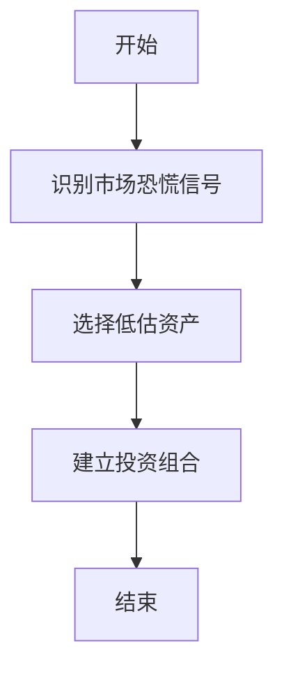
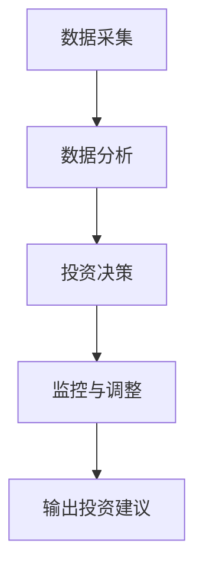
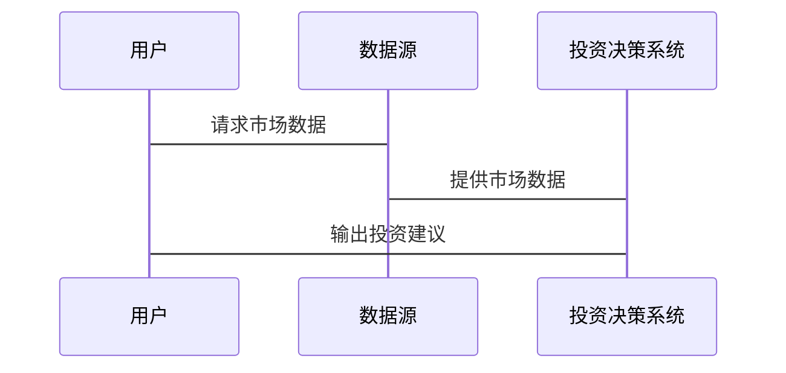

                 


# 《霍华德·马克斯的逆向价值投资：在市场恐慌中寻找机会》

## 关键词：
- 逆向投资，价值投资，市场恐慌，霍华德·马克斯，安全边际，投资策略，数学模型

## 摘要：
霍华德·马克斯的逆向价值投资策略在市场恐慌中寻找低估资产，强调安全边际和市场情绪分析。本文系统阐述了逆向投资的核心概念、算法模型、系统架构和实战案例，结合数学模型和代码实现，帮助读者在市场恐慌中识别投资机会，构建稳健的投资组合。

---

## 第一部分：逆向价值投资的背景与核心概念

### 第1章：价值投资与逆向投资概述

#### 1.1 价值投资的基本概念
- 价值投资的定义与核心理念
- 价值投资与其他投资策略的对比
- 价值投资的历史发展与现状

#### 1.2 霍华德·马克斯的贡献与思想
- 霍华德·马克斯的生平简介
- 马克斯投资思想的核心理念
- 马克斯投资方法的独特性

#### 1.3 逆向投资的定义与特点
- 逆向投资的定义
- 逆向投资与价值投资的区别与联系
- 逆向投资的优势与风险

### 第2章：市场恐慌与投资机会

#### 2.1 市场恐慌的定义与表现
- 市场恐慌的定义
- 市场恐慌的表现形式
- 市场恐慌的周期性分析

#### 2.2 逆向投资与市场恐慌的关系
- 逆向投资在市场恐慌中的应用
- 市场恐慌中的投资机会
- 逆向投资如何利用市场恐慌

#### 2.3 市场恐慌中的投资策略
- 识别市场恐慌的方法
- 利用市场恐慌的投资策略
- 市场恐慌中的风险管理

---

## 第二部分：逆向投资的核心概念与算法原理

### 第3章：安全边际与市场先生

#### 3.1 安全边际的定义与作用
- 安全边际的定义
- 安全边际的作用
- 安全边际的计算方法

#### 3.2 市场先生的概念与应用
- 市场先生的定义
- 市场先生的行为特征
- 市场先生与逆向投资的关系

#### 3.3 恐惧与贪婪的周期性
- 恐惧与贪婪的定义
- 恐惧与贪婪的周期性分析
- 如何利用恐惧与贪婪的周期性

### 第4章：逆向投资的数学模型与算法

#### 4.1 市场恐慌指数的计算
- 市场恐慌指数的定义与公式
- $$P = \sum_{i=1}^{n} (v_i - p_i)$$，其中 $v_i$ 为资产的内在价值，$p_i$ 为市场价格
- 市场恐慌指数的计算步骤

#### 4.2 安全边际的数学公式
- $$S = \frac{v - p}{p}$$，其中 $S$ 为安全边际，$v$ 为内在价值，$p$ 为市场价格
- 安全边际的计算与分析

#### 4.3 投资组合优化的数学模型
- 最优化投资组合的公式
- 使用凸优化理论进行投资组合优化
- 数学模型的实现与验证

### 第5章：逆向投资的算法实现

#### 5.1 算法流程图
- 使用mermaid绘制逆向投资算法流程图


#### 5.2 Python代码实现
```python
def calculate_margin_of_safety(value, price):
    return (value - price) / price

def is_in_panic_market(market_panic_index):
    return market_panic_index > 0.8

def main():
    assets = [{'value': 100, 'price': 50}, {'value': 80, 'price': 40}]
    panic_assets = []
    for asset in assets:
        mos = calculate_margin_of_safety(asset['value'], asset['price'])
        if is_in_panic_market(mos):
            panic_assets.append(asset)
    print("恐慌市场中可以投资的资产：", panic_assets)

if __name__ == "__main__":
    main()
```

#### 5.3 算法的优缺点分析
- 优点：能够有效识别低估资产，捕捉市场恐慌中的机会
- 缺点：需要准确的市场信号识别，存在一定的误判风险

---

## 第三部分：系统架构与投资决策系统设计

### 第6章：投资决策系统的功能设计

#### 6.1 系统功能模块
- 数据采集模块：收集市场数据和资产信息
- 数据分析模块：计算市场恐慌指数和安全边际
- 投资决策模块：基于算法生成投资建议
- 监控与调整模块：实时跟踪市场变化并调整投资组合

#### 6.2 系统架构设计
- 使用mermaid绘制系统架构图


#### 6.3 系统接口设计
- 数据接口：与金融数据源对接
- 用户接口：提供投资建议和市场信号

#### 6.4 系统交互序列图


---

## 第四部分：项目实战与案例分析

### 第7章：逆向投资的实战应用

#### 7.1 环境安装与配置
- 安装必要的金融分析库（如Pandas、NumPy）
- 配置数据源接口

#### 7.2 核心功能实现
- 识别市场恐慌信号的代码实现
- 选择低估资产的算法实现
- 建立投资组合的优化代码

#### 7.3 案例分析与解读
- 经典案例：2008年金融危机期间的逆向投资机会
- 案例分析的启示与经验总结

### 第8章：系统实现与代码分析

#### 8.1 核心代码实现
```python
import pandas as pd

def calculate_margin_of_safety(df):
    df['安全边际'] = (df['内在价值'] - df['价格']) / df['价格']
    return df

def identify_panic_assets(df, threshold=0.8):
    return df[df['安全边际'] > threshold]

def main():
    data = {
        '资产': ['资产1', '资产2', '资产3'],
        '内在价值': [100, 80, 120],
        '价格': [50, 40, 60]
    }
    df = pd.DataFrame(data)
    df = calculate_margin_of_safety(df)
    panic_assets = identify_panic_assets(df)
    print("恐慌市场中可以投资的资产：", panic_assets)

if __name__ == "__main__":
    main()
```

#### 8.2 系统实现与优化
- 代码优化与性能提升
- 系统的可扩展性与维护性

---

## 第五部分：总结与展望

### 第9章：逆向投资的总结与注意事项

#### 9.1 投资策略总结
- 逆向投资的核心要点
- 市场恐慌中的投资机会
- 安全边际的重要性

#### 9.2 投资策略的注意事项
- 市场信号的误判风险
- 投资组合的分散与风险管理
- 长期投资与市场波动的关系

### 第10章：未来展望与拓展阅读

#### 10.1 未来研究方向
- 逆向投资与机器学习的结合
- 大数据在市场信号识别中的应用
- 全球化市场中的逆向投资策略

#### 10.2 拓展阅读
- 霍华德·马克斯的《投资最重要的事情》
- 历史上的逆向投资案例研究
- 相关学术论文与研究报告

---

## 附录：逆向投资的数学模型与公式汇总

- 市场恐慌指数公式：$$P = \sum_{i=1}^{n} (v_i - p_i)$$
- 安全边际公式：$$S = \frac{v - p}{p}$$
- 投资组合优化模型：$$\min \sum_{i=1}^{n} w_i p_i$$，$$\text{s.t.} \sum_{i=1}^{n} w_i = 1, w_i \geq 0$$

---

## 关键词索引：
- 逆向投资，价值投资，市场恐慌，霍华德·马克斯，安全边际，投资策略，数学模型

---

## 参考文献：
1. 霍华德·马克斯. 《投资最重要的事情》
2. Fama, E. (1970). Efficient Capital Markets: A Review of Theory and Practice.
3. 张五壮. 《逆向投资实战手册》

---

通过以上结构，文章详细讲解了霍华德·马克斯的逆向价值投资策略，结合理论分析、算法实现、系统设计和案例实战，帮助读者在市场恐慌中识别投资机会，构建稳健的投资组合。

